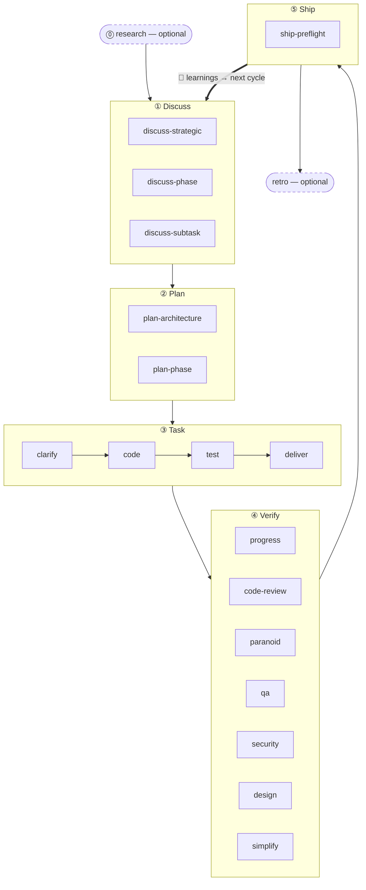

The 5-stage cadence is harnessed's core methodology: every feature, bug fix, or refactor moves through the same five stages in sequence — **Discuss → Plan → Task → Verify → Ship** — closed by an automatic **Learn** loop. Two companion stages (Research, Retro) bookend the main loop.

## The stages

| # | Stage | Slash command | Mode |
|---|-------|---------------|------|
| 0 | **Research** | `/research` | Optional — fires when understanding is unclear |
| 1 | **Discuss** | `/discuss` | Mandatory |
| 2 | **Plan** | `/plan` | Mandatory |
| 3 | **Task** | `/task` | Mandatory |
| 4 | **Verify** | `/verify` | Mandatory |
| 5 | **Ship** | `/ship` | Explicit — release stage (user-triggered) |
| — | **Retro** | `/retro` | Mandatory after `/auto`, optional standalone |

**Learning is automatic, not a stage.** Every completed workflow appends its failure/loop/reject signals to `.planning/LEARNINGS.md`; the inject hook surfaces relevant learnings into the next session. This is always-on and **not** gated on the optional Retro.

### Research (optional)

Multi-source investigation via Tavily, Exa, and ctx7. Fires in `/auto` when you answer "no" to the understanding check, or invoke `/research` directly. Outputs go to `.planning/` as `research-notes.md`.

### Discuss — 3-layer gates

`/discuss` evaluates three independent gates and runs only the ones that fire:

- **Strategic** (`discuss-strategic`): New feature, new milestone, new product direction → gstack `/office-hours` + `/plan-ceo-review`. Persists `findings.md`.
- **Phase** (`discuss-phase`): ≥2 open implementation decisions, cross-module data flow unclear → GSD `/gsd-discuss-phase`. Persists `findings.md` + `knowledge.md`.
- **Subtask** (`discuss-subtask`): ≥2 distinct approaches to core algorithm / API contract → Superpowers brainstorming. Ephemeral, not persisted.

Each gate declares transparently when it fires and when it skips.

### Plan — architecture + persistence

`/plan` runs two steps in sequence:

1. **Architecture review** (conditional) — complex architecture triggers gstack `/plan-eng-review`. Locks design before persisting.
2. **Phase plan** — GSD `gsd-plan-phase` + planning-with-files generates `task_plan.md` with exact file paths, acceptance criteria, and dependency ordering.

### Task — per-subtask loop

`/task` runs four sub-steps per subtask in strict series:

1. **Clarify** — verifies spec, surfaces ambiguities, checks against `task_plan.md`
2. **Code** — karpathy principles: smallest viable change, surgical edits, no scope creep
3. **Test** — TDD red → green → refactor for core logic; optional for CRUD / obvious implementations
4. **Deliver** — `ralph-loop` wrapper ensures verbatim `COMPLETE` before advancing

### Verify — 7 conditional sub-checks

`/verify` dispatches sub-checks based on what changed. Always runs: `verify-progress` (UAT + state sync), `verify-code-review` (multi-agent parallel), `verify-simplify` (final cleanup). Conditional: paranoid review, QA, security, design, multispec.

### Ship — release stage

`/ship` is the 5th stage, after Verify. It runs `harnessed release-preflight` (a read-only release-readiness gate — `CHANGELOG [Unreleased]`/version/git-clean/tag-absent), then delegates PR + deploy to gstack `/ship`. The **deploy boundary is tag-ready**: the stage never pushes, publishes, or creates a tag — the actual `npm publish` + GitHub release happen in `publish.yml` CI on tag push (with explicit approval). "PR ready ≠ release ready."

### Retro

gstack `/retro` captures milestone lessons, decisions made, and surprises. In `/auto` this is mandatory. Run standalone at any milestone close. (Distinct from the always-on Learn loop above.)

## Flow diagram



## Running with `/auto` vs individual stages

`/auto` chains the core dev stages automatically (research conditional → discuss → plan → task → verify → retro). **Ship is explicit** — `/auto` does not auto-release; you run `/ship` when a milestone is ready to cut. Individual stage commands give you entry points at any stage:

```
/discuss "add rate limiter"     # run only discuss
/plan "rate limiter"            # run only plan (assumes discuss done)
/task "implement middleware"    # run only task
/verify "rate limiter feature"  # run only verify
/ship                           # run only ship (release-preflight → tag-ready)
```

Across *multiple* phases, `harnessed advance` derives the next phase from `.planning/` disk state and prints the command to run — so a driver loop chains phases hands-free (`while harnessed advance --json; do : ; done`), stopping at the advance-gate when an earlier phase is left incomplete. See the `harnessed advance` entry in the [CLI reference](../../reference/cli/).

Surgical sub-workflow invocation skips the master entirely:

```
/discuss-phase "..."        # only phase-layer clarification
/plan-architecture "..."    # only architecture review
/verify-paranoid "..."      # only the paranoid staff engineer check
```

See [Architecture decisions](https://github.com/easyinplay/harnessed/blob/main/docs/adr/0030-namespace-policy.md) ADR 0030, 0031, 0032 for the namespace design rationale.
