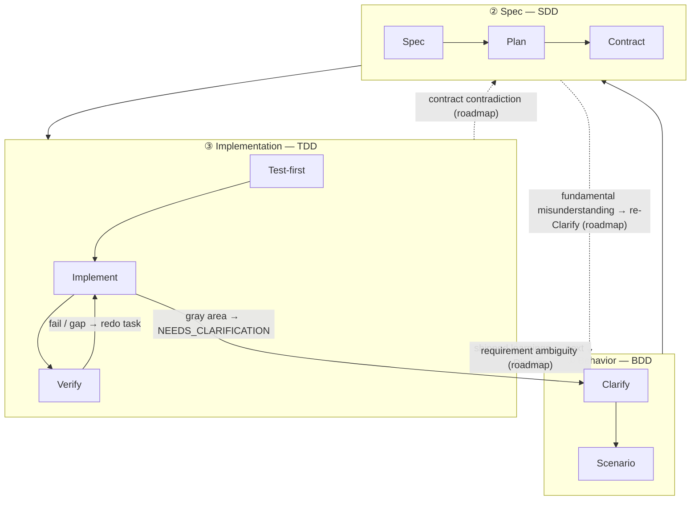

The three-layer stack is harnessed's theory of *why* the cadence is shaped the way it is. It is harnessed's implementation of software engineering's established **BDD → SDD → TDD** nesting: three nested feedback loops, each answering a different question. harnessed's contribution is to **compose** the open-source ecosystem into each loop — and because the upstream components *partially overlap*, arbitrating that overlap is exactly the job of a composition orchestrator.

## The three loops

| Layer | Loop | Question it answers | Composed from (overlapping) |
|-------|------|---------------------|-----------------------------|
| **① Behavior** | BDD | *What* to build, and how we know it's done | gstack `/office-hours` governance · GSD discuss · superpowers brainstorming → acceptance criteria |
| **② Spec** | SDD | *How* it's structured | GSD plan-phase → requirements / design / tasks · contracts (Spec Kit / ECC patterns) |
| **③ Implementation** | TDD | Does it actually *work* | superpowers TDD red-green · subagent execution · GSD verify-work · ralph-loop completion |

**Loops are nested lenses, not phases.** Cucumber popularized the BDD-outer + TDD-inner double-loop: a failing scenario opens the outer loop, and you drive it green through many inner red-green TDD cycles. The GenAI era adds a middle ring — an explicit SDD **spec** loop between behavior and implementation, because an agent needs a frozen contract to execute against. That gives the **triple-loop** above.

## Node-level breakdown

Each loop decomposes into nodes. Every node names the open-source component(s) it is composed from.

### ① Behavior (BDD)

| Node | What it does | Composed from |
|------|--------------|---------------|
| **Clarify** | Lock down *what* + surface ambiguity | gstack `/office-hours` + GSD discuss + superpowers brainstorming |
| **Scenario** | Turn intent into acceptance criteria | GSD phase success criteria |

The outer loop is open until the scenario's acceptance criteria are written. "Done" is defined here, before any structure or code exists.

### ② Spec (SDD)

| Node | What it does | Composed from |
|------|--------------|---------------|
| **Spec** | Requirements + design | GSD plan-phase + Spec Kit triad (requirements / design / tasks) |
| **Plan** | Tasks + dependency DAG | GSD `PLAN.md` + ECC decomposition |
| **Contract** | Interfaces frozen | contract conventions |

The middle loop converts "what" into an executable structure. Its exit condition is a **frozen contract** — the interface the implementation loop will test against.

### ③ Implementation (TDD)

| Node | What it does | Composed from |
|------|--------------|---------------|
| **Test-first** | Failing test (red gate) | superpowers TDD |
| **Implement** | Drive to green | subagent execution |
| **Verify** | Refactor + per-task completion | GSD verify-work + ralph-loop completion |

The inner loop is the classic red → green → refactor cycle, run once per task until every contract is satisfied.

### Cross-cutting

Two concerns sit outside any single loop:

| Concern | What it does | Composed from |
|---------|--------------|---------------|
| **Review** | Quality + security gate | gstack `/review` + `/cso` |
| **Ship** | Release-readiness + delivery | `release-preflight` + gstack `/ship` |

And two **disciplines** run through *every* layer:

- **karpathy principles** — *how* to code: smallest viable change, surgical edits, simplicity first.
- **mattpocock moves** — on-demand tools (`/zoom-out`, `/diagnose`, `/grill-with-docs`), summoned per situation.

## Going back (GoBack)

Flow runs outer → inner by default. **harnessed is the linear-cadence realization of the triple-loop — the full routed graph is its evolution path.** The loops are still feedback loops, but only some return edges ship today; the finer-grained, per-ring structured returns are on the roadmap. The diagram below draws shipped edges as solid lines and roadmap edges as dashed lines marked `(roadmap)`.

### Shipped today

Three feedback edges are live in the current linear cadence:

- **Verify → Task** — a failed check or unmet gap pushes the failed work back into the implementation loop to redo.
- **Gray area → clarification** — when a subagent hits an ambiguity it returns `STATUS: NEEDS_CLARIFICATION`; the run pauses, clarifies, then continues.
- **Learnings → next Discuss** — every shipped cycle appends its failure/loop/reject signals, which feed back into the next cycle's Behavior loop (the always-on learn loop).

### Roadmap (not yet shipped)

Finer-grained structured returns — routing a gap *directly* to the ring that owns the answer — are the evolution path, not current behavior:

- **Contract contradiction** (the implementation can't satisfy a frozen interface) → route back to **Spec**.
- **Requirement ambiguity** (the contract is internally consistent but the behavior was underspecified) → route back to **Behavior**.
- **Fundamental misunderstanding** (the whole structure targets the wrong outcome) → re-open **Clarify** in Behavior.

Today these gaps surface through the three shipped edges above (typically Verify → Task plus human clarification) rather than as automatic per-ring routing. The composition orchestrator's near-term value is keeping the linear cadence coherent while different upstream components own different rings; the routed graph is where it's heading.

## Components intersect — and that's the point

The same upstream tool shows up in more than one loop. That overlap is not redundancy; it's the surface a composition orchestrator arbitrates:

- **GSD** is the **backbone** — it threads all three rings (discuss → plan → verify).
- **gstack** spans **Behavior + Review**.
- **superpowers** spans **Behavior** (brainstorm) + **Implementation** (TDD).

Without arbitration these overlaps would double-fire or contradict each other. The composition layer routes each ring to the right upstream tool and resolves the seams.

## Theory vs. runtime

The three-layer stack is the *theory*. The [5-stage cadence](/docs/concepts/four-stage-cadence/) is how that theory runs at the command line:

| Loop (theory) | Runtime stage |
|---------------|---------------|
| ① Behavior | **Discuss** |
| ② Spec | **Plan** |
| ③ Implementation | **Build** (Task) |
| Cross-cutting | **Verify + Ship** (evidence gates) |

For *how* the upstream tools are stitched together without forking them, see [Composition over vendoring](/docs/concepts/composition/).
