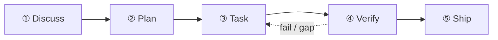

This tutorial walks through the 5-stage cadence manually using a realistic example: **"Add a rate limiter to our Express API — 100 req/min per IP, Redis-backed."**

Your first `/auto` run walks all five stages end-to-end:



## Stage 1 — Discuss

```
/discuss "add a rate limiter to our Express API — 100 req/min per IP, Redis-backed"
```

`/discuss` runs 3 clarification gates in parallel:

- **Strategic gate** (`discuss-strategic`): Is this a new feature or a change to existing infrastructure? Does it affect product positioning? For a rate limiter this gate typically fires a quick governance check.
- **Phase gate** (`discuss-phase`): Are there ≥2 open implementation decisions? (Redis vs in-memory? Per-route or global?) This gate clarifies and persists findings to `findings.md`.
- **Subtask gate** (`discuss-subtask`): Any subtasks with ≥2 distinct approaches? Core algorithm design gets a quick brainstorm.

**Output**: `findings.md` and `knowledge.md` in `.planning/PHASE-N/`.

## Stage 2 — Plan

```
/plan "rate limiter feature"
```

`/plan` runs two steps in sequence:

1. **Architecture review** (conditional) — if the feature crosses module boundaries or involves new infrastructure, gstack's paranoid staff engineer reviews the design
2. **Phase plan** — GSD persists `task_plan.md` with exact file paths, acceptance criteria, and dependency ordering

**Output**: `.planning/PHASE-N/PLAN.md` and `task_plan.md`.

## Stage 3 — Task

```
/task "implement rate limiter middleware"
```

`/task` runs 4 sub-steps per subtask in series:

1. **Clarify** — verifies spec before writing code; surfaces ambiguities
2. **Code** — implements with karpathy principles (smallest viable change, surgical edits)
3. **Test** — TDD on core logic: red → green → refactor
4. **Deliver** — `ralph-loop` wrapper ensures verbatim `COMPLETE` before moving on

## Stage 4 — Verify

```
/verify "rate limiter feature"
```

`/verify` dispatches up to 7 sub-checks based on what changed:

| Check | Fires when |
|-------|-----------|
| `verify-progress` | always (UAT acceptance + state sync) |
| `verify-code-review` | always (multi-agent parallel fan-out) |
| `verify-paranoid` | critical module or pre-PR |
| `verify-qa` | UI changes present |
| `verify-security` | auth or secrets touched |
| `verify-design` | design changes present |
| `verify-simplify` | always last (removes redundant logic) |

## Artifacts persisted in `.planning/`

```
.planning/
├── STATE.md          # current phase / progress SoT
├── ROADMAP.md        # phase route map
└── PHASE-1/
    ├── PLAN.md       # task list, file paths, acceptance criteria
    ├── findings.md   # discuss stage outputs
    ├── task_plan.md  # per-subtask breakdown
    └── PROGRESS.md   # live progress tracking
```

## Next steps

After Verify completes, run `/retro` to close the milestone and capture lessons. If you ran `/auto` these stages would have chained automatically — see [Quickstart](/docs/getting-started/quickstart/) for the one-command path.

For the architecture behind each stage, read [The 5-stage cadence](/docs/concepts/five-stage-cadence/).
