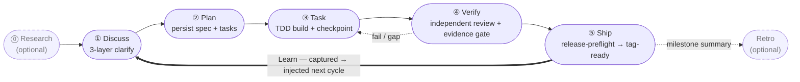

harnessed is the package manager and composition orchestrator for AI coding harnesses. It installs, composes, and runs workflows that combine Skills, MCP servers, and harness packs through a typed manifest — without vendoring upstream code.

If you're building with Claude Code, harnessed wires together the best open-source components — ECC, Superpowers, GSD, gstack — into a unified, runnable workflow via a single command.

The operating loop — five stages closed by an always-on Learn cycle:

## Where to start

- **[Installation](/docs/getting-started/installation/)** — install harnessed and run setup in 30 seconds
- **[Quickstart](/docs/getting-started/quickstart/)** — from install to first workflow in 60 seconds
- **[Composition concept](/docs/concepts/composition/)** — how harnessed composes upstream tools without forking them
- **[Workflow reference](/docs/reference/workflows/)** — all 28 composable workflows shipped with v4.12.0

## What makes harnessed different

Three principles underpin every workflow:

**Composition over vendoring.** Each harness pack ships a manifest. harnessed reads it, validates compatibility, and stitches upstream tools together at runtime. You always run the official upstream — never a stale fork.

**5-stage cadence built in.** Discuss → Plan → Task → Verify → Ship, with optional Research and Retro, plus an automatic learning loop. Or run `/auto` for the full 6-stage pipeline (research → retro; Ship is explicit) in one command.

**Dogfood-first methodology.** Every workflow is validated against its own definition — the same discipline harnessed uses to ship itself.

Read the [README](https://github.com/easyinplay/harnessed#readme) for the full high-level pitch.
