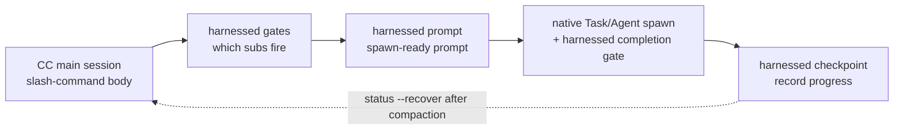

> **v4.0 execution model.** harnessed is an _orchestration brain + prompt library_, not an execution engine. Slash-command bodies (generated by `harnessed setup`) drive **CC-native subagent spawn** through three fast, pure-function CLIs — `harnessed gates` (which sub-workflows fire), `harnessed prompt` (spawn-ready prompt for a sub), and `harnessed checkpoint` (record progress). The Claude Code main session does the actual spawning, Agent Teams, and clarification round-trips with native tools. `harnessed run` is retained for CI/headless only.

How the three orchestration CLIs drive CC-native spawn:



## `harnessed` (you-are-here dashboard)

Run `harnessed` with **no arguments** for the you-are-here dashboard — the fastest way to re-orient in an active workflow (the comet `/comet` analog, shipped in v8.0).

```bash
harnessed          # human-readable you-are-here + what's-next dashboard
harnessed --json   # machine-readable structured object
```

It auto-detects the active workflow for the current repo and prints the current phase, each sub-workflow's status, and a single deterministic `NEXT: auto | manual | done` contract line plus a run hint (e.g. `→ run: harnessed prompt <sub>`). With no active workflow it prints an onboarding hint pointing at `harnessed setup`.

**Read-only** — no spawn, no state / git / remote mutation; always exits `0`. Only a bare `harnessed` (or `harnessed --json`, optionally with `--lang`) dispatches the dashboard; any subcommand, `--help`, `--version`, or unknown word falls through to normal command parsing (so `harnessed bogus` still errors).

`--json` fields: `active`, `phase`, `status`, `started_at`, `next`, `sub`, `hint`, `sub_progress`.

---

## `harnessed setup`

One-shot onboarding — install workflow skills and base manifests to `~/.claude/`.

```bash
harnessed setup [options]
```

**What it does:**

1. Scans `workflows/<name>/SKILL.md` and copies each to `~/.claude/skills/<name>/`
2. Processes `manifests/tools/*.yaml` and `manifests/skill-packs/*.yaml`
3. Writes `CLAUDE_CODE_EXPERIMENTAL_AGENT_TEAMS=1` to `~/.claude/settings.json`
4. Detects OS locale and writes `env.HARNESSED_USER_LANG` (zh-* → `zh-Hans`, else `en`)

**Options:**

| Flag                 | Description                                                         |
| -------------------- | ------------------------------------------------------------------- |
| `--user-lang <code>` | Override detected locale. Accepts `en`, `zh-Hans`, `zh-CN`, `zh-TW` |
| `--dry-run`          | Preview only — print what would be written, no disk changes         |

**Exit codes:** `0` = success, `1` = filesystem error, `2` = no SKILL.md workflows found.

---

## `harnessed install <pack>`

Install a harness pack by name or path.

```bash
harnessed install <pack>
```

Resolves the pack manifest, validates it against the schema, and runs each `install` step in order. Currently supports bootstrap install from local paths and git URLs; npm registry pack discovery is planned.

---

## `harnessed install-base`

Install the whole base profile in one shot — every manifest under `manifests/tools/*.yaml` and `manifests/skill-packs/*.yaml`, in sorted order. A separate subcommand (not a `--base` flag on `install`) so it never collides with the single-pack gate.

```bash
harnessed install-base                   # apply immediately (default)
harnessed install-base --dry-run         # preview only — no disk changes
harnessed install-base --non-interactive # skip all prompts (CI / scripts)
```

Prints a tally: `installed / already-installed / skipped (user-aborted) / failed`.

**Exit codes:** `0` = at least one installed and none failed · `1` = one or more failed · `2` = nothing installed (all already-installed or aborted).

---

## `harnessed research`

Run the research workflow — search-category sub-routing → subagent spawn → verbatim `COMPLETE`. A thin alias over `workflows/research/workflow.yaml`.

```bash
harnessed research --query "compare Postgres vs SQLite for this use case"
harnessed research --query "..." --dry-run          # preview the resolved workflow + gate context (JSON)
harnessed research --query "..." --model sonnet      # subagent model: haiku | sonnet | opus
harnessed research --query "..." --non-interactive   # skip all prompts (CI / scripts)
```

| Flag                | Description                                                                           |
| ------------------- | ------------------------------------------------------------------------------------- |
| `--query <text>`    | Research prompt (**required**)                                                        |
| `--dry-run`         | Preview only — print the `{ workflow, yamlPath, gateContext }` envelope, do not spawn |
| `--model <model>`   | Subagent model: `haiku` \| `sonnet` \| `opus`                                         |
| `--non-interactive` | Skip all prompts (CI / scripts)                                                       |

**Exit codes:** `0` = workflow completed · `1` = workflow runtime failed · `2` = usage error (missing `--query` or workflow yaml not found).

---

## `harnessed manifest-add <upstream>`

Add a new upstream adapter behind the **EE-5 5-question merge gate** — five interactive prompts that force a deliberate decision before wiring a new upstream into the composition (is it a reusable surface, does the name fit, does it overlap existing components, are you importing a concept or someone's product identity, can users understand it without knowing the upstream). All five must be answered non-empty.

```bash
harnessed manifest-add https://github.com/owner/repo.git
harnessed manifest-add <upstream> --category tools    # skill-packs (default) | tools
harnessed manifest-add <upstream> --name myadapter    # defaults to the <upstream> basename
harnessed manifest-add <upstream> --dry-run           # preview — print answers, do not write
harnessed manifest-add <upstream> --non-interactive   # CI: WARN-only dry-run, writes nothing
```

On success it writes the answers to `manifests/<category>/<name>.ee5-answers.json`.

| Flag                | Description                                                |
| ------------------- | ---------------------------------------------------------- |
| `--category <cat>`  | Manifest category: `skill-packs` (default) \| `tools`      |
| `--name <name>`     | Short adapter name (defaults to the `<upstream>` basename) |
| `--dry-run`         | Preview only — print the answers JSON, do not write        |
| `--non-interactive` | CI / scripts — WARN-only, writes nothing                   |

**Exit codes:** `0` = gate passed (written or previewed) · `1` = an answer was left empty.

---

## `harnessed uninstall [pack]`

Remove an installed pack, or — with no argument — remove harnessed's own installed files.

```bash
harnessed uninstall <pack>   # remove a single pack (runs its manifest uninstall steps)
harnessed uninstall          # remove harnessed's own skills/manifests from ~/.claude/
```

For the three install methods that place skills on disk (`npm-cli`, `git-clone-with-setup`, `npx-skill-installer`), uninstall executes the manifest's **declared `spec.uninstall` contract**: it runs the declared `cmd` (fail-soft — a non-zero exit or missing shell warns and continues), then removes each `cleanup_paths` entry with an idempotent force-rm **constrained to `$HOME`** (a path escaping the home subtree hard-fails). Methods that do settings/plugin/MCP surgery (`cc-hook-add`, `cc-plugin-marketplace`, `mcp-*-add`) keep their per-method reversers. The no-arg unified uninstall reverses `harnessed setup`.

---

## Orchestration CLIs (v4.0)

These three pure-function CLIs are what the generated slash-command bodies call to drive CC-native spawn. They print JSON and do no spawning themselves — the main session orchestrates.

### `harnessed gates <master>`

Evaluate which sub-workflows fire for a master orchestrator (`discuss` / `plan` / `task` / `verify` / `auto`) given a task spec.

```bash
harnessed gates plan --task "add OAuth login" --skip-sub discuss
# → JSON: { fire: [{ sub, order, mode }], skip: [...], parallelism: { escalate_to_teams } }
```

`fire` lists the sub-workflows that pass their judgment gates (in execution order); `parallelism.escalate_to_teams` signals when to use CC-native Agent Teams instead of sequential subagent spawn.

### `harnessed prompt <sub>`

Emit a spawn-ready prompt for a single sub-workflow — the role-prompt body + checklist + applied disciplines.

```bash
harnessed prompt plan-phase --task "add OAuth login" --json
# → JSON: { prompt, max_iterations, model }
```

The main session feeds `prompt` into a native `Task` spawn, with `harnessed checkpoint complete` as the completion gate; `max_iterations` / `model` come straight from the workflow defaults.

### `harnessed checkpoint`

Record sub-workflow progress to the harnessed checkpoint store. The main session calls this after each sub completes (and on failure), enabling `harnessed status --recover` after a compaction.

```bash
harnessed checkpoint start <master> --plan <json>   # seed the progress ledger
harnessed checkpoint complete <sub>                 # mark a sub done (with evidence guard)
harnessed checkpoint fail <sub>                      # record a failed sub
```

### `harnessed run`

**CI / headless only.** In-process SDK spawn of an entire workflow — used when there is no interactive main session to orchestrate. The v4.0 default path is the gates → prompt → checkpoint orchestration above; `run` is the fallback.

```bash
harnessed run <master> --task "<spec>"
```

---

## `harnessed doctor`

Diagnose the local harnessed + Claude Code install — a 23-check health report (Node, MCP scope + servers (tavily/exa), jq, bun, Windows bash flavour, origin URL, gstack prefix, deprecated manifests, token budget, Agent Teams env, planning-with-files, mattpocock-skills, CodeGraph, GateGuard conflict, workflow skill integrity, update, install channel, stale hooks, ECC, per-turn inject pairing, plugin install freshness, `HARNESSED_OFF` ablation switch). `HARNESSED_OFF=1` turns every always-on harnessed hook into a no-op (a clean control arm for A/B runs, no uninstall needed); doctor warns while it is set.

```bash
harnessed doctor
harnessed doctor --json   # machine-readable report
```

---

## `harnessed update`

Keep harnessed (and, optionally, its upstream plugins) up to date. doctor's update check also surfaces "update available X→Y" passively. `update` is dual-channel — it detects how harnessed was installed and picks the matching flow.

```bash
harnessed update                      # self-update + top CHANGELOG section + restart hint
harnessed update --check              # report installed/latest version, do not install
harnessed update --dry-run            # preview what the update would do — no writes
harnessed update --upstreams          # also re-run the base manifests to upgrade upstream plugins
harnessed update --migration-report   # read-only inventory of stale harnessed state (deletes nothing)
harnessed update --rollback [version] # compiled binary only — restore a banked previous version
```

**npm channel** — runs `npm i -g harnessed@latest`, prints the top CHANGELOG section, and reminds you to restart Claude Code.

**Compiled-binary channel** (one-line installer) — downloads the platform asset from GitHub releases, verifies the `.sha256` checksum **and its ed25519 signature** (`<asset>.sha256.sig`, a release contract since v4.32.19 — a missing or invalid signature is a hard error and the current binary is left untouched), then swaps the binary atomically. The replaced version is banked to `bin-backup/` for rollback.

**`--rollback [version]`** (compiled binary only) — atomically restores a previous version from `bin-backup/`: newest banked version by default, or pass a version to pick one (unknown versions get an error listing what's available). The current binary is banked back first, so a rollback is itself reversible. On npm installs it exits with a pointer to `npm i -g harnessed@<version>` instead.

Network access is fail-soft — an unreachable npm never errors.

---

## `harnessed release-preflight`

The Ship-stage gate. A **read-only** release-readiness check — exits 1 if the repo is not ready to tag a release. Mutates nothing (publish happens in CI on tag push).

```bash
harnessed release-preflight
```

Checks: `CHANGELOG.md` `[Unreleased]` (or a `[<version>]` section) is non-empty, `package.json` has a valid version, the working tree is clean (tracked changes), and a `v<version>` tag does not already exist.

---

## `harnessed compact`

Summarize+evict resolved sub-progress ledger entries to free context on long tasks. **G6-safe**: entries with `fail_count > 0` are never evicted, so the break-loop signal survives.

```bash
harnessed compact                                  # manual compaction
harnessed checkpoint complete <sub> --tokens <n>   # auto-triggers when the token count crosses the threshold
```

---

## `harnessed workflows`

List in-flight workflows — one per repo (harnessed keys checkpoint state by repo root, so concurrent projects no longer clobber each other).

```bash
harnessed workflows
```

---

## `harnessed learn`

Append a prose learning to the current repo's `.planning/LEARNINGS.md`. Completed workflows also append their failure/loop/reject signals automatically; the inject hook surfaces relevant learnings into the next session.

```bash
harnessed learn "avoid retrying the migration blindly — it needs a fresh snapshot first"
```

---

## `harnessed retro`

Reset the retro-cadence reminder. `/retro` is a gstack skill harnessed can't observe, so after you run it, call `harnessed retro --done` to zero the per-repo phase counter and clear the `RETRO-DUE` inject reminder.

```bash
harnessed retro --done   # reset the phase counter + clear the RETRO-DUE reminder
```

Without `--done` it does nothing and exits `1` (`nothing to do — pass --done after running /retro`).

---

## `harnessed next`

Print the deterministic next-step contract — read-only, no state mutation. Two layers:

1. **Mid-flight workflow** (a sub is still pending) → the intra-workflow contract `NEXT: auto <sub> | manual <sub> | done` (exit `0`, unchanged).
2. **Subs all resolved** → falls through to **cross-unit forward continuation** (v4.10): derives the next work unit (next phase / task) from the `.planning/` disk SoT and prints `NEXT: advance | blocked | done`.

```bash
harnessed next
# mid-flight:   NEXT: auto <sub>
# fall-through: NEXT: advance
#               UNIT: phase 16 'rate limiter'
#               HINT: run /auto (or harnessed advance) to start it — 2 phases remain
```

**Cross-unit exit codes:** `0` = advance (next unit available) · `2` = done (all phases complete) · `10` = blocked (human decision needed).

---

## `harnessed advance`

Advance to the next work unit derived from the `.planning/` disk SoT — **print-only**. It prints the next phase/task and the command to run (e.g. `→ run /auto "..."`) but does **not** seed state or spawn anything; the main session runs the emitted command itself, keeping clarification round-trips and Agent Teams reachable.

```bash
harnessed advance
# ADVANCE: advance
# UNIT: phase 16 'rate limiter'
# → run /auto "phase 16 'rate limiter'"
```

**Advance-gate.** `advance` refuses to step past an earlier _incomplete_ phase (the "comet" gate): if the derived next phase orders before the workflow pointer, or a failed sub blocks the ledger, it exits non-zero **without** printing a run command. Pass `--force` to override — this records an audit note in the output and proceeds.

```bash
harnessed advance --force   # override the gate (audit note recorded)
```

**Driver loop.** `--json` emits a machine-readable `{ next, unit, hint }` so a shell loop can chain phases hands-free — the loop stops on any non-zero exit (done / blocked / gate-reject):

```bash
while harnessed advance --json; do : ; done
```

**Exit codes:** `0` = advance · `2` = done (all phases complete) · `10` = blocked · `11` = gate-reject (earlier phase incomplete; use `--force`) · `1` = error.

**Design — derive, don't queue.** "Next" is always derived from disk, never from a stored queue. A phase counts complete when every `NN-*-PLAN.md` has a matching `NN-*-SUMMARY.md` (artifact-derived, so already-shipped phases are skipped naturally). Insert a phase mid-flight (edit `ROADMAP.md` or add `phases/16.1-*/`) and the next `advance` picks it up automatically. Phase-level continuation is the shipped floor; task-level resolution is resolver-ready but not yet wired to the CLI.

---

## `harnessed reject <sub>`

Mark a sub-workflow as user-rejected — a terminal status distinct from `failed` (which drives break-loop retry logic).

```bash
harnessed reject <sub>
```

---

## `harnessed resume`

Resume a failed `/auto` run from the last successful stage.

```bash
harnessed resume
```

Reads `.planning/STATE.md` to find the last successful stage and re-enters the pipeline from there. Useful when a stage fails mid-run.

---

## `harnessed status`

Show current pipeline status for the working directory.

```bash
harnessed status
```

Reads `.planning/STATE.md` and prints the current phase, last completed stage, and any blocked items.

```bash
harnessed status --recover
```

`--recover` reads the checkpoint progress ledger (not STATE.md) and prints a structured post-compaction recovery view — done / pending / skipped sub-workflows, the next command to run, and any evidence-drift warnings. Use it to re-orient after a context compaction.

---

## `harnessed audit`

Second-line self-consistency audit of the manifests under `manifests/tools/` and `manifests/skill-packs/`. A defense-in-depth pass that catches schema drift, placeholder values, and tampering the Ajv schema does not.

```bash
harnessed audit                 # manifest + runtime layers
harnessed audit --skip-runtime  # manifest checks only (offline / pre-init)
```

**Manifest layer:** repository URL shape (`https://…​.git`), `signed_by` placeholders (`unsigned` / `todo` / `tbd` / …), and moving `git_ref` values (`HEAD` / `main` / `master` — an _error_: pin to a SHA or tag). **Runtime layer** (skipped with `--skip-runtime`): origin-URL tamper, `install.cmd` shell-injection + npm-pkg cross-check, and the provenance gate. Prints a per-manifest `✓ / ⚠ / ✗` report and a finding tally.

**Exit codes:** `0` = no error-level findings (warnings allowed) · `1` = one or more errors.

> **`audit` vs `audit-log`** — `audit` _validates the manifest files_ for integrity; `audit-log` (below) _queries the routing/install log_ of what already happened. Different concerns.

---

## `harnessed audit-log`

Inspect the routing/install audit log — which gates fired, which packs installed, when.

```bash
harnessed audit-log                    # human-readable 5-column table
harnessed audit-log --filter <pack>    # filter by pack/event
harnessed audit-log --json             # full 12-field records
```

---

## `harnessed backup list`

List every backup snapshot under `.harnessed-backup/` — one row per snapshot with its timestamp, source manifest, and file count. Read from each snapshot's `metadata.json`.

```bash
harnessed backup list
```

Sister to `harnessed gc` (deletes old snapshots) and `harnessed rollback` (restores from a chosen timestamp).

---

## `harnessed gc`

Garbage-collect stale backups created by install/uninstall/rollback.

```bash
harnessed gc
```

---

## `harnessed rollback`

Restore the previous state from the most recent backup (CRLF/LF preserving) — undoes the last install/setup mutation.

```bash
harnessed rollback
```

---

## `harnessed check-docs`

Documentation-discipline gate over `.planning/` — STATE.md digest limit (100 lines by default), archive cadence, and ROADMAP pointers instead of inlined narrative. Exits `2` on a blocking violation, `1` when there are only advisory findings.

```bash
harnessed check-docs                       # human-readable report
harnessed check-docs --json                # machine-readable
harnessed check-docs --max-state-lines 120 # raise the STATE.md ceiling
harnessed check-docs --hook                # PreToolUse mode: gate only `git commit`
```

---

## `harnessed facts <master>`

List the gate facts a master actually consumes — deterministic ones filled in, judgement calls left `null` with a one-line hint. Fill in the rest and feed the file to `harnessed gates --context-file`.

```bash
harnessed facts verify --out facts.json
harnessed gates verify --context-file facts.json
```

---

## `harnessed eval`

Run the orchestrator-behavior regression trap suite: recorded scenarios replayed deterministically against goldens. This is a CI gate.

```bash
harnessed eval                     # run ./fixtures/eval
harnessed eval --filter <substr>   # only scenarios whose name or dir matches
harnessed eval --coverage          # judgments-trigger coverage matrix
harnessed eval --update-golden     # re-record goldens — review the printed diff
harnessed eval record              # turn a real run trajectory into a replayable scenario
```

---

## `harnessed exempt-gateguard`

Persist `GATEGUARD_EXEMPT_GLOBS=".planning/**"` into the harness settings env (backup first, atomic write). It resolves the dual-guard conflict between ECC's GateGuard hook and the harnessed evidence guard; doctor's GateGuard check points here.

```bash
harnessed exempt-gateguard
```

---

## Hook entry points (internal)

`harnessed inject-state` and `harnessed stop-hook` are run by the hooks `harnessed setup` registers, not by hand. `inject-state` prints the per-turn `<workflow-state>` block (`--invalidate` drops the per-session context cache on SessionStart); `stop-hook` auto-recovers corrupted tool-call output at the end of a turn. Compiled binaries register these subcommands directly, so the hooks need no host Node.

---

## `harnessed --version`

```bash
harnessed --version
# → 4.43.0
```

---

## `harnessed --help`

```bash
harnessed --help
harnessed <command> --help   # per-command help
```

---

## Global options

| Flag        | Description            |
| ----------- | ---------------------- |
| `--version` | Print version and exit |
| `--help`    | Print help and exit    |

Source: `src/cli.ts` and `src/cli/` in the [harnessed repository](https://github.com/easyinplay/harnessed/tree/main/src/cli).
