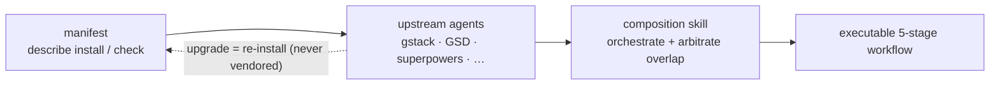

## 問題

AI コーディング harness —— ECC、Superpowers、GSD、gstack —— はそれぞれ別々の npm パッケージや git リポジトリとして配布されます。それらを手作業でまとめるのは脆い方法です。upstream を fork し、ローカルでパッチを当て、そして upstream が新しいバージョンを出すたびに、簡単にはマージできないまま腐っていくのを眺めることになります。

従来の答えは vendoring でした。upstream のコードを自分のリポジトリにコピーして保守するやり方です。これは upstream が大きな改善を出すまでは機能しますが、その後は古い fork に取り残されます。何十もの harness コンポーネントを手で同期させ続けるのはスケールしません。

## harnessed のアプローチ

harnessed は upstream のコードを決してコピーしません。代わりに各 harness パックが**マニフェスト** —— そのパックのインストール方法、公開する capability、他コンポーネントとの統合ポイントを記述した型付き YAML ファイル —— を同梱します。

runtime では、harnessed がこれらのマニフェストを読み、互換性を検証し、合成 skills を介して upstream のツールをオーケストレーションします。あなたが動かすのは常に公式の upstream バイナリで、harnessed は受け渡しを調整するだけです。

vendoring ではなく組み立て —— マニフェストが記述し、合成 skill がオーケストレーションします：



マニフェストの例（抜粋）：

```yaml
name: my-pack
version: 1.0.0
description: harnessed に OAuth2 ワークフローを追加する
install:
  - npm: superpowers
  - git: https://github.com/example/skill-pack-oauth
capability:
  skills:
    - brainstorming
    - tdd
  workflows:
    - discuss
    - plan
```

## 利点

**常に最新の upstream。** Superpowers が新リリースを出したら、`harnessed install` を再実行するだけで即座に取り込めます。手動マージも、古びた fork もありません。

**検証済みの合成。** `harnessed setup` はインストール前にマニフェストの互換性をチェックします。衝突する capability 宣言は runtime の驚きではなくエラーとして表面化します。

**自分でパックを書く。** マニフェスト schema はリポジトリの `schemas/manifest.v1.schema.json` に公開されています（YAML language server をそこに向ければインライン検証が効きます）。インストール可能な任意の upstream（npm パッケージ、git リポジトリ、独自 skill）にマニフェストを向ければ、harnessed はそれを一級の合成単位として扱います。

**統一されたエントリーポイント。** ユーザーが向き合うのは `/discuss`、`/plan`、`/task`、`/verify` だけで、各 upstream の用語を覚える必要はありません。合成 skill が各段階で正しい upstream ツールへのルーティングを担います。

## 合成 skills の動作

v4.0 以降、harnessed は実行エンジンではなく **orchestration brain + prompt library** です。自身のプロセス内でワークフローを spawn することはもうありません —— 代わりに、`harnessed setup` が生成したスラッシュコマンドの本体が Claude Code の main session に **CC-native subagent** の spawn を指示し、3 つの高速な純関数 CLI がそれを駆動します。`/discuss` を実行すると：

1. **Gate** —— `harnessed gates discuss --task "<spec>"` が、3 つの議論ゲート（strategic / phase / subtask）のどれが発火するか、Agent Teams に昇格すべきかを返します。
2. **Prompt** —— 発火した各ゲートについて、`harnessed prompt <sub> --json` が spawn-ready な prompt（role 本体 + チェックリスト + 適用された disciplines）を出力します。
3. **Spawn** —— main session がネイティブの `Task` spawn を実行し（ralph-loop でラップ）、`STATUS: NEEDS_CLARIFICATION` は `AskUserQuestion` であなたに戻します。
4. **Checkpoint** —— `harnessed checkpoint complete <sub>` が進捗を `.planning/` に記録し、compaction を越えて実行が生き延びるようにします。

harnessed は判断（ゲートのルーティング、prompt 生成、進捗 ledger）を担い、実際の spawn、Agent Teams の調整、明確化の往復は main session がネイティブの Claude Code ツールで行います。（`harnessed run` は CI／headless 専用に、従来のプロセス内 spawn を残しています。）

harnessed の 28 個のワークフローが ECC、Superpowers、GSD、gstack を同時に合成できるのはこのためです —— 合成層が継ぎ目を抽象化しています。

28 個すべてのワークフローと upstream 依存は[ワークフロー一覧](/ja/docs/reference/workflows/)を参照してください。
