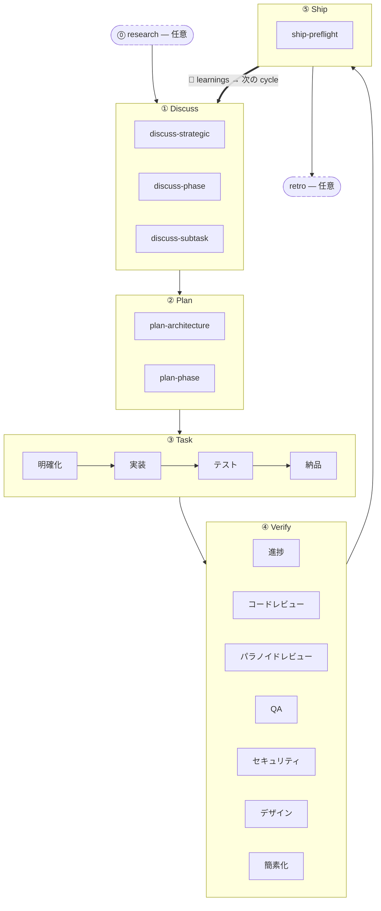

5 段階のリズムは harnessed の中核メソドロジーです。すべての機能、バグ修正、リファクタリングが同じ 5 つの段階を順に通ります —— **Discuss → Plan → Task → Verify → Ship** —— そして自動の **Learn** ループがそれを閉じます。2 つの伴走段階（Research、Retro）が主ループの両端に位置します。

## 段階

| # | 段階 | スラッシュコマンド | モード |
|---|------|-------------------|--------|
| 0 | **Research** | `/research` | 任意 —— 理解が不十分なときに発火 |
| 1 | **Discuss** | `/discuss` | 必須 |
| 2 | **Plan** | `/plan` | 必須 |
| 3 | **Task** | `/task` | 必須 |
| 4 | **Verify** | `/verify` | 必須 |
| 5 | **Ship** | `/ship` | 明示 —— リリース段階（ユーザーが起動） |
| — | **Retro** | `/retro` | `/auto` では必須、単独呼び出しでは任意 |

**学習は段階ではなく自動です。** 完了した各 workflow は自分の failure／loop／reject シグナルを `.planning/LEARNINGS.md` に追記し、inject hook が関連する learnings を次の session に注入します。これは always-on であり、任意の Retro に**依存しません**。

### Research（任意）

Tavily、Exa、ctx7 によるマルチソース調査。`/auto` の中で理解確認に「いいえ」と答えたときに発火するか、`/research` を直接呼び出します。出力は `.planning/` 配下の `research-notes.md` に書かれます。

### Discuss —— 3 層のゲート

`/discuss` は 3 つのゲートを独立に評価し、発火したものだけを実行します：

- **戦略層**（`discuss-strategic`）：新機能、新 milestone、新しいプロダクト方針 → gstack `/office-hours` + `/plan-ceo-review`。`findings.md` を永続化。
- **フェーズ層**（`discuss-phase`）：未決の実装判断が 2 つ以上、モジュールをまたぐデータフローが不明瞭 → GSD `gsd-discuss-phase`。`findings.md` + `knowledge.md` を永続化。
- **サブタスク層**（`discuss-subtask`）：明確に異なる方針が 2 つ以上あるコアアルゴリズム／API contract → Superpowers brainstorming。一時的で、永続化しません。

各ゲートは発火時もスキップ時も、その旨を明示的に宣言します。

### Plan —— アーキテクチャレビュー + 永続化

`/plan` は 2 つのステップを順に実行します：

1. **アーキテクチャレビュー**（条件付き）—— 複雑なアーキテクチャは gstack `/plan-eng-review` を発火させ、永続化の前に設計を確定します
2. **フェーズ計画** —— GSD `gsd-plan-phase` + planning-with-files が `task_plan.md` を生成します。正確なファイルパス、受け入れ基準、依存順序を含みます

### Task —— サブタスクループ

`/task` はサブタスクごとに厳密な順序で 4 ステップを実行します：

1. **明確化** —— 仕様を検証し、曖昧さを洗い出し、`task_plan.md` と突き合わせる
2. **実装** —— karpathy 原則：最小限の実行可能な変更、外科手術的な編集、スコープを広げない
3. **テスト** —— コアロジックは TDD red → green → refactor。CRUD や自明な実装では任意
4. **納品** —— `ralph-loop` ラッパーが、逐語の `COMPLETE` が出るまで次に進ませない

### Verify —— 7 つの条件付きサブチェック

`/verify` は変更内容に応じてサブチェックを振り分けます。常時実行：`verify-progress`（UAT + 状態同期）、`verify-code-review`（マルチ agent 並列）、`verify-simplify`（最終クリーンアップ）。条件付き：パラノイドレビュー、QA、セキュリティ、デザイン、multispec。

### Ship —— リリース段階

`/ship` は Verify の後に来る 5 番目の段階です。まず `harnessed release-preflight`（読み取り専用のリリース準備ゲート —— `CHANGELOG [Unreleased]`／version／git-clean／tag-absent）を実行し、その後 PR + deploy を gstack `/ship` に委譲します。**deploy の境界は tag-ready** です。この段階では push も publish も tag 作成も行いません —— 実際の `npm publish` と GitHub release は tag push 時に `publish.yml` CI が実行します（明示的な承認が必要）。「PR ready ≠ release ready」。

### Retro

gstack `/retro` がマイルストーンの学び、判断記録、想定外の発見を残します。`/auto` では必須で実行されます。任意のマイルストーン終了時に単独で呼び出すこともできます。（上記の always-on な Learn ループとは別物です。）

## フロー図



## `/auto` と個別の段階コマンド

`/auto` は中核の開発段階を自動で連鎖させます（research 条件付き → discuss → plan → task → verify → retro）。**Ship は明示的です** —— `/auto` は自動でリリースしません。マイルストーンが切れる状態になったら自分で `/ship` を実行します。個別の段階コマンドを使えば、任意の段階から入れます：

```
/discuss "レート制限を追加"     # discuss だけ実行
/plan "レート制限"              # plan だけ実行（discuss 済みを前提）
/task "ミドルウェアを実装"       # task だけ実行
/verify "レート制限機能"        # verify だけ実行
/ship                          # ship だけ実行（release-preflight → tag-ready）
```

*複数*の phase をまたぐときは、`harnessed advance` が `.planning/` のディスク状態から次の phase を導出し、実行すべきコマンドを表示します —— これにより driver loop が複数 phase を hands-free で連鎖でき（`while harnessed advance --json; do : ; done`）、より前の phase が未完了なら advance-gate で止まります。詳細は [CLI リファレンス](../../reference/cli/) の `harnessed advance` の項を参照してください。

外科手術的なサブワークフロー呼び出しは master を完全に飛ばします：

```
/discuss-phase "..."        # フェーズ層の明確化だけ実行
/plan-architecture "..."    # アーキテクチャレビューだけ実行
/verify-paranoid "..."      # パラノイドエンジニアのチェックだけ実行
```

アーキテクチャ上の判断は [ADR 0030](https://github.com/easyinplay/harnessed/blob/main/docs/adr/0030-namespace-policy.md)、0031、0032（名前空間の設計判断）に詳しく記載されています。
