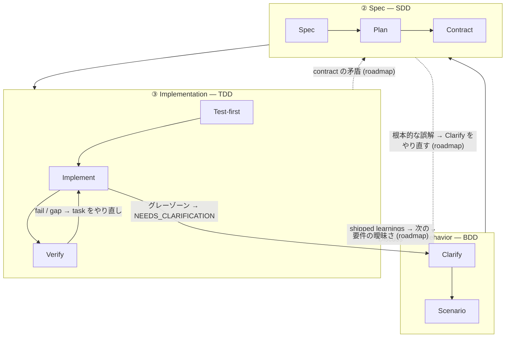

三層スタックは、harnessed のリズムが*なぜ*この形なのかを説明する理論です。これは **BDD → SDD → TDD** という入れ子構造をソフトウェアエンジニアリングとして実装したもので、3 つの入れ子フィードバックループがそれぞれ別の問いに答えます。harnessed の貢献はオープンソース生態系を各ループに**合成**することです —— そして upstream のコンポーネントは*部分的に重なる*ため、その重なりを調停することこそ合成オーケストレーターの本分です。

## 3 つのループ

| 層                   | Loop | 答える問い                                 | 合成元（重なりあり）                                                                              |
| -------------------- | ---- | ------------------------------------------ | ------------------------------------------------------------------------------------------------- |
| **① Behavior**       | BDD  | *何を*作るか、そして何をもって完了とするか | gstack `/office-hours` governance · GSD discuss · superpowers brainstorming → acceptance criteria |
| **② Spec**           | SDD  | *どう*構造化するか                         | GSD plan-phase → requirements / design / tasks · contracts（Spec Kit / ECC patterns）             |
| **③ Implementation** | TDD  | それは実際に*動く*のか                     | superpowers TDD red-green · subagent execution · GSD verify-work · harnessed completion gate          |

**ループは段階ではなく入れ子のレンズ（nested lenses）です。** Cucumber は BDD-outer + TDD-inner の二重ループを広めました。failing scenario が外側のループを開き、複数の内側 red-green TDD サイクルでそれを緑まで駆動します。GenAI 時代はその間に環をひとつ足しました —— Behavior と Implementation のあいだの明示的な SDD **spec** 環です。agent が実行するには frozen contract が要るからです。こうして上記の **triple-loop** ができます。

## ノード単位の展開

各ループはいくつかのノードに分かれ、それぞれがどのオープンソースコンポーネントから合成されるかを示します。

### ① Behavior (BDD)

| ノード       | 役割                                 | 合成元                                                           |
| ------------ | ------------------------------------ | ---------------------------------------------------------------- |
| **Clarify**  | *何を*作るかを固め、曖昧さを洗い出す | gstack `/office-hours` + GSD discuss + superpowers brainstorming |
| **Scenario** | 意図を acceptance criteria に変換    | GSD phase success criteria                                       |

外側のループは、scenario の acceptance criteria が書き出されるまで開いたままです。「完了」の定義はここで決まります —— どんな構造やコードよりも先に。

### ② Spec (SDD)

| ノード       | 役割                         | 合成元                                                                  |
| ------------ | ---------------------------- | ----------------------------------------------------------------------- |
| **Spec**     | requirements + design        | GSD plan-phase + Spec Kit の三点セット（requirements / design / tasks） |
| **Plan**     | tasks + 依存 DAG             | GSD `PLAN.md` + ECC の分解                                              |
| **Contract** | インターフェースを frozen に | contract の慣習                                                         |

中間の環は「何を」を実行可能な構造へ変換します。その終了条件は **frozen contract** —— implementation 環がそれに対してテストを書くインターフェースです。

### ③ Implementation (TDD)

| ノード         | 役割                        | 合成元                                  |
| -------------- | --------------------------- | --------------------------------------- |
| **Test-first** | failing test（red gate）    | superpowers TDD                         |
| **Implement**  | green まで駆動              | subagent execution                      |
| **Verify**     | refactor + タスク単位の完了 | GSD verify-work + harnessed completion gate |

内側の環は古典的な red → green → refactor サイクルそのもので、すべての contract が満たされるまでタスクごとに一周します。

### Cross-cutting

2 つの関心事はどの単一ループにも属しません：

| 関心事     | 役割                        | 合成元                               |
| ---------- | --------------------------- | ------------------------------------ |
| **Review** | 品質 + セキュリティのゲート | gstack `/review` + `/cso`            |
| **Ship**   | リリース準備 + 納品         | `release-preflight` + gstack `/ship` |

さらに 2 つの **discipline** が*すべての*層を貫きます：

- **karpathy principles** —— _how_ to code：最小限の実行可能な変更、外科手術的な編集、simplicity first。
- **mattpocock moves** —— オンデマンドのツール（`/zoom-out`、`/diagnose`、`/grill-with-docs`）を状況ごとに呼び出す。

## 戻り（GoBack）

フローの既定は outer → inner です。**harnessed はこの triple-loop の linear-cadence 実装であり、完全な routed graph はその進化の到達点です。** これらのループは依然フィードバックループですが、今日出荷されているのは一部の戻り辺だけで、より粒度の細かい環単位のルーティングは roadmap 上にあります。下図では出荷済みの辺を実線、roadmap の辺を破線で示し `(roadmap)` と付記しています。

### 今日出荷済み

現在の linear cadence には 3 本の live な戻り辺があります：

- **Verify → Task** —— 失敗したチェックや埋まらない gap が、その作業を implementation 環に押し戻します。
- **グレーゾーン → 明確化** —— subagent が曖昧さにぶつかると `STATUS: NEEDS_CLARIFICATION` を返し、実行を止め、明確化し、再開します。
- **Learnings → 次の Discuss** —— 出荷された各サイクルが failure／loop／reject シグナルを追記し、次の Behavior 環に流し込みます（always-on の learn loop）。

### Roadmap（未出荷）

より粒度の細かい構造化された戻り —— gap を答えを持つ環に*直接*ルーティングする —— は現在の挙動ではなく進化の方向です：

- **contract の矛盾**（implementation が frozen なインターフェースを満たせない）→ **Spec** に戻す。
- **要件の曖昧さ**（contract 自体は整合しているが behavior が規定不足）→ **Behavior** に戻す。
- **根本的な誤解**（構造全体が誤った結果を狙っている）→ Behavior の **Clarify** を開き直す。

今日これらの gap は、上記 3 本の出荷済みの辺（多くは Verify → Task と人手の明確化）を通じて表面化するのであって、自動の環単位ルーティングではありません。合成オーケストレーターの当面の価値は、異なる upstream コンポーネントがそれぞれ別の環を所有するなかで linear cadence の整合を保つことにあり、routed graph はその先の方向です。

## コンポーネントの交差 —— これこそが要点

同じ upstream ツールが複数のループに現れます。この交差は冗長ではなく、合成オーケストレーターが調停すべきインターフェースです：

- **GSD** は **backbone** —— 3 つの環すべて（discuss → plan → verify）を貫きます。
- **gstack** は **Behavior + Review** にまたがります。
- **superpowers** は **Behavior**（brainstorm）+ **Implementation**（TDD）にまたがります。

調停がなければ、これらの交差は重複して発火するか、互いに矛盾します。合成層は各環を正しい upstream ツールにルーティングし、継ぎ目を解消します。

## 理論 vs. runtime

三層スタックは*理論*です。[5 段階のリズム](/ja/docs/concepts/five-stage-cadence/) はその理論がコマンドラインで動く形です：

| Loop（理論）     | runtime の段階                     |
| ---------------- | ---------------------------------- |
| ① Behavior       | **Discuss**                        |
| ② Spec           | **Plan**                           |
| ③ Implementation | **Build**（Task）                  |
| Cross-cutting    | **Verify + Ship**（evidence gate） |

upstream ツールを fork せずに*どう*繋ぎ合わせるかは [vendoring より合成](/ja/docs/concepts/composition/) を参照してください。
