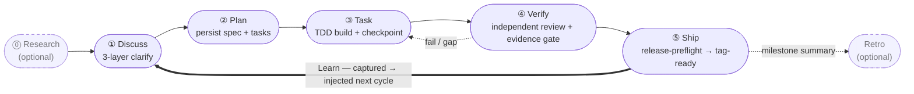

harnessed は AI コーディング harness のためのパッケージマネージャー兼合成オーケストレーターです。型付きマニフェストを通じて Skills、MCP サーバー、harness パックを組み合わせたワークフローをインストール・合成・実行します。upstream のコードを vendoring することはありません。

Claude Code で開発しているなら、harnessed はコマンド 1 つで最良のオープンソースコンポーネント —— ECC、Superpowers、GSD、gstack —— を配線し、ひとつの実行可能なワークフローにまとめます。

運転ループ —— 5 つの stage を always-on の Learn サイクルが閉じます：

## どこから始めるか

- **[インストール](/ja/docs/getting-started/installation/)** — 30 秒で harnessed をインストールしてセットアップ
- **[クイックスタート](/ja/docs/getting-started/quickstart/)** — インストールから最初のワークフローまで 60 秒
- **[合成のコンセプト](/ja/docs/concepts/composition/)** — harnessed が upstream を fork せずに合成する仕組み
- **[ワークフロー一覧](/ja/docs/reference/workflows/)** — 現行リリースに同梱される 28 個の合成可能なワークフロー

## harnessed が他と違うところ

すべてのワークフローを 3 つの原則が支えています：

**vendoring ではなく合成。** 各 harness パックはマニフェストを同梱します。harnessed はそれを読み、互換性を検証し、runtime で upstream のツールを繋ぎ合わせます。あなたが動かすのは常に公式の upstream であり、古い fork ではありません。

**5 段階のリズムを標準装備。** Discuss → Plan → Task → Verify → Ship。任意の Research と Retro に加え、自動の学習ループ付き。あるいは `/auto` を実行すれば 6 段階パイプライン全体（research → retro、Ship は明示）をコマンド 1 つで走らせられます。

**Dogfood 優先のメソドロジー。** すべてのワークフローは自身の定義に対して検証されます —— harnessed 自体を出荷するのと同じ規律です。

全体像は [README](https://github.com/easyinplay/harnessed#readme) をご覧ください。
