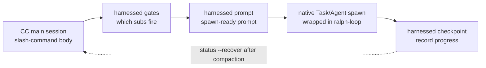

> **v4.0 の実行モデル。** harnessed は実行エンジンではなく *orchestration brain + prompt library*（判断の頭脳 + prompt ライブラリ）です。`harnessed setup` が生成するスラッシュコマンドの本体が、3 つの高速な純関数 CLI —— `harnessed gates`（どのサブワークフローが発火するか）、`harnessed prompt`（サブワークフローの spawn-ready prompt）、`harnessed checkpoint`（進捗の記録）—— を通じて **CC-native subagent spawn** を駆動します。実際の spawn、Agent Teams、ralph-loop、明確化の往復は Claude Code の main session がネイティブツールで実行します。`harnessed run` は CI／headless 専用に残されています。

3 つの orchestration CLI が CC-native spawn を駆動する流れ：



## `harnessed`（you-are-here ダッシュボード）

**引数なし**で `harnessed` を実行すると you-are-here ダッシュボードが表示されます —— 進行中の workflow の中で現在地をつかむ最速の方法です（comet `/comet` の類似、v8.0 で導入）。

```bash
harnessed          # 人間向けの you-are-here + 次の一手ダッシュボード
harnessed --json   # 機械可読の構造化オブジェクト
```

現在の repo の進行中 workflow を自動検出し、現在の phase、各サブワークフローの状態、そして 1 行の確定的な契約 `NEXT: auto | manual | done` と実行ヒント（例 `→ run: harnessed prompt <sub>`）を表示します。進行中の workflow がない場合は `harnessed setup` を案内する導入ヒントを表示します。

**読み取り専用** —— spawn せず、状態／git／remote を変更せず、常に exit `0`。ダッシュボードを出すのは素の `harnessed`（または `harnessed --json`、`--lang` 付き可）だけです。サブコマンド、`--help`、`--version`、未知の語はすべて通常のコマンド解析に落ちます（したがって `harnessed bogus` は従来どおりエラーになります）。

`--json` のフィールド：`active`、`phase`、`status`、`started_at`、`next`、`sub`、`hint`、`sub_progress`。

---

## `harnessed setup`

ワンショットのオンボーディング —— ワークフロー skills と base マニフェストを `~/.claude/` にインストールします。

```bash
harnessed setup [オプション]
```

**実行内容：**

1. `workflows/<name>/SKILL.md` をスキャンし、それぞれを `~/.claude/skills/<name>/` にコピー
2. `manifests/tools/*.yaml` と `manifests/skill-packs/*.yaml` を処理
3. `~/.claude/settings.json` に `CLAUDE_CODE_EXPERIMENTAL_AGENT_TEAMS=1` を書き込み
4. OS ロケールを検出して `env.HARNESSED_USER_LANG` に書き込み（zh-* → `zh-Hans`、それ以外 → `en`）

**フラグ：**

| フラグ | 説明 |
|--------|------|
| `--user-lang <code>` | 検出したロケールを上書き。`en`、`zh-Hans`、`zh-CN`、`zh-TW` を受け付ける |
| `--dry-run` | プレビューのみ —— 書き込む内容を表示し、ディスクは変更しない |

**終了コード：** `0` = 成功、`1` = ファイルシステムエラー、`2` = SKILL.md を持つワークフローが見つからない。

---

## `harnessed install <pack>`

名前またはパスで harness パックをインストールします。

```bash
harnessed install <pack>
```

パックのマニフェストを解決し、スキーマに照らして検証し、各 `install` ステップを順に実行します。現在はローカルパスと git URL からのブートストラップに対応しており、npm registry からのパック探索は計画中です。

---

## `harnessed install-base`

base プロファイル全体をワンショットでインストールします —— `manifests/tools/*.yaml` と `manifests/skill-packs/*.yaml` の各マニフェストをソート順に処理します。`install` の `--base` フラグではなく独立したサブコマンドなので、単一パックのゲートと衝突しません。

```bash
harnessed install-base                   # 即時適用（既定）
harnessed install-base --dry-run         # プレビューのみ —— ディスクは変更しない
harnessed install-base --non-interactive # すべてのプロンプトをスキップ（CI／スクリプト）
```

統計を表示します：`installed / already-installed / skipped (user-aborted) / failed`。

**終了コード：** `0` = 1 つ以上インストールされ失敗なし · `1` = 1 つ以上の失敗 · `2` = 何もインストールされず（すべて already-installed か中断）。

---

## `harnessed research`

research ワークフローを実行します —— search カテゴリのサブルーティング → subagent spawn → 逐語の `COMPLETE`。`workflows/research/workflow.yaml` の薄いエイリアスです。

```bash
harnessed research --query "compare Postgres vs SQLite for this use case"
harnessed research --query "..." --dry-run          # 解決された workflow + gate context をプレビュー（JSON）
harnessed research --query "..." --model sonnet      # subagent の model：haiku | sonnet | opus
harnessed research --query "..." --non-interactive   # すべてのプロンプトをスキップ（CI／スクリプト）
```

| フラグ | 説明 |
|--------|------|
| `--query <text>` | research の prompt（**必須**）|
| `--dry-run` | プレビューのみ —— `{ workflow, yamlPath, gateContext }` を表示し spawn しない |
| `--model <model>` | subagent の model：`haiku` \| `sonnet` \| `opus` |
| `--non-interactive` | すべてのプロンプトをスキップ（CI／スクリプト）|

**終了コード：** `0` = workflow 完了 · `1` = workflow 実行時の失敗 · `2` = 使い方の誤り（`--query` 欠落、または workflow yaml が見つからない）。

---

## `harnessed manifest-add <upstream>`

**EE-5 の 5 つの質問による merge ゲート**の後に、新しい upstream アダプターを追加します —— 5 つの対話的な問いが、新しい upstream を合成に取り込む前に熟慮した判断を強制します（再利用可能な surface か、名前は適切か、既存コンポーネントと重複しないか、概念を取り込むのか他人のプロダクトの identity を取り込むのか、upstream を知らないユーザーにも理解できるか）。5 問すべてに空でない回答が必要です。

```bash
harnessed manifest-add https://github.com/owner/repo.git
harnessed manifest-add <upstream> --category tools    # skill-packs（既定）| tools
harnessed manifest-add <upstream> --name myadapter    # 既定は <upstream> の basename
harnessed manifest-add <upstream> --dry-run           # プレビュー —— 回答を表示し書き込まない
harnessed manifest-add <upstream> --non-interactive   # CI：WARN のみの dry-run、何も書かない
```

成功すると回答を `manifests/<category>/<name>.ee5-answers.json` に書き込みます。

| フラグ | 説明 |
|--------|------|
| `--category <cat>` | マニフェストのカテゴリ：`skill-packs`（既定）\| `tools` |
| `--name <name>` | 短いアダプター名（既定は `<upstream>` の basename）|
| `--dry-run` | プレビューのみ —— 回答 JSON を表示し書き込まない |
| `--non-interactive` | CI／スクリプト —— WARN のみ、何も書かない |

**終了コード：** `0` = ゲート通過（書き込みまたはプレビュー）· `1` = 空の回答がある。

---

## `harnessed uninstall [pack]`

インストール済みのパックをアンインストールします。引数なしの場合、harnessed 自身がインストールしたファイルを削除します。

```bash
harnessed uninstall <pack>   # 単一パックを削除（マニフェストの uninstall 手順を実行）
harnessed uninstall          # ~/.claude/ から harnessed 自身の skills／manifests を削除
```

skill をディスクに置く 3 つのインストール方式（`npm-cli`、`git-clone-with-setup`、`npx-skill-installer`）では、uninstall はマニフェストが**宣言した `spec.uninstall` 契約**を実行します。まず宣言された `cmd` を実行し（fail-soft —— 非ゼロ終了や shell 欠如は警告のみで続行）、続いて各 `cleanup_paths` を冪等に force-rm します。この操作は **`$HOME` 内に限定**されます（home のサブツリー外のパスは hard-fail）。settings／plugin／MCP に手を入れる方式（`cc-hook-add`、`cc-plugin-marketplace`、`mcp-*-add`）は、それぞれ専用のアンインストーラーを保持します。引数なしの統合アンインストールは `harnessed setup` を巻き戻します。

---

## Orchestration CLI（v4.0）

この 3 つの純関数 CLI は、生成されたスラッシュコマンド本体が CC-native spawn を駆動するために使うものです。JSON を出力するだけで、自身は spawn しません —— オーケストレーションは main session が行います。

### `harnessed gates <master>`

ある master orchestrator（`discuss` / `plan` / `task` / `verify` / `auto`）とタスク spec に対し、どのサブワークフローが発火するかを評価します。

```bash
harnessed gates plan --task "add OAuth login" --skip-sub discuss
# → JSON: { fire: [{ sub, order, mode }], skip: [...], parallelism: { escalate_to_teams } }
```

`fire` は判定ゲートを通過したサブワークフローを実行順に列挙します。`parallelism.escalate_to_teams` は、逐次的な subagent spawn ではなく CC-native Agent Teams に切り替えるべきタイミングを示します。

### `harnessed prompt <sub>`

単一のサブワークフローについて spawn-ready な prompt を出力します —— role-prompt 本体 + チェックリスト + 適用された disciplines。

```bash
harnessed prompt plan-phase --task "add OAuth login" --json
# → JSON: { prompt, max_iterations, model }
```

main session はこの `prompt` をネイティブの `Task` spawn に渡します（外側は ralph-loop plugin）。`max_iterations` / `model` はワークフローの既定値がそのまま入ります。

### `harnessed checkpoint`

サブワークフローの進捗を harnessed の checkpoint store に記録します。main session が各サブワークフローの完了（および失敗）時に呼び出し、compaction 後に `harnessed status --recover` で復元できるようにします。

```bash
harnessed checkpoint start <master> --plan <json>   # 進捗 ledger を初期化
harnessed checkpoint complete <sub>                 # サブワークフロー完了を記録（evidence guard 付き）
harnessed checkpoint fail <sub>                      # 失敗したサブワークフローを記録
```

### `harnessed run`

**CI／headless 専用。** ワークフロー全体をプロセス内で SDK spawn します —— オーケストレーションできる対話的な main session がない場合に使います。v4.0 の既定の経路は上記の gates → prompt → checkpoint オーケストレーションで、`run` はフォールバックです。

```bash
harnessed run <master> --task "<spec>"
```

---

## `harnessed doctor`

ローカルの harnessed + Claude Code のインストールを診断します —— 14 項目のヘルスチェック（Node、MCP scope／可用性、jq、Windows bash、origin、gstack prefix、deprecations、token budget、Agent Teams env、planning-with-files、mattpocock-skills、CodeGraph、update-available）。

```bash
harnessed doctor
harnessed doctor --json   # 機械可読レポート
```

---

## `harnessed update`

harnessed（および任意で upstream プラグイン）を最新に保ちます。14 番目の doctor check も "update available X→Y" を受動的に知らせます。`update` はデュアルチャネルで、harnessed のインストール方式を自動検出して対応する経路を通ります。

```bash
harnessed update                      # 自己更新 + CHANGELOG 先頭セクション + 再起動の案内
harnessed update --check              # installed／latest のバージョンを報告するだけ、インストールしない
harnessed update --dry-run            # 実行される更新動作をプレビュー —— 何も書かない
harnessed update --upstreams          # base マニフェストを再実行して upstream プラグインも更新
harnessed update --migration-report   # 古い harnessed 状態を読み取り専用で棚卸し（何も削除しない）
harnessed update --rollback [version] # コンパイル済みバイナリ専用 —— bin-backup/ に保持された旧版へ戻す
```

**npm チャネル** —— `npm i -g harnessed@latest` を実行し、CHANGELOG の先頭セクションを表示し、Claude Code の再起動を促します。

**コンパイル済みバイナリチャネル**（ワンライナーのインストーラー）—— GitHub releases からプラットフォーム資産をダウンロードし、`.sha256` チェックサム**とその ed25519 署名**（`<asset>.sha256.sig`。v4.32.19 以降はリリース契約 —— 署名の欠如も検証失敗も hard error で、現行バイナリはそのまま残ります）を検証してから、新しいバイナリをアトミックに差し替えます。置き換えられた旧版はロールバック用に `bin-backup/` へ格納されます。

**`--rollback [version]`**（コンパイル済みバイナリ専用）—— `bin-backup/` から旧版をアトミックに復元します。既定では最新の保持版、バージョン指定も可能です（未知のバージョンはエラーとなり利用可能なバージョンを列挙します）。現行バイナリは先に bin-backup へ戻されるため、ロールバック自体も可逆です。npm インストール時は拒否し、`npm i -g harnessed@<version>` を案内します。

ネットワークアクセスは fail-soft です —— npm に到達できなくてもエラーにはなりません。

---

## `harnessed release-preflight`

Ship 段階のゲート。**読み取り専用**のリリース準備チェックで、repo がリリース可能でなければ exit 1 します。何も変更しません（実際の publish は tag push 時に CI が行います）。

```bash
harnessed release-preflight
```

チェック項目：`CHANGELOG.md` の `[Unreleased]`（または `[<version>]` セクション）が空でない、`package.json` に妥当な version がある、作業ツリーがクリーン（tracked の変更）、`v<version>` タグがまだ存在しない。

---

## `harnessed compact`

解決済みの sub-progress ledger エントリを要約して退避し、長いタスクのためにコンテキストを解放します。**G6-safe**：`fail_count > 0` のエントリは決して退避されず、break-loop シグナルが保たれます。

```bash
harnessed compact                                  # 手動 compaction
harnessed checkpoint complete <sub> --tokens <n>   # token 数が閾値を超えると自動発火
```

---

## `harnessed workflows`

進行中の workflow を列挙します —— repo ごとに 1 つ（harnessed は repo root で checkpoint 状態をスロット分けするため、並行するプロジェクト同士が上書きし合いません）。

```bash
harnessed workflows
```

---

## `harnessed learn`

現在の repo の `.planning/LEARNINGS.md` に散文の learning を追記します。完了した workflow も自身の failure／loop／reject シグナルを自動追記し、inject hook が関連する learnings を次の session に注入します。

```bash
harnessed learn "マイグレーションを闇雲にリトライしない —— 先にクリーンなスナップショットが要る"
```

---

## `harnessed retro`

retro-cadence のリマインダーをリセットします。`/retro` は gstack の skill で harnessed からは観測できないため、実行後に `harnessed retro --done` を呼んで repo ごとの phase カウンタをゼロに戻し、`RETRO-DUE` の inject リマインダーを消します。

```bash
harnessed retro --done   # phase カウンタをリセット + RETRO-DUE リマインダーを消去
```

`--done` なしでは何もせず exit `1` します（`nothing to do — pass --done after running /retro`）。

---

## `harnessed next`

確定的な next-step 契約を表示します —— 読み取り専用で状態を変更しません。2 層構成：

1. **workflow が進行中**（未処理の sub が残っている）→ workflow 内の契約 `NEXT: auto <sub> | manual <sub> | done` をそのまま使う（exit `0`、従来どおり）。
2. **sub がすべて解決済み** → **unit をまたぐ横方向の継続**（v4.10）にフォールスルー：`.planning/` のディスク SoT から次の work unit（次の phase／task）を導出し、`NEXT: advance | blocked | done` を表示。

```bash
harnessed next
# 進行中：       NEXT: auto <sub>
# fall-through: NEXT: advance
#               UNIT: phase 16 'rate limiter'
#               HINT: run /auto (or harnessed advance) to start it — 2 phases remain
```

**unit をまたぐ場合の終了コード：** `0` = advance（次の unit あり）· `2` = done（全 phase 完了）· `10` = blocked（人手の判断が必要）。

---

## `harnessed advance`

`.planning/` のディスク SoT から導出した次の work unit へ進みます —— **表示のみ（print-only）**。次の phase／task と実行すべきコマンド（例 `→ run /auto "..."`）を表示しますが、状態を seed **せず**、spawn も **しません**。表示されたコマンドは main session が自分で実行するため、明確化の往復と Agent Teams が保たれます。

```bash
harnessed advance
# ADVANCE: advance
# UNIT: phase 16 'rate limiter'
# → run /auto "phase 16 'rate limiter'"
```

**advance-gate。** `advance` は、より前の*未完了* phase を飛び越えることを拒否します（「comet」ゲート）。導出された次の phase の順序が workflow pointer より前だったり、失敗した sub が ledger を塞いでいる場合、非ゼロで終了し、実行コマンドを**表示しません**。`--force` で上書きできます —— 出力に audit note を残したうえで続行します。

```bash
harnessed advance --force   # ゲートを上書き（audit note を記録）
```

**driver loop。** `--json` は機械可読の `{ next, unit, hint }` を出力し、shell ループで複数 phase を hands-free に連鎖できます —— ループは非ゼロ終了（done／blocked／gate-reject）で止まります：

```bash
while harnessed advance --json; do : ; done
```

**終了コード：** `0` = advance · `2` = done（全 phase 完了）· `10` = blocked · `11` = gate-reject（前の phase が未完了。`--force` を使う）· `1` = error。

**設計 —— キューを持たず、ディスクから導出する。** 「次」は常にディスクから導出され、保存されたキューから来ることはありません。phase が完了とみなされるのは、各 `NN-*-PLAN.md` に対応する `NN-*-SUMMARY.md` が存在するとき ⇔ です（成果物から導出されるため、出荷済みの phase は自然にスキップされます）。途中に phase を差し込んでも（`ROADMAP.md` を編集する、`phases/16.1-*/` を追加する）、次の `advance` が自動で拾います。phase 単位の継続は出荷済みの floor で、task 単位の解決は resolver-ready ですがまだ CLI には繋がっていません。

---

## `harnessed reject <sub>`

あるサブワークフローをユーザー拒否として記録します —— 終端状態であり、`failed`（break-loop のリトライ論理を駆動する）とは区別されます。

```bash
harnessed reject <sub>
```

---

## `harnessed resume`

失敗した `/auto` パイプラインを、最後に成功した段階から再開します。

```bash
harnessed resume
```

`.planning/STATE.md` を読んで最後に成功した段階を特定し、そこからパイプラインに再入します。段階の途中で失敗した場合に有用です。

---

## `harnessed status`

現在の作業ディレクトリのパイプライン状態を表示します。

```bash
harnessed status
```

`.planning/STATE.md` を読み、現在の段階、最後に完了した段階、すべてのブロッカーを表示します。

```bash
harnessed status --recover
```

`--recover` は STATE.md ではなく checkpoint の進捗 ledger を読み、compaction 後の復旧ビューを構造化して表示します —— 完了／未実行／スキップされたサブワークフロー、次に実行すべきコマンド、そして evidence-drift の警告。context compaction のあと現在地をつかみ直すために使います。

---

## `harnessed audit`

`manifests/tools/` と `manifests/skill-packs/` のマニフェストに対する二次的な自己整合性監査です。Ajv スキーマでは捕まえられない schema drift、プレースホルダー値、改ざんを捉える多層防御のパスです。

```bash
harnessed audit                 # マニフェスト + runtime の 2 層
harnessed audit --skip-runtime  # マニフェスト層のみ（オフライン／未初期化）
```

**マニフェスト層：** repository URL の形（`https://…​.git`）、`signed_by` のプレースホルダー値（`unsigned` / `todo` / `tbd` / …）、および動く `git_ref`（`HEAD` / `main` / `master` —— これは *error*：SHA かタグに pin すべき）。**runtime 層**（`--skip-runtime` でスキップ）：origin-URL の改ざん、`install.cmd` の shell インジェクション + npm パッケージのクロスチェック、provenance ゲート。マニフェストごとの `✓ / ⚠ / ✗` レポートと finding の集計を表示します。

**終了コード：** `0` = error レベルの finding なし（warning は可）· `1` = 1 つ以上の error。

> **`audit` と `audit-log`** —— `audit` は*マニフェストファイル*の整合性を検証します。`audit-log`（次項）は、すでに起きたルーティング／インストールの*ログ*を照会します。関心事が異なります。

---

## `harnessed audit-log`

ルーティング／インストールの監査ログを表示します —— どのゲートが発火し、どのパックがいつインストールされたか。

```bash
harnessed audit-log                    # 人間向けの 5 列テーブル
harnessed audit-log --filter <pack>    # パック／イベントで絞り込み
harnessed audit-log --json             # 12 フィールドの完全なレコード
```

---

## `harnessed backup list`

`.harnessed-backup/` 配下の各バックアップスナップショットを列挙します —— スナップショットごとに 1 行で、タイムスタンプ、元のマニフェスト、ファイル数を表示します。各スナップショットの `metadata.json` から読み取ります。

```bash
harnessed backup list
```

`harnessed gc`（古いスナップショットの削除）と `harnessed rollback`（選んだタイムスタンプからの復元）と対になるコマンドです。

---

## `harnessed gc`

install／uninstall／rollback が生んだ古いバックアップを回収します。

```bash
harnessed gc
```

---

## `harnessed rollback`

直近のバックアップから前の状態を復元します（CRLF／LF を保持）—— 直前の install／setup の変更を取り消します。

```bash
harnessed rollback
```

---

## `harnessed --version`

```bash
harnessed --version
# → 4.32.20
```

---

## `harnessed --help`

```bash
harnessed --help
harnessed <command> --help   # コマンドごとのヘルプ
```

---

## グローバルフラグ

| フラグ | 説明 |
|--------|------|
| `--version` | バージョンを表示して終了 |
| `--help` | ヘルプを表示して終了 |

ソースは [harnessed リポジトリ](https://github.com/easyinplay/harnessed/tree/main/src/cli) の `src/cli.ts` と `src/cli/` にあります。
