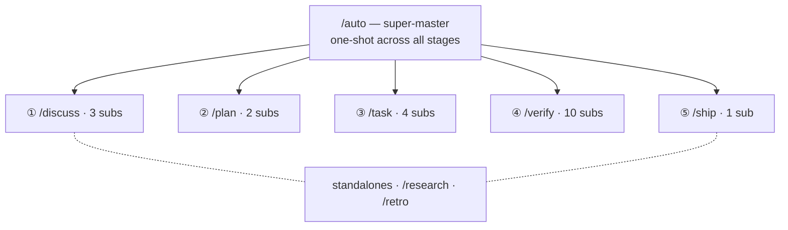

harnessed は名前空間で階層化された 28 個のワークフローを提供します：super-master が 1 つ、段階 master が 5 つ（Discuss · Plan · Task · Verify · Ship）、サブワークフローが 20 個、独立ワークフローが 2 つ。

28 個のワークフロー —— 1 つの super-master が 5 つの stage master とそのサブに扇形に広がり、加えて独立ワークフローが 2 つ：

## Super-master

| コマンド | スコープ     | capability                                                                                                                                                                                                                           |
| -------- | ------------ | ------------------------------------------------------------------------------------------------------------------------------------------------------------------------------------------------------------------------------------ |
| `/auto`  | super-master | 6 段階パイプライン全体：research（条件付き）→ discuss → plan → task → verify → retro（必須）。AI によるワンショットの複雑度評価 + 理解確認。`--staged` フラグで段階ゲート UX を有効化。失敗時は即停止し、`harnessed resume` で再開。 |

## 独立ワークフロー

| コマンド    | スコープ | capability                                                                                                                   |
| ----------- | -------- | ---------------------------------------------------------------------------------------------------------------------------- |
| `/research` | 独立     | Tavily、Exa MCP、ctx7 によるマルチソース調査。`/auto` では段階 0 として発火するか、discuss の前に直接呼び出す。              |
| `/retro`    | 独立     | gstack `/retro` によるマイルストーンの締め要約。学び、判断記録、想定外の発見を `RETROSPECTIVE.md` に残す。`/auto` では必須。 |

## Discuss 段階

| コマンド             | スコープ         | capability                                                                                                                             |
| -------------------- | ---------------- | -------------------------------------------------------------------------------------------------------------------------------------- |
| `/discuss`           | 段階 master      | 3 つの議論ゲートを並列に評価し、発火したものだけを実行。                                                                               |
| `/discuss-strategic` | サブワークフロー | 戦略層 —— 新機能／milestone／プロダクト方針。gstack `/office-hours` + `/plan-ceo-review`。`findings.md` を永続化。                     |
| `/discuss-phase`     | サブワークフロー | フェーズ層 —— 未決の判断が 2 つ以上、グレーゾーンの明確化。GSD `gsd-discuss-phase`。`findings.md` + `knowledge.md` を永続化。          |
| `/discuss-subtask`   | サブワークフロー | サブタスク層 —— 2 つ以上の方針／コアアルゴリズム／API contract。Superpowers brainstorming + `/grill-with-docs`。一時的で永続化しない。 |

## Plan 段階

| コマンド             | スコープ         | capability                                                                                                    |
| -------------------- | ---------------- | ------------------------------------------------------------------------------------------------------------- |
| `/plan`              | 段階 master      | 直列：アーキテクチャレビュー（条件付き）→ フェーズ計画（常時）。                                              |
| `/plan-architecture` | サブワークフロー | アーキテクチャ層 —— 複雑なアーキテクチャのガバナンスゲート。gstack `/plan-eng-review`。計画の前に設計を確定。 |
| `/plan-phase`        | サブワークフロー | フェーズ計画 —— GSD `gsd-plan-phase` + planning-with-files。`task_plan.md` + `progress.md` を永続化。         |

## Task 段階

| コマンド        | スコープ         | capability                                                                                                                                         |
| --------------- | ---------------- | -------------------------------------------------------------------------------------------------------------------------------------------------- |
| `/task`         | 段階 master      | サブタスクごとの直列ループ：明確化 → 実装 → テスト → 納品。                                                                                        |
| `/task-clarify` | サブワークフロー | 起動時の明確化ゲート。Superpowers brainstorming + `/grill-with-docs` を条件付きで発火。                                                            |
| `/task-code`    | サブワークフロー | karpathy の 4 原則に従って実装。`/zoom-out`／`/improve-codebase-architecture`／`/diagnose` を条件付きで発火。session をまたぐ `progress.md` 同期。 |
| `/task-test`    | サブワークフロー | TDD red → green → refactor。Superpowers TDD + `/diagnose` を条件付きで発火。コアロジックでは必須。                                                 |
| `/task-deliver` | サブワークフロー | `ralph-loop` SDK ラッパー。逐語の `COMPLETE` が出るまで実行。フルスタック協調時は Agent Teams を条件付きで発火。                                   |

## Verify 段階

| コマンド                 | スコープ         | capability                                                                                                                                       |
| ------------------------ | ---------------- | ------------------------------------------------------------------------------------------------------------------------------------------------ |
| `/verify`                | 段階 master      | シナリオフラグに応じて最大 7 つのサブチェックを振り分け。                                                                                        |
| `/verify-progress`       | サブワークフロー | 常に最初に実行。UAT 受け入れ基準チェック + GSD 状態同期。                                                                                        |
| `/verify-code-review`    | サブワークフロー | 複数 subagent の並列 fan-out。高確度の指摘。                                                                                                     |
| `/verify-paranoid`       | サブワークフロー | gstack `/review` によるパラノイドエンジニアレビュー。重要モジュールの PR 前は必須。                                                              |
| `/verify-qa`             | サブワークフロー | gstack `/qa` + playwright-cli／`@playwright/test` によるエンドツーエンド QA。UI 変更時に発火。                                                   |
| `/verify-security`       | サブワークフロー | gstack `/cso` による OWASP／認証／シークレットのチェック。認証やシークレットに触れたときに発火。                                                 |
| `/verify-design`         | サブワークフロー | gstack `/design-review` + ui-ux-pro-max + design-taste-frontend によるデザインシステム整合チェック。デザイン変更時に発火。                       |
| `/verify-eval-review`    | サブワークフロー | GSD `/gsd-eval-review` による AI フェーズの eval カバレッジ監査。AI／LLM 段階を含むときに発火（plan 側の gsd-ai-integration-phase と対になる）。 |
| `/verify-validate-phase` | サブワークフロー | GSD `/gsd-validate-phase` による Nyquist の要件→テストカバレッジ埋め戻し。カバレッジ監査が必要なときに発火。                                     |
| `/verify-simplify`       | サブワークフロー | `code-simplifier` による最終簡素化。常に最後に実行。                                                                                             |
| `/verify-multispec`      | サブワークフロー | 4 専門家の Agent Team Pattern C —— SendMessage で相互にクロスレビュー。重要リリースや大規模リファクタ PR の昇格経路。                            |

## Ship（第 ⑤ 段階）

| コマンド          | スコープ         | capability                                                                                                                                                                                    |
| ----------------- | ---------------- | --------------------------------------------------------------------------------------------------------------------------------------------------------------------------------------------- |
| `/ship`           | 段階 master      | Verify の後のリリース段階。まず preflight ゲートを実行し、その後 PR／deploy を gstack `/ship` に委譲。Deploy の境界は tag-ready で、実際の publish は tag push 時に `publish.yml` CI が実行。 |
| `/ship-preflight` | サブワークフロー | `harnessed release-preflight` を実行 —— 読み取り専用ゲート（CHANGELOG `[Unreleased]`／version／git-clean／tag-absent）。ひとつでも失敗すればリリースをブロック。                              |

## 規律ラッパー

| コマンド        | スコープ | capability                                                                                                       |
| --------------- | -------- | ---------------------------------------------------------------------------------------------------------------- |
| `/tdd`          | 規律     | red → green → refactor。`superpowers:test-driven-development` のエイリアス。独立した規律ラッパーとしても使える。 |
| `/ralph-loop`   | ラッパー | 完了約束のラッパー。任意の prompt を逐語の `COMPLETE` が出るまで実行。`/task-deliver` に組み込み済み。           |
| `/execute-task` | ツール   | 直接タスク実行のエントリーポイント。discuss／plan 段階をスキップ。                                               |

すべてのワークフロー定義は [harnessed リポジトリ](https://github.com/easyinplay/harnessed) の `workflows/<name>/workflow.yaml` にあります。
