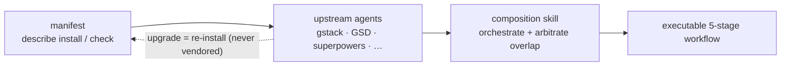

## 문제

AI 코딩 harness —— ECC, Superpowers, GSD, gstack —— 는 각각 별도의 npm 패키지나 git 저장소로 배포됩니다. 이들을 손으로 엮는 것은 취약합니다. upstream을 fork하고, 로컬에서 패치하고, 그다음에는 upstream이 새 버전을 낼 때마다 쉽게 병합하지 못한 채 썩어 가는 것을 지켜보게 됩니다.

전통적인 답은 vendoring이었습니다. upstream 코드를 자기 저장소로 복사해 직접 유지보수하는 방식이죠. upstream이 큰 개선을 내놓기 전까지는 잘 작동하지만, 그 뒤에는 낡은 fork에 갇힙니다. 수십 개의 harness 구성 요소를 손으로 동기화하는 것은 확장되지 않습니다.

## harnessed의 접근

harnessed는 upstream 코드를 절대 복사하지 않습니다. 대신 각 harness 팩이 **매니페스트** —— 팩의 설치 방법, 노출하는 capability, 다른 구성 요소와의 통합 지점을 기술한 타입이 정의된 YAML 파일 —— 를 함께 제공합니다.

runtime에 harnessed는 이 매니페스트들을 읽고, 호환성을 검증하고, 조합 skills를 통해 upstream 도구들을 오케스트레이션합니다. 여러분이 실행하는 것은 언제나 공식 upstream 바이너리이며, harnessed는 인계 지점만 조율합니다.

vendoring이 아닌 조립 —— 매니페스트가 기술하고, 조합 skill이 오케스트레이션합니다:



매니페스트 예시(축약):

```yaml
name: my-pack
version: 1.0.0
description: harnessed에 OAuth2 워크플로를 추가
install:
  - npm: superpowers
  - git: https://github.com/example/skill-pack-oauth
capability:
  skills:
    - brainstorming
    - tdd
  workflows:
    - discuss
    - plan
```

## 이점

**언제나 최신 upstream.** Superpowers가 새 릴리스를 내면 `harnessed install`을 다시 실행하는 것만으로 즉시 반영됩니다. 수동 병합도, 낡은 fork도 없습니다.

**검증된 조합.** `harnessed setup`은 설치 전에 매니페스트 호환성을 확인합니다. 충돌하는 capability 선언은 runtime의 놀람이 아니라 오류로 드러납니다.

**직접 팩 작성하기.** 매니페스트 schema는 저장소의 `schemas/manifest.v1.schema.json`에 공개되어 있습니다(YAML language server를 그 파일로 지정하면 인라인 검증이 됩니다). 설치 가능한 어떤 upstream(npm 패키지, git 저장소, 커스텀 skill)이든 매니페스트로 가리키면 harnessed는 이를 일급 조합 단위로 취급합니다.

**통합된 진입점.** 사용자는 각 upstream의 용어를 배울 필요 없이 `/discuss`, `/plan`, `/task`, `/verify`만 마주합니다. 조합 skill이 각 단계에서 올바른 upstream 도구로 라우팅을 처리합니다.

## 조합 skills의 동작 방식

v4.0부터 harnessed는 실행 엔진이 아니라 **orchestration brain + prompt library**입니다. 더 이상 자기 프로세스 안에서 워크플로를 spawn하지 않습니다 —— 대신 `harnessed setup`이 생성한 슬래시 명령 본문이 Claude Code main session에 **CC-native subagent** spawn을 지시하고, 세 개의 빠른 순수 함수 CLI가 이를 구동합니다. `/discuss`를 실행하면:

1. **Gate** —— `harnessed gates discuss --task "<spec>"`가 세 개의 논의 게이트(strategic / phase / subtask) 중 무엇이 발동하는지, Agent Teams로 승격할지를 반환합니다.
2. **Prompt** —— 발동한 각 게이트에 대해 `harnessed prompt <sub> --json`이 spawn 준비된 prompt(role 본문 + 체크리스트 + 적용된 disciplines)를 출력합니다.
3. **Spawn** —— main session이 네이티브 `Task` spawn을 실행하고(ralph-loop로 감쌈), `STATUS: NEEDS_CLARIFICATION`은 `AskUserQuestion`으로 여러분에게 되돌립니다.
4. **Checkpoint** —— `harnessed checkpoint complete <sub>`가 진행 상황을 `.planning/`에 기록해 compaction 후에도 실행이 살아남게 합니다.

harnessed는 결정(게이트 라우팅, prompt 생성, 진행 ledger)을 담당하고, 실제 spawn과 Agent Teams 조율, 명확화 왕복은 main session이 네이티브 Claude Code 도구로 수행합니다. (`harnessed run`은 CI/headless 전용으로 예전의 프로세스 내 spawn을 유지합니다.)

harnessed의 28개 워크플로가 ECC, Superpowers, GSD, gstack을 동시에 조합할 수 있는 이유가 바로 이것입니다 —— 조합 계층이 이음매를 추상화합니다.

28개 전체 워크플로와 upstream 의존성은 [워크플로 레퍼런스](/ko/docs/reference/workflows/)를 참고하세요.
