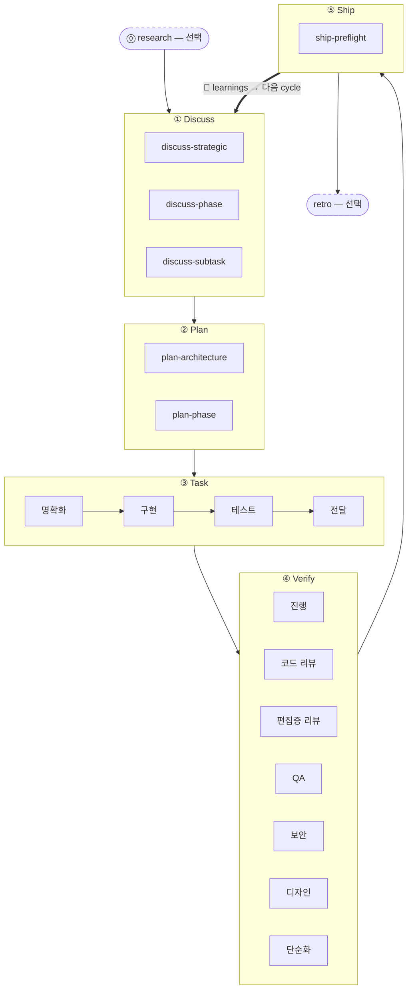

5단계 리듬은 harnessed의 핵심 방법론입니다. 모든 기능, 버그 수정, 리팩터링이 같은 다섯 단계를 차례로 지나갑니다 —— **Discuss → Plan → Task → Verify → Ship** —— 그리고 자동 **Learn** 루프가 그것을 닫습니다. 두 개의 동반 단계(Research, Retro)가 주 루프의 양 끝에 놓입니다.

## 단계

| #   | 단계         | 슬래시 명령 | 모드                                  |
| --- | ------------ | ----------- | ------------------------------------- |
| 0   | **Research** | `/research` | 선택 —— 이해가 불충분할 때 발동       |
| 1   | **Discuss**  | `/discuss`  | 필수                                  |
| 2   | **Plan**     | `/plan`     | 필수                                  |
| 3   | **Task**     | `/task`     | 필수                                  |
| 4   | **Verify**   | `/verify`   | 필수                                  |
| 5   | **Ship**     | `/ship`     | 명시적 —— 릴리스 단계(사용자가 발동)  |
| —   | **Retro**    | `/retro`    | `/auto`에서는 필수, 단독 호출 시 선택 |

**학습은 단계가 아니라 자동입니다.** 완료된 각 workflow는 자신의 failure/loop/reject 신호를 `.planning/LEARNINGS.md`에 덧붙이고, inject hook이 관련 learnings를 다음 session에 주입합니다. 이는 always-on이며 선택 단계인 Retro에 **의존하지 않습니다**.

### Research(선택)

Tavily, Exa, ctx7을 통한 다중 소스 조사. `/auto` 안에서 이해 확인에 "아니오"라고 답하면 발동하거나, `/research`를 직접 호출합니다. 출력은 `.planning/` 아래 `research-notes.md`에 기록됩니다.

### Discuss —— 3계층 게이트

`/discuss`는 세 게이트를 독립적으로 평가하고, 발동한 것만 실행합니다:

- **전략 계층**(`discuss-strategic`): 새 기능, 새 milestone, 새 제품 방향 → gstack `/office-hours` + `/plan-ceo-review`. `findings.md` 영속화.
- **페이즈 계층**(`discuss-phase`): 미결 구현 결정 2개 이상, 모듈 간 데이터 흐름 불명확 → GSD `gsd-discuss-phase`. `findings.md` + `knowledge.md` 영속화.
- **서브태스크 계층**(`discuss-subtask`): 뚜렷이 다른 방식이 2개 이상인 핵심 알고리즘 / API contract → Superpowers brainstorming. 일시적이며 영속화하지 않음.

각 게이트는 발동할 때도 건너뛸 때도 그 사실을 투명하게 밝힙니다.

### Plan —— 아키텍처 리뷰 + 영속화

`/plan`은 두 단계를 순서대로 실행합니다:

1. **아키텍처 리뷰**(조건부) —— 복잡한 아키텍처는 gstack `/plan-eng-review`를 발동시켜, 영속화 전에 설계를 확정합니다
2. **페이즈 계획** —— GSD `gsd-plan-phase` + planning-with-files가 정확한 파일 경로, 인수 기준, 의존 순서를 담아 `task_plan.md`를 생성합니다

### Task —— 서브태스크 루프

`/task`는 서브태스크마다 엄격한 순서로 네 단계를 실행합니다:

1. **명확화** —— 스펙을 검증하고, 모호함을 드러내고, `task_plan.md`와 대조
2. **구현** —— karpathy 원칙: 가장 작은 실행 가능한 변경, 외과적 편집, 범위 확대 금지
3. **테스트** —— 핵심 로직은 TDD red → green → refactor. CRUD나 자명한 구현은 선택
4. **전달** —— `harnessed checkpoint complete` 게이트가 문자 그대로의 `COMPLETE` 전에는 다음으로 넘기지 않음

### Verify —— 7가지 조건부 하위 검사

`/verify`는 변경 내용에 따라 하위 검사를 배분합니다. 항상 실행: `verify-progress`(UAT + 상태 동기화), `verify-code-review`(다중 agent 병렬), `verify-simplify`(마지막 정리). 조건부: 편집증 리뷰, QA, 보안, 디자인, multispec.

### Ship —— 릴리스 단계

`/ship`은 Verify 다음에 오는 다섯 번째 단계입니다. 먼저 `harnessed release-preflight`(읽기 전용 릴리스 준비 게이트 —— `CHANGELOG [Unreleased]`/version/git-clean/tag-absent)를 실행한 뒤, PR + deploy를 gstack `/ship`에 위임합니다. **deploy 경계는 tag-ready**입니다: 이 단계는 push도, publish도, tag 생성도 하지 않습니다 —— 실제 `npm publish`와 GitHub release는 tag push 시 `publish.yml` CI가 수행합니다(명시적 승인 필요). "PR ready ≠ release ready".

### Retro

gstack `/retro`가 마일스톤의 교훈, 결정 기록, 예기치 못한 발견을 남깁니다. `/auto`에서는 필수로 실행됩니다. 어느 마일스톤 종료 시점에나 단독 호출할 수도 있습니다. (위의 always-on Learn 루프와는 별개입니다.)

## 흐름도



## `/auto`와 개별 단계 명령

`/auto`는 핵심 개발 단계를 자동으로 이어 붙입니다(research 조건부 → discuss → plan → task → verify → retro). **Ship은 명시적입니다** —— `/auto`는 자동으로 릴리스하지 않습니다. 마일스톤이 버전을 끊을 준비가 되면 직접 `/ship`을 실행하세요. 개별 단계 명령을 쓰면 어느 단계로든 진입할 수 있습니다:

```
/discuss "레이트 리미터 추가"     # discuss만 실행
/plan "레이트 리미터"            # plan만 실행(discuss 완료를 전제)
/task "미들웨어 구현"            # task만 실행
/verify "레이트 리미터 기능"      # verify만 실행
/ship                          # ship만 실행(release-preflight → tag-ready)
```

_여러_ phase를 넘나들 때는 `harnessed advance`가 `.planning/`의 디스크 상태에서 다음 phase를 유도하고 실행할 명령을 출력합니다 —— 그래서 driver loop가 여러 phase를 hands-free로 이어 붙일 수 있고(`while harnessed advance --json; do : ; done`), 앞선 phase가 미완이면 advance-gate에서 멈춥니다. 자세한 내용은 [CLI 레퍼런스](../../reference/cli/)의 `harnessed advance` 항목을 보세요.

외과적인 서브워크플로 호출은 master를 완전히 건너뜁니다:

```
/discuss-phase "..."        # 페이즈 계층 명확화만 실행
/plan-architecture "..."    # 아키텍처 리뷰만 실행
/verify-paranoid "..."      # 편집증 엔지니어 검사만 실행
```

아키텍처 결정은 [ADR 0030](https://github.com/easyinplay/harnessed/blob/main/docs/adr/0030-namespace-policy.md), 0031, 0032(네임스페이스 설계 결정)에 자세히 있습니다.
