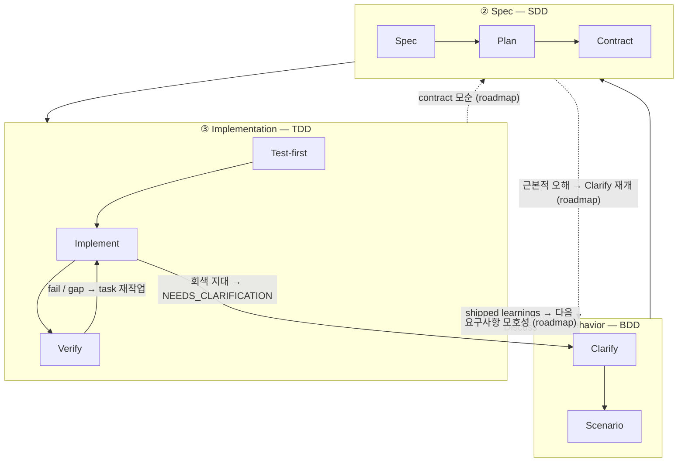

3계층 스택은 harnessed의 리듬이 _왜_ 이런 모양인지를 설명하는 이론입니다. 이는 확립된 **BDD → SDD → TDD** 중첩 구조를 소프트웨어 엔지니어링으로 구현한 것으로, 세 개의 중첩 피드백 루프가 각기 다른 질문에 답합니다. harnessed의 기여는 오픈소스 생태계를 각 루프에 **조합**하는 것입니다 —— 그리고 upstream 구성 요소들이 _부분적으로 겹치기_ 때문에, 그 겹침을 중재하는 것이 바로 조합 오케스트레이터의 본분입니다.

## 세 개의 루프

| 계층                 | Loop | 답하는 질문                                      | 조합 대상(겹침 있음)                                                                              |
| -------------------- | ---- | ------------------------------------------------ | ------------------------------------------------------------------------------------------------- |
| **① Behavior**       | BDD  | _무엇을_ 만들 것인가, 무엇으로 완료를 판단하는가 | gstack `/office-hours` governance · GSD discuss · superpowers brainstorming → acceptance criteria |
| **② Spec**           | SDD  | _어떻게_ 구조화할 것인가                         | GSD plan-phase → requirements / design / tasks · contracts(Spec Kit / ECC patterns)               |
| **③ Implementation** | TDD  | 실제로 _동작하는가_                              | superpowers TDD red-green · subagent execution · GSD verify-work · harnessed completion gate          |

**루프는 단계가 아니라 중첩된 렌즈(nested lenses)입니다.** Cucumber는 BDD-outer + TDD-inner 이중 루프를 널리 퍼뜨렸습니다: failing scenario가 바깥 루프를 열고, 여러 번의 안쪽 red-green TDD 사이클로 그것을 녹색까지 밀어붙입니다. GenAI 시대는 그 사이에 고리를 하나 더했습니다 —— Behavior와 Implementation 사이의 명시적 SDD **spec** 고리인데, agent가 실행하려면 frozen contract가 필요하기 때문입니다. 이렇게 위의 **triple-loop**가 만들어집니다.

## 노드 단위 전개

각 루프는 여러 노드로 나뉘고, 각 노드는 어떤 오픈소스 구성 요소로 조합되는지를 나타냅니다.

### ① Behavior (BDD)

| 노드         | 역할                                     | 조합 대상                                                        |
| ------------ | ---------------------------------------- | ---------------------------------------------------------------- |
| **Clarify**  | _무엇을_ 만들지 확정하고 모호함을 드러냄 | gstack `/office-hours` + GSD discuss + superpowers brainstorming |
| **Scenario** | 의도를 acceptance criteria로 전환        | GSD phase success criteria                                       |

바깥 루프는 scenario의 acceptance criteria가 쓰일 때까지 열려 있습니다. "완료"의 정의가 여기서 결정됩니다 —— 어떤 구조나 코드보다 먼저.

### ② Spec (SDD)

| 노드         | 역할                  | 조합 대상                                                    |
| ------------ | --------------------- | ------------------------------------------------------------ |
| **Spec**     | requirements + design | GSD plan-phase + Spec Kit 3종(requirements / design / tasks) |
| **Plan**     | tasks + 의존 DAG      | GSD `PLAN.md` + ECC 분해                                     |
| **Contract** | 인터페이스 frozen     | contract 관례                                                |

가운데 고리는 "무엇을"을 실행 가능한 구조로 바꿉니다. 그 종료 조건은 **frozen contract** —— implementation 루프가 그에 맞춰 테스트를 작성할 인터페이스입니다.

### ③ Implementation (TDD)

| 노드           | 역할                        | 조합 대상                               |
| -------------- | --------------------------- | --------------------------------------- |
| **Test-first** | failing test(red gate)      | superpowers TDD                         |
| **Implement**  | green까지 밀어붙임          | subagent execution                      |
| **Verify**     | refactor + 태스크 단위 완료 | GSD verify-work + harnessed completion gate |

안쪽 고리는 고전적인 red → green → refactor 사이클 그대로이며, 모든 contract가 충족될 때까지 태스크마다 한 바퀴 돕니다.

### Cross-cutting

두 관심사는 어느 단일 루프에도 속하지 않습니다:

| 관심사     | 역할               | 조합 대상                            |
| ---------- | ------------------ | ------------------------------------ |
| **Review** | 품질 + 보안 게이트 | gstack `/review` + `/cso`            |
| **Ship**   | 릴리스 준비 + 전달 | `release-preflight` + gstack `/ship` |

여기에 두 개의 **discipline**이 _모든_ 계층을 관통합니다:

- **karpathy principles** —— _how_ to code: 가장 작은 실행 가능한 변경, 외과적 편집, simplicity first.
- **mattpocock moves** —— 온디맨드 도구(`/zoom-out`, `/diagnose`, `/grill-with-docs`)를 상황에 따라 호출.

## 되돌아가기(GoBack)

흐름의 기본은 outer → inner입니다. **harnessed는 이 triple-loop의 linear-cadence 구현이며, 완전한 routed graph는 그 진화 경로입니다.** 이 루프들은 여전히 피드백 루프이지만, 오늘 출시된 것은 일부 되돌림 간선뿐이고 더 세밀한 고리 단위 라우팅은 roadmap에 있습니다. 아래 그림은 출시된 간선을 실선으로, roadmap 간선을 점선에 `(roadmap)` 표시로 그렸습니다.

### 오늘 출시된 것

현재 linear cadence에는 세 개의 live 되돌림 간선이 있습니다:

- **Verify → Task** —— 실패한 검사나 메워지지 않은 gap이 그 작업을 implementation 루프로 되밀어 냅니다.
- **회색 지대 → 명확화** —— subagent가 모호함에 부딪히면 `STATUS: NEEDS_CLARIFICATION`을 반환하고, 실행을 멈추고, 명확화한 뒤 이어 갑니다.
- **Learnings → 다음 Discuss** —— 출시된 각 사이클이 failure/loop/reject 신호를 덧붙여 다음 Behavior 루프로 흘려보냅니다(always-on learn loop).

### Roadmap(미출시)

더 세밀한 구조적 되돌림 —— gap을 답을 가진 고리로 _직접_ 라우팅하는 것 —— 은 현재 동작이 아니라 진화 방향입니다:

- **contract 모순**(implementation이 frozen 인터페이스를 만족시키지 못함) → **Spec**으로 라우팅.
- **요구사항 모호성**(contract는 자체로 일관되지만 behavior가 덜 규정됨) → **Behavior**로 라우팅.
- **근본적 오해**(구조 전체가 잘못된 결과를 겨냥) → Behavior의 **Clarify**를 다시 엶.

오늘 이 gap들은 위의 세 출시된 간선(대개 Verify → Task와 사람의 명확화)을 통해 드러나며, 자동 고리 단위 라우팅은 아닙니다. 조합 오케스트레이터의 당장의 가치는, 서로 다른 upstream 구성 요소가 각기 다른 고리를 소유할 때 linear cadence를 일관되게 유지하는 데 있고, routed graph는 그다음 방향입니다.

## 구성 요소의 교차 —— 바로 이것이 핵심

같은 upstream 도구가 하나 이상의 루프에 나타납니다. 이 교차는 중복이 아니라 조합 오케스트레이터가 중재해야 할 인터페이스입니다:

- **GSD**는 **backbone** —— 세 고리 전체(discuss → plan → verify)를 관통합니다.
- **gstack**은 **Behavior + Review**에 걸칩니다.
- **superpowers**는 **Behavior**(brainstorm) + **Implementation**(TDD)에 걸칩니다.

중재가 없으면 이 교차들은 중복 발동하거나 서로 모순됩니다. 조합 계층이 각 고리를 올바른 upstream 도구로 라우팅하고 이음매를 해소합니다.

## 이론 vs. runtime

3계층 스택은 *이론*입니다. [5단계 리듬](/ko/docs/concepts/five-stage-cadence/)은 그 이론이 명령줄에서 돌아가는 방식입니다:

| Loop(이론)       | runtime 단계                     |
| ---------------- | -------------------------------- |
| ① Behavior       | **Discuss**                      |
| ② Spec           | **Plan**                         |
| ③ Implementation | **Build**(Task)                  |
| Cross-cutting    | **Verify + Ship**(evidence gate) |

upstream 도구를 fork하지 않고 _어떻게_ 이어 붙이는지는 [vendoring 대신 조합](/ko/docs/concepts/composition/)을 참고하세요.
