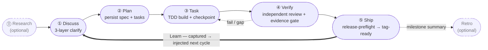

harnessed는 AI 코딩 harness를 위한 패키지 매니저이자 조합 오케스트레이터입니다. 타입이 정의된 매니페스트를 통해 Skills, MCP 서버, harness 팩을 결합한 워크플로를 설치하고 조합하고 실행합니다. upstream 코드를 vendoring하지 않습니다.

Claude Code로 개발하고 있다면, harnessed는 최고의 오픈소스 구성 요소 —— ECC, Superpowers, GSD, gstack —— 를 명령 한 줄로 엮어 하나의 실행 가능한 워크플로로 만들어 줍니다.

동작 루프 —— 다섯 개의 stage를 always-on Learn 사이클이 닫습니다:

## 어디서 시작할까

- **[설치](/ko/docs/getting-started/installation/)** — 30초 만에 harnessed 설치하고 setup 실행하기
- **[빠른 시작](/ko/docs/getting-started/quickstart/)** — 설치부터 첫 워크플로까지 60초
- **[조합 개념](/ko/docs/concepts/composition/)** — harnessed가 upstream을 fork하지 않고 조합하는 방식
- **[워크플로 레퍼런스](/ko/docs/reference/workflows/)** — 현재 릴리스에 포함된 28개 조합 가능한 워크플로 전체

## harnessed가 다른 점

모든 워크플로를 세 가지 원칙이 떠받칩니다:

**vendoring 대신 조합.** 각 harness 팩은 매니페스트를 함께 제공합니다. harnessed는 이를 읽고 호환성을 검증한 뒤 runtime에 upstream 도구들을 이어 붙입니다. 여러분이 실행하는 것은 언제나 공식 upstream이며, 낡은 fork가 아닙니다.

**5단계 리듬 기본 탑재.** Discuss → Plan → Task → Verify → Ship. 선택 단계인 Research와 Retro, 그리고 자동 학습 루프까지 포함됩니다. 또는 `/auto` 한 줄로 6단계 파이프라인 전체(research → retro, Ship은 명시적)를 실행할 수 있습니다.

**Dogfood 우선 방법론.** 모든 워크플로는 자기 자신의 정의로 검증됩니다 —— harnessed가 자기 자신을 출시할 때 쓰는 것과 똑같은 규율입니다.

전체 그림은 [README](https://github.com/easyinplay/harnessed#readme)를 읽어 보세요.
