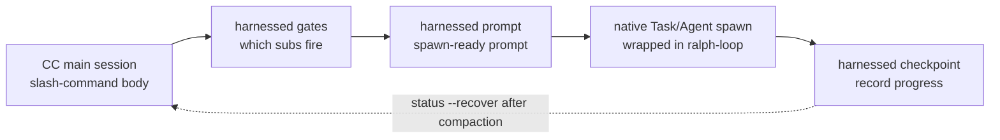

> **v4.0 실행 모델.** harnessed는 실행 엔진이 아니라 _orchestration brain + prompt library_(판단 두뇌 + prompt 라이브러리)입니다. `harnessed setup`이 생성한 슬래시 명령 본문이 세 개의 빠른 순수 함수 CLI —— `harnessed gates`(어떤 서브워크플로가 발동하는가), `harnessed prompt`(서브워크플로의 spawn 준비된 prompt), `harnessed checkpoint`(진행 기록) —— 를 통해 **CC-native subagent spawn**을 구동합니다. 실제 spawn, Agent Teams, ralph-loop, 명확화 왕복은 Claude Code main session이 네이티브 도구로 수행합니다. `harnessed run`은 CI/headless 전용으로만 남아 있습니다.

세 개의 orchestration CLI가 CC-native spawn을 구동하는 흐름:



## `harnessed`(you-are-here 대시보드)

**인자 없이** `harnessed`를 실행하면 you-are-here 대시보드가 출력됩니다 —— 진행 중인 workflow에서 현재 위치를 잡는 가장 빠른 방법입니다(comet `/comet`의 대응물, v8.0 도입).

```bash
harnessed          # 사람이 읽는 you-are-here + 다음 단계 대시보드
harnessed --json   # 기계가 읽는 구조화 객체
```

현재 repo의 진행 중 workflow를 자동 감지해 현재 phase, 각 서브워크플로 상태, 그리고 한 줄짜리 결정적 계약 `NEXT: auto | manual | done`과 실행 힌트(예: `→ run: harnessed prompt <sub>`)를 출력합니다. 진행 중 workflow가 없으면 `harnessed setup`으로 안내하는 입문 힌트를 출력합니다.

**읽기 전용** —— spawn하지 않고 상태/git/remote를 바꾸지 않으며 항상 exit `0`입니다. 대시보드를 내보내는 것은 맨 `harnessed`(또는 `harnessed --json`, `--lang` 동반 가능)뿐이고, 모든 하위 명령, `--help`, `--version`, 알 수 없는 단어는 일반 명령 파싱으로 넘어갑니다(따라서 `harnessed bogus`는 여전히 오류입니다).

`--json` 필드: `active`, `phase`, `status`, `started_at`, `next`, `sub`, `hint`, `sub_progress`.

---

## `harnessed setup`

원샷 온보딩 —— 워크플로 skills와 base 매니페스트를 `~/.claude/`에 설치합니다.

```bash
harnessed setup [옵션]
```

**수행 내용:**

1. `workflows/<name>/SKILL.md`를 훑어 각각을 `~/.claude/skills/<name>/`으로 복사
2. `manifests/tools/*.yaml`과 `manifests/skill-packs/*.yaml` 처리
3. `~/.claude/settings.json`에 `CLAUDE_CODE_EXPERIMENTAL_AGENT_TEAMS=1` 기록
4. OS 로케일을 감지해 `env.HARNESSED_USER_LANG`에 기록(zh-* → `zh-Hans`, 그 외 → `en`)

**플래그:**

| 플래그               | 설명                                                           |
| -------------------- | -------------------------------------------------------------- |
| `--user-lang <code>` | 감지된 로케일 덮어쓰기. `en`, `zh-Hans`, `zh-CN`, `zh-TW` 허용 |
| `--dry-run`          | 미리보기만 —— 기록할 내용을 출력하고 디스크는 변경하지 않음    |

**종료 코드:** `0` = 성공, `1` = 파일 시스템 오류, `2` = SKILL.md를 가진 워크플로를 찾지 못함.

---

## `harnessed install <pack>`

이름이나 경로로 harness 팩을 설치합니다.

```bash
harnessed install <pack>
```

팩 매니페스트를 해석하고 스키마로 검증한 뒤 각 `install` 단계를 순서대로 실행합니다. 현재는 로컬 경로와 git URL 부트스트랩을 지원하며, npm registry 팩 탐색은 계획 중입니다.

---

## `harnessed install-base`

base 프로필 전체를 원샷으로 설치합니다 —— `manifests/tools/*.yaml`과 `manifests/skill-packs/*.yaml`의 모든 매니페스트를 정렬 순으로 처리합니다. `install`의 `--base` 플래그가 아니라 독립 하위 명령이므로 단일 팩 게이트와 충돌하지 않습니다.

```bash
harnessed install-base                   # 즉시 적용(기본)
harnessed install-base --dry-run         # 미리보기만 —— 디스크 변경 없음
harnessed install-base --non-interactive # 모든 프롬프트 건너뜀(CI / 스크립트)
```

통계를 출력합니다: `installed / already-installed / skipped (user-aborted) / failed`.

**종료 코드:** `0` = 하나 이상 설치되고 실패 없음 · `1` = 하나 이상 실패 · `2` = 아무것도 설치되지 않음(전부 already-installed이거나 중단).

---

## `harnessed research`

research 워크플로를 실행합니다 —— search 카테고리 하위 라우팅 → subagent spawn → 문자 그대로의 `COMPLETE`. `workflows/research/workflow.yaml`의 얇은 별칭입니다.

```bash
harnessed research --query "compare Postgres vs SQLite for this use case"
harnessed research --query "..." --dry-run          # 해석된 workflow + gate context 미리보기(JSON)
harnessed research --query "..." --model sonnet      # subagent model: haiku | sonnet | opus
harnessed research --query "..." --non-interactive   # 모든 프롬프트 건너뜀(CI / 스크립트)
```

| 플래그              | 설명                                                                          |
| ------------------- | ----------------------------------------------------------------------------- |
| `--query <text>`    | research prompt(**필수**)                                                     |
| `--dry-run`         | 미리보기만 —— `{ workflow, yamlPath, gateContext }`를 출력하고 spawn하지 않음 |
| `--model <model>`   | subagent model: `haiku` \| `sonnet` \| `opus`                                 |
| `--non-interactive` | 모든 프롬프트 건너뜀(CI / 스크립트)                                           |

**종료 코드:** `0` = workflow 완료 · `1` = workflow 실행 실패 · `2` = 사용법 오류(`--query` 누락 또는 workflow yaml 없음).

---

## `harnessed manifest-add <upstream>`

**EE-5 다섯 질문 merge 게이트**를 거친 뒤 새 upstream 어댑터를 추가합니다 —— 다섯 개의 대화형 질문이, 새 upstream을 조합에 들이기 전에 숙고된 결정을 강제합니다(재사용 가능한 surface인가, 이름이 적절한가, 기존 구성 요소와 겹치지 않는가, 개념을 들이는가 남의 제품 정체성을 들이는가, upstream을 모르는 사용자도 이해할 수 있는가). 다섯 질문 모두 비어 있지 않은 답이 필요합니다.

```bash
harnessed manifest-add https://github.com/owner/repo.git
harnessed manifest-add <upstream> --category tools    # skill-packs(기본) | tools
harnessed manifest-add <upstream> --name myadapter    # 기본값은 <upstream> basename
harnessed manifest-add <upstream> --dry-run           # 미리보기 —— 답을 출력하고 기록하지 않음
harnessed manifest-add <upstream> --non-interactive   # CI: WARN 전용 dry-run, 아무것도 기록하지 않음
```

성공하면 답을 `manifests/<category>/<name>.ee5-answers.json`에 기록합니다.

| 플래그              | 설명                                                |
| ------------------- | --------------------------------------------------- |
| `--category <cat>`  | 매니페스트 카테고리: `skill-packs`(기본) \| `tools` |
| `--name <name>`     | 짧은 어댑터 이름(기본값은 `<upstream>` basename)    |
| `--dry-run`         | 미리보기만 —— 답 JSON을 출력하고 기록하지 않음      |
| `--non-interactive` | CI / 스크립트 —— WARN 전용, 아무것도 기록하지 않음  |

**종료 코드:** `0` = 게이트 통과(기록 또는 미리보기) · `1` = 빈 답이 있음.

---

## `harnessed uninstall [pack]`

설치된 팩을 제거합니다. 인자가 없으면 harnessed가 스스로 설치한 파일을 제거합니다.

```bash
harnessed uninstall <pack>   # 단일 팩 제거(매니페스트의 uninstall 단계 실행)
harnessed uninstall          # ~/.claude/에서 harnessed 자신의 skills/manifests 제거
```

skill을 디스크에 두는 세 가지 설치 방식(`npm-cli`, `git-clone-with-setup`, `npx-skill-installer`)에서 uninstall은 매니페스트가 **선언한 `spec.uninstall` 계약**을 실행합니다. 먼저 선언된 `cmd`를 실행하고(fail-soft —— 0이 아닌 종료나 shell 부재는 경고만 하고 계속), 이어서 각 `cleanup_paths` 항목을 멱등하게 force-rm 하며, 이 작업은 **`$HOME` 안으로 제한**됩니다(home 서브트리를 벗어난 경로는 hard-fail). settings/plugin/MCP를 손보는 방식(`cc-hook-add`, `cc-plugin-marketplace`, `mcp-*-add`)은 각자 전용 제거기를 유지합니다. 인자 없는 통합 제거는 `harnessed setup`을 되돌립니다.

---

## Orchestration CLI(v4.0)

이 세 순수 함수 CLI는 생성된 슬래시 명령 본문이 CC-native spawn을 구동하는 데 쓰입니다. JSON만 출력하고 스스로 spawn하지 않습니다 —— 오케스트레이션은 main session이 합니다.

### `harnessed gates <master>`

특정 master orchestrator(`discuss` / `plan` / `task` / `verify` / `auto`)와 태스크 spec에 대해 어떤 서브워크플로가 발동하는지 평가합니다.

```bash
harnessed gates plan --task "add OAuth login" --skip-sub discuss
# → JSON: { fire: [{ sub, order, mode }], skip: [...], parallelism: { escalate_to_teams } }
```

`fire`는 판단 게이트를 통과한 서브워크플로를 실행 순서대로 나열합니다. `parallelism.escalate_to_teams`는 순차 subagent spawn 대신 CC-native Agent Teams로 전환할 시점을 알려 줍니다.

### `harnessed prompt <sub>`

단일 서브워크플로에 대해 spawn 준비된 prompt를 출력합니다 —— role-prompt 본문 + 체크리스트 + 적용된 disciplines.

```bash
harnessed prompt plan-phase --task "add OAuth login" --json
# → JSON: { prompt, max_iterations, model }
```

main session은 이 `prompt`를 네이티브 `Task` spawn에 넘깁니다(바깥은 ralph-loop plugin). `max_iterations` / `model`은 워크플로 기본값이 그대로 들어갑니다.

### `harnessed checkpoint`

서브워크플로 진행 상황을 harnessed checkpoint store에 기록합니다. main session이 각 서브워크플로 완료(및 실패) 시 호출하여, compaction 이후 `harnessed status --recover`로 복구할 수 있게 합니다.

```bash
harnessed checkpoint start <master> --plan <json>   # 진행 ledger 초기화
harnessed checkpoint complete <sub>                 # 서브워크플로 완료 표시(evidence guard 포함)
harnessed checkpoint fail <sub>                      # 실패한 서브워크플로 기록
```

### `harnessed run`

**CI / headless 전용.** 워크플로 전체를 프로세스 내 SDK spawn으로 실행합니다 —— 오케스트레이션할 대화형 main session이 없을 때 씁니다. v4.0의 기본 경로는 위의 gates → prompt → checkpoint 오케스트레이션이며, `run`은 폴백입니다.

```bash
harnessed run <master> --task "<spec>"
```

---

## `harnessed doctor`

로컬 harnessed + Claude Code 설치를 진단합니다 —— 14가지 헬스 체크(Node, MCP scope/가용성, jq, Windows bash, origin, gstack prefix, deprecations, token budget, Agent Teams env, planning-with-files, mattpocock-skills, CodeGraph, update-available).

```bash
harnessed doctor
harnessed doctor --json   # 기계가 읽는 리포트
```

---

## `harnessed update`

harnessed(및 선택적으로 upstream 플러그인)를 최신으로 유지합니다. 14번째 doctor check도 "update available X→Y"를 수동적으로 알려 줍니다. `update`는 듀얼 채널로, harnessed의 설치 방식을 자동 감지해 해당 경로를 따릅니다.

```bash
harnessed update                      # 자체 업그레이드 + CHANGELOG 상단 섹션 + 재시작 안내
harnessed update --check              # installed/latest 버전만 보고, 설치하지 않음
harnessed update --dry-run            # 수행될 업데이트 동작 미리보기 —— 아무것도 기록하지 않음
harnessed update --upstreams          # base 매니페스트를 재실행해 upstream 플러그인도 업그레이드
harnessed update --migration-report   # 낡은 harnessed 상태를 읽기 전용으로 점검(아무것도 삭제하지 않음)
harnessed update --rollback [version] # 컴파일된 바이너리 전용 —— bin-backup/에 보관된 이전 버전 복원
```

**npm 채널** —— `npm i -g harnessed@latest`를 실행하고, CHANGELOG 상단 섹션을 출력하고, Claude Code 재시작을 안내합니다.

**컴파일된 바이너리 채널**(원라이너 설치 프로그램) —— GitHub releases에서 플랫폼 자산을 내려받아 `.sha256` 체크섬**과 그 ed25519 서명**(`<asset>.sha256.sig`. v4.32.19부터 릴리스 계약 —— 서명 누락도 검증 실패도 hard error이며 현재 바이너리는 그대로 유지)을 검증한 뒤, 새 바이너리를 원자적으로 교체합니다. 교체된 이전 버전은 롤백용으로 `bin-backup/`에 보관됩니다.

**`--rollback [version]`**(컴파일된 바이너리 전용) —— `bin-backup/`에서 이전 버전을 원자적으로 복원합니다. 기본은 가장 최근 보관 버전이고, 버전 지정도 가능합니다(알 수 없는 버전은 오류와 함께 사용 가능한 버전을 나열). 현재 바이너리는 먼저 bin-backup으로 되돌려지므로 롤백 자체도 가역적입니다. npm 설치 모드에서는 거부하고 `npm i -g harnessed@<version>`으로 안내합니다.

네트워크 접근은 fail-soft입니다 —— npm에 닿지 못해도 절대 오류를 내지 않습니다.

---

## `harnessed release-preflight`

Ship 단계의 게이트. **읽기 전용** 릴리스 준비 검사로, repo가 릴리스 가능하지 않으면 exit 1 합니다. 아무것도 변경하지 않습니다(실제 publish는 tag push 시 CI가 수행).

```bash
harnessed release-preflight
```

검사 항목: `CHANGELOG.md`의 `[Unreleased]`(또는 `[<version>]` 섹션)가 비어 있지 않을 것, `package.json`에 유효한 version이 있을 것, 작업 트리가 깨끗할 것(tracked 변경), `v<version>` 태그가 아직 없을 것.

---

## `harnessed compact`

해결된 sub-progress ledger 항목을 요약해 밀어내고, 긴 태스크를 위해 컨텍스트를 확보합니다. **G6-safe**: `fail_count > 0`인 항목은 절대 밀려나지 않아 break-loop 신호가 보존됩니다.

```bash
harnessed compact                                  # 수동 compaction
harnessed checkpoint complete <sub> --tokens <n>   # token 수가 임계값을 넘으면 자동 발동
```

---

## `harnessed workflows`

진행 중인 workflow를 나열합니다 —— repo마다 하나씩(harnessed는 repo root 기준으로 checkpoint 상태를 슬롯 분리하므로 병렬 프로젝트가 서로 덮어쓰지 않습니다).

```bash
harnessed workflows
```

---

## `harnessed learn`

현재 repo의 `.planning/LEARNINGS.md`에 산문 형태의 learning을 덧붙입니다. 완료된 workflow도 자신의 failure/loop/reject 신호를 자동으로 덧붙이며, inject hook이 관련 learnings를 다음 session에 주입합니다.

```bash
harnessed learn "마이그레이션을 무작정 재시도하지 말 것 —— 깨끗한 스냅샷이 먼저 필요하다"
```

---

## `harnessed retro`

retro-cadence 알림을 재설정합니다. `/retro`는 gstack skill이라 harnessed가 관측하지 못하므로, 실행한 뒤 `harnessed retro --done`을 호출해 repo별 phase 카운터를 0으로 되돌리고 `RETRO-DUE` inject 알림을 지웁니다.

```bash
harnessed retro --done   # phase 카운터 재설정 + RETRO-DUE 알림 제거
```

`--done` 없이는 아무것도 하지 않고 exit `1` 합니다(`nothing to do — pass --done after running /retro`).

---

## `harnessed next`

결정적인 next-step 계약을 출력합니다 —— 읽기 전용이며 상태를 바꾸지 않습니다. 두 계층:

1. **workflow 진행 중**(처리할 sub가 남음) → workflow 내부 계약 `NEXT: auto <sub> | manual <sub> | done`을 그대로 사용(exit `0`, 변경 없음).
2. **sub가 모두 해결됨** → **unit 간 가로 방향 이어가기**(v4.10)로 폴스루: `.planning/` 디스크 SoT에서 다음 work unit(다음 phase / task)을 유도하고 `NEXT: advance | blocked | done`을 출력.

```bash
harnessed next
# 진행 중:      NEXT: auto <sub>
# fall-through: NEXT: advance
#               UNIT: phase 16 'rate limiter'
#               HINT: run /auto (or harnessed advance) to start it — 2 phases remain
```

**unit 간 종료 코드:** `0` = advance(다음 unit 있음) · `2` = done(모든 phase 완료) · `10` = blocked(사람의 결정 필요).

---

## `harnessed advance`

`.planning/` 디스크 SoT에서 유도한 다음 work unit으로 진행합니다 —— **출력 전용(print-only)**. 다음 phase/task와 실행할 명령(예: `→ run /auto "..."`)을 출력하지만 상태를 seed하지 **않고** spawn도 **하지 않습니다**. 출력된 명령은 main session이 직접 실행하므로 명확화 왕복과 Agent Teams가 보존됩니다.

```bash
harnessed advance
# ADVANCE: advance
# UNIT: phase 16 'rate limiter'
# → run /auto "phase 16 'rate limiter'"
```

**advance-gate.** `advance`는 앞선 _미완료_ phase를 건너뛰는 것을 거부합니다("comet" 게이트). 유도된 다음 phase의 순서가 workflow pointer보다 앞서거나 실패한 sub가 ledger를 막고 있으면, 0이 아닌 값으로 종료하며 실행 명령을 **출력하지 않습니다**. `--force`로 덮어쓸 수 있습니다 —— 출력에 audit note를 남기고 계속합니다.

```bash
harnessed advance --force   # 게이트 덮어쓰기(audit note 기록)
```

**driver loop.** `--json`은 기계가 읽는 `{ next, unit, hint }`를 출력해, shell 루프가 여러 phase를 hands-free로 이어 붙일 수 있게 합니다 —— 루프는 0이 아닌 종료(done / blocked / gate-reject)에서 멈춥니다:

```bash
while harnessed advance --json; do : ; done
```

**종료 코드:** `0` = advance · `2` = done(모든 phase 완료) · `10` = blocked · `11` = gate-reject(앞선 phase 미완료. `--force` 사용) · `1` = error.

**설계 —— 큐가 아니라 디스크에서 유도.** "다음"은 언제나 디스크에서 유도되며 저장된 큐에서 오지 않습니다. phase가 완료로 간주되는 것은 각 `NN-*-PLAN.md`에 대응하는 `NN-*-SUMMARY.md`가 있을 때 ⇔ 입니다(산출물에서 유도되므로 이미 출시된 phase는 자연히 건너뜁니다). 중간에 phase를 끼워 넣어도(`ROADMAP.md` 수정, `phases/16.1-*/` 추가) 다음 `advance`가 자동으로 집어 갑니다. phase 단위 이어가기는 출시된 floor이고, task 단위 해결은 resolver-ready이지만 아직 CLI에 연결되지 않았습니다.

---

## `harnessed reject <sub>`

특정 서브워크플로를 사용자 거부로 표시합니다 —— 종단 상태이며, break-loop 재시도 로직을 구동하는 `failed`와 구분됩니다.

```bash
harnessed reject <sub>
```

---

## `harnessed resume`

실패한 `/auto` 파이프라인을 마지막으로 성공한 단계부터 재개합니다.

```bash
harnessed resume
```

`.planning/STATE.md`를 읽어 마지막으로 성공한 단계를 찾고, 거기서 파이프라인에 재진입합니다. 단계 도중 실패했을 때 유용합니다.

---

## `harnessed status`

현재 작업 디렉터리의 파이프라인 상태를 표시합니다.

```bash
harnessed status
```

`.planning/STATE.md`를 읽어 현재 단계, 마지막으로 완료한 단계, 모든 블로커를 출력합니다.

```bash
harnessed status --recover
```

`--recover`는 STATE.md가 아니라 checkpoint 진행 ledger를 읽어, compaction 이후의 복구 뷰를 구조화해 출력합니다 —— 완료/미실행/건너뛴 서브워크플로, 다음에 실행할 명령, 그리고 evidence-drift 경고. context compaction 이후 현재 위치를 다시 잡을 때 씁니다.

---

## `harnessed audit`

`manifests/tools/`와 `manifests/skill-packs/` 아래 매니페스트에 대한 2차 자기 일관성 감사입니다. Ajv 스키마가 잡지 못하는 schema drift, 자리표시자 값, 변조를 잡는 심층 방어 패스입니다.

```bash
harnessed audit                 # 매니페스트 + runtime 두 계층
harnessed audit --skip-runtime  # 매니페스트 계층만(오프라인 / 미초기화)
```

**매니페스트 계층:** repository URL 형태(`https://…​.git`), `signed_by` 자리표시자 값(`unsigned` / `todo` / `tbd` / …), 그리고 움직이는 `git_ref`(`HEAD` / `main` / `master` —— 이는 _error_: SHA나 태그에 pin해야 함). **runtime 계층**(`--skip-runtime`으로 생략): origin-URL 변조, `install.cmd` shell 주입 + npm 패키지 교차 확인, provenance 게이트. 매니페스트별 `✓ / ⚠ / ✗` 리포트와 finding 집계를 출력합니다.

**종료 코드:** `0` = error 등급 finding 없음(warning 허용) · `1` = 하나 이상의 error.

> **`audit` vs `audit-log`** —— `audit`은 *매니페스트 파일*의 무결성을 검증합니다. `audit-log`(아래)는 이미 일어난 라우팅/설치 *기록*을 조회합니다. 관심사가 다릅니다.

---

## `harnessed audit-log`

라우팅/설치 감사 로그를 봅니다 —— 어떤 게이트가 발동했고, 어떤 팩이 언제 설치됐는지.

```bash
harnessed audit-log                    # 사람이 읽는 5열 테이블
harnessed audit-log --filter <pack>    # 팩/이벤트로 필터
harnessed audit-log --json             # 12개 필드의 완전한 레코드
```

---

## `harnessed backup list`

`.harnessed-backup/` 아래 각 백업 스냅샷을 나열합니다 —— 스냅샷마다 한 줄로 타임스탬프, 원본 매니페스트, 파일 수를 표시합니다. 각 스냅샷의 `metadata.json`에서 읽습니다.

```bash
harnessed backup list
```

`harnessed gc`(오래된 스냅샷 삭제), `harnessed rollback`(선택한 타임스탬프에서 복원)과 짝을 이룹니다.

---

## `harnessed gc`

install/uninstall/rollback이 남긴 낡은 백업을 회수합니다.

```bash
harnessed gc
```

---

## `harnessed rollback`

가장 최근 백업에서 이전 상태를 복원합니다(CRLF/LF 보존) —— 직전 install/setup 변경을 되돌립니다.

```bash
harnessed rollback
```

---

## `harnessed --version`

```bash
harnessed --version
# → 4.32.20
```

---

## `harnessed --help`

```bash
harnessed --help
harnessed <command> --help   # 명령별 도움말
```

---

## 전역 플래그

| 플래그      | 설명                   |
| ----------- | ---------------------- |
| `--version` | 버전을 출력하고 종료   |
| `--help`    | 도움말을 출력하고 종료 |

소스는 [harnessed 저장소](https://github.com/easyinplay/harnessed/tree/main/src/cli)의 `src/cli.ts`와 `src/cli/`에 있습니다.
