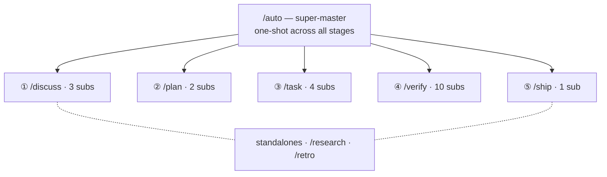

harnessed는 네임스페이스로 계층화된 28개 워크플로를 제공합니다: super-master 1개, 단계 master 5개(Discuss · Plan · Task · Verify · Ship), 서브워크플로 20개, 독립 워크플로 2개.

28개 워크플로 —— 하나의 super-master가 다섯 stage master와 그 서브들로 부채꼴로 퍼지고, 여기에 독립 워크플로 2개가 더해집니다:

## Super-master

| 명령    | 범위         | capability                                                                                                                                                                                                             |
| ------- | ------------ | ---------------------------------------------------------------------------------------------------------------------------------------------------------------------------------------------------------------------- |
| `/auto` | super-master | 6단계 파이프라인 전체: research(조건부) → discuss → plan → task → verify → retro(필수). AI 원샷 복잡도 평가 + 이해 확인. `--staged` 플래그로 단계 게이트 UX 활성화. 실패 시 즉시 중단하고 `harnessed resume`으로 재개. |

## 독립 워크플로

| 명령        | 범위 | capability                                                                                                                      |
| ----------- | ---- | ------------------------------------------------------------------------------------------------------------------------------- |
| `/research` | 독립 | Tavily, Exa MCP, ctx7을 통한 다중 소스 조사. `/auto`에서는 0단계로 발동하거나 discuss 전에 직접 호출.                           |
| `/retro`    | 독립 | gstack `/retro`를 통한 마일스톤 마무리 요약. 교훈, 결정 기록, 예기치 못한 발견을 `RETROSPECTIVE.md`에 남김. `/auto`에서는 필수. |

## Discuss 단계

| 명령                 | 범위         | capability                                                                                                                              |
| -------------------- | ------------ | --------------------------------------------------------------------------------------------------------------------------------------- |
| `/discuss`           | 단계 master  | 세 개의 논의 게이트를 병렬 평가하고 발동한 것만 실행.                                                                                   |
| `/discuss-strategic` | 서브워크플로 | 전략 계층 —— 새 기능 / milestone / 제품 방향. gstack `/office-hours` + `/plan-ceo-review`. `findings.md` 영속화.                        |
| `/discuss-phase`     | 서브워크플로 | 페이즈 계층 —— 미결 결정 2개 이상, 회색 지대 명확화. GSD `gsd-discuss-phase`. `findings.md` + `knowledge.md` 영속화.                    |
| `/discuss-subtask`   | 서브워크플로 | 서브태스크 계층 —— 2가지 이상 방식 / 핵심 알고리즘 / API contract. Superpowers brainstorming + `/grill-with-docs`. 일시적, 영속화 없음. |

## Plan 단계

| 명령                 | 범위         | capability                                                                                          |
| -------------------- | ------------ | --------------------------------------------------------------------------------------------------- |
| `/plan`              | 단계 master  | 직렬: 아키텍처 리뷰(조건부) → 페이즈 계획(항상).                                                    |
| `/plan-architecture` | 서브워크플로 | 아키텍처 계층 —— 복잡한 아키텍처의 거버넌스 게이트. gstack `/plan-eng-review`. 계획 전에 설계 확정. |
| `/plan-phase`        | 서브워크플로 | 페이즈 계획 —— GSD `gsd-plan-phase` + planning-with-files. `task_plan.md` + `progress.md` 영속화.   |

## Task 단계

| 명령            | 범위         | capability                                                                                                                             |
| --------------- | ------------ | -------------------------------------------------------------------------------------------------------------------------------------- |
| `/task`         | 단계 master  | 서브태스크별 직렬 루프: 명확화 → 구현 → 테스트 → 전달.                                                                                 |
| `/task-clarify` | 서브워크플로 | 시작 시 명확화 게이트. Superpowers brainstorming + `/grill-with-docs` 조건부 발동.                                                     |
| `/task-code`    | 서브워크플로 | karpathy 4원칙에 따라 구현. `/zoom-out` / `/improve-codebase-architecture` / `/diagnose` 조건부 발동. session 간 `progress.md` 동기화. |
| `/task-test`    | 서브워크플로 | TDD red → green → refactor. Superpowers TDD + `/diagnose` 조건부 발동. 핵심 로직에는 필수.                                             |
| `/task-deliver` | 서브워크플로 | `ralph-loop` SDK 래퍼. 문자 그대로의 `COMPLETE`가 나올 때까지 실행. 풀스택 조율 시 Agent Teams 조건부 발동.                            |

## Verify 단계

| 명령                     | 범위         | capability                                                                                                                       |
| ------------------------ | ------------ | -------------------------------------------------------------------------------------------------------------------------------- |
| `/verify`                | 단계 master  | 시나리오 플래그에 따라 최대 7가지 하위 검사 배분.                                                                                |
| `/verify-progress`       | 서브워크플로 | 항상 첫 번째로 실행. UAT 인수 기준 검사 + GSD 상태 동기화.                                                                       |
| `/verify-code-review`    | 서브워크플로 | 다중 subagent 병렬 fan-out. 높은 확신도의 지적.                                                                                  |
| `/verify-paranoid`       | 서브워크플로 | gstack `/review`를 통한 편집증적 엔지니어 리뷰. 핵심 모듈 PR 전 필수.                                                            |
| `/verify-qa`             | 서브워크플로 | gstack `/qa` + playwright-cli / `@playwright/test`를 통한 종단 간 QA. UI 변경 시 발동.                                           |
| `/verify-security`       | 서브워크플로 | gstack `/cso`를 통한 OWASP / 인증 / 시크릿 검사. 인증이나 시크릿을 건드리면 발동.                                                |
| `/verify-design`         | 서브워크플로 | gstack `/design-review` + ui-ux-pro-max + design-taste-frontend를 통한 디자인 시스템 일관성 검사. 디자인 변경 시 발동.           |
| `/verify-eval-review`    | 서브워크플로 | GSD `/gsd-eval-review`를 통한 AI 페이즈 eval 커버리지 감사. AI/LLM 단계를 포함할 때 발동(plan 쪽 gsd-ai-integration-phase와 짝). |
| `/verify-validate-phase` | 서브워크플로 | GSD `/gsd-validate-phase`를 통한 Nyquist 요구사항→테스트 커버리지 보완. 커버리지 감사가 필요할 때 발동.                          |
| `/verify-simplify`       | 서브워크플로 | `code-simplifier`를 통한 최종 단순화. 항상 마지막에 실행.                                                                        |
| `/verify-multispec`      | 서브워크플로 | 4인 전문가 Agent Team Pattern C —— SendMessage로 상호 교차 검토. 핵심 릴리스나 대규모 리팩터링 PR의 승격 경로.                   |

## Ship(⑤단계)

| 명령              | 범위         | capability                                                                                                                                                                       |
| ----------------- | ------------ | -------------------------------------------------------------------------------------------------------------------------------------------------------------------------------- |
| `/ship`           | 단계 master  | Verify 이후의 릴리스 단계. 먼저 preflight 게이트를 실행한 뒤 PR/deploy를 gstack `/ship`에 위임. Deploy 경계는 tag-ready이며, 실제 publish는 tag push 시 `publish.yml` CI가 수행. |
| `/ship-preflight` | 서브워크플로 | `harnessed release-preflight` 실행 —— 읽기 전용 게이트(CHANGELOG `[Unreleased]` / version / git-clean / tag-absent). 하나라도 실패하면 릴리스 차단.                              |

## 규율 래퍼

| 명령            | 범위 | capability                                                                                           |
| --------------- | ---- | ---------------------------------------------------------------------------------------------------- |
| `/tdd`          | 규율 | red → green → refactor. `superpowers:test-driven-development`의 별칭. 독립 규율 래퍼로도 사용 가능.  |
| `/ralph-loop`   | 래퍼 | 완료 약속 래퍼. 임의의 prompt를 문자 그대로의 `COMPLETE`가 나올 때까지 실행. `/task-deliver`에 내장. |
| `/execute-task` | 도구 | 직접 태스크 실행 진입점. discuss/plan 단계를 건너뜀.                                                 |

모든 워크플로 정의는 [harnessed 저장소](https://github.com/easyinplay/harnessed)의 `workflows/<name>/workflow.yaml`에 있습니다.
