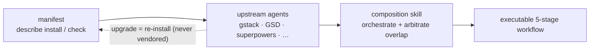

## O problema

Harnesses de programação com IA — ECC, Superpowers, GSD, gstack — são publicados como pacotes npm ou repositórios git separados. Juntá-los na mão é frágil: você faz fork do código upstream, aplica patches localmente e depois assiste tudo apodrecer conforme o upstream lança versões que você não consegue mesclar com facilidade.

A resposta tradicional é vendoring: copiar o código upstream para o seu repositório e mantê-lo. Isso funciona até o upstream entregar uma melhoria importante e você ficar preso a um fork velho. Manter dezenas de componentes de harness sincronizados manualmente não escala.

## A abordagem do harnessed

O harnessed nunca copia código upstream. Em vez disso, cada harness pack traz um **manifesto** — um arquivo YAML tipado que descreve como instalar o pack, quais capabilities ele expõe e como se integra a outros componentes.

Em runtime, o harnessed lê esses manifestos, valida a compatibilidade e orquestra as ferramentas upstream por meio das composition skills. Você sempre roda o binário oficial do upstream — o harnessed apenas coordena as passagens de bastão.

Montagem, não vendoring — os manifestos descrevem, a composition skill orquestra:



Exemplo de manifesto (resumido):

```yaml
name: my-pack
version: 1.0.0
description: Adiciona workflows de OAuth2 ao harnessed
install:
  - npm: superpowers
  - git: https://github.com/example/skill-pack-oauth
capability:
  skills:
    - brainstorming
    - tdd
  workflows:
    - discuss
    - plan
```

## Benefícios

**Sempre no upstream mais recente.** Quando o Superpowers lança uma versão, basta rodar `harnessed install` de novo para incorporá-la na hora. Sem merge manual, sem forks velhos.

**Composição validada.** `harnessed setup` checa a compatibilidade dos manifestos antes de instalar. Declarações de capability conflitantes aparecem como erros, não como surpresas em runtime.

**Escreva seu próprio pack.** O schema do manifesto está publicado no repositório em `schemas/manifest.v1.schema.json` (aponte seu YAML language server para ele e ganhe validação inline). Aponte seu manifesto para qualquer upstream instalável (pacote npm, repositório git, skill própria) e o harnessed o tratará como unidade componível de primeira classe.

**Ponto de entrada unificado.** Os usuários lidam com `/discuss`, `/plan`, `/task`, `/verify` sem precisar aprender a terminologia de cada upstream. A composition skill cuida do roteamento para a ferramenta upstream certa em cada estágio.

## Como as composition skills funcionam

Desde a v4.0, o harnessed é um **orchestration brain + biblioteca de prompts**, não um motor de execução. Ele não faz mais spawn de workflows no próprio processo — em vez disso, o corpo do comando de barra (gerado por `harnessed setup`) instrui a sessão principal do Claude Code a fazer spawn de **subagents CC-native**, dirigidos por três CLIs puras e rápidas. Quando você roda `/discuss`:

1. **Gate** — `harnessed gates discuss --task "<spec>"` retorna quais dos 3 gates de discussão disparam (strategic / phase / subtask) e se deve escalar para Agent Teams.
2. **Prompt** — para cada gate que dispara, `harnessed prompt <sub> --json` emite um prompt pronto para spawn (corpo do role + checklist + disciplines aplicadas).
3. **Spawn** — a sessão principal executa um spawn nativo de `Task` (embrulhado em ralph-loop), devolvendo qualquer `STATUS: NEEDS_CLARIFICATION` a você via `AskUserQuestion`.
4. **Checkpoint** — `harnessed checkpoint complete <sub>` registra o progresso em `.planning/` para que a execução sobreviva à compactação.

O harnessed contribui com as decisões (roteamento de gates, geração de prompt, ledger de progresso); a sessão principal faz o spawn de fato, a coordenação de Agent Teams e as idas e vindas de esclarecimento com as ferramentas nativas do Claude Code. (`harnessed run` mantém o antigo spawn em processo apenas para CI/headless.)

É por isso que os 28 workflows do harnessed conseguem compor ECC, Superpowers, GSD e gstack ao mesmo tempo — a camada de composição abstrai as emendas.

Veja a [Referência de workflows](/pt-br/docs/reference/workflows/) para todos os 28 workflows e suas dependências upstream.
