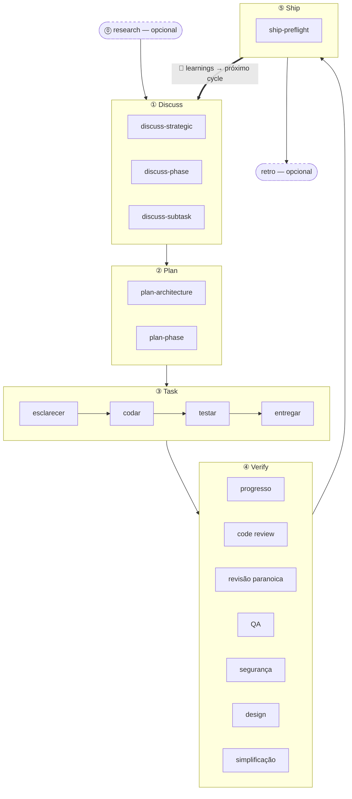

A cadência de 5 estágios é a metodologia central do harnessed: cada funcionalidade, correção de bug ou refatoração passa pelos mesmos cinco estágios, em ordem — **Discuss → Plan → Task → Verify → Ship** — fechados por um loop automático de **Learn**. Dois estágios acompanhantes (Research, Retro) ficam nas pontas do loop principal.

## Os estágios

| #   | Estágio      | Comando de barra | Modo                                                     |
| --- | ------------ | ---------------- | -------------------------------------------------------- |
| 0   | **Research** | `/research`      | opcional — dispara quando o entendimento está incompleto |
| 1   | **Discuss**  | `/discuss`       | obrigatório                                              |
| 2   | **Plan**     | `/plan`          | obrigatório                                              |
| 3   | **Task**     | `/task`          | obrigatório                                              |
| 4   | **Verify**   | `/verify`        | obrigatório                                              |
| 5   | **Ship**     | `/ship`          | explícito — estágio de release (disparado pelo usuário)  |
| —   | **Retro**    | `/retro`         | obrigatório no `/auto`, opcional quando chamado sozinho  |

**O aprendizado é automático, não um estágio.** Cada workflow concluído acrescenta seus sinais de failure/loop/reject a `.planning/LEARNINGS.md`; o inject hook injeta os learnings relevantes na próxima sessão. Isso é sempre ativo e **não** depende do Retro opcional.

### Research (opcional)

Investigação multifonte via Tavily, Exa e ctx7. Dispara dentro do `/auto` quando você responde "não" à checagem de entendimento, ou pode ser chamado direto com `/research`. A saída vai para `research-notes.md` em `.planning/`.

### Discuss — gates em 3 camadas

`/discuss` avalia três gates de forma independente e roda só os que disparam:

- **Camada estratégica** (`discuss-strategic`): nova funcionalidade, novo milestone, nova direção de produto → gstack `/office-hours` + `/plan-ceo-review`. Persiste `findings.md`.
- **Camada de fase** (`discuss-phase`): ≥2 decisões de implementação em aberto, fluxo de dados entre módulos pouco claro → GSD `gsd-discuss-phase`. Persiste `findings.md` + `knowledge.md`.
- **Camada de subtarefa** (`discuss-subtask`): algoritmo central / contrato de API com ≥2 abordagens distintas → brainstorming do Superpowers. Efêmero, não persiste.

Cada gate declara explicitamente quando dispara e quando é pulado.

### Plan — revisão de arquitetura + persistência

`/plan` roda dois passos em sequência:

1. **Revisão de arquitetura** (condicional) — arquiteturas complexas disparam gstack `/plan-eng-review`, travando o design antes da persistência
2. **Plano de fase** — GSD `gsd-plan-phase` + planning-with-files gera `task_plan.md` com caminhos exatos, critérios de aceite e ordenação de dependências

### Task — o loop de subtarefas

`/task` executa quatro passos em ordem estrita para cada subtarefa:

1. **Esclarecer** — valida a spec, expõe ambiguidades, confere contra `task_plan.md`
2. **Codar** — princípios karpathy: menor mudança viável, edições cirúrgicas, sem ampliar escopo
3. **Testar** — TDD red → green → refactor na lógica central; opcional para CRUD e implementações óbvias
4. **Entregar** — o gate `harnessed checkpoint complete` só libera a próxima etapa com um `COMPLETE` literal

### Verify — 7 subverificações condicionais

`/verify` distribui subverificações conforme o que mudou. Sempre rodam: `verify-progress` (UAT + sincronização de estado), `verify-code-review` (multi-agent paralelo), `verify-simplify` (limpeza final). Condicionais: revisão paranoica, QA, segurança, design, multispec.

### Ship — o estágio de release

`/ship` é o 5º estágio, depois do Verify. Ele roda primeiro `harnessed release-preflight` (gate somente leitura de prontidão — `CHANGELOG [Unreleased]`/version/git-clean/tag-absent) e então delega PR + deploy ao gstack `/ship`. **A fronteira do deploy é tag-ready**: este estágio não faz push, não publica e não cria tag — o `npm publish` real e a GitHub release são executados pelo CI `publish.yml` no push da tag (com aprovação explícita). "PR ready ≠ release ready".

### Retro

O gstack `/retro` registra lições do marco, decisões e descobertas inesperadas. Roda obrigatoriamente dentro do `/auto`. Também pode ser chamado sozinho ao fim de qualquer marco. (Diferente do loop de Learn sempre ativo descrito acima.)

## Diagrama de fluxo



## `/auto` versus comandos de estágio individuais

`/auto` encadeia automaticamente os estágios centrais de desenvolvimento (research condicional → discuss → plan → task → verify → retro). **Ship é explícito** — `/auto` não faz release sozinho; quando o marco estiver pronto para virar versão, você roda `/ship`. Os comandos de estágio individuais deixam você entrar em qualquer ponto:

```
/discuss "adicionar rate limiter"   # roda só discuss
/plan "rate limiter"                # roda só plan (assume discuss feito)
/task "implementar middleware"      # roda só task
/verify "recurso de rate limiter"   # roda só verify
/ship                               # roda só ship (release-preflight → tag-ready)
```

Ao atravessar _várias_ fases, `harnessed advance` deriva a próxima fase do estado em disco de `.planning/` e imprime o comando a rodar — assim um driver loop pode encadear várias fases sem intervenção (`while harnessed advance --json; do : ; done`), parando no advance-gate quando uma fase anterior está incompleta. Veja a entrada `harnessed advance` na [Referência da CLI](../../reference/cli/).

Chamadas cirúrgicas de subworkflow pulam o master por completo:

```
/discuss-phase "..."        # roda só o esclarecimento de camada de fase
/plan-architecture "..."    # roda só a revisão de arquitetura
/verify-paranoid "..."      # roda só a checagem do engenheiro paranoico
```

As decisões de arquitetura estão detalhadas em [ADR 0030](https://github.com/easyinplay/harnessed/blob/main/docs/adr/0030-namespace-policy.md), 0031 e 0032 (decisões de design de namespace).
