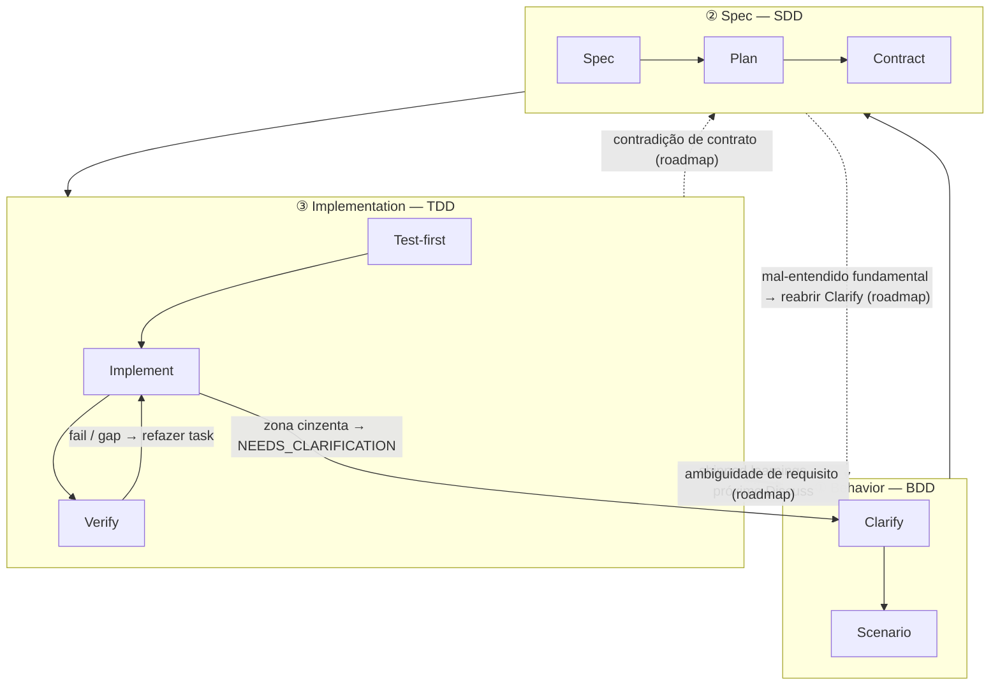

A pilha de três camadas é a teoria do harnessed sobre _por que_ a cadência tem essa forma. Ela é uma implementação de engenharia de software do aninhamento consagrado **BDD → SDD → TDD**: três loops de feedback aninhados, cada um respondendo a uma pergunta diferente. A contribuição do harnessed é **compor** o ecossistema open source dentro de cada loop — e como os componentes upstream _se sobrepõem em parte_, arbitrar essa sobreposição é justamente o ofício de um orquestrador de composição.

## Os três loops

| Camada               | Loop | Pergunta que responde                          | Composto de (com sobreposição)                                                                    |
| -------------------- | ---- | ---------------------------------------------- | ------------------------------------------------------------------------------------------------- |
| **① Behavior**       | BDD  | _O que_ construir e como saber que está pronto | gstack `/office-hours` governance · GSD discuss · superpowers brainstorming → acceptance criteria |
| **② Spec**           | SDD  | _Como_ está estruturado                        | GSD plan-phase → requirements / design / tasks · contracts (Spec Kit / ECC patterns)              |
| **③ Implementation** | TDD  | Isso _funciona_ de fato                        | superpowers TDD red-green · subagent execution · GSD verify-work · harnessed completion gate          |

**Os loops são lentes aninhadas, não fases.** O Cucumber popularizou o loop duplo BDD-externo + TDD-interno: um scenario que falha abre o loop externo, e você o leva ao verde por meio de vários ciclos internos de red-green TDD. A era GenAI acrescentou um anel no meio — o anel explícito de **spec** do SDD entre Behavior e Implementation, porque agents precisam de um contrato congelado para executar. Isso forma o **triple-loop** acima.

## Detalhamento por nó

Cada loop se divide em nós, e cada nó indica de qual(is) componente(s) open source ele é composto.

### ① Behavior (BDD)

| Nó           | Papel                                        | Composto de                                                      |
| ------------ | -------------------------------------------- | ---------------------------------------------------------------- |
| **Clarify**  | Fixar _o que_ construir e expor ambiguidades | gstack `/office-hours` + GSD discuss + superpowers brainstorming |
| **Scenario** | Converter intenção em acceptance criteria    | GSD phase success criteria                                       |

O loop externo fica aberto até os acceptance criteria do scenario estarem escritos. A definição de "pronto" é decidida aqui — antes de qualquer estrutura ou código.

### ② Spec (SDD)

| Nó           | Papel                       | Composto de                                                         |
| ------------ | --------------------------- | ------------------------------------------------------------------- |
| **Spec**     | requirements + design       | GSD plan-phase + o trio do Spec Kit (requirements / design / tasks) |
| **Plan**     | tasks + DAG de dependências | GSD `PLAN.md` + decomposição do ECC                                 |
| **Contract** | interface congelada         | convenções de contrato                                              |

O anel do meio converte o "o quê" em estrutura executável. Sua condição de saída é um **contrato congelado** — a interface contra a qual o loop de implementação vai escrever testes.

### ③ Implementation (TDD)

| Nó             | Papel                           | Composto de                             |
| -------------- | ------------------------------- | --------------------------------------- |
| **Test-first** | teste que falha (red gate)      | superpowers TDD                         |
| **Implement**  | levar ao verde                  | subagent execution                      |
| **Verify**     | refactor + conclusão por tarefa | GSD verify-work + harnessed completion gate |

O anel interno é o clássico ciclo red → green → refactor, rodado uma vez por tarefa até que todos os contratos sejam satisfeitos.

### Transversais

Duas preocupações ficam fora de qualquer loop isolado:

| Preocupação | Papel                          | Composto de                          |
| ----------- | ------------------------------ | ------------------------------------ |
| **Review**  | gates de qualidade + segurança | gstack `/review` + `/cso`            |
| **Ship**    | prontidão de release + entrega | `release-preflight` + gstack `/ship` |

Além disso, duas **disciplines** atravessam _todas_ as camadas:

- **karpathy principles** — _how_ to code: menor mudança viável, edições cirúrgicas, simplicity first.
- **mattpocock moves** — ferramentas sob demanda (`/zoom-out`, `/diagnose`, `/grill-with-docs`), invocadas conforme a situação.

## Retornos (GoBack)

O fluxo padrão é externo → interno. **O harnessed é a realização em cadência linear desse triple-loop — o grafo roteado completo é seu caminho de evolução.** Esses loops continuam sendo loops de feedback, mas hoje apenas parte das arestas de retorno está em produção; o roteamento por anel mais granular está no roadmap. O diagrama abaixo traz as arestas entregues em linha cheia e as de roadmap em tracejado, marcadas com `(roadmap)`.

### Entregue hoje

A cadência linear atual tem três arestas de retorno vivas:

- **Verify → Task** — uma verificação que falha ou um gap não atendido empurra aquele trabalho de volta ao loop de implementação.
- **Zona cinzenta → esclarecimento** — quando um subagent esbarra em ambiguidade, ele devolve `STATUS: NEEDS_CLARIFICATION`; a execução pausa, esclarece e segue.
- **Learnings → próximo Discuss** — cada ciclo entregue acrescenta sinais de failure/loop/reject que alimentam o loop de Behavior seguinte (o learn loop sempre ativo).

### Roadmap (ainda não entregue)

Retornos estruturados mais granulares — rotear o gap _direto_ para o anel que tem a resposta — são a direção de evolução, não o comportamento atual:

- **Contradição de contrato** (a implementação não consegue satisfazer uma interface congelada) → rotear de volta para **Spec**.
- **Ambiguidade de requisito** (o contrato é coerente, mas o behavior está subespecificado) → rotear de volta para **Behavior**.
- **Mal-entendido fundamental** (toda a estrutura mira o resultado errado) → reabrir o **Clarify** de Behavior.

Hoje esses gaps aparecem pelas três arestas já entregues (em geral Verify → Task somado a esclarecimento humano), e não por roteamento automático por anel. O valor imediato do orquestrador de composição está em manter a cadência linear coerente quando componentes upstream diferentes são donos de anéis diferentes; o grafo roteado é o passo seguinte.

## Os componentes se cruzam — e esse é o ponto

A mesma ferramenta upstream aparece em mais de um loop. Esse cruzamento não é redundância: é a interface que o orquestrador de composição precisa arbitrar:

- **GSD** é a **espinha dorsal** — atravessa os três anéis (discuss → plan → verify).
- **gstack** abrange **Behavior + Review**.
- **superpowers** abrange **Behavior** (brainstorm) + **Implementation** (TDD).

Sem arbitragem, esses cruzamentos disparam em duplicidade ou se contradizem. A camada de composição roteia cada anel para a ferramenta upstream certa e resolve as emendas.

## Teoria vs. runtime

A pilha de três camadas é _teoria_. [A cadência de 5 estágios](/pt-br/docs/concepts/five-stage-cadence/) é como essa teoria roda na linha de comando:

| Loop (teoria)    | Estágio de runtime                |
| ---------------- | --------------------------------- |
| ① Behavior       | **Discuss**                       |
| ② Spec           | **Plan**                          |
| ③ Implementation | **Build** (Task)                  |
| Transversais     | **Verify + Ship** (evidence gate) |

Para saber _como_ as ferramentas upstream são costuradas sem fork, veja [Composição em vez de vendoring](/pt-br/docs/concepts/composition/).
