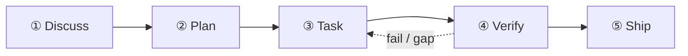

Este tutorial percorre a cadência de 5 estágios manualmente com um exemplo realista: **"Adicionar rate limiter à nossa API Express — 100 req/min por IP, com Redis."**

Sua primeira execução de `/auto` percorre os cinco estágios de ponta a ponta:



## Estágio 1 — Discuss

```
/discuss "adicionar rate limiter à nossa API Express — 100 req/min por IP, com Redis"
```

`/discuss` avalia 3 gates de esclarecimento em paralelo e roda só os que disparam:

- **Gate estratégico** (`discuss-strategic`): isto é um recurso novo ou uma mudança em infraestrutura existente? Afeta o posicionamento do produto? Para um rate limiter, esse gate normalmente dispara uma checagem rápida de governança.
- **Gate de fase** (`discuss-phase`): há ≥2 decisões de implementação em aberto? (Redis ou memória? Por rota ou global?) Esse gate esclarece e persiste os achados em `findings.md`.
- **Gate de subtarefa** (`discuss-subtask`): alguma subtarefa com ≥2 abordagens distintas? O design do algoritmo central passa por um brainstorming rápido.

**Saída**: `findings.md` e `knowledge.md` em `.planning/PHASE-N/`.

## Estágio 2 — Plan

```
/plan "recurso de rate limiter"
```

`/plan` roda dois passos em sequência:

1. **Revisão de arquitetura** (condicional) — se o recurso cruza fronteiras de módulo ou envolve nova infraestrutura, o staff engineer paranoico do gstack revisa o design
2. **Plano de fase** — o GSD persiste `task_plan.md` com caminhos de arquivo exatos, critérios de aceite e ordenação de dependências

**Saída**: `.planning/PHASE-N/PLAN.md` e `task_plan.md`.

## Estágio 3 — Task

```
/task "implementar o middleware de rate limiter"
```

`/task` roda 4 subpassos por subtarefa, em série:

1. **Esclarecer** — verifica a spec antes de escrever código; expõe ambiguidades
2. **Codar** — implementa seguindo os princípios karpathy (menor mudança viável, edições cirúrgicas)
3. **Testar** — TDD na lógica central: red → green → refactor
4. **Entregar** — o wrapper `ralph-loop` garante um `COMPLETE` literal antes de seguir adiante

## Estágio 4 — Verify

```
/verify "recurso de rate limiter"
```

`/verify` distribui até 7 subverificações conforme o que mudou:

| Verificação          | Dispara quando                                   |
| -------------------- | ------------------------------------------------ |
| `verify-progress`    | sempre (aceite de UAT + sincronização de estado) |
| `verify-code-review` | sempre (fan-out paralelo multi-agent)            |
| `verify-paranoid`    | módulo crítico ou pré-PR                         |
| `verify-qa`          | há mudanças de UI                                |
| `verify-security`    | auth ou segredos foram tocados                   |
| `verify-design`      | há mudanças de design                            |
| `verify-simplify`    | sempre por último (remove lógica redundante)     |

## Artefatos persistidos em `.planning/`

```
.planning/
├── STATE.md          # SoT da fase / progresso atual
├── ROADMAP.md        # mapa de rotas das fases
└── PHASE-1/
    ├── PLAN.md       # lista de tarefas, caminhos, critérios de aceite
    ├── findings.md   # saídas do estágio discuss
    ├── task_plan.md  # decomposição por subtarefa
    └── PROGRESS.md   # acompanhamento em tempo real
```

## Próximos passos

Depois que o Verify terminar, rode `/retro` para fechar o marco e registrar as lições. Se você tivesse rodado `/auto`, esses estágios teriam sido encadeados automaticamente — veja [Início rápido](/pt-br/docs/getting-started/quickstart/) para o caminho de um comando só.

Para a arquitetura por trás de cada estágio, leia [A cadência de 5 estágios](/pt-br/docs/concepts/five-stage-cadence/).
