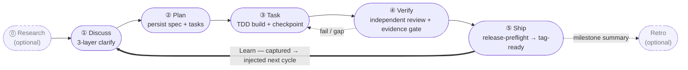

harnessed é o gerenciador de pacotes e orquestrador de composição para harnesses de programação com IA. Ele instala, compõe e executa workflows que combinam Skills, servidores MCP e harness packs por meio de um manifesto tipado — sem fazer vendoring do código upstream.

Se você desenvolve com Claude Code, o harnessed conecta os melhores componentes open source — ECC, Superpowers, GSD, gstack — em um workflow único e executável, com um só comando.

O loop de operação — cinco estágios fechados por um ciclo de Learn sempre ativo:

## Por onde começar

- **[Instalação](/pt-br/docs/getting-started/installation/)** — instale o harnessed e rode o setup em 30 segundos
- **[Início rápido](/pt-br/docs/getting-started/quickstart/)** — da instalação ao primeiro workflow em 60 segundos
- **[Conceito de composição](/pt-br/docs/concepts/composition/)** — como o harnessed compõe ferramentas upstream sem fazer fork delas
- **[Referência de workflows](/pt-br/docs/reference/workflows/)** — os 28 workflows componíveis entregues na release atual

## O que torna o harnessed diferente

Três princípios sustentam cada workflow:

**Composição em vez de vendoring.** Cada harness pack traz um manifesto. O harnessed lê esse manifesto, valida a compatibilidade e costura as ferramentas upstream em runtime. Você sempre roda o upstream oficial — nunca um fork desatualizado.

**Cadência de 5 estágios embutida.** Discuss → Plan → Task → Verify → Ship, com Research e Retro opcionais, mais um loop de aprendizado automático. Ou rode `/auto` para o pipeline completo de 6 estágios (research → retro; Ship é explícito) em um único comando.

**Metodologia dogfood-first.** Cada workflow é validado contra a própria definição — a mesma disciplina que o harnessed usa para entregar a si mesmo.

Leia o [README](https://github.com/easyinplay/harnessed#readme) para a visão geral completa.
