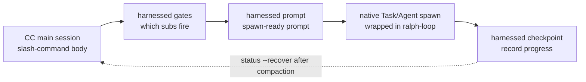

> **Modelo de execução v4.0.** O harnessed é um *orchestration brain + biblioteca de prompts*, não um motor de execução. O corpo do comando de barra (gerado por `harnessed setup`) dirige o **spawn de subagents CC-native** por meio de três CLIs puras e rápidas — `harnessed gates` (quais subworkflows disparam), `harnessed prompt` (prompt pronto para spawn de um subworkflow) e `harnessed checkpoint` (registro de progresso). O spawn em si, Agent Teams, ralph-loop e as idas e vindas de esclarecimento ficam com a sessão principal do Claude Code, usando ferramentas nativas. `harnessed run` permanece apenas para CI/headless.

Como as três CLIs de orquestração dirigem o spawn CC-native:



## `harnessed` (painel you-are-here)

Rodar `harnessed` **sem argumentos** imprime o painel you-are-here — o jeito mais rápido de se reorientar dentro de um workflow em andamento (análogo ao `/comet` do comet, introduzido na v8.0).

```bash
harnessed          # painel you-are-here + próximo passo, legível por humanos
harnessed --json   # objeto estruturado, legível por máquina
```

Ele detecta automaticamente o workflow em andamento do repositório atual e imprime a fase corrente, o status de cada subworkflow e o contrato determinístico de uma linha `NEXT: auto | manual | done`, mais uma dica de execução (ex.: `→ run: harnessed prompt <sub>`). Sem workflow em andamento, imprime uma dica de introdução apontando para `harnessed setup`.

**Somente leitura** — não faz spawn, não altera estado/git/remote e sempre sai com `0`. Só o `harnessed` puro (ou `harnessed --json`, opcionalmente com `--lang`) despacha o painel; qualquer subcomando, `--help`, `--version` ou palavra desconhecida cai no parsing normal de comandos (então `harnessed bogus` continua sendo erro).

Campos de `--json`: `active`, `phase`, `status`, `started_at`, `next`, `sub`, `hint`, `sub_progress`.

---

## `harnessed setup`

Onboarding de uma vez — instala os workflow skills e os manifestos base em `~/.claude/`.

```bash
harnessed setup [opções]
```

**O que faz:**

1. Varre `workflows/<name>/SKILL.md` e copia cada um para `~/.claude/skills/<name>/`
2. Processa `manifests/tools/*.yaml` e `manifests/skill-packs/*.yaml`
3. Grava `CLAUDE_CODE_EXPERIMENTAL_AGENT_TEAMS=1` em `~/.claude/settings.json`
4. Detecta o locale do SO e grava `env.HARNESSED_USER_LANG` (zh-* → `zh-Hans`, o restante → `en`)

**Flags:**

| Flag | Descrição |
|------|-----------|
| `--user-lang <code>` | Sobrescreve o locale detectado. Aceita `en`, `zh-Hans`, `zh-CN`, `zh-TW` |
| `--dry-run` | Apenas prévia — imprime o que seria escrito, sem alterar o disco |

**Códigos de saída:** `0` = sucesso, `1` = erro de sistema de arquivos, `2` = nenhum workflow com SKILL.md encontrado.

---

## `harnessed install <pack>`

Instala um harness pack por nome ou caminho.

```bash
harnessed install <pack>
```

Resolve o manifesto do pack, valida contra o schema e executa cada passo de `install` em ordem. Hoje há suporte a bootstrap por caminho local e por URL git; a descoberta de packs no registry npm está planejada.

---

## `harnessed install-base`

Instala o perfil base inteiro de uma vez — cada manifesto em `manifests/tools/*.yaml` e `manifests/skill-packs/*.yaml`, em ordem alfabética. É um subcomando próprio (e não uma flag `--base` do `install`), para não conflitar com o gate de pack único.

```bash
harnessed install-base                   # aplica imediatamente (padrão)
harnessed install-base --dry-run         # apenas prévia — sem alterar o disco
harnessed install-base --non-interactive # pula todos os prompts (CI / scripts)
```

Imprime estatísticas: `installed / already-installed / skipped (user-aborted) / failed`.

**Códigos de saída:** `0` = ao menos um instalado e nenhuma falha · `1` = uma ou mais falhas · `2` = nada instalado (tudo já instalado ou abortado).

---

## `harnessed research`

Roda o workflow de research — subroteamento por categoria de busca → spawn de subagent → `COMPLETE` literal. É um alias fino de `workflows/research/workflow.yaml`.

```bash
harnessed research --query "compare Postgres vs SQLite for this use case"
harnessed research --query "..." --dry-run          # prévia do workflow resolvido + gate context (JSON)
harnessed research --query "..." --model sonnet      # model do subagent: haiku | sonnet | opus
harnessed research --query "..." --non-interactive   # pula todos os prompts (CI / scripts)
```

| Flag | Descrição |
|------|-----------|
| `--query <text>` | prompt de research (**obrigatório**) |
| `--dry-run` | Apenas prévia — imprime `{ workflow, yamlPath, gateContext }` e não faz spawn |
| `--model <model>` | model do subagent: `haiku` \| `sonnet` \| `opus` |
| `--non-interactive` | Pula todos os prompts (CI / scripts) |

**Códigos de saída:** `0` = workflow concluído · `1` = falha em runtime do workflow · `2` = erro de uso (falta `--query` ou o yaml do workflow não foi encontrado).

---

## `harnessed manifest-add <upstream>`

Adiciona um novo adaptador upstream depois do **gate de merge das 5 perguntas EE-5** — cinco perguntas interativas que forçam uma decisão pensada antes de trazer um novo upstream para a composição (é uma surface reutilizável, o nome cabe, há sobreposição com componentes existentes, você está importando um conceito ou a identidade de produto de outra pessoa, e alguém que não conhece o upstream ainda entenderia). Todas as cinco exigem resposta não vazia.

```bash
harnessed manifest-add https://github.com/owner/repo.git
harnessed manifest-add <upstream> --category tools    # skill-packs (padrão) | tools
harnessed manifest-add <upstream> --name myadapter    # padrão: basename do <upstream>
harnessed manifest-add <upstream> --dry-run           # prévia — imprime as respostas, não grava
harnessed manifest-add <upstream> --non-interactive   # CI: dry-run só com WARN, não grava nada
```

Em caso de sucesso, grava as respostas em `manifests/<category>/<name>.ee5-answers.json`.

| Flag | Descrição |
|------|-----------|
| `--category <cat>` | Categoria do manifesto: `skill-packs` (padrão) \| `tools` |
| `--name <name>` | Nome curto do adaptador (padrão: basename do `<upstream>`) |
| `--dry-run` | Apenas prévia — imprime o JSON de respostas, não grava |
| `--non-interactive` | CI / scripts — só WARN, não grava nada |

**Códigos de saída:** `0` = gate aprovado (gravado ou em prévia) · `1` = alguma resposta em branco.

---

## `harnessed uninstall [pack]`

Desinstala um pack instalado; sem argumentos, remove os arquivos que o próprio harnessed instalou.

```bash
harnessed uninstall <pack>   # remove um pack (executa os passos de uninstall do manifesto)
harnessed uninstall          # remove de ~/.claude/ os skills/manifests do próprio harnessed
```

Para os três métodos de instalação que colocam skills em disco (`npm-cli`, `git-clone-with-setup`, `npx-skill-installer`), o uninstall executa o **contrato `spec.uninstall` declarado** no manifesto: primeiro roda o `cmd` declarado (fail-soft — saída diferente de zero ou shell ausente apenas avisa e segue), depois faz um force-rm idempotente de cada entrada de `cleanup_paths`, **restrito a `$HOME`** (caminhos fora da subárvore do home dão hard-fail). Métodos que mexem em settings/plugin/MCP (`cc-hook-add`, `cc-plugin-marketplace`, `mcp-*-add`) mantêm desinstaladores próprios. O uninstall unificado sem argumentos reverte o `harnessed setup`.

---

## CLIs de orquestração (v4.0)

Estas três CLIs puras são o que o corpo gerado do comando de barra usa para dirigir o spawn CC-native. Elas só imprimem JSON e não fazem spawn — a orquestração é da sessão principal.

### `harnessed gates <master>`

Avalia quais subworkflows disparam para um dado master orchestrator (`discuss` / `plan` / `task` / `verify` / `auto`) e uma spec de tarefa.

```bash
harnessed gates plan --task "add OAuth login" --skip-sub discuss
# → JSON: { fire: [{ sub, order, mode }], skip: [...], parallelism: { escalate_to_teams } }
```

`fire` lista os subworkflows que passaram nos gates de julgamento, em ordem de execução; `parallelism.escalate_to_teams` indica quando trocar o spawn sequencial de subagents por Agent Teams CC-native.

### `harnessed prompt <sub>`

Emite um prompt pronto para spawn de um único subworkflow — corpo do role-prompt + checklist + disciplines aplicadas.

```bash
harnessed prompt plan-phase --task "add OAuth login" --json
# → JSON: { prompt, max_iterations, model }
```

A sessão principal alimenta esse `prompt` em um spawn nativo de `Task` (por fora, o plugin ralph-loop); `max_iterations` / `model` vêm direto dos padrões do workflow.

### `harnessed checkpoint`

Registra o progresso de subworkflows no checkpoint store do harnessed. A sessão principal chama ao concluir (e ao falhar) cada subworkflow, permitindo recuperar com `harnessed status --recover` depois de uma compactação.

```bash
harnessed checkpoint start <master> --plan <json>   # semeia o ledger de progresso
harnessed checkpoint complete <sub>                 # marca o subworkflow como concluído (com evidence guard)
harnessed checkpoint fail <sub>                      # registra um subworkflow que falhou
```

### `harnessed run`

**Apenas CI / headless.** Faz spawn do workflow inteiro em processo, via SDK — para quando não há uma sessão principal interativa para orquestrar. O caminho padrão da v4.0 é a orquestração gates → prompt → checkpoint acima; `run` é o fallback.

```bash
harnessed run <master> --task "<spec>"
```

---

## `harnessed doctor`

Diagnostica a instalação local de harnessed + Claude Code — 14 checagens de saúde (Node, escopo/disponibilidade de MCP, jq, bash no Windows, origin, prefixo do gstack, deprecations, orçamento de tokens, env de Agent Teams, planning-with-files, mattpocock-skills, CodeGraph, update-available).

```bash
harnessed doctor
harnessed doctor --json   # relatório legível por máquina
```

---

## `harnessed update`

Mantém o harnessed (e opcionalmente os plugins upstream) atualizado. A 14ª checagem do doctor também avisa passivamente "update available X→Y". O `update` é de canal duplo — detecta como o harnessed foi instalado e segue o caminho correspondente.

```bash
harnessed update                      # autoatualização + seção de topo do CHANGELOG + aviso de reinício
harnessed update --check              # só reporta as versões installed/latest, não instala
harnessed update --dry-run            # prévia das ações de atualização — não grava nada
harnessed update --upstreams          # roda de novo os manifestos base para atualizar plugins upstream
harnessed update --migration-report   # inventário somente leitura de estado obsoleto (não apaga nada)
harnessed update --rollback [version] # só no binário compilado — restaura uma versão guardada em bin-backup/
```

**Canal npm** — executa `npm i -g harnessed@latest`, imprime a seção de topo do CHANGELOG e lembra de reiniciar o Claude Code.

**Canal do binário compilado** (instalador one-liner) — baixa o artefato da plataforma das GitHub releases, verifica o checksum `.sha256` **e sua assinatura ed25519** (`<asset>.sha256.sig`, contrato de release desde a v4.32.19 — assinatura ausente ou verificação falha são hard error, e o binário atual fica intacto) e então troca o novo binário atomicamente; a versão substituída vai para `bin-backup/` para rollback.

**`--rollback [version]`** (só no binário compilado) — restaura atomicamente uma versão anterior a partir de `bin-backup/`: por padrão a mais recente guardada, ou uma versão específica (versão desconhecida gera erro e lista as disponíveis). O binário atual é guardado antes, então o próprio rollback é reversível. No modo de instalação npm, o comando recusa e direciona para `npm i -g harnessed@<version>`.

O acesso à rede é fail-soft — nunca dá erro se o npm estiver inacessível.

---

## `harnessed release-preflight`

O gate do estágio Ship. Checagem **somente leitura** de prontidão para release — sai com 1 se o repositório não estiver pronto. Não altera nada (o publish real é feito pelo CI no push da tag).

```bash
harnessed release-preflight
```

Verifica: `[Unreleased]` (ou a seção `[<version>]`) não vazio no `CHANGELOG.md`, `package.json` com version válida, árvore de trabalho limpa (mudanças em arquivos tracked) e a tag `v<version>` ainda não existente.

---

## `harnessed compact`

Resume e descarta entradas já resolvidas do ledger de sub-progresso, liberando contexto para tarefas longas. **G6-safe**: entradas com `fail_count > 0` nunca são descartadas, preservando os sinais de break-loop.

```bash
harnessed compact                                  # compactação manual
harnessed checkpoint complete <sub> --tokens <n>   # dispara sozinho quando a contagem de tokens cruza o limite
```

---

## `harnessed workflows`

Lista os workflows em andamento — um por repositório (o harnessed separa o estado de checkpoint por repo root, então projetos paralelos não se sobrescrevem).

```bash
harnessed workflows
```

---

## `harnessed learn`

Acrescenta um learning em prosa ao `.planning/LEARNINGS.md` do repositório atual. Workflows concluídos também acrescentam automaticamente seus sinais de failure/loop/reject; o inject hook injeta os learnings relevantes na próxima sessão.

```bash
harnessed learn "não repita a migração às cegas — ela precisa de um snapshot limpo antes"
```

---

## `harnessed retro`

Reinicia o lembrete de cadência de retro. `/retro` é uma skill do gstack e o harnessed não consegue observá-la, então depois de rodá-la chame `harnessed retro --done` para zerar o contador de fases por repositório e limpar o lembrete injetado `RETRO-DUE`.

```bash
harnessed retro --done   # zera o contador de fases + limpa o lembrete RETRO-DUE
```

Sem `--done` ele não faz nada e sai com `1` (`nothing to do — pass --done after running /retro`).

---

## `harnessed next`

Imprime o contrato determinístico de próximo passo — somente leitura, não altera estado. Duas camadas:

1. **Workflow em andamento** (ainda há subs pendentes) → mantém o contrato interno do workflow `NEXT: auto <sub> | manual <sub> | done` (exit `0`, sem mudanças).
2. **Todos os subs resolvidos** → cai na **continuação horizontal entre units** (v4.10): deriva a próxima work unit (próxima fase / tarefa) da SoT em disco de `.planning/` e imprime `NEXT: advance | blocked | done`.

```bash
harnessed next
# em andamento: NEXT: auto <sub>
# fall-through: NEXT: advance
#               UNIT: phase 16 'rate limiter'
#               HINT: run /auto (or harnessed advance) to start it — 2 phases remain
```

**Códigos de saída entre units:** `0` = advance (há próxima unit) · `2` = done (todas as fases concluídas) · `10` = blocked (decisão humana necessária).

---

## `harnessed advance`

Avança para a próxima work unit derivada da SoT em disco de `.planning/` — **apenas imprime (print-only)**. Ele mostra a próxima fase/tarefa e o comando a rodar (ex.: `→ run /auto "..."`), mas **não** semeia estado e **não** faz spawn; quem roda o comando impresso é a sessão principal, o que preserva as idas e vindas de esclarecimento e os Agent Teams.

```bash
harnessed advance
# ADVANCE: advance
# UNIT: phase 16 'rate limiter'
# → run /auto "phase 16 'rate limiter'"
```

**advance-gate.** O `advance` se recusa a pular fases anteriores *incompletas* (o gate "comet"): se a próxima fase derivada estiver ordenada antes do ponteiro do workflow, ou se um sub que falhou estiver travando o ledger, ele sai com código diferente de zero e **não** imprime o comando. Use `--force` para sobrescrever — ele registra uma nota de auditoria na saída e segue.

```bash
harnessed advance --force   # sobrescreve o gate (registra nota de auditoria)
```

**Driver loop.** `--json` emite `{ next, unit, hint }` legível por máquina, permitindo que um loop de shell encadeie várias fases sem intervenção — o loop para em qualquer saída diferente de zero (done / blocked / gate-reject):

```bash
while harnessed advance --json; do : ; done
```

**Códigos de saída:** `0` = advance · `2` = done (todas as fases concluídas) · `10` = blocked · `11` = gate-reject (fase anterior incompleta; use `--force`) · `1` = error.

**Design — derivar do disco, sem manter fila.** O "próximo" é sempre derivado do disco, nunca de uma fila armazenada. Uma fase conta como concluída ⇔ cada `NN-*-PLAN.md` tem um `NN-*-SUMMARY.md` correspondente (derivado de artefatos, então fases já entregues são naturalmente puladas). Se você inserir uma fase no meio (editando `ROADMAP.md` ou criando `phases/16.1-*/`), o próximo `advance` a pega sozinho. A continuação por fase é o piso já entregue; a resolução por tarefa está resolver-ready mas ainda não ligada à CLI.

---

## `harnessed reject <sub>`

Marca um subworkflow como rejeitado pelo usuário — um estado terminal, distinto de `failed` (que alimenta a lógica de retry do break-loop).

```bash
harnessed reject <sub>
```

---

## `harnessed resume`

Retoma um pipeline `/auto` que falhou, a partir do último estágio bem-sucedido.

```bash
harnessed resume
```

Lê `.planning/STATE.md` para encontrar o último estágio bem-sucedido e reentra no pipeline a partir dali. Útil quando um estágio falha no meio.

---

## `harnessed status`

Mostra o estado do pipeline para o diretório de trabalho atual.

```bash
harnessed status
```

Lê `.planning/STATE.md` e imprime o estágio atual, o último estágio concluído e todos os bloqueios.

```bash
harnessed status --recover
```

`--recover` lê o ledger de progresso dos checkpoints (em vez do STATE.md) e imprime uma visão estruturada de recuperação pós-compactação — subworkflows concluídos / pendentes / pulados, o próximo comando a rodar e quaisquer avisos de evidence-drift. Use para se reorientar depois de uma compactação de contexto.

---

## `harnessed audit`

Auditoria secundária de autoconsistência dos manifestos em `manifests/tools/` e `manifests/skill-packs/`. É uma passada de defesa em profundidade que pega schema drift, valores de placeholder e adulterações que o schema Ajv não pega.

```bash
harnessed audit                 # camadas de manifesto + runtime
harnessed audit --skip-runtime  # só a camada de manifesto (offline / não inicializado)
```

**Camada de manifesto:** formato da URL de repositório (`https://…​.git`), valores de placeholder em `signed_by` (`unsigned` / `todo` / `tbd` / …) e `git_ref` móvel (`HEAD` / `main` / `master` — isso é *error*: deve ser pinado em SHA ou tag). **Camada de runtime** (pulada com `--skip-runtime`): adulteração da URL de origin, injeção de shell em `install.cmd` + verificação cruzada de pacotes npm, gate de proveniência. Imprime um relatório `✓ / ⚠ / ✗` por manifesto e a contagem de findings.

**Códigos de saída:** `0` = nenhum finding de nível error (warnings permitidos) · `1` = um ou mais errors.

> **`audit` vs. `audit-log`** — `audit` *valida a integridade dos arquivos de manifesto*; `audit-log` (abaixo) *consulta o registro* de roteamentos/instalações que já aconteceram. São preocupações diferentes.

---

## `harnessed audit-log`

Consulta o log de auditoria de roteamento/instalação — quais gates dispararam, quais packs foram instalados e quando.

```bash
harnessed audit-log                    # tabela de 5 colunas legível por humanos
harnessed audit-log --filter <pack>    # filtra por pack/evento
harnessed audit-log --json             # registro completo de 12 campos
```

---

## `harnessed backup list`

Lista cada snapshot de backup em `.harnessed-backup/` — uma linha por snapshot, com timestamp, manifesto de origem e contagem de arquivos. Lido do `metadata.json` de cada snapshot.

```bash
harnessed backup list
```

Faz par com `harnessed gc` (apaga snapshots antigos) e `harnessed rollback` (restaura a partir de um timestamp escolhido).

---

## `harnessed gc`

Recupera espaço de backups obsoletos deixados por install/uninstall/rollback.

```bash
harnessed gc
```

---

## `harnessed rollback`

Restaura o estado anterior a partir do backup mais recente (preservando CRLF/LF) — desfaz a última mudança de install/setup.

```bash
harnessed rollback
```

---

## `harnessed --version`

```bash
harnessed --version
# → 4.32.20
```

---

## `harnessed --help`

```bash
harnessed --help
harnessed <command> --help   # ajuda por comando
```

---

## Flags globais

| Flag | Descrição |
|------|-----------|
| `--version` | Imprime a versão e sai |
| `--help` | Imprime a ajuda e sai |

O código-fonte está em `src/cli.ts` e `src/cli/` no [repositório do harnessed](https://github.com/easyinplay/harnessed/tree/main/src/cli).
