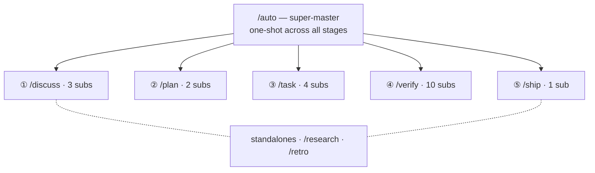

O harnessed traz 28 workflows organizados por namespace: um super-master, cinco masters de estágio (Discuss · Plan · Task · Verify · Ship), 20 subworkflows e dois workflows independentes.

28 workflows — um super-master se abre nos cinco masters de estágio e seus subs, mais dois workflows independentes:

## Super-master

| Comando | Escopo       | Capabilities                                                                                                                                                                                                                                                                                          |
| ------- | ------------ | ----------------------------------------------------------------------------------------------------------------------------------------------------------------------------------------------------------------------------------------------------------------------------------------------------- |
| `/auto` | super-master | Pipeline completo de 6 estágios: research (condicional) → discuss → plan → task → verify → retro (obrigatório). Avaliação de complexidade em um passo por IA + checagem de entendimento. A flag `--staged` habilita a UX de gates por estágio. Para na primeira falha; retome com `harnessed resume`. |

## Workflows independentes

| Comando     | Escopo       | Capabilities                                                                                                                                          |
| ----------- | ------------ | ----------------------------------------------------------------------------------------------------------------------------------------------------- |
| `/research` | independente | Investigação multifonte via Tavily, Exa MCP e ctx7. Dispara como estágio 0 dentro do `/auto` ou é chamado direto antes do discuss.                    |
| `/retro`    | independente | Resumo de fechamento de marco via gstack `/retro`. Registra lições, decisões e descobertas inesperadas em `RETROSPECTIVE.md`. Obrigatório no `/auto`. |

## Estágio Discuss

| Comando              | Escopo            | Capabilities                                                                                                                                          |
| -------------------- | ----------------- | ----------------------------------------------------------------------------------------------------------------------------------------------------- |
| `/discuss`           | master de estágio | Avalia os três gates de discussão em paralelo e roda só os que disparam.                                                                              |
| `/discuss-strategic` | subworkflow       | Camada estratégica — nova funcionalidade / milestone / direção de produto. gstack `/office-hours` + `/plan-ceo-review`. Persiste `findings.md`.       |
| `/discuss-phase`     | subworkflow       | Camada de fase — ≥2 decisões em aberto, esclarecimento de zona cinzenta. GSD `gsd-discuss-phase`. Persiste `findings.md` + `knowledge.md`.            |
| `/discuss-subtask`   | subworkflow       | Camada de subtarefa — ≥2 abordagens / algoritmo central / contrato de API. Superpowers brainstorming + `/grill-with-docs`. Efêmero, sem persistência. |

## Estágio Plan

| Comando              | Escopo            | Capabilities                                                                                                                      |
| -------------------- | ----------------- | --------------------------------------------------------------------------------------------------------------------------------- |
| `/plan`              | master de estágio | Serial: revisão de arquitetura (condicional) → plano de fase (sempre).                                                            |
| `/plan-architecture` | subworkflow       | Camada de arquitetura — gate de governança para arquiteturas complexas. gstack `/plan-eng-review`. Trava o design antes do plano. |
| `/plan-phase`        | subworkflow       | Plano de fase — GSD `gsd-plan-phase` + planning-with-files. Persiste `task_plan.md` + `progress.md`.                              |

## Estágio Task

| Comando         | Escopo            | Capabilities                                                                                                                                                     |
| --------------- | ----------------- | ---------------------------------------------------------------------------------------------------------------------------------------------------------------- |
| `/task`         | master de estágio | Loop serial por subtarefa: esclarecer → codar → testar → entregar.                                                                                               |
| `/task-clarify` | subworkflow       | Gate de esclarecimento na largada. Superpowers brainstorming + `/grill-with-docs` condicionais.                                                                  |
| `/task-code`    | subworkflow       | Implementa seguindo os 4 princípios karpathy. `/zoom-out` / `/improve-codebase-architecture` / `/diagnose` condicionais. Sincroniza `progress.md` entre sessões. |
| `/task-test`    | subworkflow       | TDD red → green → refactor. Superpowers TDD + `/diagnose` condicionais. Obrigatório na lógica central.                                                           |
| `/task-deliver` | subworkflow       | Wrapper do SDK `ralph-loop`. Roda até um `COMPLETE` literal. Agent Teams condicional para coordenação full-stack.                                                |

## Estágio Verify

| Comando                  | Escopo            | Capabilities                                                                                                                                                              |
| ------------------------ | ----------------- | ------------------------------------------------------------------------------------------------------------------------------------------------------------------------- |
| `/verify`                | master de estágio | Distribui até 7 subverificações conforme as flags de cenário.                                                                                                             |
| `/verify-progress`       | subworkflow       | Sempre roda primeiro. Checagem de critérios de aceite de UAT + sincronização de estado do GSD.                                                                            |
| `/verify-code-review`    | subworkflow       | Fan-out paralelo de vários subagents. Achados de alta confiança.                                                                                                          |
| `/verify-paranoid`       | subworkflow       | Revisão do staff engineer paranoico via gstack `/review`. Obrigatório em módulos críticos antes do PR.                                                                    |
| `/verify-qa`             | subworkflow       | QA ponta a ponta via gstack `/qa` + playwright-cli / `@playwright/test`. Dispara com mudanças de UI.                                                                      |
| `/verify-security`       | subworkflow       | Checagem OWASP / auth / segredos via gstack `/cso`. Dispara quando auth ou segredos são tocados.                                                                          |
| `/verify-design`         | subworkflow       | Consistência do design system via gstack `/design-review` + ui-ux-pro-max + design-taste-frontend. Dispara com mudanças de design.                                        |
| `/verify-eval-review`    | subworkflow       | Auditoria de cobertura de eval de fase de IA via GSD `/gsd-eval-review`. Dispara quando a fase inclui etapas de IA/LLM (par do gsd-ai-integration-phase no lado do plan). |
| `/verify-validate-phase` | subworkflow       | Preenchimento de cobertura requisito→teste de Nyquist via GSD `/gsd-validate-phase`. Dispara quando é preciso auditar cobertura.                                          |
| `/verify-simplify`       | subworkflow       | Simplificação final via `code-simplifier`. Sempre por último.                                                                                                             |
| `/verify-multispec`      | subworkflow       | Agent Team de 4 especialistas, Pattern C — questionamento cruzado via SendMessage. Caminho de escalonamento para releases críticas e PRs de refatoração grande.           |

## Ship (estágio ⑤)

| Comando           | Escopo            | Capabilities                                                                                                                                                                                              |
| ----------------- | ----------------- | --------------------------------------------------------------------------------------------------------------------------------------------------------------------------------------------------------- |
| `/ship`           | master de estágio | Estágio de release após o Verify. Roda o gate de preflight e então delega PR/deploy ao gstack `/ship`. A fronteira do deploy é tag-ready; o publish de fato é feito pelo CI `publish.yml` no push da tag. |
| `/ship-preflight` | subworkflow       | Roda `harnessed release-preflight` — gate somente leitura (CHANGELOG `[Unreleased]` / version / git-clean / tag-absent). Qualquer falha bloqueia a release.                                               |

## Wrappers de disciplina

| Comando         | Escopo     | Capabilities                                                                                                             |
| --------------- | ---------- | ------------------------------------------------------------------------------------------------------------------------ |
| `/tdd`          | disciplina | red → green → refactor. Alias de `superpowers:test-driven-development`. Também serve como wrapper de disciplina isolado. |
| `/ralph-loop`   | wrapper    | Wrapper de promessa de conclusão. Roda qualquer prompt até sair um `COMPLETE` literal. Já embutido no `/task-deliver`.   |
| `/execute-task` | ferramenta | Ponto de entrada para execução direta de tarefa. Pula os estágios discuss/plan.                                          |

Todas as definições de workflow estão em `workflows/<name>/workflow.yaml` no [repositório do harnessed](https://github.com/easyinplay/harnessed).
