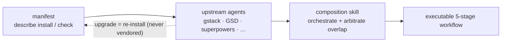

## Проблема

AI-харнессы разработки — ECC, Superpowers, GSD, gstack — поставляются как отдельные npm-пакеты или git-репозитории. Собирать их вручную хрупко: вы форкаете upstream, патчите локально, а затем смотрите, как всё гниёт, пока upstream выпускает версии, которые уже не смержить.

Традиционный ответ — vendoring: скопировать upstream в свой репозиторий и поддерживать самому. Это работает, пока upstream не выпустит крупное улучшение, — и вы застреваете на старом форке. Держать десятки harness-компонентов в синхроне вручную не масштабируется.

## Подход harnessed

harnessed никогда не копирует upstream-код. Вместо этого каждый harness-пак поставляется с **манифестом** — типизированным YAML-файлом, который описывает, как установить пак, какие capability он предоставляет и как интегрируется с другими компонентами.

В runtime harnessed читает эти манифесты, проверяет совместимость и оркестрирует upstream-инструменты через composition skills. Вы всегда запускаете официальный upstream-бинарник — harnessed лишь координирует передачу управления.

Сборка, а не vendoring — манифесты описывают, composition skill оркестрирует:



Пример манифеста (сокращённо):

```yaml
name: my-pack
version: 1.0.0
description: Добавляет workflow OAuth2 в harnessed
install:
  - npm: superpowers
  - git: https://github.com/example/skill-pack-oauth
capability:
  skills:
    - brainstorming
    - tdd
  workflows:
    - discuss
    - plan
```

## Преимущества

**Всегда свежий upstream.** Когда Superpowers выпускает новый релиз, вы просто перезапускаете `harnessed install` и сразу получаете его. Никакого ручного merge, никаких устаревших форков.

**Проверенная композиция.** `harnessed setup` проверяет совместимость манифестов до установки. Конфликтующие объявления capability всплывают как ошибки, а не как сюрпризы в runtime.

**Напишите собственный пак.** Схема манифеста опубликована в репозитории по пути `schemas/manifest.v1.schema.json` (направьте на неё свой YAML language server ради inline-валидации). Нацельте манифест на любой устанавливаемый upstream (npm-пакет, git-репозиторий, собственный skill) — и harnessed будет считать его полноправной составной единицей.

**Единая точка входа.** Пользователи работают с `/discuss`, `/plan`, `/task`, `/verify`, не изучая терминологию каждого upstream. Composition skill сам маршрутизирует к нужному upstream-инструменту на каждой стадии.

## Как работают composition skills

С версии v4.0 harnessed — это **orchestration brain + библиотека промптов**, а не движок исполнения. Он больше не порождает workflow в собственном процессе — вместо этого тело слеш-команды (сгенерированное `harnessed setup`) поручает главной сессии Claude Code порождать **CC-native subagent**, а управляют этим три быстрых чистых CLI. Когда вы запускаете `/discuss`:

1. **Gate** — `harnessed gates discuss --task "<spec>"` возвращает, какие из трёх gate обсуждения срабатывают (strategic / phase / subtask) и нужно ли повышать до Agent Teams.
2. **Prompt** — для каждого сработавшего gate `harnessed prompt <sub> --json` выдаёт готовый к spawn промпт (тело role + чек-лист + применённые disciplines).
3. **Spawn** — главная сессия выполняет нативный spawn `Task` (обёрнутый в ralph-loop) и возвращает вам любой `STATUS: NEEDS_CLARIFICATION` через `AskUserQuestion`.
4. **Checkpoint** — `harnessed checkpoint complete <sub>` записывает прогресс в `.planning/`, чтобы запуск пережил compaction.

harnessed отвечает за решения (маршрутизация gate, генерация промптов, ledger прогресса); сам spawn, координацию Agent Teams и круги уточнений выполняет главная сессия нативными инструментами Claude Code. (`harnessed run` сохраняет старый внутрипроцессный spawn только для CI/headless.)

Именно поэтому 28 workflow в harnessed могут одновременно собирать ECC, Superpowers, GSD и gstack — слой композиции абстрагирует стыки.

Все 28 workflow и их upstream-зависимости — в [Справочнике workflow](/ru/docs/reference/workflows/).
