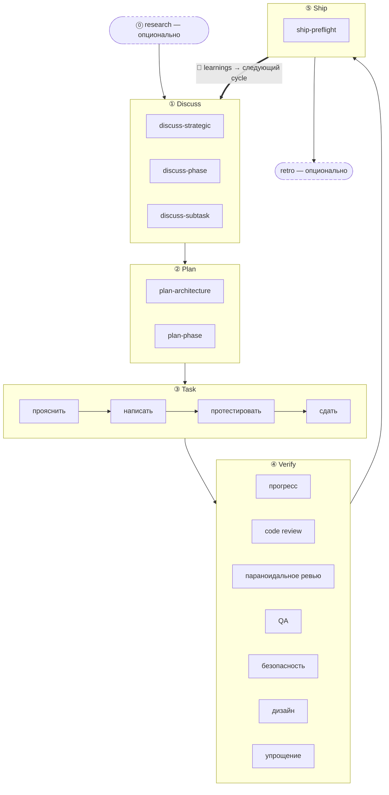

Ритм из 5 стадий — ядро методологии harnessed: каждая функциональность, исправление бага или рефакторинг проходят одни и те же пять стадий по порядку — **Discuss → Plan → Task → Verify → Ship** — и замыкаются автоматическим циклом **Learn**. Две сопутствующие стадии (Research, Retro) стоят по краям основного цикла.

## Стадии

| #   | Стадия       | Слеш-команда | Режим                                                        |
| --- | ------------ | ------------ | ------------------------------------------------------------ |
| 0   | **Research** | `/research`  | опционально — срабатывает при нехватке понимания             |
| 1   | **Discuss**  | `/discuss`   | обязательно                                                  |
| 2   | **Plan**     | `/plan`      | обязательно                                                  |
| 3   | **Task**     | `/task`      | обязательно                                                  |
| 4   | **Verify**   | `/verify`    | обязательно                                                  |
| 5   | **Ship**     | `/ship`      | явно — стадия релиза (запускает пользователь)                |
| —   | **Retro**    | `/retro`     | обязательно внутри `/auto`, опционально при отдельном вызове |

**Обучение автоматическое, а не стадия.** Каждый завершённый workflow дописывает свои сигналы failure/loop/reject в `.planning/LEARNINGS.md`; inject hook подмешивает релевантные learnings в следующую сессию. Это работает всегда и **не** зависит от опционального Retro.

### Research (опционально)

Многоисточниковое исследование через Tavily, Exa и ctx7. Срабатывает внутри `/auto`, когда вы отвечаете «нет» на проверку понимания, либо вызывается напрямую через `/research`. Результат пишется в `research-notes.md` внутри `.planning/`.

### Discuss — трёхслойные gate

`/discuss` независимо оценивает три gate и запускает только сработавшие:

- **Стратегический слой** (`discuss-strategic`): новая функциональность, новая веха, новое направление продукта → gstack `/office-hours` + `/plan-ceo-review`. Сохраняет `findings.md`.
- **Слой фазы** (`discuss-phase`): ≥2 нерешённых вопроса по реализации, неясный поток данных между модулями → GSD `gsd-discuss-phase`. Сохраняет `findings.md` + `knowledge.md`.
- **Слой подзадачи** (`discuss-subtask`): ключевой алгоритм / контракт API с ≥2 разными подходами → brainstorming из Superpowers. Эфемерно, ничего не сохраняет.

Каждый gate прозрачно сообщает и о срабатывании, и о пропуске.

### Plan — ревью архитектуры + сохранение

`/plan` выполняет два шага по порядку:

1. **Ревью архитектуры** (условно) — сложная архитектура запускает gstack `/plan-eng-review`, фиксируя дизайн до сохранения
2. **План фазы** — GSD `gsd-plan-phase` + planning-with-files формирует `task_plan.md` с точными путями, критериями приёмки и порядком зависимостей

### Task — цикл подзадач

`/task` выполняет четыре шага в строгом порядке для каждой подзадачи:

1. **Прояснить** — проверить спецификацию, вскрыть неоднозначности, сверить с `task_plan.md`
2. **Написать** — принципы karpathy: минимальное жизнеспособное изменение, точечные правки, без расширения объёма
3. **Протестировать** — TDD red → green → refactor в основной логике; опционально для CRUD и очевидных реализаций
4. **Сдать** — обёртка `ralph-loop` не пропускает дальше без дословного `COMPLETE`

### Verify — 7 условных подпроверок

`/verify` раздаёт подпроверки по тому, что изменилось. Всегда выполняются: `verify-progress` (UAT + синхронизация состояния), `verify-code-review` (параллельный multi-agent), `verify-simplify` (финальная зачистка). Условные: параноидальное ревью, QA, безопасность, дизайн, multispec.

### Ship — стадия релиза

`/ship` — пятая стадия, после Verify. Сначала запускается `harnessed release-preflight` (gate готовности к релизу только для чтения — `CHANGELOG [Unreleased]`/version/git-clean/tag-absent), затем PR и deploy делегируются gstack `/ship`. **Граница deploy — tag-ready**: эта стадия не делает push, не публикует и не создаёт тег — реальные `npm publish` и GitHub release выполняет CI `publish.yml` при push тега (с явным подтверждением). «PR ready ≠ release ready».

### Retro

gstack `/retro` фиксирует выводы по вехе, записи решений и неожиданные находки. Внутри `/auto` выполняется обязательно. Также может вызываться отдельно в конце любой вехи. (Это не то же самое, что всегда активный цикл Learn выше.)

## Схема потока



## `/auto` против отдельных команд стадий

`/auto` автоматически сцепляет основные стадии разработки (research условно → discuss → plan → task → verify → retro). **Ship запускается явно** — `/auto` не выпускает релиз сам; когда веха готова к нарезке версии, вы запускаете `/ship`. Отдельные команды стадий позволяют войти с любой точки:

```
/discuss "добавить rate limiter"       # только discuss
/plan "rate limiter"                   # только plan (предполагается, что discuss сделан)
/task "реализовать middleware"         # только task
/verify "функциональность rate limiter" # только verify
/ship                                  # только ship (release-preflight → tag-ready)
```

При переходе через _несколько_ фаз `harnessed advance` выводит следующую фазу из состояния на диске в `.planning/` и печатает команду для запуска — так driver loop может сцеплять несколько фаз без участия человека (`while harnessed advance --json; do : ; done`), останавливаясь на advance-gate, если более ранняя фаза не завершена. Подробности — в статье `harnessed advance` [Справочника CLI](../../reference/cli/).

Точечные вызовы подworkflow полностью минуют master:

```
/discuss-phase "..."        # только прояснение слоя фазы
/plan-architecture "..."    # только ревью архитектуры
/verify-paranoid "..."      # только проверка параноидального инженера
```

Архитектурные решения подробно описаны в [ADR 0030](https://github.com/easyinplay/harnessed/blob/main/docs/adr/0030-namespace-policy.md), 0031 и 0032 (решения по дизайну пространств имён).
