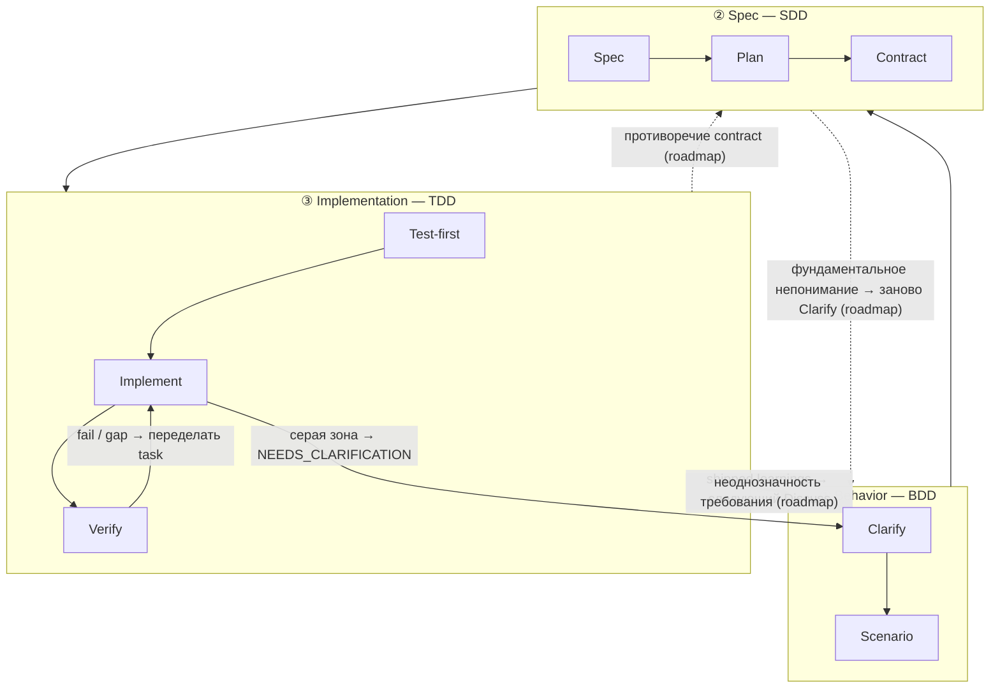

Трёхслойный стек — это теория harnessed о том, _почему_ ритм устроен именно так. Это инженерная реализация устоявшейся вложенности **BDD → SDD → TDD**: три вложенных цикла обратной связи, каждый отвечает на свой вопрос. Вклад harnessed — **вплетать** открытую экосистему в каждый цикл; а поскольку upstream-компоненты _частично пересекаются_, разрешать эти пересечения и есть работа оркестратора композиции.

## Три цикла

| Слой                 | Loop | На какой вопрос отвечает              | Из чего собран (с пересечениями)                                                                  |
| -------------------- | ---- | ------------------------------------- | ------------------------------------------------------------------------------------------------- |
| **① Behavior**       | BDD  | _Что_ строим и как понять, что готово | gstack `/office-hours` governance · GSD discuss · superpowers brainstorming → acceptance criteria |
| **② Spec**           | SDD  | _Как_ это устроено                    | GSD plan-phase → requirements / design / tasks · contracts (Spec Kit / ECC patterns)              |
| **③ Implementation** | TDD  | Оно и правда _работает_               | superpowers TDD red-green · subagent execution · GSD verify-work · ralph-loop completion          |

**Циклы — это вложенные линзы, а не фазы.** Cucumber популяризовал двойной цикл BDD снаружи + TDD внутри: падающий scenario открывает внешний цикл, и вы доводите его до зелёного несколькими внутренними циклами red-green TDD. Эпоха GenAI добавила посередине ещё одно кольцо — явное кольцо **spec** из SDD между Behavior и Implementation, потому что агентам нужен замороженный contract, чтобы исполнять. Так получается **triple-loop** выше.

## Разбор по узлам

Каждый цикл разбит на узлы, и каждый узел показывает, из каких открытых компонентов он собран.

### ① Behavior (BDD)

| Узел         | Роль                                                   | Из чего собран                                                   |
| ------------ | ------------------------------------------------------ | ---------------------------------------------------------------- |
| **Clarify**  | Зафиксировать, _что_ строим, и вскрыть неоднозначности | gstack `/office-hours` + GSD discuss + superpowers brainstorming |
| **Scenario** | Превратить намерение в acceptance criteria             | GSD phase success criteria                                       |

Внешний цикл остаётся открытым, пока не написаны acceptance criteria у scenario. Определение «готово» принимается здесь — раньше любой структуры и кода.

### ② Spec (SDD)

| Узел         | Роль                     | Из чего собран                                                   |
| ------------ | ------------------------ | ---------------------------------------------------------------- |
| **Spec**     | requirements + design    | GSD plan-phase + тройка Spec Kit (requirements / design / tasks) |
| **Plan**     | tasks + DAG зависимостей | GSD `PLAN.md` + декомпозиция ECC                                 |
| **Contract** | интерфейс заморожен      | соглашения по contract                                           |

Среднее кольцо превращает «что» в исполняемую структуру. Условие выхода — **замороженный contract**, интерфейс, против которого цикл реализации будет писать тесты.

### ③ Implementation (TDD)

| Узел           | Роль                            | Из чего собран                          |
| -------------- | ------------------------------- | --------------------------------------- |
| **Test-first** | падающий тест (red gate)        | superpowers TDD                         |
| **Implement**  | довести до зелёного             | subagent execution                      |
| **Verify**     | refactor + завершение по задаче | GSD verify-work + ralph-loop completion |

Внутреннее кольцо — классический цикл red → green → refactor, по одному проходу на задачу, пока не выполнены все contract.

### Сквозные

Две области находятся вне любого отдельного цикла:

| Область    | Роль                           | Из чего собран                       |
| ---------- | ------------------------------ | ------------------------------------ |
| **Review** | gate качества и безопасности   | gstack `/review` + `/cso`            |
| **Ship**   | готовность к релизу + поставка | `release-preflight` + gstack `/ship` |

Кроме того, две **discipline** проходят через _каждый_ слой:

- **karpathy principles** — _how_ to code: минимальное жизнеспособное изменение, точечные правки, simplicity first.
- **mattpocock moves** — инструменты по запросу (`/zoom-out`, `/diagnose`, `/grill-with-docs`), вызываются под ситуацию.

## Возвраты (GoBack)

По умолчанию поток идёт снаружи внутрь. **harnessed — это реализация такого triple-loop с линейным ритмом, а полный маршрутизированный граф — путь его эволюции.** Циклы остаются циклами обратной связи, но сегодня в продакшене лишь часть возвратных рёбер; более тонкая маршрутизация по кольцам — в roadmap. На схеме ниже выпущенные рёбра нарисованы сплошной линией, рёбра roadmap — пунктиром с пометкой `(roadmap)`.

### Выпущено сегодня

В текущем линейном ритме живут три возвратных ребра:

- **Verify → Task** — провалившаяся проверка или незакрытый gap возвращает эту работу в цикл реализации.
- **Серая зона → прояснение** — столкнувшись с неоднозначностью, subagent возвращает `STATUS: NEEDS_CLARIFICATION`; запуск приостанавливается, вопрос проясняется, работа продолжается.
- **Learnings → следующий Discuss** — каждый выпущенный цикл дописывает сигналы failure/loop/reject, которые попадают в следующий цикл Behavior (всегда активный learn loop).

### Roadmap (ещё не выпущено)

Более тонкие структурированные возвраты — маршрутизировать gap _напрямую_ в то кольцо, у которого есть ответ, — это направление развития, а не текущее поведение:

- **Противоречие contract** (реализация не может выполнить замороженный интерфейс) → вернуть в **Spec**.
- **Неоднозначность требования** (contract сам по себе согласован, но behavior недоопределён) → вернуть в **Behavior**.
- **Фундаментальное непонимание** (вся структура нацелена на неверный результат) → заново открыть **Clarify** в Behavior.

Сегодня эти gap всплывают через три выпущенных ребра выше (обычно Verify → Task плюс ручное прояснение), а не через автоматическую маршрутизацию по кольцам. Ближайшая ценность оркестратора композиции — держать линейный ритм согласованным, когда разные upstream-компоненты владеют разными кольцами; маршрутизированный граф — следующий шаг.

## Компоненты пересекаются — и в этом суть

Один и тот же upstream-инструмент появляется больше чем в одном цикле. Это пересечение не избыточность, а интерфейс, который оркестратор композиции обязан разрешить:

- **GSD** — несущая ось: проходит через все три кольца (discuss → plan → verify).
- **gstack** охватывает **Behavior + Review**.
- **superpowers** охватывает **Behavior** (brainstorm) + **Implementation** (TDD).

Без разрешения эти пересечения либо срабатывают дважды, либо противоречат друг другу. Слой композиции маршрутизирует каждое кольцо к нужному upstream-инструменту и снимает стыки.

## Теория vs. runtime

Трёхслойный стек — это _теория_. [Ритм из 5 стадий](/ru/docs/concepts/five-stage-cadence/) — то, как эта теория работает в командной строке:

| Loop (теория)    | Стадия runtime                    |
| ---------------- | --------------------------------- |
| ① Behavior       | **Discuss**                       |
| ② Spec           | **Plan**                          |
| ③ Implementation | **Build** (Task)                  |
| Сквозные         | **Verify + Ship** (evidence gate) |

О том, _как_ upstream-инструменты сшиваются без форка, читайте в [Композиции вместо vendoring](/ru/docs/concepts/composition/).
