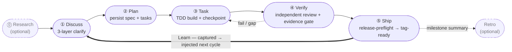

harnessed — это пакетный менеджер и оркестратор композиции для AI-харнессов разработки. Он устанавливает, собирает и запускает workflow, объединяющие Skills, серверы MCP и harness-паки через типизированный манифест — без vendoring исходников upstream.

Если вы работаете в Claude Code, harnessed одной командой связывает лучшие open source компоненты — ECC, Superpowers, GSD, gstack — в единый исполняемый workflow.

Рабочий цикл — пять стадий, замыкаемых всегда активным циклом Learn:

## С чего начать

- **[Установка](/ru/docs/getting-started/installation/)** — установите harnessed и выполните setup за 30 секунд
- **[Быстрый старт](/ru/docs/getting-started/quickstart/)** — от установки до первого workflow за 60 секунд
- **[Концепция композиции](/ru/docs/concepts/composition/)** — как harnessed собирает upstream-инструменты, не форкая их
- **[Справочник workflow](/ru/docs/reference/workflows/)** — все 28 составных workflow текущего релиза

## Чем harnessed отличается

В основе каждого workflow лежат три принципа:

**Композиция вместо vendoring.** Каждый harness-пак поставляется с манифестом. harnessed читает его, проверяет совместимость и сшивает upstream-инструменты в runtime. Вы всегда запускаете официальный upstream — никогда устаревший форк.

**Встроенный ритм из 5 стадий.** Discuss → Plan → Task → Verify → Ship, с опциональными Research и Retro, плюс автоматический цикл обучения. Или запустите `/auto` и прогоните весь конвейер из 6 стадий (research → retro; Ship запускается явно) одной командой.

**Методология dogfood-first.** Каждый workflow проверяется собственным определением — та же дисциплина, по которой harnessed выпускает сам себя.

Полное описание высокого уровня — в [README](https://github.com/easyinplay/harnessed#readme).
