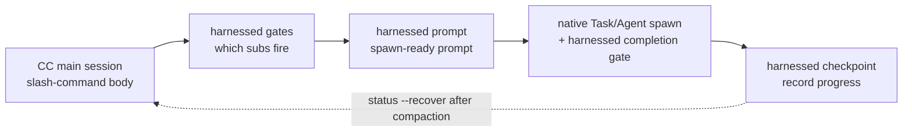

> **Модель исполнения v4.0.** harnessed — это _orchestration brain + библиотека промптов_, а не движок исполнения. Тело слеш-команды (сгенерированное `harnessed setup`) управляет **spawn CC-native subagent** через три быстрых чистых CLI — `harnessed gates` (какие подworkflow срабатывают), `harnessed prompt` (готовый к spawn промпт для подworkflow) и `harnessed checkpoint` (запись прогресса). Сам spawn, Agent Teams и круги уточнений выполняет главная сессия Claude Code нативными инструментами. `harnessed run` оставлен только для CI/headless.

Как три CLI оркестрации управляют CC-native spawn:



## `harnessed` (панель you-are-here)

Запуск `harnessed` **без аргументов** печатает панель you-are-here — самый быстрый способ снова сориентироваться внутри активного workflow (аналог `/comet` у comet, появился в v8.0).

```bash
harnessed          # человекочитаемая панель you-are-here + следующий шаг
harnessed --json   # машиночитаемый структурированный объект
```

Она автоматически определяет активный workflow текущего репозитория и печатает текущую фазу, статус каждого подworkflow и однострочный детерминированный контракт `NEXT: auto | manual | done` вместе с подсказкой запуска (например, `→ run: harnessed prompt <sub>`). Если активного workflow нет, печатается вводная подсказка со ссылкой на `harnessed setup`.

**Только чтение** — не порождает процессы, не меняет состояние/git/remote и всегда завершается с `0`. Панель отдаёт только голый `harnessed` (или `harnessed --json`, опционально с `--lang`); любая подкоманда, `--help`, `--version` или неизвестное слово проваливаются в обычный разбор команд (так что `harnessed bogus` по-прежнему ошибка).

Поля `--json`: `active`, `phase`, `status`, `started_at`, `next`, `sub`, `hint`, `sub_progress`.

---

## `harnessed setup`

Разовый онбординг — устанавливает workflow skills и базовые манифесты в `~/.claude/`.

```bash
harnessed setup [опции]
```

**Что делает:**

1. Сканирует `workflows/<name>/SKILL.md` и копирует каждый в `~/.claude/skills/<name>/`
2. Обрабатывает `manifests/tools/*.yaml` и `manifests/skill-packs/*.yaml`
3. Записывает `CLAUDE_CODE_EXPERIMENTAL_AGENT_TEAMS=1` в `~/.claude/settings.json`
4. Определяет локаль ОС и записывает `env.HARNESSED_USER_LANG` (zh-* → `zh-Hans`, остальное → `en`)

**Флаги:**

| Флаг                 | Описание                                                                        |
| -------------------- | ------------------------------------------------------------------------------- |
| `--user-lang <code>` | Переопределяет определённую локаль. Принимает `en`, `zh-Hans`, `zh-CN`, `zh-TW` |
| `--dry-run`          | Только предпросмотр — печатает, что было бы записано, диск не меняется          |

**Коды выхода:** `0` = успех, `1` = ошибка файловой системы, `2` = не найдено workflow с SKILL.md.

---

## `harnessed install <pack>`

Устанавливает harness-пак по имени или пути.

```bash
harnessed install <pack>
```

Разрешает манифест пака, проверяет его по схеме и выполняет каждый шаг `install` по порядку. Сегодня поддерживается bootstrap из локального пути и git URL; обнаружение паков в npm registry запланировано.

---

## `harnessed install-base`

Устанавливает весь базовый профиль за один заход — каждый манифест из `manifests/tools/*.yaml` и `manifests/skill-packs/*.yaml` в отсортированном порядке. Это отдельная подкоманда (а не флаг `--base` у `install`), чтобы не конфликтовать с gate для одиночного пака.

```bash
harnessed install-base                   # применить сразу (по умолчанию)
harnessed install-base --dry-run         # только предпросмотр — диск не меняется
harnessed install-base --non-interactive # пропустить все запросы (CI / скрипты)
```

Печатает статистику: `installed / already-installed / skipped (user-aborted) / failed`.

**Коды выхода:** `0` = установлен хотя бы один и без сбоев · `1` = один или более сбоев · `2` = ничего не установлено (всё уже стояло или прервано).

---

## `harnessed research`

Запускает workflow research — подмаршрутизация по категории поиска → spawn subagent → дословный `COMPLETE`. Тонкий псевдоним `workflows/research/workflow.yaml`.

```bash
harnessed research --query "compare Postgres vs SQLite for this use case"
harnessed research --query "..." --dry-run          # предпросмотр разрешённого workflow + gate context (JSON)
harnessed research --query "..." --model sonnet      # model subagent: haiku | sonnet | opus
harnessed research --query "..." --non-interactive   # пропустить все запросы (CI / скрипты)
```

| Флаг                | Описание                                                                              |
| ------------------- | ------------------------------------------------------------------------------------- |
| `--query <text>`    | промпт research (**обязателен**)                                                      |
| `--dry-run`         | Только предпросмотр — печатает `{ workflow, yamlPath, gateContext }`, spawn не делает |
| `--model <model>`   | model subagent: `haiku` \| `sonnet` \| `opus`                                         |
| `--non-interactive` | Пропустить все запросы (CI / скрипты)                                                 |

**Коды выхода:** `0` = workflow завершён · `1` = сбой в runtime workflow · `2` = ошибка использования (нет `--query` или не найден yaml workflow).

---

## `harnessed manifest-add <upstream>`

Добавляет новый upstream-адаптер после **gate из пяти вопросов EE-5** — пять интерактивных вопросов заставляют принять обдуманное решение до включения нового upstream в композицию (это переиспользуемая surface, имя подходит, есть ли пересечение с существующими компонентами, вы вносите концепцию или чужую продуктовую идентичность, поймёт ли пользователь, не знающий upstream). Все пять требуют непустого ответа.

```bash
harnessed manifest-add https://github.com/owner/repo.git
harnessed manifest-add <upstream> --category tools    # skill-packs (по умолчанию) | tools
harnessed manifest-add <upstream> --name myadapter    # по умолчанию basename от <upstream>
harnessed manifest-add <upstream> --dry-run           # предпросмотр — печатает ответы, не пишет
harnessed manifest-add <upstream> --non-interactive   # CI: dry-run только с WARN, ничего не пишет
```

При успехе записывает ответы в `manifests/<category>/<name>.ee5-answers.json`.

| Флаг                | Описание                                                      |
| ------------------- | ------------------------------------------------------------- |
| `--category <cat>`  | Категория манифеста: `skill-packs` (по умолчанию) \| `tools`  |
| `--name <name>`     | Короткое имя адаптера (по умолчанию basename от `<upstream>`) |
| `--dry-run`         | Только предпросмотр — печатает JSON ответов, не пишет         |
| `--non-interactive` | CI / скрипты — только WARN, ничего не пишет                   |

**Коды выхода:** `0` = gate пройден (записано или предпросмотр) · `1` = есть пустой ответ.

---

## `harnessed uninstall [pack]`

Удаляет установленный пак; без аргументов удаляет файлы, установленные самим harnessed.

```bash
harnessed uninstall <pack>   # удалить один пак (выполняет шаги uninstall из его манифеста)
harnessed uninstall          # удалить из ~/.claude/ собственные skills/manifests harnessed
```

Для трёх способов установки, кладущих skill на диск (`npm-cli`, `git-clone-with-setup`, `npx-skill-installer`), uninstall выполняет **объявленный в манифесте контракт `spec.uninstall`**: сначала запускает объявленный `cmd` (fail-soft — ненулевой выход или отсутствие shell лишь предупреждают и не прерывают), затем идемпотентно force-rm для каждой записи `cleanup_paths`, и всё это **ограничено `$HOME`** (пути вне поддерева home дают hard-fail). Способы, оперирующие settings/plugin/MCP (`cc-hook-add`, `cc-plugin-marketplace`, `mcp-*-add`), сохраняют собственные деинсталляторы. Единое удаление без аргументов откатывает `harnessed setup`.

---

## CLI оркестрации (v4.0)

Эти три чистых CLI — то, чем сгенерированное тело слеш-команды управляет CC-native spawn. Они только печатают JSON и сами не порождают процессы — оркестрирует главная сессия.

### `harnessed gates <master>`

Определяет, какие подworkflow срабатывают для конкретного master orchestrator (`discuss` / `plan` / `task` / `verify` / `auto`) и спецификации задачи.

```bash
harnessed gates plan --task "add OAuth login" --skip-sub discuss
# → JSON: { fire: [{ sub, order, mode }], skip: [...], parallelism: { escalate_to_teams } }
```

`fire` перечисляет подworkflow, прошедшие gate решений, в порядке выполнения; `parallelism.escalate_to_teams` показывает, когда переходить с последовательного spawn subagent на CC-native Agent Teams.

### `harnessed prompt <sub>`

Выдаёт готовый к spawn промпт для одного подworkflow — тело role-prompt + чек-лист + применённые disciplines.

```bash
harnessed prompt plan-phase --task "add OAuth login" --json
# → JSON: { prompt, max_iterations, model }
```

Главная сессия передаёт этот `prompt` в нативный spawn `Task` (снаружи — плагин `harnessed checkpoint complete`); `max_iterations` / `model` берутся прямо из значений workflow по умолчанию.

### `harnessed checkpoint`

Записывает прогресс подworkflow в checkpoint store harnessed. Главная сессия вызывает её после завершения (и после сбоя) каждого подworkflow, чтобы после compaction можно было восстановиться через `harnessed status --recover`.

```bash
harnessed checkpoint start <master> --plan <json>   # инициализировать ledger прогресса
harnessed checkpoint complete <sub>                 # отметить подworkflow завершённым (с evidence guard)
harnessed checkpoint fail <sub>                      # записать сбойный подworkflow
```

### `harnessed run`

**Только CI / headless.** Порождает весь workflow внутри процесса через SDK — когда нет интерактивной главной сессии, которая могла бы оркестрировать. Путь по умолчанию в v4.0 — оркестрация gates → prompt → checkpoint выше; `run` — запасной вариант.

```bash
harnessed run <master> --task "<spec>"
```

---

## `harnessed doctor`

Диагностирует локальную установку harnessed + Claude Code — отчёт из 23 проверок (Node, scope и серверы MCP (tavily/exa), jq, bun, тип bash в Windows, origin URL, префикс gstack, устаревшие manifest, бюджет токенов, env Agent Teams, planning-with-files, mattpocock-skills, CodeGraph, конфликт с GateGuard, целостность skill воркфлоу, update, канал установки, устаревшие hook, ECC, парность инъекции на каждом ходе, свежесть установки плагинов, выключатель абляции `HARNESSED_OFF`). `HARNESSED_OFF=1` превращает все постоянно активные hook harnessed в no-op (чистая контрольная группа для A/B без удаления); пока переменная задана, doctor выводит предупреждение.

```bash
harnessed doctor
harnessed doctor --json   # машиночитаемый отчёт
```

---

## `harnessed update`

Держит harnessed (и, по желанию, upstream-плагины) в актуальном состоянии. Проверка update в doctor тоже пассивно подсказывает «update available X→Y». `update` двухканальный — сам определяет, как установлен harnessed, и идёт соответствующим путём.

```bash
harnessed update                      # самообновление + верхний раздел CHANGELOG + напоминание о перезапуске
harnessed update --check              # только сообщает версии installed/latest, не ставит
harnessed update --dry-run            # предпросмотр действий обновления — ничего не пишет
harnessed update --upstreams          # дополнительно перезапускает базовые манифесты, обновляя upstream-плагины
harnessed update --migration-report   # инвентаризация устаревшего состояния только для чтения (ничего не удаляет)
harnessed update --rollback [version] # только скомпилированный бинарник — восстанавливает версию из bin-backup/
```

**Канал npm** — выполняет `npm i -g harnessed@latest`, печатает верхний раздел CHANGELOG и напоминает перезапустить Claude Code.

**Канал скомпилированного бинарника** (однострочный установщик) — скачивает артефакт платформы из GitHub releases, проверяет контрольную сумму `.sha256` **и её подпись ed25519** (`<asset>.sha256.sig`; с v4.32.19 это контракт релиза — и отсутствие подписи, и неудачная проверка являются hard error, текущий бинарник остаётся нетронутым), после чего атомарно подменяет бинарник; заменённая версия кладётся в `bin-backup/` для отката.

**`--rollback [version]`** (только скомпилированный бинарник) — атомарно восстанавливает прежнюю версию из `bin-backup/`: по умолчанию самую свежую сохранённую либо указанную (неизвестная версия даёт ошибку со списком доступных). Текущий бинарник сначала кладётся обратно в bin-backup, поэтому сам откат обратим. В режиме установки через npm команда отказывает и направляет к `npm i -g harnessed@<version>`.

Доступ к сети fail-soft — при недоступности npm ошибок не будет.

---

## `harnessed release-preflight`

Gate стадии Ship. **Только для чтения**: проверка готовности к релизу, завершается с 1, если репозиторий не готов. Ничего не меняет (реальный publish делает CI при push тега).

```bash
harnessed release-preflight
```

Что проверяется: в `CHANGELOG.md` непустой `[Unreleased]` (или раздел `[<version>]`), в `package.json` валидная version, рабочее дерево чистое (изменения в tracked-файлах), тега `v<version>` ещё нет.

---

## `harnessed compact`

Суммирует и вытесняет решённые записи ledger подпрогресса, освобождая контекст для длинных задач. **G6-safe**: записи с `fail_count > 0` не вытесняются никогда, сигналы break-loop сохраняются.

```bash
harnessed compact                                  # ручной compaction
harnessed checkpoint complete <sub> --tokens <n>   # срабатывает само, когда число токенов пересекает порог
```

---

## `harnessed workflows`

Перечисляет активные workflow — по одному на репозиторий (harnessed раскладывает состояние checkpoint по repo root, поэтому параллельные проекты не затирают друг друга).

```bash
harnessed workflows
```

---

## `harnessed learn`

Дописывает текстовый learning в `.planning/LEARNINGS.md` текущего репозитория. Завершённые workflow также автоматически дописывают свои сигналы failure/loop/reject; inject hook подмешивает релевантные learnings в следующую сессию.

```bash
harnessed learn "не перезапускать миграцию вслепую — сначала нужен чистый снимок"
```

---

## `harnessed retro`

Сбрасывает напоминание о ритме retro. `/retro` — это skill из gstack, и harnessed его не видит, поэтому после запуска вызовите `harnessed retro --done`, чтобы обнулить счётчик фаз по репозиторию и убрать напоминание `RETRO-DUE`.

```bash
harnessed retro --done   # сбросить счётчик фаз + убрать напоминание RETRO-DUE
```

Без `--done` команда ничего не делает и завершается с `1` (`nothing to do — pass --done after running /retro`).

---

## `harnessed next`

Печатает детерминированный контракт следующего шага — только чтение, состояние не меняется. Два слоя:

1. **Workflow активен** (остались необработанные sub) → используется внутренний контракт workflow `NEXT: auto <sub> | manual <sub> | done` (exit `0`, без изменений).
2. **Все sub разрешены** → проваливается в **горизонтальное продолжение между unit** (v4.10): следующая work unit (следующая phase / task) выводится из состояния на диске в `.planning/`, печатается `NEXT: advance | blocked | done`.

```bash
harnessed next
# активен:      NEXT: auto <sub>
# fall-through: NEXT: advance
#               UNIT: phase 16 'rate limiter'
#               HINT: run /auto (or harnessed advance) to start it — 2 phases remain
```

**Коды выхода между unit:** `0` = advance (есть следующая unit) · `2` = done (все phase завершены) · `10` = blocked (нужно решение человека).

---

## `harnessed advance`

Переходит к следующей work unit, выведенной из состояния на диске в `.planning/` — **только печатает (print-only)**. Печатает следующую phase/task и команду для запуска (например, `→ run /auto "..."`), но **не** инициализирует состояние и **не** порождает процессы; напечатанную команду запускает сама главная сессия, что сохраняет круги уточнений и Agent Teams.

```bash
harnessed advance
# ADVANCE: advance
# UNIT: phase 16 'rate limiter'
# → run /auto "phase 16 'rate limiter'"
```

**advance-gate.** `advance` отказывается перепрыгивать более раннюю _незавершённую_ phase (gate «comet»): если выведенная следующая phase упорядочена раньше указателя workflow либо сбойный sub блокирует ledger, команда завершается ненулевым кодом и **не** печатает команду запуска. Переопределяйте флагом `--force` — он оставит в выводе аудиторскую пометку и продолжит.

```bash
harnessed advance --force   # переопределить gate (записывает аудиторскую пометку)
```

**Driver loop.** `--json` выдаёт машиночитаемый `{ next, unit, hint }`, позволяя shell-циклу сцеплять несколько phase без участия человека — цикл останавливается на любом ненулевом коде (done / blocked / gate-reject):

```bash
while harnessed advance --json; do : ; done
```

**Коды выхода:** `0` = advance · `2` = done (все phase завершены) · `10` = blocked · `11` = gate-reject (более ранняя phase не завершена; используйте `--force`) · `1` = error.

**Дизайн — выводить с диска, не держать очередь.** «Следующее» всегда выводится с диска, никогда из сохранённой очереди. Phase считается завершённой ⇔ у каждого `NN-*-PLAN.md` есть парный `NN-*-SUMMARY.md` (выводится из артефактов, поэтому выпущенные phase пропускаются естественным образом). Вставьте phase в середину (правкой `ROADMAP.md` или добавлением `phases/16.1-*/`) — следующий `advance` подхватит её сам. Продолжение на уровне phase — уже выпущенный минимум; разрешение на уровне task готово в resolver, но ещё не подключено к CLI.

---

## `harnessed reject <sub>`

Помечает подworkflow как отклонённый пользователем — терминальное состояние, отличное от `failed` (который запускает логику повторов break-loop).

```bash
harnessed reject <sub>
```

---

## `harnessed resume`

Продолжает упавший конвейер `/auto` с последней успешной стадии.

```bash
harnessed resume
```

Читает `.planning/STATE.md`, находит последнюю успешную стадию и заново входит в конвейер с неё. Полезно, когда стадия падает на середине.

---

## `harnessed status`

Показывает состояние конвейера для текущего рабочего каталога.

```bash
harnessed status
```

Читает `.planning/STATE.md` и печатает текущую стадию, последнюю завершённую стадию и все блокеры.

```bash
harnessed status --recover
```

`--recover` читает ledger прогресса из checkpoint (а не STATE.md) и печатает структурированное представление для восстановления после compaction — завершённые / ожидающие / пропущенные подworkflow, следующую команду и любые предупреждения evidence-drift. Используйте, чтобы сориентироваться после compaction контекста.

---

## `harnessed audit`

Аудит самосогласованности второй линии для манифестов в `manifests/tools/` и `manifests/skill-packs/`. Это проход эшелонированной защиты, ловящий schema drift, значения-заглушки и подмены, которые не ловит схема Ajv.

```bash
harnessed audit                 # слои манифеста + runtime
harnessed audit --skip-runtime  # только слой манифеста (офлайн / без инициализации)
```

**Слой манифеста:** форма URL репозитория (`https://…​.git`), значения-заглушки в `signed_by` (`unsigned` / `todo` / `tbd` / …) и подвижный `git_ref` (`HEAD` / `main` / `master` — это _error_: нужно закрепление на SHA или теге). **Слой runtime** (пропускается через `--skip-runtime`): подмена origin-URL, shell-инъекции в `install.cmd` + перекрёстная проверка npm-пакетов, gate происхождения. Печатает отчёт `✓ / ⚠ / ✗` по каждому манифесту и счётчик находок.

**Коды выхода:** `0` = нет находок уровня error (warning допустимы) · `1` = одна или несколько ошибок.

> **`audit` и `audit-log`** — `audit` _проверяет целостность файлов манифеста_; `audit-log` (ниже) _запрашивает журнал_ уже произошедших маршрутизаций и установок. Это разные задачи.

---

## `harnessed audit-log`

Просмотр журнала аудита маршрутизации/установок — какие gate срабатывали, какие паки ставились и когда.

```bash
harnessed audit-log                    # человекочитаемая таблица из 5 колонок
harnessed audit-log --filter <pack>    # фильтр по паку/событию
harnessed audit-log --json             # полная запись из 12 полей
```

---

## `harnessed backup list`

Перечисляет каждый снимок резервной копии в `.harnessed-backup/` — по строке на снимок, с меткой времени, исходным манифестом и числом файлов. Читается из `metadata.json` каждого снимка.

```bash
harnessed backup list
```

Парная команда к `harnessed gc` (удаляет старые снимки) и `harnessed rollback` (восстанавливает из выбранной метки времени).

---

## `harnessed gc`

Освобождает место от устаревших резервных копий, оставшихся после install/uninstall/rollback.

```bash
harnessed gc
```

---

## `harnessed rollback`

Восстанавливает предыдущее состояние из самой свежей резервной копии (с сохранением CRLF/LF) — отменяет последнее изменение install/setup.

```bash
harnessed rollback
```

---

## `harnessed check-docs`

Gate документационной дисциплины для `.planning/` — лимит строк дайджеста STATE.md (по умолчанию 100), ритм архивирования и указатели в ROADMAP вместо встроенного повествования. Код выхода `2` при блокирующем нарушении, `1` — если есть только рекомендации.

```bash
harnessed check-docs                       # отчёт для человека
harnessed check-docs --json                # машиночитаемый вывод
harnessed check-docs --max-state-lines 120 # поднять лимит STATE.md
harnessed check-docs --hook                # режим PreToolUse: проверяет только `git commit`
```

---

## `harnessed facts <master>`

Показывает gate facts, которые master действительно использует: детерминированные заполнены, требующие суждения оставлены `null` с однострочной подсказкой. Заполните остальное и передайте файл в `harnessed gates --context-file`.

```bash
harnessed facts verify --out facts.json
harnessed gates verify --context-file facts.json
```

---

## `harnessed eval`

Запускает набор регрессионных trap для поведения оркестратора: записанные сценарии детерминированно воспроизводятся против golden. Это gate в CI.

```bash
harnessed eval                     # запустить ./fixtures/eval
harnessed eval --filter <substr>   # только сценарии, чьё имя или каталог совпадает
harnessed eval --coverage          # матрица покрытия триггеров judgments
harnessed eval --update-golden     # перезаписать golden — проверьте выведенный diff
harnessed eval record              # превратить траекторию реального запуска в воспроизводимый сценарий
```

---

## `harnessed exempt-gateguard`

Сохраняет `GATEGUARD_EXEMPT_GLOBS=".planning/**"` в env настроек harness (сначала резервная копия, атомарная запись). Устраняет конфликт двух охранников — hook GateGuard из ECC и evidence guard harnessed; проверка GateGuard в doctor указывает сюда.

```bash
harnessed exempt-gateguard
```

---

## Точки входа hook (внутренние)

`harnessed inject-state` и `harnessed stop-hook` запускаются hook, которые регистрирует `harnessed setup`, а не вручную. `inject-state` выводит блок `<workflow-state>` на каждом ходе (`--invalidate` сбрасывает кэш контекста сессии при SessionStart); `stop-hook` в конце хода автоматически восстанавливает повреждённый вывод вызова инструмента. Скомпилированные бинарники регистрируют эти подкоманды напрямую, поэтому hook не нужен Node на хосте.

---

## `harnessed --version`

```bash
harnessed --version
# → 4.43.0
```

---

## `harnessed --help`

```bash
harnessed --help
harnessed <command> --help   # справка по конкретной команде
```

---

## Глобальные флаги

| Флаг        | Описание                   |
| ----------- | -------------------------- |
| `--version` | Печатает версию и выходит  |
| `--help`    | Печатает справку и выходит |

Исходники — в `src/cli.ts` и `src/cli/` в [репозитории harnessed](https://github.com/easyinplay/harnessed/tree/main/src/cli).
