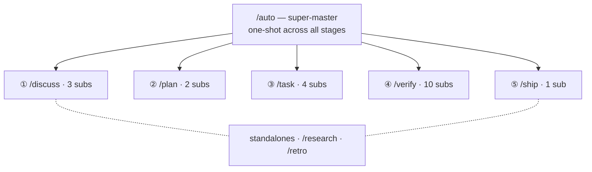

harnessed поставляет 28 workflow, разложенных по пространствам имён: один super-master, пять стадийных master (Discuss · Plan · Task · Verify · Ship), 20 подworkflow и два отдельных workflow.

28 workflow — один super-master разворачивается в пять стадийных master с их подworkflow, плюс два отдельных workflow:

## Super-master

| Команда | Область      | Capability                                                                                                                                                                                                                                                                    |
| ------- | ------------ | ----------------------------------------------------------------------------------------------------------------------------------------------------------------------------------------------------------------------------------------------------------------------------- |
| `/auto` | super-master | Весь конвейер из 6 стадий: research (условно) → discuss → plan → task → verify → retro (обязательно). Одношаговая AI-оценка сложности + проверка понимания. Флаг `--staged` включает UX со стадийными gate. При сбое останавливается сразу, продолжение — `harnessed resume`. |

## Отдельные workflow

| Команда     | Область   | Capability                                                                                                                                    |
| ----------- | --------- | --------------------------------------------------------------------------------------------------------------------------------------------- |
| `/research` | отдельный | Многоисточниковое исследование через Tavily, Exa MCP и ctx7. Внутри `/auto` срабатывает как стадия 0 либо вызывается напрямую перед discuss.  |
| `/retro`    | отдельный | Итоговое резюме вехи через gstack `/retro`. Записывает выводы, решения и неожиданные находки в `RETROSPECTIVE.md`. Обязателен внутри `/auto`. |

## Стадия Discuss

| Команда              | Область          | Capability                                                                                                                                        |
| -------------------- | ---------------- | ------------------------------------------------------------------------------------------------------------------------------------------------- |
| `/discuss`           | стадийный master | Параллельно оценивает три gate обсуждения и запускает только сработавшие.                                                                         |
| `/discuss-strategic` | подworkflow      | Стратегический слой — новая функциональность / веха / направление продукта. gstack `/office-hours` + `/plan-ceo-review`. Сохраняет `findings.md`. |
| `/discuss-phase`     | подworkflow      | Слой фазы — ≥2 нерешённых вопроса, прояснение серых зон. GSD `gsd-discuss-phase`. Сохраняет `findings.md` + `knowledge.md`.                       |
| `/discuss-subtask`   | подworkflow      | Слой подзадачи — ≥2 подхода / ключевой алгоритм / контракт API. Superpowers brainstorming + `/grill-with-docs`. Эфемерно, без сохранения.         |

## Стадия Plan

| Команда              | Область          | Capability                                                                                                              |
| -------------------- | ---------------- | ----------------------------------------------------------------------------------------------------------------------- |
| `/plan`              | стадийный master | Последовательно: ревью архитектуры (условно) → план фазы (всегда).                                                      |
| `/plan-architecture` | подworkflow      | Слой архитектуры — gate governance для сложных архитектур. gstack `/plan-eng-review`. Фиксирует дизайн до планирования. |
| `/plan-phase`        | подworkflow      | План фазы — GSD `gsd-plan-phase` + planning-with-files. Сохраняет `task_plan.md` + `progress.md`.                       |

## Стадия Task

| Команда         | Область          | Capability                                                                                                                                           |
| --------------- | ---------------- | ---------------------------------------------------------------------------------------------------------------------------------------------------- |
| `/task`         | стадийный master | Последовательный цикл на подзадачу: прояснить → написать → протестировать → сдать.                                                                   |
| `/task-clarify` | подworkflow      | Gate прояснения на старте. Superpowers brainstorming + `/grill-with-docs` условно.                                                                   |
| `/task-code`    | подworkflow      | Пишет код по 4 принципам karpathy. `/zoom-out` / `/improve-codebase-architecture` / `/diagnose` условно. Синхронизация `progress.md` между сессиями. |
| `/task-test`    | подworkflow      | TDD red → green → refactor. Superpowers TDD + `/diagnose` условно. Обязателен для основной логики.                                                   |
| `/task-deliver` | подworkflow      | Обёртка SDK `ralph-loop`. Работает до дословного `COMPLETE`. Agent Teams условно при full-stack координации.                                         |

## Стадия Verify

| Команда                  | Область          | Capability                                                                                                                                                      |
| ------------------------ | ---------------- | --------------------------------------------------------------------------------------------------------------------------------------------------------------- |
| `/verify`                | стадийный master | Раздаёт до 7 подпроверок по флагам сценария.                                                                                                                    |
| `/verify-progress`       | подworkflow      | Всегда выполняется первой. Проверка критериев приёмки UAT + синхронизация состояния GSD.                                                                        |
| `/verify-code-review`    | подworkflow      | Параллельный fan-out нескольких subagent. Находки высокой достоверности.                                                                                        |
| `/verify-paranoid`       | подworkflow      | Ревью параноидального staff engineer через gstack `/review`. Обязательно для критичных модулей перед PR.                                                        |
| `/verify-qa`             | подworkflow      | Сквозной QA через gstack `/qa` + playwright-cli / `@playwright/test`. Срабатывает при изменениях UI.                                                            |
| `/verify-security`       | подworkflow      | Проверка OWASP / аутентификации / секретов через gstack `/cso`. Срабатывает, когда затронуты аутентификация или секреты.                                        |
| `/verify-design`         | подworkflow      | Согласованность дизайн-системы через gstack `/design-review` + ui-ux-pro-max + design-taste-frontend. Срабатывает при изменениях дизайна.                       |
| `/verify-eval-review`    | подworkflow      | Аудит покрытия eval для AI-фазы через GSD `/gsd-eval-review`. Срабатывает, когда фаза включает шаги AI/LLM (парный к gsd-ai-integration-phase на стороне plan). |
| `/verify-validate-phase` | подworkflow      | Дозаполнение покрытия «требование→тест» по Найквисту через GSD `/gsd-validate-phase`. Срабатывает, когда нужен аудит покрытия.                                  |
| `/verify-simplify`       | подworkflow      | Финальное упрощение через `code-simplifier`. Всегда выполняется последней.                                                                                      |
| `/verify-multispec`      | подworkflow      | Agent Team из четырёх специалистов, Pattern C — взаимный перекрёстный опрос через SendMessage. Путь эскалации для критичных релизов и крупных рефакторинг-PR.   |

## Ship (стадия ⑤)

| Команда           | Область          | Capability                                                                                                                                                                                        |
| ----------------- | ---------------- | ------------------------------------------------------------------------------------------------------------------------------------------------------------------------------------------------- |
| `/ship`           | стадийный master | Стадия релиза после Verify. Сначала запускает gate preflight, затем делегирует PR/deploy в gstack `/ship`. Граница deploy — tag-ready; реальный publish выполняет CI `publish.yml` при push тега. |
| `/ship-preflight` | подworkflow      | Запускает `harnessed release-preflight` — gate только для чтения (CHANGELOG `[Unreleased]` / version / git-clean / tag-absent). Любой сбой блокирует релиз.                                       |

## Обёртки-дисциплины

| Команда         | Область    | Capability                                                                                                                     |
| --------------- | ---------- | ------------------------------------------------------------------------------------------------------------------------------ |
| `/tdd`          | дисциплина | red → green → refactor. Псевдоним `superpowers:test-driven-development`. Также годится как самостоятельная обёртка-дисциплина. |
| `/ralph-loop`   | обёртка    | Обёртка обещания завершения. Прогоняет любой промпт до дословного `COMPLETE`. Уже встроена в `/task-deliver`.                  |
| `/execute-task` | инструмент | Точка входа для прямого выполнения задачи. Пропускает стадии discuss/plan.                                                     |

Все определения workflow лежат в `workflows/<name>/workflow.yaml` в [репозитории harnessed](https://github.com/easyinplay/harnessed).
