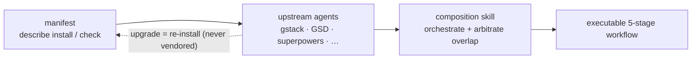

## ปัญหา

harness เขียนโค้ดด้วย AI — ECC, Superpowers, GSD, gstack — ต่างเผยแพร่เป็นแพ็กเกจ npm หรือ repo git แยกกัน การเอามารวมกันด้วยมือนั้นเปราะบาง: คุณ fork โค้ด upstream แพตช์ในเครื่อง แล้วก็ได้แต่มองมันผุพังไปเรื่อย ๆ เมื่อ upstream ออกเวอร์ชันใหม่ที่คุณ merge ตามไม่ไหว

คำตอบดั้งเดิมคือ vendoring: คัดลอกโค้ด upstream เข้ามาใน repo ของคุณแล้วดูแลเอง วิธีนี้ใช้ได้จนกว่า upstream จะปล่อยการปรับปรุงครั้งใหญ่ แล้วคุณก็ติดอยู่กับ fork เก่า การไล่ซิงก์ส่วนประกอบ harness หลายสิบตัวด้วยมือนั้นขยายขนาดไม่ได้

## แนวทางของ harnessed

harnessed ไม่คัดลอกโค้ด upstream เลย แต่ให้ harness pack แต่ละตัวมาพร้อม **manifest** — ไฟล์ YAML ที่กำหนดชนิด ซึ่งอธิบายวิธีติดตั้ง pack, capability ที่มันเปิดออก และวิธีเชื่อมกับส่วนประกอบอื่น

ตอน runtime harnessed อ่าน manifest เหล่านี้ ตรวจความเข้ากันได้ แล้วเรียบเรียงเครื่องมือ upstream ผ่าน composition skills คุณจึงรันไบนารี upstream ตัวจริงเสมอ — harnessed แค่ประสานจุดส่งต่อเท่านั้น

ประกอบ ไม่ใช่ vendoring — manifest อธิบาย ส่วน composition skill เรียบเรียง:



ตัวอย่าง manifest (ย่อ):

```yaml
name: my-pack
version: 1.0.0
description: เพิ่ม workflow OAuth2 ให้ harnessed
install:
  - npm: superpowers
  - git: https://github.com/example/skill-pack-oauth
capability:
  skills:
    - brainstorming
    - tdd
  workflows:
    - discuss
    - plan
```

## ข้อดี

**ได้ upstream ล่าสุดเสมอ** เมื่อ Superpowers ออกรุ่นใหม่ คุณแค่รัน `harnessed install` อีกครั้งก็ได้ทันที ไม่ต้อง merge เอง ไม่มี fork ค้างเก่า

**การประกอบที่ผ่านการตรวจสอบ** `harnessed setup` ตรวจความเข้ากันได้ของ manifest ก่อนติดตั้ง การประกาศ capability ที่ขัดกันจะโผล่เป็นข้อผิดพลาด ไม่ใช่เซอร์ไพรส์ตอน runtime

**เขียน pack ของคุณเอง** schema ของ manifest เผยแพร่อยู่ใน repo ที่ `schemas/manifest.v1.schema.json` (ชี้ YAML language server ไปที่ไฟล์นี้เพื่อให้ตรวจแบบอินไลน์) เล็ง manifest ของคุณไปยัง upstream ใดก็ได้ที่ติดตั้งได้ (แพ็กเกจ npm, repo git, skill ที่เขียนเอง) แล้ว harnessed จะถือว่ามันเป็นหน่วยประกอบชั้นหนึ่ง

**จุดเข้าเดียว** ผู้ใช้เจอแค่ `/discuss`, `/plan`, `/task`, `/verify` โดยไม่ต้องเรียนศัพท์เฉพาะของแต่ละ upstream composition skill จัดการเรื่องการส่งต่อไปยังเครื่องมือ upstream ที่ถูกต้องในแต่ละขั้น

## composition skills ทำงานอย่างไร

ตั้งแต่ v4.0 harnessed เป็น **orchestration brain + คลัง prompt** ไม่ใช่เอนจินรันงาน มันไม่ spawn workflow ในโปรเซสของตัวเองอีกต่อไป — แต่ส่วนเนื้อของคำสั่งสแลช (สร้างโดย `harnessed setup`) จะสั่งให้ main session ของ Claude Code spawn **CC-native subagent** โดยมี CLI ฟังก์ชันบริสุทธิ์ที่เร็วสามตัวเป็นตัวขับ เมื่อคุณรัน `/discuss`:

1. **Gate** — `harnessed gates discuss --task "<spec>"` คืนค่าว่า gate การอภิปรายตัวใดใน 3 ตัวถูกกระตุ้น (strategic / phase / subtask) และควรยกระดับไป Agent Teams หรือไม่
2. **Prompt** — สำหรับแต่ละ gate ที่ถูกกระตุ้น `harnessed prompt <sub> --json` จะปล่อย prompt ที่พร้อม spawn (เนื้อ role + checklist + disciplines ที่ใช้)
3. **Spawn** — main session รัน spawn `Task` แบบเนทีฟ (ห่อด้วย ralph-loop) และส่ง `STATUS: NEEDS_CLARIFICATION` ใด ๆ กลับมาหาคุณผ่าน `AskUserQuestion`
4. **Checkpoint** — `harnessed checkpoint complete <sub>` บันทึกความคืบหน้าลง `.planning/` เพื่อให้การรันรอดผ่าน compaction

harnessed มีส่วนร่วมในการตัดสินใจ (การส่งต่อ gate, การสร้าง prompt, ledger ความคืบหน้า) ส่วนการ spawn จริง การประสาน Agent Teams และการวนถามเพื่อความชัดเจน เป็นงานของ main session ด้วยเครื่องมือเนทีฟของ Claude Code (`harnessed run` ยังเก็บการ spawn ในโปรเซสแบบเดิมไว้ สำหรับ CI/headless เท่านั้น)

นี่คือเหตุผลที่ workflow ทั้ง 28 ตัวใน harnessed ประกอบ ECC, Superpowers, GSD และ gstack พร้อมกันได้ — ชั้นการประกอบทำให้รอยต่อกลายเป็นนามธรรม

ดู workflow ทั้ง 28 ตัวและการพึ่งพา upstream ได้ที่ [อ้างอิง workflow](/th/docs/reference/workflows/)
