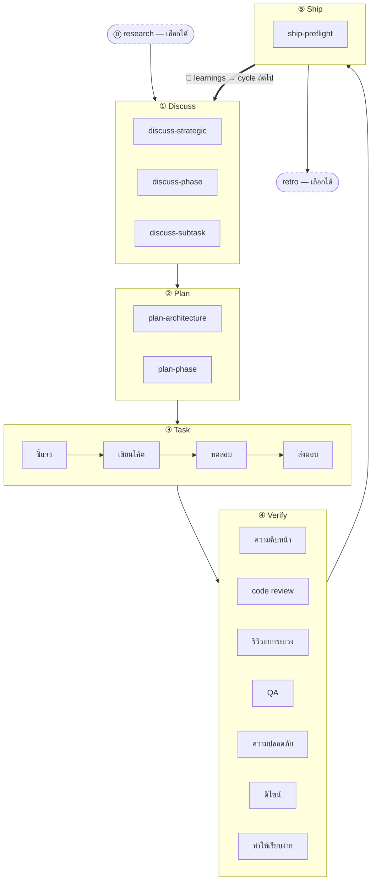

จังหวะ 5 ขั้นคือระเบียบวิธีแกนกลางของ harnessed: ทุกฟีเจอร์ ทุกการแก้บั๊ก ทุกการรีแฟกเตอร์ ล้วนผ่านห้าขั้นเดียวกันตามลำดับ — **Discuss → Plan → Task → Verify → Ship** — และปิดท้ายด้วยวง **Learn** อัตโนมัติ อีกสองขั้นประกบ (Research, Retro) อยู่ที่ปลายทั้งสองด้านของวงหลัก

## ขั้นต่าง ๆ

| #   | ขั้น         | คำสั่งสแลช  | โหมด                                       |
| --- | ------------ | ----------- | ------------------------------------------ |
| 0   | **Research** | `/research` | เลือกได้ — ทำงานเมื่อความเข้าใจยังไม่พอ    |
| 1   | **Discuss**  | `/discuss`  | บังคับ                                     |
| 2   | **Plan**     | `/plan`     | บังคับ                                     |
| 3   | **Task**     | `/task`     | บังคับ                                     |
| 4   | **Verify**   | `/verify`   | บังคับ                                     |
| 5   | **Ship**     | `/ship`     | ชัดเจน — ขั้นปล่อยรุ่น (ผู้ใช้เป็นคนเรียก) |
| —   | **Retro**    | `/retro`    | บังคับใน `/auto` เลือกได้เมื่อเรียกเดี่ยว  |

**การเรียนรู้เป็นอัตโนมัติ ไม่ใช่ขั้นหนึ่ง** ทุก workflow ที่เสร็จจะต่อท้ายสัญญาณ failure/loop/reject ของตัวเองลงใน `.planning/LEARNINGS.md` จากนั้น inject hook จะฉีด learnings ที่เกี่ยวข้องเข้าสู่ session ถัดไป กลไกนี้เปิดอยู่ตลอดและ**ไม่**ขึ้นกับ Retro ที่เป็นตัวเลือก

### Research (เลือกได้)

สืบค้นหลายแหล่งผ่าน Tavily, Exa และ ctx7 ทำงานภายใน `/auto` เมื่อคุณตอบ "ไม่" ในการเช็กความเข้าใจ หรือเรียกตรง ๆ ด้วย `/research` ผลลัพธ์เขียนลง `research-notes.md` ใน `.planning/`

### Discuss — gate 3 ชั้น

`/discuss` ประเมิน gate สามตัวอย่างอิสระ และรันเฉพาะตัวที่ถูกกระตุ้น:

- **ชั้นกลยุทธ์** (`discuss-strategic`): ฟีเจอร์ใหม่ milestone ใหม่ ทิศทางผลิตภัณฑ์ใหม่ → gstack `/office-hours` + `/plan-ceo-review` บันทึก `findings.md`
- **ชั้น phase** (`discuss-phase`): มีการตัดสินใจด้านการพัฒนาค้างอยู่ ≥2 เรื่อง หรือกระแสข้อมูลข้ามโมดูลยังไม่ชัด → GSD `gsd-discuss-phase` บันทึก `findings.md` + `knowledge.md`
- **ชั้น subtask** (`discuss-subtask`): อัลกอริทึมแกนกลาง / contract API ที่มีแนวทาง ≥2 แบบ → brainstorming ของ Superpowers ชั่วคราว ไม่บันทึก

ทุก gate จะประกาศอย่างโปร่งใสทั้งตอนถูกกระตุ้นและตอนถูกข้าม

### Plan — รีวิวสถาปัตยกรรม + บันทึก

`/plan` รันสองขั้นตามลำดับ:

1. **รีวิวสถาปัตยกรรม** (มีเงื่อนไข) — สถาปัตยกรรมซับซ้อนจะกระตุ้น gstack `/plan-eng-review` เพื่อล็อกการออกแบบก่อนบันทึก
2. **แผนระดับ phase** — GSD `gsd-plan-phase` + planning-with-files สร้าง `task_plan.md` พร้อมพาธไฟล์ที่แม่นยำ เกณฑ์การยอมรับ และลำดับการพึ่งพา

### Task — วงของ subtask

`/task` รันสี่ขั้นตามลำดับที่เคร่งครัดสำหรับแต่ละ subtask:

1. **ชี้แจง** — ตรวจสอบ spec เปิดจุดกำกวม เทียบกับ `task_plan.md`
2. **เขียนโค้ด** — หลัก karpathy: เปลี่ยนให้น้อยที่สุดเท่าที่ใช้ได้ แก้แบบผ่าตัด ไม่ขยายขอบเขต
3. **ทดสอบ** — TDD red → green → refactor สำหรับตรรกะแกนกลาง; เลือกได้สำหรับ CRUD และการพัฒนาที่ชัดเจนอยู่แล้ว
4. **ส่งมอบ** — gate `harnessed checkpoint complete` ไม่ปล่อยให้ไปต่อจนกว่าจะได้ `COMPLETE` ตรงตัวอักษร

### Verify — ตรวจย่อยแบบมีเงื่อนไข 7 รายการ

`/verify` แจกจ่ายการตรวจย่อยตามสิ่งที่เปลี่ยนไป ที่ทำงานเสมอ: `verify-progress` (UAT + ซิงก์สถานะ), `verify-code-review` (หลาย agent ขนาน), `verify-simplify` (เก็บกวาดครั้งสุดท้าย) แบบมีเงื่อนไข: รีวิวแบบระแวง, QA, ความปลอดภัย, ดีไซน์, multispec

### Ship — ขั้นปล่อยรุ่น

`/ship` คือขั้นที่ 5 ต่อจาก Verify มันรัน `harnessed release-preflight` ก่อน (ด่านตรวจความพร้อมปล่อยรุ่นแบบอ่านอย่างเดียว — `CHANGELOG [Unreleased]`/version/git-clean/tag-absent) แล้วมอบงาน PR + deploy ให้ gstack `/ship` **ขอบเขตของ deploy คือ tag-ready**: ขั้นนี้ไม่ push ไม่ publish ไม่สร้าง tag — `npm publish` จริงและ GitHub release ทำโดย CI `publish.yml` ตอน push tag (ต้องอนุมัติอย่างชัดเจน) "PR ready ≠ release ready"

### Retro

gstack `/retro` เก็บบทเรียนของหมุดหมาย บันทึกการตัดสินใจ และสิ่งที่ค้นพบโดยไม่คาดคิด ใน `/auto` มันทำงานแบบบังคับ และเรียกเดี่ยวได้เมื่อจบหมุดหมายใดก็ตาม (คนละอย่างกับวง Learn ที่เปิดตลอดข้างบน)

## แผนภาพการไหล



## `/auto` กับคำสั่งรายขั้น

`/auto` ต่อขั้นการพัฒนาแกนกลางให้อัตโนมัติ (research มีเงื่อนไข → discuss → plan → task → verify → retro) **Ship เรียกอย่างชัดเจน** — `/auto` ไม่ปล่อยรุ่นเอง เมื่อหมุดหมายพร้อมตัดเวอร์ชัน คุณค่อยรัน `/ship` เอง คำสั่งรายขั้นให้คุณเข้าจากจุดไหนก็ได้:

```
/discuss "เพิ่ม rate limiter"        # รันแค่ discuss
/plan "rate limiter"                # รันแค่ plan (ถือว่า discuss เสร็จแล้ว)
/task "พัฒนา middleware"             # รันแค่ task
/verify "ฟีเจอร์ rate limiter"       # รันแค่ verify
/ship                               # รันแค่ ship (release-preflight → tag-ready)
```

เมื่อข้าม _หลาย_ phase คำสั่ง `harnessed advance` จะอนุมาน phase ถัดไปจากสถานะบนดิสก์ใน `.planning/` แล้วพิมพ์คำสั่งที่ควรรัน — ทำให้ driver loop ต่อหลาย phase ได้แบบไม่ต้องคุม (`while harnessed advance --json; do : ; done`) และหยุดที่ advance-gate เมื่อ phase ก่อนหน้ายังไม่เสร็จ ดูรายละเอียดที่หัวข้อ `harnessed advance` ใน [อ้างอิง CLI](../../reference/cli/)

การเรียก subworkflow แบบผ่าตัดจะข้าม master ไปเลย:

```
/discuss-phase "..."        # รันแค่การชี้แจงชั้น phase
/plan-architecture "..."    # รันแค่รีวิวสถาปัตยกรรม
/verify-paranoid "..."      # รันแค่การตรวจของวิศวกรสายระแวง
```

การตัดสินใจเชิงสถาปัตยกรรมมีรายละเอียดใน [ADR 0030](https://github.com/easyinplay/harnessed/blob/main/docs/adr/0030-namespace-policy.md), 0031 และ 0032 (การตัดสินใจออกแบบ namespace)
