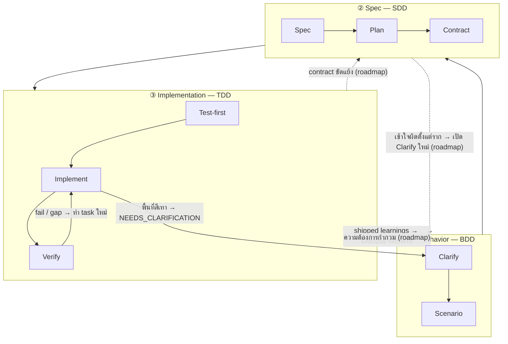

สแตกสามชั้นคือทฤษฎีของ harnessed ว่า _ทำไม_ จังหวะการทำงานจึงหน้าตาแบบนี้ มันคือการนำโครงสร้างซ้อน **BDD → SDD → TDD** ที่เป็นที่ยอมรับแล้วมาทำให้เป็นจริงในเชิงวิศวกรรมซอฟต์แวร์: วงป้อนกลับสามวงซ้อนกัน แต่ละวงตอบคำถามคนละข้อ สิ่งที่ harnessed เพิ่มเข้ามาคือการ **ประกอบ** ระบบนิเวศโอเพนซอร์สเข้าไปในแต่ละวง — และเพราะส่วนประกอบ upstream _ทับซ้อนกันบางส่วน_ การตัดสินเรื่องการทับซ้อนนั้นจึงเป็นงานของ orchestrator การประกอบโดยตรง

## สามวง

| ชั้น                 | Loop | คำถามที่มันตอบ                          | ประกอบจาก (มีการทับซ้อน)                                                                          |
| -------------------- | ---- | --------------------------------------- | ------------------------------------------------------------------------------------------------- |
| **① Behavior**       | BDD  | จะสร้าง _อะไร_ และรู้ได้อย่างไรว่าเสร็จ | gstack `/office-hours` governance · GSD discuss · superpowers brainstorming → acceptance criteria |
| **② Spec**           | SDD  | โครงสร้าง _เป็นอย่างไร_                 | GSD plan-phase → requirements / design / tasks · contracts (Spec Kit / ECC patterns)              |
| **③ Implementation** | TDD  | มัน _ทำงานได้จริง_ หรือไม่              | superpowers TDD red-green · subagent execution · GSD verify-work · harnessed completion gate          |

**วงเหล่านี้คือเลนส์ซ้อนกัน ไม่ใช่ขั้นตอน** Cucumber ทำให้วงคู่ BDD-นอก + TDD-ใน เป็นที่รู้จัก: scenario ที่ล้มเหลวจะเปิดวงนอก แล้วคุณดันมันไปสู่สีเขียวผ่านวง red-green TDD ด้านในหลายรอบ ยุค GenAI เพิ่มวงตรงกลางเข้ามา — วง **spec** ของ SDD ที่อยู่ระหว่าง Behavior กับ Implementation อย่างชัดเจน เพราะ agent ต้องมี contract ที่ถูกแช่แข็งจึงจะทำงานได้ นั่นจึงกลายเป็น **triple-loop** ข้างบน

## กางออกทีละโหนด

แต่ละวงแบ่งเป็นโหนด และแต่ละโหนดบอกว่าประกอบขึ้นจากส่วนประกอบโอเพนซอร์สตัวใดบ้าง

### ① Behavior (BDD)

| โหนด         | บทบาท                                | ประกอบจาก                                                        |
| ------------ | ------------------------------------ | ---------------------------------------------------------------- |
| **Clarify**  | ตรึงว่าจะสร้าง _อะไร_ + เปิดจุดกำกวม | gstack `/office-hours` + GSD discuss + superpowers brainstorming |
| **Scenario** | แปลงเจตนาเป็น acceptance criteria    | GSD phase success criteria                                       |

วงนอกจะเปิดค้างไว้จนกว่า acceptance criteria ของ scenario จะถูกเขียนออกมา นิยามของคำว่า "เสร็จ" ถูกตัดสินตรงนี้ — ก่อนโครงสร้างหรือโค้ดใด ๆ

### ② Spec (SDD)

| โหนด         | บทบาท                    | ประกอบจาก                                                           |
| ------------ | ------------------------ | ------------------------------------------------------------------- |
| **Spec**     | requirements + design    | GSD plan-phase + ชุดสามของ Spec Kit (requirements / design / tasks) |
| **Plan**     | tasks + DAG ของการพึ่งพา | GSD `PLAN.md` + การแตกงานของ ECC                                    |
| **Contract** | อินเทอร์เฟซถูกแช่แข็ง    | ธรรมเนียมของ contract                                               |

วงกลางแปลง "อะไร" ให้เป็นโครงสร้างที่รันได้ เงื่อนไขออกของมันคือ **contract ที่ถูกแช่แข็ง** — อินเทอร์เฟซที่วง implementation จะเขียนเทสต์เทียบกับมัน

### ③ Implementation (TDD)

| โหนด           | บทบาท                      | ประกอบจาก                               |
| -------------- | -------------------------- | --------------------------------------- |
| **Test-first** | เทสต์ที่ล้มเหลว (red gate) | superpowers TDD                         |
| **Implement**  | ดันไปสู่สีเขียว            | subagent execution                      |
| **Verify**     | refactor + จบงานรายชิ้น    | GSD verify-work + harnessed completion gate |

วงในคือวง red → green → refactor แบบคลาสสิก วนหนึ่งรอบต่อหนึ่ง task จนกว่าทุก contract จะได้รับการตอบสนอง

### ตัดขวางทุกชั้น

สองเรื่องอยู่นอกวงใดวงหนึ่งโดยเฉพาะ:

| เรื่อง     | บทบาท                          | ประกอบจาก                            |
| ---------- | ------------------------------ | ------------------------------------ |
| **Review** | ด่านคุณภาพ + ความปลอดภัย       | gstack `/review` + `/cso`            |
| **Ship**   | ความพร้อมปล่อยรุ่น + การส่งมอบ | `release-preflight` + gstack `/ship` |

นอกจากนี้ยังมีสอง **discipline** ที่พาดผ่าน _ทุก_ ชั้น:

- **karpathy principles** — _how_ to code: เปลี่ยนให้น้อยที่สุดเท่าที่ใช้ได้ แก้แบบผ่าตัด simplicity first
- **mattpocock moves** — เครื่องมือแบบเรียกใช้ตามต้องการ (`/zoom-out`, `/diagnose`, `/grill-with-docs`) เรียกตามสถานการณ์

## การย้อนกลับ (GoBack)

ค่าเริ่มต้นของการไหลคือจากนอกเข้าใน **harnessed คือการทำ triple-loop นี้ให้เป็นจริงในรูปแบบ linear-cadence — ส่วน routed graph เต็มรูปแบบคือเส้นทางวิวัฒนาการของมัน** วงเหล่านี้ยังเป็นวงป้อนกลับ แต่วันนี้มีเพียงบางเส้นย้อนกลับที่ปล่อยจริงแล้ว ส่วนการกำหนดเส้นทางตามวงที่ละเอียดกว่านั้นอยู่ใน roadmap แผนภาพด้านล่างวาดเส้นที่ปล่อยแล้วเป็นเส้นทึบ และเส้น roadmap เป็นเส้นประพร้อมกำกับ `(roadmap)`

### ที่ปล่อยแล้ววันนี้

ใน linear cadence ปัจจุบันมีเส้นย้อนกลับที่ใช้งานจริงสามเส้น:

- **Verify → Task** — การตรวจที่ไม่ผ่านหรือช่องว่างที่ยังไม่ถูกปิด จะดันงานนั้นกลับเข้าวง implementation
- **พื้นที่สีเทา → การชี้แจง** — เมื่อ subagent ชนความกำกวม มันจะคืน `STATUS: NEEDS_CLARIFICATION` การรันจะหยุด ชี้แจง แล้วไปต่อ
- **Learnings → Discuss รอบถัดไป** — ทุกรอบที่ปล่อยแล้วจะต่อท้ายสัญญาณ failure/loop/reject ซึ่งไหลเข้าสู่วง Behavior รอบถัดไป (learn loop ที่เปิดตลอด)

### Roadmap (ยังไม่ปล่อย)

การย้อนกลับเชิงโครงสร้างที่ละเอียดกว่านี้ — ส่งช่องว่าง _ตรง_ ไปยังวงที่ถือคำตอบ — คือทิศทางวิวัฒนาการ ไม่ใช่พฤติกรรมปัจจุบัน:

- **contract ขัดแย้ง** (implementation ทำตามอินเทอร์เฟซที่แช่แข็งไว้ไม่ได้) → ส่งกลับ **Spec**
- **ความต้องการกำกวม** (contract สอดคล้องในตัวเอง แต่ behavior ยังระบุไม่พอ) → ส่งกลับ **Behavior**
- **เข้าใจผิดตั้งแต่ราก** (โครงสร้างทั้งชุดเล็งไปผิดผลลัพธ์) → เปิด **Clarify** ของ Behavior ใหม่

วันนี้ช่องว่างเหล่านี้โผล่ผ่านสามเส้นที่ปล่อยแล้วข้างบน (ส่วนใหญ่คือ Verify → Task บวกการชี้แจงโดยมนุษย์) ไม่ใช่การกำหนดเส้นทางตามวงแบบอัตโนมัติ คุณค่าเฉพาะหน้าของ orchestrator การประกอบคือรักษาให้ linear cadence สอดคล้องกัน ในขณะที่ส่วนประกอบ upstream ต่าง ๆ เป็นเจ้าของคนละวง ส่วน routed graph คือก้าวถัดไป

## ส่วนประกอบตัดกัน — และนี่คือประเด็น

เครื่องมือ upstream ตัวเดียวกันปรากฏในมากกว่าหนึ่งวง การตัดกันนี้ไม่ใช่ความซ้ำซ้อน แต่คืออินเทอร์เฟซที่ orchestrator การประกอบต้องตัดสิน:

- **GSD** คือแกนหลัก — ร้อยผ่านทั้งสามวง (discuss → plan → verify)
- **gstack** ครอบคลุม **Behavior + Review**
- **superpowers** ครอบคลุม **Behavior** (brainstorm) + **Implementation** (TDD)

หากไม่มีการตัดสิน จุดตัดเหล่านี้จะกระตุ้นซ้ำซ้อนหรือขัดแย้งกันเอง ชั้นการประกอบจะส่งแต่ละวงไปยังเครื่องมือ upstream ที่ถูกต้อง และเก็บรอยต่อให้เรียบร้อย

## ทฤษฎี vs. runtime

สแตกสามชั้นคือ _ทฤษฎี_ ส่วน [จังหวะ 5 ขั้น](/th/docs/concepts/five-stage-cadence/) คือวิธีที่ทฤษฎีนั้นทำงานจริงบนบรรทัดคำสั่ง:

| Loop (ทฤษฎี)     | ขั้นใน runtime                    |
| ---------------- | --------------------------------- |
| ① Behavior       | **Discuss**                       |
| ② Spec           | **Plan**                          |
| ③ Implementation | **Build** (Task)                  |
| ตัดขวางทุกชั้น   | **Verify + Ship** (evidence gate) |

เรื่องที่ว่าเครื่องมือ upstream ถูกเย็บเข้าด้วยกัน _อย่างไร_ โดยไม่ต้อง fork ดูได้ที่ [ประกอบแทน vendoring](/th/docs/concepts/composition/)
