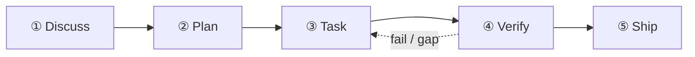

บทเรียนนี้พาเดินผ่านจังหวะ 5 ขั้นด้วยมือ โดยใช้ตัวอย่างที่เจอได้จริง: **"เพิ่ม rate limiter ให้ Express API ของเรา — 100 req/นาที ต่อ IP ใช้ Redis"**

การรัน `/auto` ครั้งแรกของคุณจะเดินครบทั้งห้าขั้นตั้งแต่ต้นจนจบ:



## ขั้นที่ 1 — Discuss

```
/discuss "เพิ่ม rate limiter ให้ Express API ของเรา — 100 req/นาที ต่อ IP ใช้ Redis"
```

`/discuss` ประเมิน gate ทำความชัดเจน 3 ตัวแบบขนาน และรันเฉพาะตัวที่ถูกกระตุ้น:

- **gate เชิงกลยุทธ์** (`discuss-strategic`): นี่คือฟีเจอร์ใหม่ หรือการเปลี่ยนโครงสร้างพื้นฐานเดิม? กระทบตำแหน่งของผลิตภัณฑ์ไหม? สำหรับ rate limiter gate นี้มักกระตุ้นการตรวจสอบเชิงกำกับดูแลแบบเร็ว
- **gate ระดับ phase** (`discuss-phase`): มีการตัดสินใจด้านการพัฒนาที่ยังค้างอยู่ ≥2 เรื่องหรือไม่? (Redis หรือเก็บในหน่วยความจำ? แยกตาม route หรือทั้งระบบ?) gate นี้ทำให้ชัดเจนและบันทึกสิ่งที่พบลง `findings.md`
- **gate ระดับ subtask** (`discuss-subtask`): มี subtask ที่มีแนวทาง ≥2 แบบต่างกันชัดเจนไหม? การออกแบบอัลกอริทึมแกนกลางจะผ่าน brainstorming สั้น ๆ

**ผลลัพธ์**: `findings.md` และ `knowledge.md` ใน `.planning/PHASE-N/`

## ขั้นที่ 2 — Plan

```
/plan "ฟีเจอร์ rate limiter"
```

`/plan` รันสองขั้นตามลำดับ:

1. **รีวิวสถาปัตยกรรม** (มีเงื่อนไข) — ถ้าฟีเจอร์ข้ามขอบเขตโมดูลหรือแตะโครงสร้างพื้นฐานใหม่ staff engineer สายระแวงของ gstack จะรีวิวการออกแบบ
2. **แผนระดับ phase** — GSD บันทึก `task_plan.md` พร้อมพาธไฟล์ที่แม่นยำ เกณฑ์การยอมรับ และลำดับการพึ่งพา

**ผลลัพธ์**: `.planning/PHASE-N/PLAN.md` และ `task_plan.md`

## ขั้นที่ 3 — Task

```
/task "พัฒนา middleware rate limiter"
```

`/task` รัน 4 ขั้นย่อยต่อ subtask ตามลำดับ:

1. **ชี้แจง** — ตรวจสอบ spec ก่อนเขียนโค้ด เปิดจุดกำกวมออกมา
2. **เขียนโค้ด** — ทำตามหลัก karpathy (เปลี่ยนให้น้อยที่สุดเท่าที่ใช้ได้ แก้แบบผ่าตัด)
3. **ทดสอบ** — TDD สำหรับตรรกะแกนกลาง: red → green → refactor
4. **ส่งมอบ** — wrapper `ralph-loop` การันตีว่าต้องได้ `COMPLETE` ตรงตัวอักษรก่อนไปต่อ

## ขั้นที่ 4 — Verify

```
/verify "ฟีเจอร์ rate limiter"
```

`/verify` แจกจ่ายการตรวจย่อยได้สูงสุด 7 รายการตามสิ่งที่เปลี่ยนไป:

| การตรวจ | ทำงานเมื่อ |
|---------|-----------|
| `verify-progress` | เสมอ (การยอมรับ UAT + ซิงก์สถานะ) |
| `verify-code-review` | เสมอ (fan-out ขนานหลาย agent) |
| `verify-paranoid` | โมดูลสำคัญ หรือก่อนเปิด PR |
| `verify-qa` | มีการเปลี่ยน UI |
| `verify-security` | แตะ auth หรือ secret |
| `verify-design` | มีการเปลี่ยนดีไซน์ |
| `verify-simplify` | เสมอและเป็นตัวสุดท้าย (ตัดตรรกะซ้ำซ้อน) |

## สิ่งที่ถูกบันทึกไว้ใน `.planning/`

```
.planning/
├── STATE.md          # แหล่งความจริงของ phase / ความคืบหน้าปัจจุบัน
├── ROADMAP.md        # แผนที่เส้นทางของ phase
└── PHASE-1/
    ├── PLAN.md       # รายการงาน พาธไฟล์ เกณฑ์การยอมรับ
    ├── findings.md   # ผลลัพธ์จากขั้น discuss
    ├── task_plan.md  # การแตกงานตาม subtask
    └── PROGRESS.md   # ติดตามความคืบหน้าแบบเรียลไทม์
```

## ขั้นต่อไป

หลัง Verify เสร็จ ให้รัน `/retro` เพื่อปิดหมุดหมายและเก็บบทเรียน ถ้าคุณรัน `/auto` ขั้นเหล่านี้จะต่อกันอัตโนมัติอยู่แล้ว — ดูเส้นทางคำสั่งเดียวได้ที่ [เริ่มใช้อย่างรวดเร็ว](/th/docs/getting-started/quickstart/)

อ่านสถาปัตยกรรมเบื้องหลังแต่ละขั้นได้ที่ [จังหวะ 5 ขั้น](/th/docs/concepts/five-stage-cadence/)
