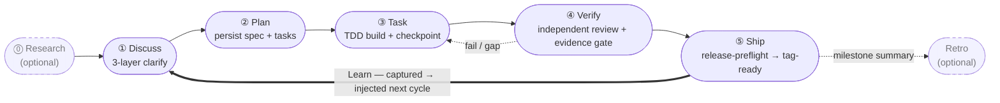

harnessed คือตัวจัดการแพ็กเกจและ orchestrator การประกอบสำหรับ harness เขียนโค้ดด้วย AI มันติดตั้ง ประกอบ และรัน workflow ที่รวม Skills, MCP server และ harness pack เข้าด้วยกันผ่าน manifest ที่กำหนดชนิด โดยไม่ vendoring โค้ด upstream

ถ้าคุณกำลังพัฒนาด้วย Claude Code, harnessed จะเดินสายส่วนประกอบโอเพนซอร์สที่ดีที่สุด — ECC, Superpowers, GSD, gstack — ให้กลายเป็น workflow เดียวที่รันได้ ด้วยคำสั่งเดียว

วงจรการทำงาน — ห้า stage ที่ปิดท้ายด้วยรอบ Learn ซึ่งเปิดอยู่ตลอด:

## เริ่มจากตรงไหนดี

- **[การติดตั้ง](/th/docs/getting-started/installation/)** — ติดตั้ง harnessed และรัน setup ใน 30 วินาที
- **[เริ่มใช้อย่างรวดเร็ว](/th/docs/getting-started/quickstart/)** — จากติดตั้งถึง workflow แรกใน 60 วินาที
- **[แนวคิดการประกอบ](/th/docs/concepts/composition/)** — harnessed ประกอบเครื่องมือ upstream โดยไม่ fork ได้อย่างไร
- **[อ้างอิง workflow](/th/docs/reference/workflows/)** — workflow ที่ประกอบได้ทั้ง 28 ตัวในรุ่นปัจจุบัน

## harnessed ต่างจากที่อื่นตรงไหน

สามหลักการรองรับทุก workflow:

**ประกอบ ไม่ใช่ vendoring** harness pack แต่ละตัวมาพร้อม manifest harnessed อ่านมัน ตรวจความเข้ากันได้ แล้วเย็บเครื่องมือ upstream เข้าด้วยกันตอน runtime คุณจึงรัน upstream ตัวจริงเสมอ — ไม่ใช่ fork ที่ค้างเก่า

**จังหวะ 5 ขั้นในตัว** Discuss → Plan → Task → Verify → Ship พร้อม Research และ Retro แบบเลือกได้ บวกวงจรการเรียนรู้อัตโนมัติ หรือรัน `/auto` เพื่อไล่ไปป์ไลน์ 6 ขั้นทั้งหมด (research → retro; Ship เรียกอย่างชัดเจน) ในคำสั่งเดียว

**ระเบียบวิธี dogfood-first** ทุก workflow ถูกตรวจสอบด้วยนิยามของตัวมันเอง — เป็นวินัยเดียวกับที่ harnessed ใช้ปล่อยตัวเอง

อ่านภาพรวมทั้งหมดได้ที่ [README](https://github.com/easyinplay/harnessed#readme)
