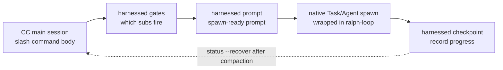

> **โมเดลการทำงานของ v4.0** harnessed คือ _orchestration brain + คลัง prompt_ ไม่ใช่เอนจินรันงาน ส่วนเนื้อของคำสั่งสแลช (สร้างโดย `harnessed setup`) ขับ **การ spawn CC-native subagent** ผ่าน CLI ฟังก์ชันบริสุทธิ์ที่เร็วสามตัว — `harnessed gates` (subworkflow ตัวใดถูกกระตุ้น), `harnessed prompt` (prompt พร้อม spawn ของ subworkflow) และ `harnessed checkpoint` (บันทึกความคืบหน้า) ส่วนการ spawn จริง, Agent Teams, ralph-loop และการวนถามเพื่อความชัดเจน เป็นงานของ main session ของ Claude Code ด้วยเครื่องมือเนทีฟ `harnessed run` เหลือไว้สำหรับ CI/headless เท่านั้น

CLI orchestration สามตัวขับการ spawn CC-native อย่างไร:



## `harnessed` (แดชบอร์ด you-are-here)

รัน `harnessed` **โดยไม่ใส่อาร์กิวเมนต์** จะพิมพ์แดชบอร์ด you-are-here — วิธีที่เร็วที่สุดในการหาตำแหน่งตัวเองใหม่ภายใน workflow ที่กำลังทำงาน (เทียบเคียงกับ `/comet` ของ comet เพิ่มเข้ามาใน v8.0)

```bash
harnessed          # แดชบอร์ด you-are-here + ก้าวถัดไป แบบอ่านง่ายสำหรับคน
harnessed --json   # ออบเจกต์มีโครงสร้างสำหรับเครื่องอ่าน
```

มันตรวจหา workflow ที่กำลังทำงานของ repo ปัจจุบันโดยอัตโนมัติ แล้วพิมพ์ phase ปัจจุบัน สถานะของแต่ละ subworkflow และ contract เชิงกำหนดแบบบรรทัดเดียว `NEXT: auto | manual | done` พร้อมคำใบ้ให้รัน (เช่น `→ run: harnessed prompt <sub>`) หากไม่มี workflow ที่กำลังทำงาน มันจะพิมพ์คำใบ้เริ่มต้นที่ชี้ไปยัง `harnessed setup`

**อ่านอย่างเดียว** — ไม่ spawn ไม่แก้สถานะ/git/remote และคืนค่า `0` เสมอ มีเพียง `harnessed` เปล่า ๆ (หรือ `harnessed --json` ซึ่งใส่ `--lang` เพิ่มได้) เท่านั้นที่ส่งแดชบอร์ดออกมา ส่วน subcommand ใด ๆ, `--help`, `--version` หรือคำที่ไม่รู้จัก จะตกไปยังการแยกวิเคราะห์คำสั่งตามปกติ (ดังนั้น `harnessed bogus` ยังคงเป็นข้อผิดพลาด)

ฟิลด์ของ `--json`: `active`, `phase`, `status`, `started_at`, `next`, `sub`, `hint`, `sub_progress`

---

## `harnessed setup`

การเริ่มต้นใช้งานรวดเดียว — ติดตั้ง workflow skills และ manifest พื้นฐานลง `~/.claude/`

```bash
harnessed setup [ตัวเลือก]
```

**มันทำอะไร:**

1. สแกน `workflows/<name>/SKILL.md` แล้วคัดลอกแต่ละไฟล์ไปที่ `~/.claude/skills/<name>/`
2. ประมวลผล `manifests/tools/*.yaml` และ `manifests/skill-packs/*.yaml`
3. เขียน `CLAUDE_CODE_EXPERIMENTAL_AGENT_TEAMS=1` ลง `~/.claude/settings.json`
4. ตรวจ locale ของระบบปฏิบัติการแล้วเขียนลง `env.HARNESSED_USER_LANG` (zh-* → `zh-Hans`, นอกนั้น → `en`)

**แฟล็ก:**

| แฟล็ก                | คำอธิบาย                                                           |
| -------------------- | ------------------------------------------------------------------ |
| `--user-lang <code>` | เขียนทับ locale ที่ตรวจพบ รับค่า `en`, `zh-Hans`, `zh-CN`, `zh-TW` |
| `--dry-run`          | ดูตัวอย่างเท่านั้น — พิมพ์สิ่งที่จะเขียน ไม่แตะดิสก์               |

**รหัสออก:** `0` = สำเร็จ, `1` = ข้อผิดพลาดของระบบไฟล์, `2` = ไม่พบ workflow ที่มี SKILL.md

---

## `harnessed install <pack>`

ติดตั้ง harness pack ตามชื่อหรือพาธ

```bash
harnessed install <pack>
```

แปลง manifest ของ pack ตรวจกับ schema แล้วรันแต่ละขั้น `install` ตามลำดับ ปัจจุบันรองรับการ bootstrap จากพาธในเครื่องและ URL ของ git ส่วนการค้นหา pack บน npm registry ยังอยู่ในแผน

---

## `harnessed install-base`

ติดตั้งโปรไฟล์พื้นฐานทั้งชุดในลูปเดียว — ทุก manifest ใน `manifests/tools/*.yaml` และ `manifests/skill-packs/*.yaml` ตามลำดับที่เรียงไว้ มันเป็น subcommand แยก (ไม่ใช่แฟล็ก `--base` ของ `install`) จึงไม่ชนกับด่านของ pack เดี่ยว

```bash
harnessed install-base                   # ใช้งานทันที (ค่าเริ่มต้น)
harnessed install-base --dry-run         # ดูตัวอย่างเท่านั้น — ไม่แตะดิสก์
harnessed install-base --non-interactive # ข้ามทุกคำถาม (CI / สคริปต์)
```

พิมพ์สถิติ: `installed / already-installed / skipped (user-aborted) / failed`

**รหัสออก:** `0` = ติดตั้งได้อย่างน้อยหนึ่งตัวและไม่มีตัวล้มเหลว · `1` = มีหนึ่งตัวขึ้นไปล้มเหลว · `2` = ไม่ได้ติดตั้งอะไรเลย (ติดตั้งไว้หมดแล้วหรือถูกยกเลิก)

---

## `harnessed research`

รัน workflow research — ส่งต่อย่อยตามหมวดการค้นหา → spawn subagent → `COMPLETE` ตรงตัวอักษร เป็นชื่อแทนบาง ๆ ของ `workflows/research/workflow.yaml`

```bash
harnessed research --query "compare Postgres vs SQLite for this use case"
harnessed research --query "..." --dry-run          # ดูตัวอย่าง workflow ที่แปลงแล้ว + gate context (JSON)
harnessed research --query "..." --model sonnet      # model ของ subagent: haiku | sonnet | opus
harnessed research --query "..." --non-interactive   # ข้ามทุกคำถาม (CI / สคริปต์)
```

| แฟล็ก               | คำอธิบาย                                                                      |
| ------------------- | ----------------------------------------------------------------------------- |
| `--query <text>`    | prompt สำหรับ research (**จำเป็น**)                                           |
| `--dry-run`         | ดูตัวอย่างเท่านั้น — พิมพ์ `{ workflow, yamlPath, gateContext }` และไม่ spawn |
| `--model <model>`   | model ของ subagent: `haiku` \| `sonnet` \| `opus`                             |
| `--non-interactive` | ข้ามทุกคำถาม (CI / สคริปต์)                                                   |

**รหัสออก:** `0` = workflow เสร็จ · `1` = workflow ล้มเหลวตอนรัน · `2` = ใช้คำสั่งผิด (ขาด `--query` หรือหา yaml ของ workflow ไม่เจอ)

---

## `harnessed manifest-add <upstream>`

เพิ่ม adapter upstream ตัวใหม่หลังผ่าน **ด่าน merge 5 คำถามแบบ EE-5** — ห้าคำถามเชิงโต้ตอบที่บังคับให้ตัดสินใจอย่างไตร่ตรองก่อนนำ upstream ใหม่เข้ามาในการประกอบ (เป็น surface ที่ใช้ซ้ำได้ไหม, ชื่อเหมาะไหม, ทับซ้อนกับส่วนประกอบที่มีอยู่หรือไม่, คุณกำลังยืมแนวคิดหรือยืมตัวตนผลิตภัณฑ์ของคนอื่น, ผู้ใช้ที่ไม่รู้จัก upstream ยังเข้าใจได้ไหม) ทั้งห้าคำถามต้องมีคำตอบที่ไม่ว่าง

```bash
harnessed manifest-add https://github.com/owner/repo.git
harnessed manifest-add <upstream> --category tools    # skill-packs (ค่าเริ่มต้น) | tools
harnessed manifest-add <upstream> --name myadapter    # ค่าเริ่มต้นใช้ basename ของ <upstream>
harnessed manifest-add <upstream> --dry-run           # ดูตัวอย่าง — พิมพ์คำตอบ ไม่เขียน
harnessed manifest-add <upstream> --non-interactive   # CI: dry-run แบบ WARN อย่างเดียว ไม่เขียนอะไร
```

เมื่อสำเร็จจะเขียนคำตอบลง `manifests/<category>/<name>.ee5-answers.json`

| แฟล็ก               | คำอธิบาย                                                        |
| ------------------- | --------------------------------------------------------------- |
| `--category <cat>`  | หมวดของ manifest: `skill-packs` (ค่าเริ่มต้น) \| `tools`        |
| `--name <name>`     | ชื่อ adapter แบบสั้น (ค่าเริ่มต้นใช้ basename ของ `<upstream>`) |
| `--dry-run`         | ดูตัวอย่างเท่านั้น — พิมพ์ JSON คำตอบ ไม่เขียน                  |
| `--non-interactive` | CI / สคริปต์ — WARN อย่างเดียว ไม่เขียนอะไร                     |

**รหัสออก:** `0` = ผ่านด่าน (เขียนแล้วหรือดูตัวอย่าง) · `1` = มีคำตอบเว้นว่าง

---

## `harnessed uninstall [pack]`

ถอน pack ที่ติดตั้งไว้ เมื่อไม่ใส่อาร์กิวเมนต์จะลบไฟล์ที่ harnessed ติดตั้งเอง

```bash
harnessed uninstall <pack>   # ถอน pack เดียว (รันขั้น uninstall ใน manifest ของมัน)
harnessed uninstall          # ลบ skills/manifests ของ harnessed เองออกจาก ~/.claude/
```

สำหรับวิธีติดตั้งสามแบบที่วาง skill ลงดิสก์ (`npm-cli`, `git-clone-with-setup`, `npx-skill-installer`) การถอนจะรัน **contract `spec.uninstall` ที่ประกาศไว้** ใน manifest: รัน `cmd` ที่ประกาศไว้ก่อน (fail-soft — โค้ดออกที่ไม่ใช่ศูนย์หรือไม่มี shell จะเตือนแล้วไปต่อ) จากนั้น force-rm แบบ idempotent สำหรับแต่ละรายการใน `cleanup_paths` และการทำงานนี้ **จำกัดอยู่ใน `$HOME`** (พาธนอกทรีของ home จะ hard-fail) ส่วนวิธีที่ไปยุ่งกับ settings/plugin/MCP (`cc-hook-add`, `cc-plugin-marketplace`, `mcp-*-add`) มีตัวถอนของตัวเอง การถอนแบบรวมโดยไม่ใส่อาร์กิวเมนต์จะย้อน `harnessed setup` กลับ

---

## CLI สำหรับ orchestration (v4.0)

CLI ฟังก์ชันบริสุทธิ์สามตัวนี้คือสิ่งที่ส่วนเนื้อของคำสั่งสแลชที่ถูกสร้างขึ้นใช้ขับการ spawn CC-native พวกมันพิมพ์แค่ JSON และไม่ spawn เอง — งานเรียบเรียงเป็นของ main session

### `harnessed gates <master>`

ประเมินว่า subworkflow ตัวใดถูกกระตุ้นสำหรับ master orchestrator ตัวหนึ่ง (`discuss` / `plan` / `task` / `verify` / `auto`) และ spec ของงานที่ให้มา

```bash
harnessed gates plan --task "add OAuth login" --skip-sub discuss
# → JSON: { fire: [{ sub, order, mode }], skip: [...], parallelism: { escalate_to_teams } }
```

`fire` แสดง subworkflow ที่ผ่านด่านการตัดสิน เรียงตามลำดับการรัน ส่วน `parallelism.escalate_to_teams` บอกว่าเมื่อใดควรเปลี่ยนจากการ spawn subagent ตามลำดับไปใช้ Agent Teams แบบ CC-native

### `harnessed prompt <sub>`

ปล่อย prompt ที่พร้อม spawn สำหรับ subworkflow ตัวเดียว — เนื้อ role-prompt + checklist + disciplines ที่ใช้

```bash
harnessed prompt plan-phase --task "add OAuth login" --json
# → JSON: { prompt, max_iterations, model }
```

main session ป้อน `prompt` นี้เข้าสู่การ spawn `Task` แบบเนทีฟ (ด้านนอกคือปลั๊กอิน ralph-loop) ส่วน `max_iterations` / `model` มาจากค่าเริ่มต้นของ workflow โดยตรง

### `harnessed checkpoint`

บันทึกความคืบหน้าของ subworkflow ลง checkpoint store ของ harnessed main session เรียกใช้หลัง subworkflow แต่ละตัวเสร็จ (และเมื่อล้มเหลว) เพื่อให้กู้คืนได้ด้วย `harnessed status --recover` หลัง compaction

```bash
harnessed checkpoint start <master> --plan <json>   # หว่านเมล็ด ledger ความคืบหน้า
harnessed checkpoint complete <sub>                 # ทำเครื่องหมายว่า subworkflow เสร็จ (พร้อม evidence guard)
harnessed checkpoint fail <sub>                      # บันทึก subworkflow ที่ล้มเหลว
```

### `harnessed run`

**สำหรับ CI / headless เท่านั้น** spawn workflow ทั้งชุดในโปรเซสผ่าน SDK — ใช้เมื่อไม่มี main session แบบโต้ตอบมาคอยเรียบเรียง เส้นทางเริ่มต้นของ v4.0 คือ gates → prompt → checkpoint ข้างบน ส่วน `run` เป็นทางสำรอง

```bash
harnessed run <master> --task "<spec>"
```

---

## `harnessed doctor`

วินิจฉัยการติดตั้ง harnessed + Claude Code ในเครื่อง — ตรวจสุขภาพ 23 รายการ (Node, ขอบเขตและเซิร์ฟเวอร์ MCP (tavily/exa), jq, bun, ชนิดของ bash บน Windows, origin URL, คำนำหน้าของ gstack, manifest ที่เลิกใช้, งบ token, env ของ Agent Teams, planning-with-files, mattpocock-skills, CodeGraph, ความขัดแย้งกับ GateGuard, ความสมบูรณ์ของ skill ในเวิร์กโฟลว์, update, ช่องทางการติดตั้ง, hook ที่ล้าสมัย, ECC, การจับคู่การฉีดต่อเทิร์น, ความใหม่ของการติดตั้งปลั๊กอิน, สวิตช์ ablation `HARNESSED_OFF`) `HARNESSED_OFF=1` ทำให้ hook ที่ทำงานตลอดของ harnessed ทั้งหมดไม่ทำอะไรเลย (ได้กลุ่มควบคุมที่สะอาดสำหรับการเปรียบเทียบ A/B โดยไม่ต้องถอนการติดตั้ง) และ doctor จะเตือนระหว่างที่ตั้งค่านี้ไว้

```bash
harnessed doctor
harnessed doctor --json   # รายงานสำหรับเครื่องอ่าน
```

---

## `harnessed update`

ทำให้ harnessed (และปลั๊กอิน upstream หากต้องการ) ทันสมัยอยู่เสมอ การตรวจ update ของ doctor ก็บอกแบบเงียบ ๆ ว่า "update available X→Y" `update` เป็นแบบสองช่องทาง — มันตรวจเองว่า harnessed ถูกติดตั้งด้วยวิธีใดแล้วเดินตามเส้นทางนั้น

```bash
harnessed update                      # อัปเกรดตัวเอง + ส่วนบนของ CHANGELOG + เตือนให้รีสตาร์ต
harnessed update --check              # รายงานเวอร์ชัน installed/latest เท่านั้น ไม่ติดตั้ง
harnessed update --dry-run            # ดูตัวอย่างการอัปเดตที่จะทำ — ไม่เขียนอะไร
harnessed update --upstreams          # รัน manifest พื้นฐานซ้ำเพื่ออัปเกรดปลั๊กอิน upstream ด้วย
harnessed update --migration-report   # สำรวจสถานะ harnessed ที่ค้างเก่าแบบอ่านอย่างเดียว (ไม่ลบอะไร)
harnessed update --rollback [version] # เฉพาะไบนารีที่คอมไพล์ — กู้เวอร์ชันเก่าที่เก็บใน bin-backup/
```

**ช่องทาง npm** — รัน `npm i -g harnessed@latest` พิมพ์ส่วนบนของ CHANGELOG และเตือนให้รีสตาร์ต Claude Code

**ช่องทางไบนารีที่คอมไพล์** (ตัวติดตั้งบรรทัดเดียว) — ดาวน์โหลดไฟล์ตามแพลตฟอร์มจาก GitHub releases ตรวจ checksum `.sha256` **และลายเซ็น ed25519 ของมัน** (`<asset>.sha256.sig` ซึ่งตั้งแต่ v4.32.19 เป็นข้อตกลงของการปล่อยรุ่น — ทั้งการไม่มีลายเซ็นและการตรวจไม่ผ่านถือเป็น hard error และไบนารีปัจจุบันจะไม่ถูกแตะ) แล้วจึงสลับไบนารีใหม่เข้าไปแบบอะตอมมิก เวอร์ชันเก่าที่ถูกแทนที่จะถูกเก็บใน `bin-backup/` เผื่อย้อนกลับ

**`--rollback [version]`** (เฉพาะไบนารีที่คอมไพล์) — กู้เวอร์ชันเก่าจาก `bin-backup/` แบบอะตอมมิก: ค่าเริ่มต้นคือเวอร์ชันที่เก็บล่าสุด หรือระบุเวอร์ชันเองก็ได้ (เวอร์ชันที่ไม่รู้จักจะแจ้งข้อผิดพลาดพร้อมรายการที่มีอยู่) ไบนารีปัจจุบันจะถูกเก็บกลับเข้า bin-backup ก่อน การย้อนกลับจึงย้อนได้อีกที ในโหมดติดตั้งผ่าน npm คำสั่งนี้จะปฏิเสธและชี้ไปที่ `npm i -g harnessed@<version>`

การเข้าถึงเครือข่ายเป็นแบบ fail-soft — จะไม่แจ้งข้อผิดพลาดเมื่อเข้าถึง npm ไม่ได้

---

## `harnessed release-preflight`

ด่านของขั้น Ship เป็นการตรวจความพร้อมปล่อยรุ่นแบบ **อ่านอย่างเดียว** — คืนค่า 1 ถ้า repo ยังไม่พร้อม ไม่แก้อะไรทั้งสิ้น (การ publish จริงทำโดย CI ตอน push tag)

```bash
harnessed release-preflight
```

สิ่งที่ตรวจ: `[Unreleased]` (หรือหัวข้อ `[<version>]`) ใน `CHANGELOG.md` ต้องไม่ว่าง, `package.json` มี version ที่ถูกต้อง, working tree สะอาด (การเปลี่ยนแปลงในไฟล์ tracked) และยังไม่มี tag `v<version>`

---

## `harnessed compact`

สรุปแล้วขับรายการใน ledger ความคืบหน้าย่อยที่จบแล้วออกไป เพื่อคืนพื้นที่ context ให้งานยาว ๆ **G6-safe**: รายการที่มี `fail_count > 0` จะไม่ถูกขับออกเด็ดขาด สัญญาณ break-loop จึงยังอยู่

```bash
harnessed compact                                  # compaction ด้วยมือ
harnessed checkpoint complete <sub> --tokens <n>   # ทำงานเองเมื่อจำนวน token ข้ามเกณฑ์
```

---

## `harnessed workflows`

แสดงรายการ workflow ที่กำลังทำงาน — หนึ่งตัวต่อหนึ่ง repo (harnessed แยกช่องเก็บสถานะ checkpoint ตาม repo root โปรเจกต์ที่ทำขนานกันจึงไม่เขียนทับกัน)

```bash
harnessed workflows
```

---

## `harnessed learn`

ต่อท้าย learning แบบร้อยแก้วลงใน `.planning/LEARNINGS.md` ของ repo ปัจจุบัน workflow ที่ทำเสร็จก็ต่อท้ายสัญญาณ failure/loop/reject ของตัวเองให้อัตโนมัติ จากนั้น inject hook จะฉีด learnings ที่เกี่ยวข้องเข้าสู่ session ถัดไป

```bash
harnessed learn "อย่ารีทราย migration แบบมืดบอด — ต้องมีสแนปช็อตสะอาดก่อน"
```

---

## `harnessed retro`

รีเซ็ตตัวเตือนจังหวะ retro `/retro` เป็น skill ของ gstack ซึ่ง harnessed มองไม่เห็น ดังนั้นหลังรันเสร็จ ให้เรียก `harnessed retro --done` เพื่อรีเซ็ตตัวนับ phase ของแต่ละ repo ให้เป็นศูนย์และล้างตัวเตือน `RETRO-DUE`

```bash
harnessed retro --done   # รีเซ็ตตัวนับ phase + ล้างตัวเตือน RETRO-DUE
```

ถ้าไม่ใส่ `--done` มันจะไม่ทำอะไรและคืนค่า `1` (`nothing to do — pass --done after running /retro`)

---

## `harnessed next`

พิมพ์ contract ก้าวถัดไปแบบกำหนดได้แน่นอน — อ่านอย่างเดียว ไม่แก้สถานะ มีสองชั้น:

1. **workflow กำลังทำงาน** (ยังมี sub ค้าง) → ใช้ contract ภายใน workflow `NEXT: auto <sub> | manual <sub> | done` (exit `0` ไม่เปลี่ยน)
2. **sub ทุกตัวจบแล้ว** → ตกลงไปยัง **การไปต่อในแนวขวางข้าม unit** (v4.10): อนุมาน work unit ถัดไป (phase / task ถัดไป) จากแหล่งความจริงบนดิสก์ใน `.planning/` แล้วพิมพ์ `NEXT: advance | blocked | done`

```bash
harnessed next
# กำลังทำงาน:   NEXT: auto <sub>
# fall-through: NEXT: advance
#               UNIT: phase 16 'rate limiter'
#               HINT: run /auto (or harnessed advance) to start it — 2 phases remain
```

**รหัสออกสำหรับข้าม unit:** `0` = advance (มี unit ถัดไป) · `2` = done (ทุก phase เสร็จแล้ว) · `10` = blocked (ต้องให้คนตัดสิน)

---

## `harnessed advance`

ไปยัง work unit ถัดไปที่อนุมานจากแหล่งความจริงบนดิสก์ใน `.planning/` — **พิมพ์อย่างเดียว (print-only)** มันพิมพ์ phase/task ถัดไปพร้อมคำสั่งที่ควรรัน (เช่น `→ run /auto "..."`) แต่ **ไม่** หว่านสถานะและ **ไม่** spawn คำสั่งที่พิมพ์ออกมานั้น main session เป็นคนรันเอง ซึ่งช่วยรักษาการวนถามเพื่อความชัดเจนและ Agent Teams ไว้

```bash
harnessed advance
# ADVANCE: advance
# UNIT: phase 16 'rate limiter'
# → run /auto "phase 16 'rate limiter'"
```

**advance-gate** `advance` ปฏิเสธการกระโดดข้าม phase ก่อนหน้าที่ _ยังไม่เสร็จ_ (ด่าน "comet"): ถ้า phase ถัดไปที่อนุมานได้ถูกจัดลำดับก่อนตัวชี้ของ workflow หรือมี sub ที่ล้มเหลวขวาง ledger อยู่ มันจะออกด้วยรหัสที่ไม่ใช่ศูนย์และ **ไม่** พิมพ์คำสั่งให้รัน ใช้ `--force` เพื่อเขียนทับ — มันจะบันทึกหมายเหตุตรวจสอบไว้ในผลลัพธ์แล้วไปต่อ

```bash
harnessed advance --force   # เขียนทับด่าน (บันทึกหมายเหตุตรวจสอบ)
```

**driver loop** `--json` ปล่อย `{ next, unit, hint }` ที่เครื่องอ่านได้ ทำให้ลูป shell ต่อหลาย phase ได้โดยไม่ต้องคุม — ลูปจะหยุดที่รหัสออกที่ไม่ใช่ศูนย์ใด ๆ (done / blocked / gate-reject):

```bash
while harnessed advance --json; do : ; done
```

**รหัสออก:** `0` = advance · `2` = done (ทุก phase เสร็จแล้ว) · `10` = blocked · `11` = gate-reject (phase ก่อนหน้ายังไม่เสร็จ ใช้ `--force`) · `1` = error

**การออกแบบ — อนุมานจากดิสก์ ไม่เก็บคิว** "ตัวถัดไป" ถูกอนุมานจากดิสก์เสมอ ไม่เคยมาจากคิวที่เก็บไว้ phase จะนับว่าเสร็จ ⇔ ทุก `NN-*-PLAN.md` มี `NN-*-SUMMARY.md` คู่กัน (อนุมานจากผลงาน phase ที่ปล่อยแล้วจึงถูกข้ามไปโดยธรรมชาติ) หากแทรก phase เข้ากลาง (แก้ `ROADMAP.md` หรือเพิ่ม `phases/16.1-*/`) การ `advance` ครั้งถัดไปจะหยิบขึ้นมาเอง การไปต่อระดับ phase คือพื้นที่ปล่อยแล้ว ส่วนการจัดการระดับ task พร้อมใน resolver แต่ยังไม่ต่อเข้ากับ CLI

---

## `harnessed reject <sub>`

ทำเครื่องหมายว่า subworkflow ตัวหนึ่งถูกผู้ใช้ปฏิเสธ — เป็นสถานะสิ้นสุด ต่างจาก `failed` (ซึ่งขับตรรกะลองใหม่ของ break-loop)

```bash
harnessed reject <sub>
```

---

## `harnessed resume`

รันไปป์ไลน์ `/auto` ที่ล้มเหลวต่อ โดยเริ่มจากขั้นที่สำเร็จล่าสุด

```bash
harnessed resume
```

อ่าน `.planning/STATE.md` เพื่อหาขั้นที่สำเร็จล่าสุด แล้วกลับเข้าไปป์ไลน์จากจุดนั้น มีประโยชน์เมื่อขั้นใดขั้นหนึ่งพังกลางทาง

---

## `harnessed status`

แสดงสถานะไปป์ไลน์ของไดเรกทอรีทำงานปัจจุบัน

```bash
harnessed status
```

อ่าน `.planning/STATE.md` แล้วพิมพ์ขั้นปัจจุบัน ขั้นที่เสร็จล่าสุด และตัวขวางทั้งหมด

```bash
harnessed status --recover
```

`--recover` อ่าน ledger ความคืบหน้าจาก checkpoint (แทน STATE.md) แล้วพิมพ์มุมมองการกู้คืนแบบมีโครงสร้างหลัง compaction — subworkflow ที่เสร็จ / ค้าง / ถูกข้าม, คำสั่งถัดไปที่ควรรัน และคำเตือน evidence-drift ใด ๆ ใช้เพื่อหาตำแหน่งตัวเองใหม่หลัง context ถูก compaction

---

## `harnessed audit`

การตรวจสอบความสอดคล้องในตัวเองแนวที่สองสำหรับ manifest ใน `manifests/tools/` และ `manifests/skill-packs/` เป็นการป้องกันเชิงลึกที่จับ schema drift, ค่าตัวยึดตำแหน่ง และการแก้ไขแทรกแซงที่ schema ของ Ajv จับไม่ได้

```bash
harnessed audit                 # ทั้งชั้น manifest และ runtime
harnessed audit --skip-runtime  # เฉพาะชั้น manifest (ออฟไลน์ / ยังไม่ได้เริ่มต้น)
```

**ชั้น manifest:** รูปแบบ URL ของ repository (`https://…​.git`), ค่าตัวยึดตำแหน่งใน `signed_by` (`unsigned` / `todo` / `tbd` / …) และ `git_ref` ที่ขยับได้ (`HEAD` / `main` / `master` — ถือเป็น _error_: ควร pin ไว้ที่ SHA หรือ tag) **ชั้น runtime** (ข้ามด้วย `--skip-runtime`): การแก้ origin-URL, การฉีด shell ใน `install.cmd` + การตรวจไขว้แพ็กเกจ npm, ด่าน provenance พิมพ์รายงาน `✓ / ⚠ / ✗` รายไฟล์ manifest พร้อมยอดรวมสิ่งที่พบ

**รหัสออก:** `0` = ไม่มีสิ่งที่พบระดับ error (มี warning ได้) · `1` = มี error หนึ่งรายการขึ้นไป

> **`audit` กับ `audit-log`** — `audit` _ตรวจความสมบูรณ์ของไฟล์ manifest_ ส่วน `audit-log` (ด้านล่าง) _สอบถามบันทึก_ ของการส่งต่อ/การติดตั้งที่เกิดขึ้นแล้ว คนละเรื่องกัน

---

## `harnessed audit-log`

ดูบันทึกตรวจสอบการส่งต่อ/การติดตั้ง — ด่านใดถูกกระตุ้น pack ใดถูกติดตั้ง และเมื่อใด

```bash
harnessed audit-log                    # ตาราง 5 คอลัมน์อ่านง่ายสำหรับคน
harnessed audit-log --filter <pack>    # กรองตาม pack/เหตุการณ์
harnessed audit-log --json             # ระเบียนเต็ม 12 ฟิลด์
```

---

## `harnessed backup list`

แสดงสแนปช็อตสำรองแต่ละชุดใน `.harnessed-backup/` — บรรทัดละหนึ่งสแนปช็อต พร้อมเวลา, manifest ต้นทาง และจำนวนไฟล์ อ่านจาก `metadata.json` ของแต่ละสแนปช็อต

```bash
harnessed backup list
```

เป็นคู่กับ `harnessed gc` (ลบสแนปช็อตเก่า) และ `harnessed rollback` (กู้คืนจากเวลาที่เลือก)

---

## `harnessed gc`

เก็บกวาดไฟล์สำรองที่ค้างจาก install/uninstall/rollback

```bash
harnessed gc
```

---

## `harnessed rollback`

กู้สถานะก่อนหน้าจากไฟล์สำรองล่าสุด (รักษา CRLF/LF) — ย้อนการเปลี่ยนแปลงจาก install/setup ครั้งล่าสุด

```bash
harnessed rollback
```

---

## `harnessed check-docs`

gate วินัยเอกสารสำหรับ `.planning/` — จำกัดจำนวนบรรทัดของสรุป STATE.md (ค่าเริ่มต้น 100 บรรทัด), รอบการเก็บถาวร และ ROADMAP ที่ใส่เพียงตัวชี้แทนการเล่าเรื่องแบบฝัง ออกด้วยรหัส `2` เมื่อมีการละเมิดที่ต้องหยุด และ `1` เมื่อมีเพียงคำแนะนำ

```bash
harnessed check-docs                       # รายงานสำหรับคนอ่าน
harnessed check-docs --json                # สำหรับเครื่องอ่าน
harnessed check-docs --max-state-lines 120 # เพิ่มเพดานของ STATE.md
harnessed check-docs --hook                # โหมด PreToolUse: ตรวจเฉพาะ `git commit`
```

---

## `harnessed facts <master>`

แสดง gate facts ที่ master ใช้จริง — ค่าที่กำหนดได้แน่นอนจะถูกเติมให้ ค่าที่ต้องใช้วิจารณญาณจะเป็น `null` พร้อมคำใบ้หนึ่งบรรทัด เติมส่วนที่เหลือแล้วส่งไฟล์ให้ `harnessed gates --context-file`

```bash
harnessed facts verify --out facts.json
harnessed gates verify --context-file facts.json
```

---

## `harnessed eval`

รันชุด trap สำหรับ regression ของพฤติกรรม orchestrator: เล่นซ้ำสถานการณ์ที่บันทึกไว้แบบกำหนดผลได้แน่นอนเทียบกับ golden ใช้เป็น gate ใน CI

```bash
harnessed eval                     # รัน ./fixtures/eval
harnessed eval --filter <substr>   # เฉพาะสถานการณ์ที่ชื่อหรือไดเรกทอรีตรงกัน
harnessed eval --coverage          # เมทริกซ์ความครอบคลุมของ trigger ใน judgments
harnessed eval --update-golden     # บันทึก golden ใหม่ — ตรวจ diff ที่พิมพ์ออกมา
harnessed eval record              # แปลงเส้นทางการรันจริงเป็นสถานการณ์ที่เล่นซ้ำได้
```

---

## `harnessed exempt-gateguard`

บันทึก `GATEGUARD_EXEMPT_GLOBS=".planning/**"` ลงใน env ของ settings ของ harness อย่างถาวร (สำรองก่อน เขียนแบบ atomic) เพื่อแก้ความขัดแย้งของตัวป้องกันสองชั้นระหว่าง hook GateGuard ของ ECC กับ evidence guard ของ harnessed โดยการตรวจ GateGuard ของ doctor จะชี้มาที่คำสั่งนี้

```bash
harnessed exempt-gateguard
```

---

## จุดเข้าของ hook (ภายใน)

`harnessed inject-state` และ `harnessed stop-hook` ถูกเรียกโดย hook ที่ `harnessed setup` ลงทะเบียนไว้ ไม่ได้มีไว้ให้รันเอง `inject-state` พิมพ์บล็อก `<workflow-state>` ในแต่ละเทิร์น (`--invalidate` ล้างแคชบริบทของเซสชันเมื่อ SessionStart) ส่วน `stop-hook` กู้คืนผลลัพธ์การเรียกเครื่องมือที่เสียหายโดยอัตโนมัติเมื่อจบเทิร์น ไบนารีที่คอมไพล์แล้วลงทะเบียนคำสั่งย่อยเหล่านี้โดยตรง hook จึงไม่ต้องใช้ Node บนเครื่อง

---

## `harnessed --version`

```bash
harnessed --version
# → 4.43.0
```

---

## `harnessed --help`

```bash
harnessed --help
harnessed <command> --help   # ความช่วยเหลือรายคำสั่ง
```

---

## แฟล็กระดับ global

| แฟล็ก       | คำอธิบาย                  |
| ----------- | ------------------------- |
| `--version` | พิมพ์เวอร์ชันแล้วออก      |
| `--help`    | พิมพ์ความช่วยเหลือแล้วออก |

ซอร์สโค้ดอยู่ที่ `src/cli.ts` และ `src/cli/` ใน [repo ของ harnessed](https://github.com/easyinplay/harnessed/tree/main/src/cli)
