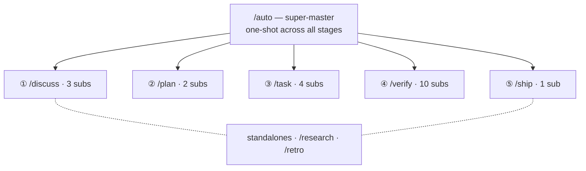

harnessed ให้ workflow 28 ตัวที่จัดชั้นตาม namespace: super-master หนึ่งตัว, master ระดับขั้นห้าตัว (Discuss · Plan · Task · Verify · Ship), subworkflow 20 ตัว และ workflow อิสระสองตัว

28 workflow — super-master หนึ่งตัวแตกออกไปยัง stage master ห้าตัวและ sub ของแต่ละตัว บวก workflow อิสระอีกสองตัว:

## Super-master

| คำสั่ง  | ขอบเขต       | Capability                                                                                                                                                                                                                                      |
| ------- | ------------ | ----------------------------------------------------------------------------------------------------------------------------------------------------------------------------------------------------------------------------------------------- |
| `/auto` | super-master | ไปป์ไลน์ 6 ขั้นเต็ม: research (มีเงื่อนไข) → discuss → plan → task → verify → retro (บังคับ) ประเมินความซับซ้อนด้วย AI ในลูปเดียว + เช็กความเข้าใจ แฟล็ก `--staged` เปิด UX แบบมีด่านรายขั้น ล้มเหลวแล้วหยุดทันที รันต่อด้วย `harnessed resume` |

## workflow อิสระ

| คำสั่ง      | ขอบเขต | Capability                                                                                                                      |
| ----------- | ------ | ------------------------------------------------------------------------------------------------------------------------------- |
| `/research` | อิสระ  | สืบค้นหลายแหล่งผ่าน Tavily, Exa MCP และ ctx7 ใน `/auto` ทำงานเป็นขั้นที่ 0 หรือเรียกตรง ๆ ก่อน discuss                          |
| `/retro`    | อิสระ  | สรุปปิดหมุดหมายผ่าน gstack `/retro` บันทึกบทเรียน การตัดสินใจ และสิ่งที่ค้นพบโดยไม่คาดคิดลง `RETROSPECTIVE.md` บังคับใน `/auto` |

## ขั้น Discuss

| คำสั่ง               | ขอบเขต           | Capability                                                                                                                        |
| -------------------- | ---------------- | --------------------------------------------------------------------------------------------------------------------------------- |
| `/discuss`           | master ระดับขั้น | ประเมิน gate การอภิปรายทั้งสามแบบขนาน และรันเฉพาะตัวที่ถูกกระตุ้น                                                                 |
| `/discuss-strategic` | subworkflow      | ชั้นกลยุทธ์ — ฟีเจอร์ใหม่ / milestone / ทิศทางผลิตภัณฑ์ gstack `/office-hours` + `/plan-ceo-review` บันทึก `findings.md`          |
| `/discuss-phase`     | subworkflow      | ชั้น phase — การตัดสินใจค้าง ≥2 เรื่อง ชี้แจงพื้นที่สีเทา GSD `gsd-discuss-phase` บันทึก `findings.md` + `knowledge.md`           |
| `/discuss-subtask`   | subworkflow      | ชั้น subtask — แนวทาง ≥2 แบบ / อัลกอริทึมแกนกลาง / contract API Superpowers brainstorming + `/grill-with-docs` ชั่วคราว ไม่บันทึก |

## ขั้น Plan

| คำสั่ง               | ขอบเขต           | Capability                                                                                                |
| -------------------- | ---------------- | --------------------------------------------------------------------------------------------------------- |
| `/plan`              | master ระดับขั้น | ตามลำดับ: รีวิวสถาปัตยกรรม (มีเงื่อนไข) → แผน phase (เสมอ)                                                |
| `/plan-architecture` | subworkflow      | ชั้นสถาปัตยกรรม — ด่านกำกับดูแลสำหรับสถาปัตยกรรมซับซ้อน gstack `/plan-eng-review` ล็อกการออกแบบก่อนวางแผน |
| `/plan-phase`        | subworkflow      | แผน phase — GSD `gsd-plan-phase` + planning-with-files บันทึก `task_plan.md` + `progress.md`              |

## ขั้น Task

| คำสั่ง          | ขอบเขต           | Capability                                                                                                                                  |
| --------------- | ---------------- | ------------------------------------------------------------------------------------------------------------------------------------------- |
| `/task`         | master ระดับขั้น | วนตามลำดับต่อ subtask: ชี้แจง → เขียนโค้ด → ทดสอบ → ส่งมอบ                                                                                  |
| `/task-clarify` | subworkflow      | ด่านชี้แจงตอนเริ่ม Superpowers brainstorming + `/grill-with-docs` แบบมีเงื่อนไข                                                             |
| `/task-code`    | subworkflow      | เขียนโค้ดตามหลัก karpathy 4 ข้อ `/zoom-out` / `/improve-codebase-architecture` / `/diagnose` แบบมีเงื่อนไข ซิงก์ `progress.md` ข้าม session |
| `/task-test`    | subworkflow      | TDD red → green → refactor Superpowers TDD + `/diagnose` แบบมีเงื่อนไข บังคับสำหรับตรรกะแกนกลาง                                             |
| `/task-deliver` | subworkflow      | wrapper SDK `ralph-loop` รันจนกว่าจะได้ `COMPLETE` ตรงตัวอักษร Agent Teams แบบมีเงื่อนไขเมื่อต้องประสานงานแบบ full-stack                    |

## ขั้น Verify

| คำสั่ง                   | ขอบเขต           | Capability                                                                                                                                               |
| ------------------------ | ---------------- | -------------------------------------------------------------------------------------------------------------------------------------------------------- |
| `/verify`                | master ระดับขั้น | แจกจ่ายการตรวจย่อยได้สูงสุด 7 รายการตามแฟล็กของสถานการณ์                                                                                                 |
| `/verify-progress`       | subworkflow      | ทำงานเป็นตัวแรกเสมอ ตรวจเกณฑ์การยอมรับ UAT + ซิงก์สถานะ GSD                                                                                              |
| `/verify-code-review`    | subworkflow      | fan-out ขนานหลาย subagent ข้อค้นพบที่มั่นใจสูง                                                                                                           |
| `/verify-paranoid`       | subworkflow      | รีวิวโดย staff engineer สายระแวงผ่าน gstack `/review` บังคับสำหรับโมดูลสำคัญก่อนเปิด PR                                                                  |
| `/verify-qa`             | subworkflow      | QA แบบครบวงจรผ่าน gstack `/qa` + playwright-cli / `@playwright/test` ทำงานเมื่อมีการเปลี่ยน UI                                                           |
| `/verify-security`       | subworkflow      | ตรวจ OWASP / auth / secret ผ่าน gstack `/cso` ทำงานเมื่อแตะ auth หรือ secret                                                                             |
| `/verify-design`         | subworkflow      | ตรวจความสอดคล้องของ design system ผ่าน gstack `/design-review` + ui-ux-pro-max + design-taste-frontend ทำงานเมื่อมีการเปลี่ยนดีไซน์                      |
| `/verify-eval-review`    | subworkflow      | ตรวจสอบความครอบคลุมของ eval สำหรับ phase ที่มี AI ผ่าน GSD `/gsd-eval-review` ทำงานเมื่อ phase มีขั้น AI/LLM (คู่กับ gsd-ai-integration-phase ฝั่ง plan) |
| `/verify-validate-phase` | subworkflow      | เติมความครอบคลุม requirement→test ตาม Nyquist ผ่าน GSD `/gsd-validate-phase` ทำงานเมื่อจำเป็นต้องตรวจความครอบคลุม                                        |
| `/verify-simplify`       | subworkflow      | ทำให้เรียบง่ายครั้งสุดท้ายผ่าน `code-simplifier` ทำงานเป็นตัวสุดท้ายเสมอ                                                                                 |
| `/verify-multispec`      | subworkflow      | Agent Team ผู้เชี่ยวชาญสี่คน Pattern C — ซักค้านกันผ่าน SendMessage เส้นทางยกระดับสำหรับการปล่อยรุ่นสำคัญและ PR รีแฟกเตอร์ขนาดใหญ่                       |

## Ship (ขั้นที่ ⑤)

| คำสั่ง            | ขอบเขต           | Capability                                                                                                                                                                     |
| ----------------- | ---------------- | ------------------------------------------------------------------------------------------------------------------------------------------------------------------------------ |
| `/ship`           | master ระดับขั้น | ขั้นปล่อยรุ่นหลัง Verify รันด่าน preflight ก่อน แล้วมอบงาน PR/deploy ให้ gstack `/ship` ขอบเขตของ deploy คือ tag-ready ส่วนการ publish จริงทำโดย CI `publish.yml` ตอน push tag |
| `/ship-preflight` | subworkflow      | รัน `harnessed release-preflight` — ด่านอ่านอย่างเดียว (CHANGELOG `[Unreleased]` / version / git-clean / tag-absent) ถ้าข้อใดไม่ผ่านจะบล็อกการปล่อยรุ่น                        |

## wrapper เชิงวินัย

| คำสั่ง          | ขอบเขต     | Capability                                                                                                      |
| --------------- | ---------- | --------------------------------------------------------------------------------------------------------------- |
| `/tdd`          | วินัย      | red → green → refactor ชื่อแทนของ `superpowers:test-driven-development` ใช้เป็น wrapper เชิงวินัยเดี่ยว ๆ ก็ได้ |
| `/ralph-loop`   | wrapper    | wrapper คำสัญญาว่าเสร็จ รัน prompt ใดก็ได้จนกว่าจะได้ `COMPLETE` ตรงตัวอักษร ฝังอยู่ใน `/task-deliver` แล้ว     |
| `/execute-task` | เครื่องมือ | จุดเข้าสำหรับรัน task ตรง ๆ ข้ามขั้น discuss/plan                                                               |

นิยาม workflow ทั้งหมดอยู่ที่ `workflows/<name>/workflow.yaml` ใน [repo ของ harnessed](https://github.com/easyinplay/harnessed)
