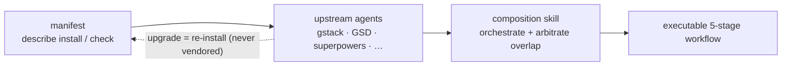

## Sorun

Yapay zekâ kodlama harness’ları — ECC, Superpowers, GSD, gstack — ayrı npm paketleri ya da git depoları olarak yayımlanır. Bunları elle bir araya getirmek kırılgandır: upstream kodu fork edersiniz, yerelde yamalarsınız ve sonra upstream kolayca birleştiremeyeceğiniz yeni sürümler çıkardıkça her şeyin çürümesini izlersiniz.

Geleneksel yanıt vendoring’dir: upstream kodu kendi deponuza kopyalayıp bakımını üstlenmek. Bu, upstream önemli bir iyileştirme yayımlayana kadar işe yarar; ardından eski bir fork’ta sıkışıp kalırsınız. Onlarca harness bileşenini elle senkron tutmak ölçeklenmez.

## harnessed’ın yaklaşımı

harnessed upstream kodu asla kopyalamaz. Bunun yerine her harness paketi bir **manifest** ile gelir — paketin nasıl kurulacağını, hangi capability’leri açtığını ve diğer bileşenlerle nasıl bütünleştiğini tanımlayan tipli bir YAML dosyası.

Runtime’da harnessed bu manifestleri okur, uyumluluğu doğrular ve kompozisyon skills’leri aracılığıyla upstream araçları orkestre eder. Çalıştırdığınız her zaman resmi upstream binary’sidir — harnessed yalnızca devir teslimleri koordine eder.

Vendoring değil montaj — manifestler tanımlar, kompozisyon skill’i orkestre eder:



Örnek manifest (kısaltılmış):

```yaml
name: my-pack
version: 1.0.0
description: harnessed’a OAuth2 iş akışları ekler
install:
  - npm: superpowers
  - git: https://github.com/example/skill-pack-oauth
capability:
  skills:
    - brainstorming
    - tdd
  workflows:
    - discuss
    - plan
```

## Faydalar

**Her zaman en güncel upstream.** Superpowers yeni bir sürüm çıkardığında `harnessed install` komutunu yeniden çalıştırıp anında alırsınız. Elle birleştirme yok, bayat fork yok.

**Doğrulanmış kompozisyon.** `harnessed setup`, kurulumdan önce manifest uyumluluğunu kontrol eder. Çakışan capability bildirimleri runtime sürprizi olarak değil, hata olarak yüzeye çıkar.

**Kendi paketinizi yazın.** Manifest schema’sı depoda `schemas/manifest.v1.schema.json` yolunda yayımlanmıştır (satır içi doğrulama için YAML language server’ınızı oraya yöneltin). Manifestinizi kurulabilir herhangi bir upstream’e (npm paketi, git deposu, özel skill) yöneltin; harnessed onu birinci sınıf birleştirilebilir bir birim olarak ele alacaktır.

**Tek giriş noktası.** Kullanıcılar her upstream’in terminolojisini öğrenmek zorunda kalmadan `/discuss`, `/plan`, `/task`, `/verify` ile karşılaşır. Her aşamada doğru upstream araca yönlendirmeyi kompozisyon skill’i yapar.

## Kompozisyon skills’leri nasıl çalışır

v4.0’dan beri harnessed bir yürütme motoru değil, bir **orchestration brain + prompt kütüphanesi**dir. Artık iş akışlarını kendi süreci içinde spawn etmez — bunun yerine (`harnessed setup` tarafından üretilen) eğik çizgi komut gövdesi, Claude Code ana oturumunu **CC-native subagent** spawn etmeye yönlendirir; bunu üç hızlı saf fonksiyon CLI sürer. `/discuss` çalıştırdığınızda:

1. **Gate** — `harnessed gates discuss --task "<spec>"`, üç tartışma kapısından hangilerinin tetiklendiğini (strategic / phase / subtask) ve Agent Teams’e yükseltilip yükseltilmeyeceğini döner.
2. **Prompt** — tetiklenen her kapı için `harnessed prompt <sub> --json`, spawn’a hazır bir prompt üretir (role gövdesi + kontrol listesi + uygulanan disciplines).
3. **Spawn** — ana oturum yerel bir `Task` spawn’ı çalıştırır (tamamlama vaadini harnessed'ın kendi gate'i `harnessed checkpoint complete` üstlenir) ve her `STATUS: NEEDS_CLARIFICATION` yanıtını `AskUserQuestion` ile size geri iletir.
4. **Checkpoint** — `harnessed checkpoint complete <sub>`, ilerlemeyi `.planning/` altına kaydeder; böylece çalıştırma compaction’dan sağ çıkar.

harnessed kararları üretir (kapı yönlendirmesi, prompt üretimi, ilerleme ledger’ı); asıl spawn, Agent Teams koordinasyonu ve netleştirme gidiş gelişleri ana oturumun yerel Claude Code araçlarıyla yaptığı iştir. (`harnessed run`, yalnızca CI/headless için eski süreç içi spawn’ı korur.)

harnessed’ın 29 iş akışının ECC, Superpowers, GSD ve gstack’i aynı anda birleştirebilmesinin nedeni budur — kompozisyon katmanı dikiş yerlerini soyutlar.

29 iş akışının tamamı ve upstream bağımlılıkları için [İş akışı başvurusu](/tr/docs/reference/workflows/) bölümüne bakın.
