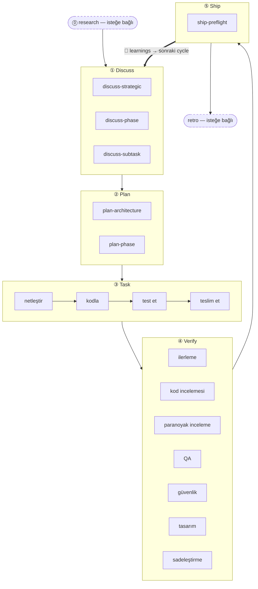

5 aşamalı ritim, harnessed’ın çekirdek metodolojisidir: her özellik, hata düzeltmesi ya da yeniden düzenleme aynı beş aşamadan sırayla geçer — **Discuss → Plan → Task → Verify → Ship** — ve otomatik bir **Learn** döngüsüyle kapanır. İki yardımcı aşama (Research, Retro) ana döngünün iki ucunda yer alır.

## Aşamalar

| #   | Aşama        | Eğik çizgi komutu | Mod                                                           |
| --- | ------------ | ----------------- | ------------------------------------------------------------- |
| 0   | **Research** | `/research`       | isteğe bağlı — anlayış eksikse tetiklenir                     |
| 1   | **Discuss**  | `/discuss`        | zorunlu                                                       |
| 2   | **Plan**     | `/plan`           | zorunlu                                                       |
| 3   | **Task**     | `/task`           | zorunlu                                                       |
| 4   | **Verify**   | `/verify`         | zorunlu                                                       |
| 5   | **Ship**     | `/ship`           | açık — yayın aşaması (kullanıcı tetikler)                     |
| —   | **Retro**    | `/retro`          | `/auto` içinde zorunlu, tek başına çağrıldığında isteğe bağlı |

**Öğrenme bir aşama değil, otomatiktir.** Tamamlanan her workflow, kendi failure/loop/reject sinyallerini `.planning/LEARNINGS.md` dosyasına ekler; inject hook ilgili learnings’i bir sonraki session’a enjekte eder. Bu her zaman açıktır ve isteğe bağlı Retro’ya **bağlı değildir**.

### Research (isteğe bağlı)

Tavily, Exa ve ctx7 üzerinden çok kaynaklı araştırma. `/auto` içinde anlama kontrolüne "hayır" yanıtı verdiğinizde tetiklenir ya da doğrudan `/research` ile çağrılır. Çıktı `.planning/` altındaki `research-notes.md` dosyasına yazılır.

### Discuss — 3 katmanlı kapılar

`/discuss` üç kapıyı bağımsız değerlendirir ve yalnızca tetiklenenleri çalıştırır:

- **Stratejik katman** (`discuss-strategic`): yeni özellik, yeni milestone, yeni ürün yönü → gstack `/office-hours` + `/plan-ceo-review`. `findings.md` kalıcılaştırır.
- **Faz katmanı** (`discuss-phase`): açık kalmış ≥2 uygulama kararı, modüller arası veri akışı belirsiz → GSD `gsd-discuss-phase`. `findings.md` + `knowledge.md` kalıcılaştırır.
- **Alt görev katmanı** (`discuss-subtask`): ≥2 farklı yaklaşımı olan çekirdek algoritma / API contract → Superpowers brainstorming. Geçicidir, kalıcılaştırmaz.

Her kapı, tetiklendiğinde de atlandığında da bunu şeffaf biçimde bildirir.

### Plan — mimari inceleme + kalıcılaştırma

`/plan` iki adımı sırayla çalıştırır:

1. **Mimari inceleme** (koşullu) — karmaşık mimariler gstack `/plan-eng-review` tetikler ve tasarımı kalıcılaştırmadan önce sabitler
2. **Faz planı** — GSD `gsd-plan-phase` + planning-with-files, tam dosya yolları, kabul ölçütleri ve bağımlılık sırasıyla `task_plan.md` üretir

### Task — alt görev döngüsü

`/task` her alt görev için dört adımı kesin sırayla çalıştırır:

1. **Netleştir** — spec’i doğrula, belirsizlikleri açığa çıkar, `task_plan.md` ile karşılaştır
2. **Kodla** — karpathy ilkeleri: mümkün olan en küçük değişiklik, cerrahi düzenlemeler, kapsamı büyütme
3. **Test et** — çekirdek mantıkta TDD red → green → refactor; CRUD ve apaçık uygulamalarda isteğe bağlı
4. **Teslim et** — `harnessed checkpoint complete` gate'i, devam etmeden önce birebir `COMPLETE` çıktısını şart koşar

### Verify — 7 koşullu alt kontrol

`/verify` neyin değiştiğine göre alt kontroller dağıtır. Her zaman çalışanlar: `verify-progress` (UAT + durum eşitleme), `verify-code-review` (çok agent’lı paralel), `verify-simplify` (son temizlik). Koşullu olanlar: paranoyak inceleme, QA, güvenlik, tasarım, multispec.

### Ship — yayın aşaması

`/ship`, Verify’dan sonra gelen 5. aşamadır. Önce `harnessed release-preflight` çalıştırır (yalnızca okuyan yayın hazırlığı kapısı — `CHANGELOG [Unreleased]`/version/git-clean/tag-absent), ardından PR + deploy işini gstack `/ship`’e devreder. **Deploy sınırı tag-ready’dir**: bu aşama push etmez, publish etmez, tag oluşturmaz — asıl `npm publish` ve GitHub release, tag push’unda `publish.yml` CI tarafından çalıştırılır (açık onay gerektirir). "PR ready ≠ release ready".

### Retro

gstack `/retro`, kilometre taşı derslerini, karar kayıtlarını ve beklenmedik bulguları kaydeder. `/auto` içinde zorunlu olarak çalışır. Herhangi bir kilometre taşının sonunda tek başına da çağrılabilir. (Yukarıdaki her zaman açık Learn döngüsünden farklıdır.)

## Akış diyagramı



## `/auto` ile tek tek aşama komutları

`/auto`, çekirdek geliştirme aşamalarını otomatik zincirler (research koşullu → discuss → plan → task → verify → retro). **Ship açıktır** — `/auto` kendiliğinden yayın yapmaz; kilometre taşı sürüm kesmeye hazır olduğunda `/ship` komutunu siz çalıştırırsınız. Tek tek aşama komutları herhangi bir noktadan girmenizi sağlar:

```
/discuss "hız sınırlayıcı ekle"      # yalnızca discuss çalışır
/plan "hız sınırlayıcı"              # yalnızca plan çalışır (discuss yapılmış varsayılır)
/task "ara katmanı uygula"           # yalnızca task çalışır
/verify "hız sınırlayıcı özelliği"   # yalnızca verify çalışır
/ship                                # yalnızca ship çalışır (release-preflight → tag-ready)
```

_Birden çok_ faz boyunca ilerlerken `harnessed advance`, sonraki fazı `.planning/` diskteki durumdan türetir ve çalıştırılacak komutu yazdırır — böylece bir driver loop birden çok fazı elle müdahale olmadan zincirleyebilir (`while harnessed advance --json; do : ; done`) ve önceki bir faz tamamlanmamışsa advance-gate’te durur. Ayrıntı için [CLI başvurusu](../../reference/cli/) içindeki `harnessed advance` maddesine bakın.

Cerrahi alt iş akışı çağrıları master’ı tamamen atlar:

```
/discuss-phase "..."        # yalnızca faz katmanı netleştirmesi
/plan-architecture "..."    # yalnızca mimari inceleme
/verify-paranoid "..."      # yalnızca paranoyak mühendis kontrolü
```

Mimari kararlar [ADR 0030](https://github.com/easyinplay/harnessed/blob/main/docs/adr/0030-namespace-policy.md), 0031 ve 0032 (ad alanı tasarım kararları) belgelerinde ayrıntılıdır.
