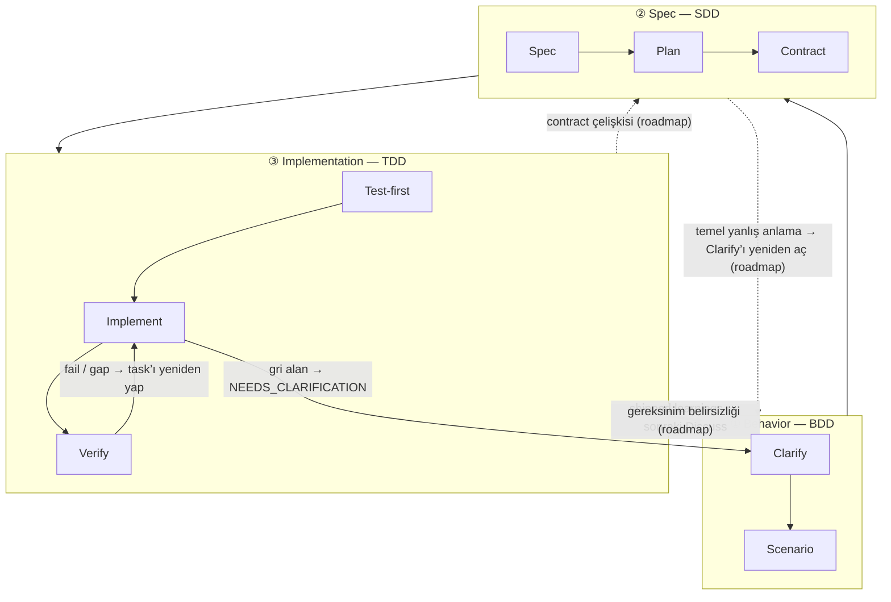

Üç katmanlı yığın, harnessed’ın ritminin _neden_ bu biçimde olduğuna dair teorisidir. Yerleşik **BDD → SDD → TDD** iç içeliğinin yazılım mühendisliği uygulamasıdır: üç iç içe geri besleme döngüsü, her biri farklı bir soruya yanıt verir. harnessed’ın katkısı, açık kaynak ekosistemi her döngünün içine **birleştirmektir** — ve upstream bileşenler _kısmen örtüştüğü_ için, bu örtüşmeyi hakemlik etmek tam olarak bir kompozisyon orkestratörünün işidir.

## Üç döngü

| Katman               | Loop | Yanıtladığı soru                              | Neyden birleştirildi (örtüşen)                                                                    |
| -------------------- | ---- | --------------------------------------------- | ------------------------------------------------------------------------------------------------- |
| **① Behavior**       | BDD  | _Ne_ inşa edilecek ve bittiğini nasıl anlarız | gstack `/office-hours` governance · GSD discuss · superpowers brainstorming → acceptance criteria |
| **② Spec**           | SDD  | _Nasıl_ yapılandırıldı                        | GSD plan-phase → requirements / design / tasks · contracts (Spec Kit / ECC patterns)              |
| **③ Implementation** | TDD  | Gerçekten _çalışıyor mu_                      | superpowers TDD red-green · subagent execution · GSD verify-work · harnessed completion gate          |

**Döngüler aşama değil, iç içe merceklerdir.** Cucumber, BDD-dış + TDD-iç çift döngüsünü yaygınlaştırdı: başarısız bir scenario dış döngüyü açar, siz de birden çok iç red-green TDD döngüsüyle onu yeşile sürersiniz. GenAI çağı araya bir halka ekledi — Behavior ile Implementation arasında açık bir SDD **spec** halkası, çünkü agent’ların yürütmek için dondurulmuş bir contract’a ihtiyacı var. Böylece yukarıdaki **triple-loop** oluşur.

## Düğüm bazında açılım

Her döngü düğümlere ayrılır ve her düğüm hangi açık kaynak bileşen(ler)den birleştirildiğini gösterir.

### ① Behavior (BDD)

| Düğüm        | Rol                                                         | Neyden birleştirildi                                             |
| ------------ | ----------------------------------------------------------- | ---------------------------------------------------------------- |
| **Clarify**  | _Ne_ inşa edileceğini sabitle + belirsizlikleri açığa çıkar | gstack `/office-hours` + GSD discuss + superpowers brainstorming |
| **Scenario** | Niyeti acceptance criteria’ya çevir                         | GSD phase success criteria                                       |

Dış döngü, scenario’nun acceptance criteria’sı yazılana kadar açık kalır. "Bitti" tanımı burada kararlaştırılır — herhangi bir yapıdan ya da koddan önce.

### ② Spec (SDD)

| Düğüm        | Rol                      | Neyden birleştirildi                                             |
| ------------ | ------------------------ | ---------------------------------------------------------------- |
| **Spec**     | requirements + design    | GSD plan-phase + Spec Kit üçlüsü (requirements / design / tasks) |
| **Plan**     | tasks + bağımlılık DAG’ı | GSD `PLAN.md` + ECC ayrıştırması                                 |
| **Contract** | arayüz dondurulmuş       | contract gelenekleri                                             |

Orta halka "ne"yi yürütülebilir yapıya çevirir. Çıkış koşulu **dondurulmuş bir contract**’tır — implementation döngüsünün karşısında test yazacağı arayüz.

### ③ Implementation (TDD)

| Düğüm          | Rol                                | Neyden birleştirildi                    |
| -------------- | ---------------------------------- | --------------------------------------- |
| **Test-first** | başarısız test (red gate)          | superpowers TDD                         |
| **Implement**  | yeşile sür                         | subagent execution                      |
| **Verify**     | refactor + görev bazında tamamlama | GSD verify-work + harnessed completion gate |

İç halka klasik red → green → refactor döngüsüdür; tüm contract’lar karşılanana kadar her görev için bir tur döner.

### Kesişen konular

İki konu herhangi bir tek döngünün dışında kalır:

| Konu       | Rol                        | Neyden birleştirildi                 |
| ---------- | -------------------------- | ------------------------------------ |
| **Review** | kalite + güvenlik kapıları | gstack `/review` + `/cso`            |
| **Ship**   | yayın hazırlığı + teslim   | `release-preflight` + gstack `/ship` |

Ayrıca iki **discipline** _her_ katmandan geçer:

- **karpathy principles** — _how_ to code: mümkün olan en küçük değişiklik, cerrahi düzenlemeler, simplicity first.
- **mattpocock moves** — talep üzerine araçlar (`/zoom-out`, `/diagnose`, `/grill-with-docs`), duruma göre çağrılır.

## Geri dönüşler (GoBack)

Akışın varsayılanı dıştan içe doğrudur. **harnessed bu triple-loop’un linear-cadence gerçeklemesidir — tam yönlendirilmiş graf ise onun evrim yoludur.** Bu döngüler hâlâ geri besleme döngüleridir, ama bugün yalnızca bir kısım geri dönüş kenarı yayında; daha ince taneli, halka bazlı yönlendirme roadmap’tedir. Aşağıdaki diyagram yayındaki kenarları düz çizgiyle, roadmap kenarlarını kesikli çizgi ve `(roadmap)` etiketiyle gösterir.

### Bugün yayında olan

Mevcut linear cadence’te üç canlı geri dönüş kenarı var:

- **Verify → Task** — başarısız bir kontrol ya da karşılanmamış bir gap, o işi implementation döngüsüne geri iter.
- **Gri alan → netleştirme** — bir subagent belirsizliğe çarptığında `STATUS: NEEDS_CLARIFICATION` döner; çalıştırma durur, netleştirilir ve devam eder.
- **Learnings → sonraki Discuss** — yayımlanan her döngü, failure/loop/reject sinyallerini ekler ve bunlar bir sonraki Behavior döngüsüne akar (her zaman açık learn loop).

### Roadmap (henüz yayında değil)

Daha ince taneli yapısal geri dönüşler — gap’i yanıtın sahibi olan halkaya _doğrudan_ yönlendirmek — mevcut davranış değil, evrim yönüdür:

- **Contract çelişkisi** (implementation dondurulmuş bir arayüzü karşılayamıyor) → **Spec**’e geri yönlendir.
- **Gereksinim belirsizliği** (contract kendi içinde tutarlı ama behavior eksik tanımlı) → **Behavior**’a geri yönlendir.
- **Temel yanlış anlama** (tüm yapı yanlış sonucu hedefliyor) → Behavior’ın **Clarify** adımını yeniden aç.

Bugün bu gap’ler yukarıdaki üç yayındaki kenar üzerinden yüzeye çıkar (genelde Verify → Task artı insan eliyle netleştirme), otomatik halka yönlendirmesiyle değil. Kompozisyon orkestratörünün yakın vadeli değeri, farklı upstream bileşenler farklı halkaların sahibiyken linear cadence’i tutarlı tutmaktır; yönlendirilmiş graf ise bir sonraki adımdır.

## Bileşenler kesişir — asıl mesele bu

Aynı upstream araç birden fazla döngüde görünür. Bu kesişme fazlalık değildir; kompozisyon orkestratörünün hakemlik etmesi gereken arayüzdür:

- **GSD** omurgadır — üç halkanın hepsinden geçer (discuss → plan → verify).
- **gstack**, **Behavior + Review**’ı kapsar.
- **superpowers**, **Behavior** (brainstorm) + **Implementation** (TDD) alanlarını kapsar.

Hakemlik olmadan bu kesişmeler ya mükerrer tetiklenir ya da birbiriyle çelişir. Kompozisyon katmanı her halkayı doğru upstream araca yönlendirir ve dikiş yerlerini çözer.

## Teori vs. runtime

Üç katmanlı yığın _teoridir_. [5 aşamalı ritim](/tr/docs/concepts/five-stage-cadence/) ise bu teorinin komut satırında çalışma biçimidir:

| Loop (teori)     | runtime aşaması                   |
| ---------------- | --------------------------------- |
| ① Behavior       | **Discuss**                       |
| ② Spec           | **Plan**                          |
| ③ Implementation | **Build** (Task)                  |
| Kesişen konular  | **Verify + Ship** (evidence gate) |

Upstream araçların fork edilmeden _nasıl_ birbirine dikildiğini görmek için [Vendoring yerine kompozisyon](/tr/docs/concepts/composition/) yazısına bakın.
