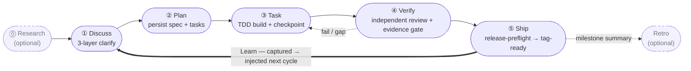

harnessed, yapay zekâ kodlama harness’ları için paket yöneticisi ve kompozisyon orkestratörüdür. Skills, MCP sunucuları ve harness paketlerini tipli bir manifest üzerinden birleştiren iş akışlarını kurar, birleştirir ve çalıştırır — upstream kodu vendoring yapmadan.

Claude Code ile geliştiriyorsanız, harnessed en iyi açık kaynak bileşenleri — ECC, Superpowers, GSD, gstack — tek bir komutla birbirine bağlayıp çalıştırılabilir tek bir iş akışına dönüştürür.

Çalışma döngüsü — beş aşama, her zaman açık bir Learn döngüsüyle kapanır:

## Nereden başlamalı

- **[Kurulum](/tr/docs/getting-started/installation/)** — harnessed’ı kurun ve setup’ı 30 saniyede çalıştırın
- **[Hızlı başlangıç](/tr/docs/getting-started/quickstart/)** — kurulumdan ilk iş akışına 60 saniyede
- **[Kompozisyon kavramı](/tr/docs/concepts/composition/)** — harnessed upstream araçları fork etmeden nasıl birleştirir
- **[İş akışı başvurusu](/tr/docs/reference/workflows/)** — mevcut sürümle gelen 28 birleştirilebilir iş akışının tamamı

## harnessed’ı farklı kılan ne

Her iş akışının altında üç ilke yatar:

**Vendoring yerine kompozisyon.** Her harness paketi bir manifest ile gelir. harnessed onu okur, uyumluluğu doğrular ve upstream araçları runtime’da birbirine diker. Çalıştırdığınız her zaman resmi upstream’dir — asla bayatlamış bir fork değil.

**Yerleşik 5 aşamalı ritim.** Discuss → Plan → Task → Verify → Ship; isteğe bağlı Research ve Retro ile birlikte, ayrıca otomatik bir öğrenme döngüsü. Ya da `/auto` çalıştırıp 6 aşamalı hattın tamamını (research → retro; Ship açıkça tetiklenir) tek komutta sürün.

**Dogfood öncelikli metodoloji.** Her iş akışı kendi tanımına karşı doğrulanır — harnessed’ın kendisini yayınlarken uyduğu disiplinin aynısı.

Bütünsel tanıtım için [README](https://github.com/easyinplay/harnessed#readme) dosyasını okuyun.
