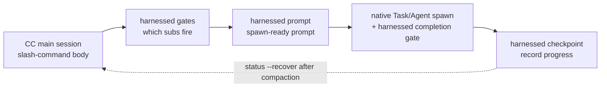

> **v4.0 yürütme modeli.** harnessed bir yürütme motoru değil, bir *orchestration brain + prompt kütüphanesi*dir. (`harnessed setup` tarafından üretilen) eğik çizgi komut gövdesi, üç hızlı saf fonksiyon CLI aracılığıyla **CC-native subagent spawn**’ı sürer — `harnessed gates` (hangi alt iş akışları tetiklenir), `harnessed prompt` (bir alt iş akışı için spawn’a hazır prompt) ve `harnessed checkpoint` (ilerlemeyi kaydeder). Asıl spawn, Agent Teams ve netleştirme gidiş gelişleri Claude Code ana oturumunun yerel araçlarla yaptığı iştir. `harnessed run` yalnızca CI/headless için korunur.

Üç orkestrasyon CLI’sı CC-native spawn’ı nasıl sürer:



## `harnessed` (you-are-here panosu)

`harnessed` komutunu **argümansız** çalıştırmak you-are-here panosunu yazdırır — devam eden bir workflow içinde yeniden yön bulmanın en hızlı yolu (comet `/comet` karşılığı, v8.0’da geldi).

```bash
harnessed          # insan tarafından okunabilir you-are-here + sonraki adım panosu
harnessed --json   # makine tarafından okunabilir yapılandırılmış nesne
```

Mevcut repo’daki devam eden workflow’u otomatik algılar; geçerli fazı, her alt iş akışının durumunu ve tek satırlık belirlenimci sözleşme `NEXT: auto | manual | done` ile birlikte bir çalıştırma ipucunu (örn. `→ run: harnessed prompt <sub>`) yazdırır. Devam eden workflow yoksa `harnessed setup`’a yönlendiren bir başlangıç ipucu yazdırır.

**Yalnızca okur** — spawn etmez, durumu/git’i/remote’u değiştirmez ve her zaman `0` ile çıkar. Panoyu yalnızca çıplak `harnessed` (ya da `harnessed --json`, isteğe bağlı `--lang` ile) gönderir; herhangi bir alt komut, `--help`, `--version` veya bilinmeyen bir sözcük normal komut ayrıştırmasına düşer (bu yüzden `harnessed bogus` hâlâ hata verir).

`--json` alanları: `active`, `phase`, `status`, `started_at`, `next`, `sub`, `hint`, `sub_progress`.

---

## `harnessed setup`

Tek seferlik başlangıç — iş akışı skills’lerini ve temel manifestleri `~/.claude/` altına kurar.

```bash
harnessed setup [seçenekler]
```

**Ne yapar:**

1. `workflows/<name>/SKILL.md` dosyalarını tarar ve her birini `~/.claude/skills/<name>/` altına kopyalar
2. `manifests/tools/*.yaml` ve `manifests/skill-packs/*.yaml` dosyalarını işler
3. `~/.claude/settings.json` dosyasına `CLAUDE_CODE_EXPERIMENTAL_AGENT_TEAMS=1` yazar
4. İşletim sistemi yerel ayarını algılar ve `env.HARNESSED_USER_LANG` değerine yazar (zh-* → `zh-Hans`, diğerleri → `en`)

**Bayraklar:**

| Bayrak               | Açıklama                                                                             |
| -------------------- | ------------------------------------------------------------------------------------ |
| `--user-lang <code>` | Algılanan yerel ayarı geçersiz kılar. `en`, `zh-Hans`, `zh-CN`, `zh-TW` kabul edilir |
| `--dry-run`          | Yalnızca önizleme — yazılacakları gösterir, diski değiştirmez                        |

**Çıkış kodları:** `0` = başarılı, `1` = dosya sistemi hatası, `2` = SKILL.md içeren iş akışı bulunamadı.

---

## `harnessed install <pack>`

Bir harness paketini ada ya da yola göre kurar.

```bash
harnessed install <pack>
```

Paket manifestini çözer, şemaya karşı doğrular ve her `install` adımını sırayla çalıştırır. Bugün yerel yol ve git URL’den bootstrap desteklenir; npm registry’den paket keşfi planlanmaktadır.

---

## `harnessed install-base`

Tüm base profilini tek seferde kurar — `manifests/tools/*.yaml` ve `manifests/skill-packs/*.yaml` altındaki her manifest, sıralı biçimde. `install` üzerindeki bir `--base` bayrağı değil, kendi alt komutudur; böylece tek paket kapısıyla çakışmaz.

```bash
harnessed install-base                   # hemen uygula (varsayılan)
harnessed install-base --dry-run         # yalnızca önizleme — diski değiştirmez
harnessed install-base --non-interactive # tüm istemleri atla (CI / betikler)
```

İstatistik yazdırır: `installed / already-installed / skipped (user-aborted) / failed`.

**Çıkış kodları:** `0` = en az biri kuruldu ve hata yok · `1` = bir veya daha fazla hata · `2` = hiçbir şey kurulmadı (hepsi zaten kuruluydu ya da iptal edildi).

---

## `harnessed research`

research iş akışını çalıştırır — arama kategorisi alt yönlendirmesi → subagent spawn → birebir `COMPLETE`. `workflows/research/workflow.yaml` için ince bir takma addır.

```bash
harnessed research --query "compare Postgres vs SQLite for this use case"
harnessed research --query "..." --dry-run          # çözülen workflow + gate context önizlemesi (JSON)
harnessed research --query "..." --model sonnet      # subagent model: haiku | sonnet | opus
harnessed research --query "..." --non-interactive   # tüm istemleri atla (CI / betikler)
```

| Bayrak              | Açıklama                                                                        |
| ------------------- | ------------------------------------------------------------------------------- |
| `--query <text>`    | research prompt’u (**zorunlu**)                                                 |
| `--dry-run`         | Yalnızca önizleme — `{ workflow, yamlPath, gateContext }` yazdırır, spawn etmez |
| `--model <model>`   | subagent model: `haiku` \| `sonnet` \| `opus`                                   |
| `--non-interactive` | Tüm istemleri atla (CI / betikler)                                              |

**Çıkış kodları:** `0` = workflow tamamlandı · `1` = workflow runtime hatası · `2` = kullanım hatası (`--query` eksik ya da workflow yaml bulunamadı).

---

## `harnessed manifest-add <upstream>`

**EE-5 beş soruluk merge kapısından** sonra yeni bir upstream adaptörü ekler — beş etkileşimli soru, yeni bir upstream’i kompozisyona almadan önce düşünülmüş bir karar vermeyi zorunlu kılar (yeniden kullanılabilir bir surface mi, ad uygun mu, mevcut bileşenlerle örtüşüyor mu, bir kavramı mı yoksa başkasının ürün kimliğini mi içeri alıyorsunuz, upstream’i bilmeyen bir kullanıcı yine de anlar mı). Beş sorunun hepsi boş olmayan yanıt gerektirir.

```bash
harnessed manifest-add https://github.com/owner/repo.git
harnessed manifest-add <upstream> --category tools    # skill-packs (varsayılan) | tools
harnessed manifest-add <upstream> --name myadapter    # varsayılan: <upstream> basename
harnessed manifest-add <upstream> --dry-run           # önizleme — yanıtları yazdırır, kaydetmez
harnessed manifest-add <upstream> --non-interactive   # CI: yalnızca WARN dry-run, hiçbir şey yazmaz
```

Başarılı olursa yanıtları `manifests/<category>/<name>.ee5-answers.json` dosyasına yazar.

| Bayrak              | Açıklama                                                   |
| ------------------- | ---------------------------------------------------------- |
| `--category <cat>`  | Manifest kategorisi: `skill-packs` (varsayılan) \| `tools` |
| `--name <name>`     | Kısa adaptör adı (varsayılan: `<upstream>` basename)       |
| `--dry-run`         | Yalnızca önizleme — yanıt JSON’unu yazdırır, kaydetmez     |
| `--non-interactive` | CI / betikler — yalnızca WARN, hiçbir şey yazmaz           |

**Çıkış kodları:** `0` = kapı geçti (yazıldı ya da önizlendi) · `1` = boş bırakılmış yanıt var.

---

## `harnessed uninstall [pack]`

Kurulu bir paketi kaldırır; argümansız çağrıldığında harnessed’ın kendi kurduğu dosyaları siler.

```bash
harnessed uninstall <pack>   # tek paketi kaldır (manifestindeki uninstall adımlarını çalıştırır)
harnessed uninstall          # ~/.claude/ altından harnessed’ın kendi skills/manifests dosyalarını kaldır
```

Skill’leri diske koyan üç kurulum yöntemi için (`npm-cli`, `git-clone-with-setup`, `npx-skill-installer`) uninstall, manifestin **bildirdiği `spec.uninstall` sözleşmesini** yürütür: önce bildirilen `cmd` çalıştırılır (fail-soft — sıfır olmayan çıkış ya da eksik shell yalnızca uyarır ve devam eder), ardından her `cleanup_paths` girdisi için idempotent bir force-rm yapılır ve bu işlem **`$HOME` içiyle sınırlıdır** (home alt ağacının dışındaki yollar hard-fail verir). settings/plugin/MCP üzerinde işlem yapan yöntemler (`cc-hook-add`, `cc-plugin-marketplace`, `mcp-*-add`) kendi kaldırıcılarını korur. Argümansız birleşik kaldırma, `harnessed setup` işlemini geri alır.

---

## Orkestrasyon CLI’ları (v4.0)

Bu üç saf fonksiyon CLI, üretilen eğik çizgi komut gövdesinin CC-native spawn’ı sürmek için kullandığı araçlardır. Yalnızca JSON yazdırırlar, kendileri spawn etmezler — orkestrasyonu ana oturum yapar.

### `harnessed gates <master>`

Belirli bir master orchestrator (`discuss` / `plan` / `task` / `verify` / `auto`) ve görev spec’i için hangi alt iş akışlarının tetiklendiğini değerlendirir.

```bash
harnessed gates plan --task "add OAuth login" --skip-sub discuss
# → JSON: { fire: [{ sub, order, mode }], skip: [...], parallelism: { escalate_to_teams } }
```

`fire`, yargı kapılarını geçen alt iş akışlarını yürütme sırasıyla listeler; `parallelism.escalate_to_teams`, sıralı subagent spawn yerine CC-native Agent Teams’e ne zaman geçileceğini gösterir.

### `harnessed prompt <sub>`

Tek bir alt iş akışı için spawn’a hazır prompt üretir — role-prompt gövdesi + kontrol listesi + uygulanan disciplines.

```bash
harnessed prompt plan-phase --task "add OAuth login" --json
# → JSON: { prompt, max_iterations, model }
```

Ana oturum bu `prompt`’u yerel bir `Task` spawn’ına verir (dışta `harnessed checkpoint complete`’i); `max_iterations` / `model` doğrudan iş akışı varsayılanlarından gelir.

### `harnessed checkpoint`

Alt iş akışı ilerlemesini harnessed checkpoint store’a kaydeder. Ana oturum, her alt iş akışı tamamlandığında (ve başarısız olduğunda) çağırır; böylece compaction sonrasında `harnessed status --recover` ile kurtarma mümkün olur.

```bash
harnessed checkpoint start <master> --plan <json>   # ilerleme ledger’ını tohumla
harnessed checkpoint complete <sub>                 # alt iş akışını tamamlandı olarak işaretle (evidence guard ile)
harnessed checkpoint fail <sub>                      # başarısız alt iş akışını kaydet
```

### `harnessed run`

**Yalnızca CI / headless.** İş akışının tamamını süreç içinde SDK ile spawn eder — orkestre edecek etkileşimli bir ana oturum olmadığında kullanılır. v4.0’ın varsayılan yolu yukarıdaki gates → prompt → checkpoint orkestrasyonudur; `run` yedek yoldur.

```bash
harnessed run <master> --task "<spec>"
```

---

## `harnessed doctor`

Yerel harnessed + Claude Code kurulumunu teşhis eder — 23 kontrollü bir sağlık raporu (Node, MCP kapsamı ve sunucuları (tavily/exa), jq, bun, Windows bash türü, origin URL, gstack öneki, kullanımdan kaldırılmış manifest'ler, token bütçesi, Agent Teams env, planning-with-files, mattpocock-skills, CodeGraph, GateGuard çakışması, iş akışı skill bütünlüğü, update, kurulum kanalı, eskimiş hook'lar, ECC, tur başına enjeksiyon eşleşmesi, eklenti kurulum güncelliği, `HARNESSED_OFF` ablasyon anahtarı). `HARNESSED_OFF=1`, harnessed'ın her zaman açık tüm hook'larını no-op yapar (kaldırmadan A/B karşılaştırması için temiz bir kontrol grubu); ayarlı olduğu sürece doctor uyarı verir.

```bash
harnessed doctor
harnessed doctor --json   # makine tarafından okunabilir rapor
```

---

## `harnessed update`

harnessed'ı (ve isteğe bağlı olarak upstream eklentilerini) güncel tutar. doctor'ın update kontrolü de "update available X→Y" bilgisini pasif olarak gösterir. `update` çift kanallıdır — harnessed'ın nasıl kurulduğunu algılar ve uygun akışı izler.

```bash
harnessed update                      # kendini yükselt + CHANGELOG üst bölümü + yeniden başlatma uyarısı
harnessed update --check              # yalnızca installed/latest sürümlerini bildirir, kurmaz
harnessed update --dry-run            # yapılacak güncelleme adımlarını önizler — hiçbir şey yazmaz
harnessed update --upstreams          # temel manifestleri yeniden çalıştırarak upstream eklentileri de yükseltir
harnessed update --migration-report   # eskimiş harnessed durumunun salt okunur dökümü (hiçbir şey silmez)
harnessed update --rollback [version] # yalnızca derlenmiş binary — bin-backup/ içinde saklanan eski sürümü geri yükler
```

**npm kanalı** — `npm i -g harnessed@latest` çalıştırır, CHANGELOG üst bölümünü yazdırır ve Claude Code’u yeniden başlatmayı hatırlatır.

**Derlenmiş binary kanalı** (tek satırlık kurulum betiği) — platform varlığını GitHub releases’tan indirir, `.sha256` sağlamasını **ve onun ed25519 imzasını** doğrular (`<asset>.sha256.sig`; v4.32.19’dan beri yayın sözleşmesi — eksik imza da başarısız doğrulama da hard error’dur ve mevcut binary olduğu gibi kalır), ardından yeni binary’yi atomik olarak takar; değiştirilen eski sürüm geri alma için `bin-backup/` altına konur.

**`--rollback [version]`** (yalnızca derlenmiş binary) — `bin-backup/` içinden eski bir sürümü atomik olarak geri yükler: varsayılan olarak en son saklanan sürüm, ya da belirtilen bir sürüm (bilinmeyen sürüm hata verir ve mevcutları listeler). Mevcut binary önce bin-backup’a alındığı için geri alma işlemi de tersine çevrilebilir. npm kurulum modunda reddeder ve `npm i -g harnessed@<version>` yolunu gösterir.

Ağ erişimi fail-soft’tur — npm erişilemezse asla hata vermez.

---

## `harnessed release-preflight`

Ship aşamasının kapısı. **Yalnızca okuyan** yayın hazırlığı kontrolü — repo yayına hazır değilse 1 ile çıkar. Hiçbir şeyi değiştirmez (asıl publish, tag push’unda CI tarafından yapılır).

```bash
harnessed release-preflight
```

Kontrol ettikleri: `CHANGELOG.md` içinde `[Unreleased]` (ya da `[<version>]` bölümü) boş değil, `package.json` geçerli bir version içeriyor, çalışma ağacı temiz (tracked değişiklikler) ve `v<version>` etiketi henüz yok.

---

## `harnessed compact`

Çözülmüş alt ilerleme ledger girdilerini özetleyip tahliye eder ve uzun görevler için bağlam açar. **G6-safe**: `fail_count > 0` olan girdiler asla tahliye edilmez, böylece break-loop sinyalleri korunur.

```bash
harnessed compact                                  # elle compaction
harnessed checkpoint complete <sub> --tokens <n>   # token sayısı eşiği aştığında kendiliğinden tetiklenir
```

---

## `harnessed workflows`

Devam eden workflow’ları listeler — repo başına bir tane (harnessed, checkpoint durumunu repo root’a göre ayırır; böylece paralel projeler birbirinin üzerine yazmaz).

```bash
harnessed workflows
```

---

## `harnessed learn`

Mevcut repo’nun `.planning/LEARNINGS.md` dosyasına düz metin bir learning ekler. Tamamlanan workflow’lar da kendi failure/loop/reject sinyallerini otomatik ekler; inject hook ilgili learnings’i bir sonraki session’a enjekte eder.

```bash
harnessed learn "migration’ı körlemesine yeniden deneme — önce temiz bir anlık görüntü gerekiyor"
```

---

## `harnessed retro`

retro-cadence hatırlatıcısını sıfırlar. `/retro` bir gstack skill’idir ve harnessed onu göremez; bu yüzden çalıştırdıktan sonra `harnessed retro --done` çağırarak repo başına faz sayacını sıfırlayın ve `RETRO-DUE` inject hatırlatıcısını temizleyin.

```bash
harnessed retro --done   # faz sayacını sıfırla + RETRO-DUE hatırlatıcısını temizle
```

`--done` olmadan hiçbir şey yapmaz ve `1` ile çıkar (`nothing to do — pass --done after running /retro`).

---

## `harnessed next`

Belirlenimci sonraki adım sözleşmesini yazdırır — yalnızca okur, durumu değiştirmez. İki katman:

1. **workflow devam ediyor** (hâlâ bekleyen sub var) → workflow içi sözleşme `NEXT: auto <sub> | manual <sub> | done` kullanılır (exit `0`, değişiklik yok).
2. **tüm sub’lar çözüldü** → **unit’ler arası yatay devam etmeye** (v4.10) düşer: `.planning/` diskteki tek doğruluk kaynağından bir sonraki work unit (sonraki phase / task) türetilir ve `NEXT: advance | blocked | done` yazdırılır.

```bash
harnessed next
# devam ediyor: NEXT: auto <sub>
# fall-through: NEXT: advance
#               UNIT: phase 16 'rate limiter'
#               HINT: run /auto (or harnessed advance) to start it — 2 phases remain
```

**Unit’ler arası çıkış kodları:** `0` = advance (sonraki unit var) · `2` = done (tüm phase’ler tamamlandı) · `10` = blocked (insan kararı gerekiyor).

---

## `harnessed advance`

`.planning/` diskteki tek doğruluk kaynağından türetilen bir sonraki work unit’e ilerler — **yalnızca yazdırır (print-only)**. Sonraki phase/task’ı ve çalıştırılacak komutu (örn. `→ run /auto "..."`) yazdırır, ama durumu **tohumlamaz** ve spawn **etmez**; yazdırılan komutu ana oturum kendisi çalıştırır, böylece netleştirme gidiş gelişleri ve Agent Teams korunur.

```bash
harnessed advance
# ADVANCE: advance
# UNIT: phase 16 'rate limiter'
# → run /auto "phase 16 'rate limiter'"
```

**advance-gate.** `advance`, önceki _tamamlanmamış_ bir phase’in üzerinden atlamayı reddeder ("comet" kapısı): türetilen sonraki phase, workflow pointer’ından önce sıralanıyorsa ya da başarısız bir sub ledger’ı tıkıyorsa, sıfır olmayan bir kodla çıkar ve çalıştırma komutunu **yazdırmaz**. `--force` ile geçersiz kılın — çıktıya bir denetim notu düşer ve devam eder.

```bash
harnessed advance --force   # kapıyı geçersiz kıl (denetim notu kaydeder)
```

**Driver loop.** `--json`, makine tarafından okunabilir `{ next, unit, hint }` üretir; böylece bir shell döngüsü birden çok phase’i elle müdahale olmadan zincirleyebilir — döngü sıfır olmayan herhangi bir çıkışta durur (done / blocked / gate-reject):

```bash
while harnessed advance --json; do : ; done
```

**Çıkış kodları:** `0` = advance · `2` = done (tüm phase’ler tamamlandı) · `10` = blocked · `11` = gate-reject (önceki phase tamamlanmamış; `--force` kullanın) · `1` = error.

**Tasarım — kuyruk tutma, diskten türet.** "Sonraki" her zaman diskten türetilir, asla saklanan bir kuyruktan değil. Bir phase tamamlanmış sayılır ⇔ her `NN-*-PLAN.md` için eşleşen bir `NN-*-SUMMARY.md` varsa (üretimden türetilir, bu yüzden yayımlanmış phase’ler doğal olarak atlanır). Araya bir phase eklerseniz (`ROADMAP.md`’yi düzenleyerek ya da `phases/16.1-*/` ekleyerek), bir sonraki `advance` onu kendiliğinden alır. Phase düzeyinde devam etme yayındaki tabandır; task düzeyinde çözümleme resolver-ready’dir ama henüz CLI’ya bağlanmamıştır.

---

## `harnessed reject <sub>`

Bir alt iş akışını kullanıcı tarafından reddedilmiş olarak işaretler — nihai bir durumdur ve break-loop yeniden deneme mantığını süren `failed` durumundan ayrılır.

```bash
harnessed reject <sub>
```

---

## `harnessed resume`

Başarısız olmuş bir `/auto` hattını, en son başarılı aşamadan itibaren sürdürür.

```bash
harnessed resume
```

`.planning/STATE.md` dosyasını okuyup en son başarılı aşamayı bulur ve hatta oradan yeniden girer. Bir aşama ortasında başarısızlık olduğunda kullanışlıdır.

---

## `harnessed status`

Mevcut çalışma dizini için hat durumunu gösterir.

```bash
harnessed status
```

`.planning/STATE.md` dosyasını okur; geçerli aşamayı, son tamamlanan aşamayı ve tüm engelleri yazdırır.

```bash
harnessed status --recover
```

`--recover`, STATE.md yerine checkpoint ilerleme ledger’ını okur ve compaction sonrası yapılandırılmış bir kurtarma görünümü yazdırır — tamamlanan / bekleyen / atlanan alt iş akışları, çalıştırılacak sonraki komut ve varsa evidence-drift uyarıları. Bağlam compaction’ından sonra yeniden yön bulmak için kullanın.

---

## `harnessed audit`

`manifests/tools/` ve `manifests/skill-packs/` altındaki manifestler için ikinci hat bir tutarlılık denetimi. Ajv şemasının yakalayamadığı schema drift, yer tutucu değerler ve kurcalamaları yakalayan derinlemesine savunma geçişidir.

```bash
harnessed audit                 # manifest + runtime katmanları
harnessed audit --skip-runtime  # yalnızca manifest katmanı (çevrimdışı / başlatılmamış)
```

**Manifest katmanı:** repository URL biçimi (`https://…​.git`), `signed_by` yer tutucu değerleri (`unsigned` / `todo` / `tbd` / …) ve hareketli `git_ref` (`HEAD` / `main` / `master` — bu bir _error_’dur: SHA ya da tag’e pinlenmeli). **Runtime katmanı** (`--skip-runtime` ile atlanır): origin-URL kurcalaması, `install.cmd` shell enjeksiyonu + npm paketi çapraz kontrolü, provenance kapısı. Manifest başına `✓ / ⚠ / ✗` raporu ve finding sayımı yazdırır.

**Çıkış kodları:** `0` = error düzeyinde finding yok (warning’lere izin verilir) · `1` = bir veya daha fazla error.

> **`audit` ile `audit-log`** — `audit`, _manifest dosyalarının_ bütünlüğünü doğrular; `audit-log` (aşağıda) ise gerçekleşmiş yönlendirme/kurulum _kayıtlarını_ sorgular. Farklı konulardır.

---

## `harnessed audit-log`

Yönlendirme/kurulum denetim kaydını görüntüler — hangi kapılar tetiklendi, hangi paketler ne zaman kuruldu.

```bash
harnessed audit-log                    # insan tarafından okunabilir 5 sütunlu tablo
harnessed audit-log --filter <pack>    # pakete/olaya göre filtrele
harnessed audit-log --json             # 12 alanlı tam kayıt
```

---

## `harnessed backup list`

`.harnessed-backup/` altındaki her yedek anlık görüntüsünü listeler — anlık görüntü başına bir satır; zaman damgası, kaynak manifest ve dosya sayısı. Her anlık görüntünün `metadata.json` dosyasından okunur.

```bash
harnessed backup list
```

`harnessed gc` (eski anlık görüntüleri siler) ve `harnessed rollback` (seçilen zaman damgasından geri yükler) ile eşleşir.

---

## `harnessed gc`

install/uninstall/rollback işlemlerinden kalan eskimiş yedekleri temizler.

```bash
harnessed gc
```

---

## `harnessed rollback`

En son yedekten önceki durumu geri yükler (CRLF/LF korunur) — son install/setup değişikliğini geri alır.

```bash
harnessed rollback
```

---

## `harnessed check-docs`

`.planning/` için dokümantasyon disiplini gate'i — STATE.md özet satır sınırı (varsayılan 100), arşivleme sıklığı ve ROADMAP'te gömülü anlatı yerine işaretçiler. Engelleyici bir ihlalde `2`, yalnızca tavsiye niteliğinde bulgular varsa `1` ile çıkar.

```bash
harnessed check-docs                       # insan tarafından okunabilir rapor
harnessed check-docs --json                # makine tarafından okunabilir
harnessed check-docs --max-state-lines 120 # STATE.md tavanını yükselt
harnessed check-docs --hook                # PreToolUse modu: yalnızca `git commit`'i denetler
```

---

## `harnessed facts <master>`

Bir master'ın gerçekten kullandığı gate facts'i listeler — deterministik olanlar doldurulur, muhakeme gerektirenler tek satırlık bir ipucuyla `null` bırakılır. Kalanını doldurup dosyayı `harnessed gates --context-file`'a verin.

```bash
harnessed facts verify --out facts.json
harnessed gates verify --context-file facts.json
```

---

## `harnessed eval`

Orkestratör davranışı için regresyon trap paketini çalıştırır: kaydedilmiş senaryolar golden'lara karşı deterministik olarak yeniden oynatılır. Bu bir CI gate'idir.

```bash
harnessed eval                     # ./fixtures/eval'i çalıştır
harnessed eval --filter <substr>   # yalnızca adı veya dizini eşleşen senaryolar
harnessed eval --coverage          # judgments trigger kapsam matrisi
harnessed eval --update-golden     # golden'ları yeniden kaydet — yazdırılan diff'i inceleyin
harnessed eval record              # gerçek bir çalıştırmanın izini yeniden oynatılabilir senaryoya dönüştür
```

---

## `harnessed exempt-gateguard`

`GATEGUARD_EXEMPT_GLOBS=".planning/**"` değerini harness ayarlarının env'ine kalıcı olarak yazar (önce yedek, atomik yazma). ECC'nin GateGuard hook'u ile harnessed evidence guard arasındaki çift koruma çakışmasını çözer; doctor'ın GateGuard kontrolü buraya yönlendirir.

```bash
harnessed exempt-gateguard
```

---

## Hook giriş noktaları (dahili)

`harnessed inject-state` ve `harnessed stop-hook`, `harnessed setup`'ın kaydettiği hook'lar tarafından çalıştırılır; elle kullanılmaz. `inject-state` her turda `<workflow-state>` bloğunu yazdırır (`--invalidate`, SessionStart'ta oturumun bağlam önbelleğini temizler); `stop-hook` tur sonunda bozuk araç çağrısı çıktısını otomatik olarak onarır. Derlenmiş ikili dosyalar bu alt komutları doğrudan kaydeder, böylece hook'lar ana makinede Node gerektirmez.

---

## `harnessed --version`

```bash
harnessed --version
# → 4.43.0
```

---

## `harnessed --help`

```bash
harnessed --help
harnessed <command> --help   # komut başına yardım
```

---

## Global bayraklar

| Bayrak      | Açıklama                  |
| ----------- | ------------------------- |
| `--version` | Sürümü yazdırır ve çıkar  |
| `--help`    | Yardımı yazdırır ve çıkar |

Kaynak kod, [harnessed deposunda](https://github.com/easyinplay/harnessed/tree/main/src/cli) `src/cli.ts` ve `src/cli/` altındadır.
