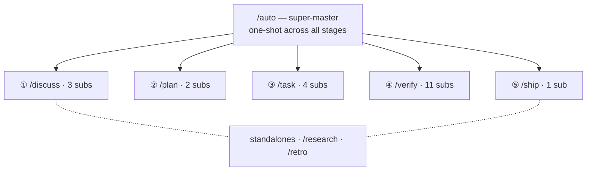

harnessed, ad alanına göre katmanlanmış 29 iş akışı sunar: bir super-master, beş aşama master’ı (Discuss · Plan · Task · Verify · Ship), 20 alt iş akışı ve iki bağımsız iş akışı.

29 iş akışı — bir super-master beş stage master’a ve onların alt akışlarına yayılır, ayrıca iki bağımsız iş akışı vardır:

## Super-master

| Komut   | Kapsam       | Capability                                                                                                                                                                                                                                                                   |
| ------- | ------------ | ---------------------------------------------------------------------------------------------------------------------------------------------------------------------------------------------------------------------------------------------------------------------------- |
| `/auto` | super-master | 6 aşamalı hattın tamamı: research (koşullu) → discuss → plan → task → verify → retro (zorunlu). Tek adımda AI karmaşıklık değerlendirmesi + anlama kontrolü. `--staged` bayrağı aşama kapısı UX’ini açar. Başarısızlıkta hızlıca durur, `harnessed resume` ile devam edilir. |

## Bağımsız iş akışları

| Komut       | Kapsam   | Capability                                                                                                                                                         |
| ----------- | -------- | ------------------------------------------------------------------------------------------------------------------------------------------------------------------ |
| `/research` | bağımsız | Tavily, Exa MCP ve ctx7 üzerinden çok kaynaklı araştırma. `/auto` içinde 0. aşama olarak tetiklenir ya da discuss öncesinde doğrudan çağrılır.                     |
| `/retro`    | bağımsız | gstack `/retro` ile kilometre taşı kapanış özeti. Dersleri, karar kayıtlarını ve beklenmedik bulguları `RETROSPECTIVE.md` dosyasına yazar. `/auto` içinde zorunlu. |

## Discuss aşaması

| Komut                | Kapsam         | Capability                                                                                                                                    |
| -------------------- | -------------- | --------------------------------------------------------------------------------------------------------------------------------------------- |
| `/discuss`           | aşama master’ı | Üç tartışma kapısını paralel değerlendirir, yalnızca tetiklenenleri çalıştırır.                                                               |
| `/discuss-strategic` | alt iş akışı   | Stratejik katman — yeni özellik / milestone / ürün yönü. gstack `/office-hours` + `/plan-ceo-review`. `findings.md` kalıcılaştırır.           |
| `/discuss-phase`     | alt iş akışı   | Faz katmanı — açık kalmış ≥2 karar, gri alan netleştirmesi. GSD `gsd-discuss-phase`. `findings.md` + `knowledge.md` kalıcılaştırır.           |
| `/discuss-subtask`   | alt iş akışı   | Alt görev katmanı — ≥2 yaklaşım / çekirdek algoritma / API contract. Superpowers brainstorming + `/grill-with-docs`. Geçici, kalıcılaştırmaz. |

## Plan aşaması

| Komut                | Kapsam         | Capability                                                                                                           |
| -------------------- | -------------- | -------------------------------------------------------------------------------------------------------------------- |
| `/plan`              | aşama master’ı | Seri: mimari inceleme (koşullu) → faz planı (her zaman).                                                             |
| `/plan-architecture` | alt iş akışı   | Mimari katman — karmaşık mimariler için yönetişim kapısı. gstack `/plan-eng-review`. Plandan önce tasarımı sabitler. |
| `/plan-phase`        | alt iş akışı   | Faz planı — GSD `gsd-plan-phase` + planning-with-files. `task_plan.md` + `progress.md` kalıcılaştırır.               |

## Task aşaması

| Komut           | Kapsam         | Capability                                                                                                                                                   |
| --------------- | -------------- | ------------------------------------------------------------------------------------------------------------------------------------------------------------ |
| `/task`         | aşama master’ı | Alt görev başına seri döngü: netleştir → kodla → test et → teslim et.                                                                                        |
| `/task-clarify` | alt iş akışı   | Başlangıçta netleştirme kapısı. Superpowers brainstorming + `/grill-with-docs` koşullu tetiklenir.                                                           |
| `/task-code`    | alt iş akışı   | karpathy’nin 4 ilkesiyle uygular. `/zoom-out` / `/improve-codebase-architecture` / `/diagnose` koşullu tetiklenir. Oturumlar arası `progress.md` eşitlemesi. |
| `/task-test`    | alt iş akışı   | TDD red → green → refactor. Superpowers TDD + `/diagnose` koşullu tetiklenir. Çekirdek mantıkta zorunlu.                                                     |
| `/task-deliver` | alt iş akışı   | harnessed'ın kendi tamamlama gate'i (`harnessed checkpoint complete`). Birebir `COMPLETE` çıkana kadar çalışır. Tam yığın koordinasyonunda Agent Teams koşullu tetiklenir.                          |

## Verify aşaması

| Komut                    | Kapsam         | Capability                                                                                                                                                      |
| ------------------------ | -------------- | --------------------------------------------------------------------------------------------------------------------------------------------------------------- |
| `/verify`                | aşama master’ı | Senaryo bayraklarına göre en fazla 11 alt kontrol dağıtır.                                                                                                       |
| `/verify-progress`       | alt iş akışı   | Her zaman ilk çalışır. UAT kabul ölçütü kontrolü + GSD durum eşitlemesi.                                                                                        |
| `/verify-code-review`    | alt iş akışı   | Çok subagent’lı paralel fan-out. Yüksek güvenli bulgular.                                                                                                       |
| `/verify-paranoid`       | alt iş akışı   | gstack `/review` ile paranoyak staff engineer incelemesi. Kritik modüllerde PR öncesi zorunlu.                                                                  |
| `/verify-qa`             | alt iş akışı   | gstack `/qa` + playwright-cli / `@playwright/test` ile uçtan uca QA. UI değişikliklerinde tetiklenir.                                                           |
| `/verify-security`       | alt iş akışı   | gstack `/cso` ile OWASP / auth / gizli anahtar kontrolü. auth ya da gizli anahtarlara dokunulduğunda tetiklenir.                                                |
| `/verify-design`         | alt iş akışı   | gstack `/design-review` + ui-ux-pro-max + design-taste-frontend ile tasarım sistemi tutarlılığı. Tasarım değişikliklerinde tetiklenir.                          |
| `/verify-eval-review`    | alt iş akışı   | GSD `/gsd-eval-review` ile AI fazının eval kapsam denetimi. Faz AI/LLM adımları içerdiğinde tetiklenir (plan tarafındaki gsd-ai-integration-phase ile eşleşir). |
| `/verify-validate-phase` | alt iş akışı   | GSD `/gsd-validate-phase` ile Nyquist gereksinim→test kapsamı tamamlama. Kapsam denetimi gerektiğinde tetiklenir.                                               |
| `/verify-second-opinion`  | alt iş akışı | Son release tag'inden bu yana oluşan diff için modeller arası ikinci görüş. Değişiklik motorun gerçekten okuduğu yüzeye dokunduğunda tetiklenir.      |
| `/verify-simplify`       | alt iş akışı   | `code-simplifier` ile son sadeleştirme. Her zaman en son çalışır.                                                                                               |
| `/verify-multispec`      | alt iş akışı   | Dört uzmanlı Agent Team Pattern C — SendMessage ile karşılıklı sorgulama. Kritik yayınlar ve büyük yeniden düzenleme PR’ları için yükseltme yolu.               |

## Disiplin sarmalayıcıları

| Komut  | Kapsam   | Yetenekler                                                                                                     |
| ------ | -------- | ---------------------------------------------------------------------------------------------------------------- |
| `/tdd` | disiplin | Red → green → refactor. Upstream `superpowers:test-driven-development` ile bestelenir (yedek: mattpocock `/tdd`). |

Tamamlama vaadi artık bir upstream sarmalayıcı değil: 4.36.0'dan beri harnessed'ın kendi gate'i olan `harnessed checkpoint complete ` bunu üstleniyor (ADR 0039); bu yüzden `/ralph-loop` ve eski `/execute-task` giriş noktası kaldırıldı.

Tüm iş akışı tanımları [harnessed deposunda](https://github.com/easyinplay/harnessed) `workflows/<name>/workflow.yaml` yolundadır.
