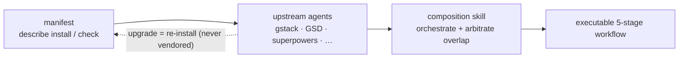

## Vấn đề

Các harness lập trình AI — ECC, Superpowers, GSD, gstack — đều phát hành dưới dạng gói npm hoặc repo git riêng biệt. Ghép chúng bằng tay rất mong manh: bạn fork mã upstream, vá tại chỗ, rồi nhìn nó mục dần khi upstream ra phiên bản mới mà bạn không dễ merge.

Câu trả lời truyền thống là vendoring: chép mã upstream vào repo của bạn và tự bảo trì. Cách này ổn cho tới khi upstream tung ra một cải tiến lớn và bạn mắc kẹt ở một fork cũ. Giữ hàng chục thành phần harness đồng bộ bằng tay là chuyện không thể mở rộng.

## Cách tiếp cận của harnessed

harnessed không bao giờ chép mã upstream. Thay vào đó, mỗi harness pack đi kèm một **manifest** — tệp YAML có kiểu, mô tả cách cài pack, nó phơi ra những capability nào và tích hợp với các thành phần khác ra sao.

Tại runtime, harnessed đọc các manifest này, kiểm tra tương thích và điều phối các công cụ upstream thông qua composition skills. Bạn luôn chạy binary upstream chính thức — harnessed chỉ điều phối các điểm bàn giao.

Lắp ráp, không phải vendoring — manifest mô tả, composition skill điều phối:



Manifest ví dụ (rút gọn):

```yaml
name: my-pack
version: 1.0.0
description: Thêm workflow OAuth2 cho harnessed
install:
  - npm: superpowers
  - git: https://github.com/example/skill-pack-oauth
capability:
  skills:
    - brainstorming
    - tdd
  workflows:
    - discuss
    - plan
```

## Lợi ích

**Luôn dùng upstream mới nhất.** Khi Superpowers ra bản mới, bạn chỉ cần chạy lại `harnessed install` là nhận được ngay. Không merge thủ công, không fork cũ kỹ.

**Kết hợp đã được kiểm chứng.** `harnessed setup` kiểm tra tương thích manifest trước khi cài. Các khai báo capability xung đột sẽ nổi lên dưới dạng lỗi, chứ không phải bất ngờ lúc runtime.

**Tự viết pack của bạn.** Schema của manifest được công bố trong repo tại `schemas/manifest.v1.schema.json` (trỏ YAML language server vào đó để có kiểm tra nội tuyến). Hãy trỏ manifest của bạn tới bất kỳ upstream cài được nào (gói npm, repo git, skill tự viết) và harnessed sẽ coi nó là một đơn vị kết hợp hạng nhất.

**Một điểm vào duy nhất.** Người dùng chỉ đối diện `/discuss`, `/plan`, `/task`, `/verify` mà không phải học thuật ngữ riêng của từng upstream. Composition skill lo việc định tuyến tới đúng công cụ upstream ở mỗi giai đoạn.

## Composition skills hoạt động ra sao

Từ v4.0, harnessed là **orchestration brain + thư viện prompt**, không phải engine thực thi. Nó không còn spawn workflow trong tiến trình của chính mình — thay vào đó, phần thân lệnh gạch chéo (do `harnessed setup` sinh ra) chỉ đạo main session của Claude Code spawn **CC-native subagent**, được điều khiển bởi ba CLI hàm thuần và nhanh. Khi bạn chạy `/discuss`:

1. **Gate** — `harnessed gates discuss --task "<spec>"` trả về gate thảo luận nào trong 3 gate được kích hoạt (strategic / phase / subtask) và có nên nâng lên Agent Teams hay không.
2. **Prompt** — với mỗi gate được kích hoạt, `harnessed prompt <sub> --json` phát ra một prompt sẵn sàng spawn (thân role + checklist + các disciplines đã áp dụng).
3. **Spawn** — main session chạy spawn `Task` gốc (bọc trong ralph-loop), chuyển mọi `STATUS: NEEDS_CLARIFICATION` về cho bạn qua `AskUserQuestion`.
4. **Checkpoint** — `harnessed checkpoint complete <sub>` ghi tiến độ vào `.planning/` để lần chạy sống sót qua compaction.

harnessed đóng góp các quyết định (định tuyến gate, sinh prompt, ledger tiến độ); còn việc spawn thực tế, điều phối Agent Teams và các vòng làm rõ do main session thực hiện bằng công cụ gốc của Claude Code. (`harnessed run` giữ lại kiểu spawn trong tiến trình cũ, chỉ dành cho CI/headless.)

Đó là lý do 28 workflow trong harnessed có thể kết hợp đồng thời ECC, Superpowers, GSD và gstack — lớp kết hợp trừu tượng hóa các đường nối.

Xem [Tham khảo workflow](/vi/docs/reference/workflows/) để biết cả 28 workflow và phụ thuộc upstream của chúng.
