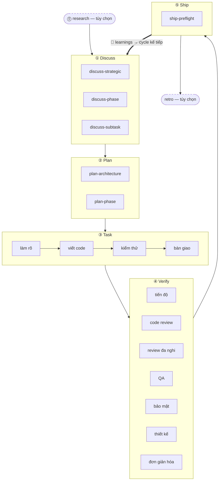

Nhịp 5 giai đoạn là phương pháp cốt lõi của harnessed: mọi tính năng, bản vá lỗi hay đợt refactor đều đi qua cùng năm giai đoạn theo thứ tự — **Discuss → Plan → Task → Verify → Ship** — và được khép lại bởi vòng **Learn** tự động. Hai giai đoạn đồng hành (Research, Retro) nằm ở hai đầu vòng chính.

## Các giai đoạn

| # | Giai đoạn | Lệnh gạch chéo | Chế độ |
|---|-----------|----------------|--------|
| 0 | **Research** | `/research` | tùy chọn — kích hoạt khi mức độ hiểu còn thiếu |
| 1 | **Discuss** | `/discuss` | bắt buộc |
| 2 | **Plan** | `/plan` | bắt buộc |
| 3 | **Task** | `/task` | bắt buộc |
| 4 | **Verify** | `/verify` | bắt buộc |
| 5 | **Ship** | `/ship` | tường minh — giai đoạn phát hành (do người dùng kích hoạt) |
| — | **Retro** | `/retro` | bắt buộc trong `/auto`, tùy chọn khi gọi riêng |

**Việc học là tự động, không phải một giai đoạn.** Mỗi workflow hoàn thành sẽ nối thêm tín hiệu failure/loop/reject của nó vào `.planning/LEARNINGS.md`; inject hook đưa các learnings liên quan vào session kế tiếp. Cơ chế này luôn bật và **không** phụ thuộc vào Retro tùy chọn.

### Research (tùy chọn)

Điều tra đa nguồn qua Tavily, Exa và ctx7. Kích hoạt bên trong `/auto` khi bạn trả lời "không" ở bước kiểm tra mức độ hiểu, hoặc gọi trực tiếp bằng `/research`. Kết quả ghi vào `research-notes.md` trong `.planning/`.

### Discuss — gate 3 tầng

`/discuss` đánh giá độc lập ba gate và chỉ chạy những gate được kích hoạt:

- **Tầng chiến lược** (`discuss-strategic`): tính năng mới, milestone mới, hướng sản phẩm mới → gstack `/office-hours` + `/plan-ceo-review`. Lưu `findings.md`.
- **Tầng phase** (`discuss-phase`): ≥2 quyết định triển khai còn bỏ ngỏ, luồng dữ liệu giữa các module chưa rõ → GSD `gsd-discuss-phase`. Lưu `findings.md` + `knowledge.md`.
- **Tầng subtask** (`discuss-subtask`): thuật toán cốt lõi / contract API với ≥2 hướng khác biệt → brainstorming của Superpowers. Tạm thời, không lưu.

Mỗi gate đều nói rõ khi nào nó kích hoạt và khi nào bị bỏ qua.

### Plan — review kiến trúc + lưu trữ

`/plan` chạy hai bước theo thứ tự:

1. **Review kiến trúc** (có điều kiện) — kiến trúc phức tạp sẽ kích hoạt gstack `/plan-eng-review`, chốt thiết kế trước khi lưu
2. **Kế hoạch phase** — GSD `gsd-plan-phase` + planning-with-files sinh `task_plan.md` với đường dẫn chính xác, tiêu chí nghiệm thu và thứ tự phụ thuộc

### Task — vòng lặp subtask

`/task` chạy bốn bước theo trình tự nghiêm ngặt cho từng subtask:

1. **Làm rõ** — xác minh spec, phơi bày mơ hồ, đối chiếu `task_plan.md`
2. **Viết code** — nguyên tắc karpathy: thay đổi khả thi nhỏ nhất, chỉnh sửa như phẫu thuật, không nới phạm vi
3. **Kiểm thử** — TDD red → green → refactor cho logic cốt lõi; tùy chọn với CRUD và các triển khai hiển nhiên
4. **Bàn giao** — wrapper `ralph-loop` không cho đi tiếp nếu chưa có `COMPLETE` nguyên văn

### Verify — 7 kiểm tra con có điều kiện

`/verify` phân phát kiểm tra con tùy theo những gì đã đổi. Luôn chạy: `verify-progress` (UAT + đồng bộ trạng thái), `verify-code-review` (đa agent song song), `verify-simplify` (dọn dẹp cuối). Có điều kiện: review đa nghi, QA, bảo mật, thiết kế, multispec.

### Ship — giai đoạn phát hành

`/ship` là giai đoạn thứ 5, sau Verify. Nó chạy `harnessed release-preflight` trước (gate chỉ đọc kiểm tra mức sẵn sàng phát hành — `CHANGELOG [Unreleased]`/version/git-clean/tag-absent), rồi ủy thác PR + deploy cho gstack `/ship`. **Ranh giới deploy là tag-ready**: giai đoạn này không push, không publish, không tạo tag — `npm publish` thật và GitHub release do CI `publish.yml` thực hiện khi push tag (cần phê duyệt tường minh). "PR ready ≠ release ready".

### Retro

gstack `/retro` ghi lại bài học của cột mốc, các quyết định và những phát hiện bất ngờ. Trong `/auto` nó chạy bắt buộc. Cũng có thể gọi riêng ở cuối bất kỳ cột mốc nào. (Khác với vòng Learn luôn bật ở trên.)

## Sơ đồ luồng



## `/auto` so với các lệnh giai đoạn riêng lẻ

`/auto` tự nối các giai đoạn phát triển cốt lõi (research có điều kiện → discuss → plan → task → verify → retro). **Ship là tường minh** — `/auto` không tự phát hành; khi cột mốc sẵn sàng cắt phiên bản, bạn tự chạy `/ship`. Các lệnh giai đoạn riêng cho phép bạn vào từ bất kỳ điểm nào:

```
/discuss "thêm rate limiter"        # chỉ chạy discuss
/plan "rate limiter"                # chỉ chạy plan (giả định discuss đã xong)
/task "triển khai middleware"       # chỉ chạy task
/verify "tính năng rate limiter"    # chỉ chạy verify
/ship                               # chỉ chạy ship (release-preflight → tag-ready)
```

Khi đi qua *nhiều* phase, `harnessed advance` suy ra phase kế tiếp từ trạng thái trên đĩa trong `.planning/` và in ra lệnh cần chạy — nhờ vậy một driver loop có thể nối nhiều phase mà không cần can thiệp (`while harnessed advance --json; do : ; done`), và dừng ở advance-gate khi một phase trước đó chưa hoàn tất. Chi tiết ở mục `harnessed advance` trong [Tham khảo CLI](../../reference/cli/).

Các lời gọi subworkflow kiểu phẫu thuật bỏ qua hoàn toàn master:

```
/discuss-phase "..."        # chỉ chạy làm rõ tầng phase
/plan-architecture "..."    # chỉ chạy review kiến trúc
/verify-paranoid "..."      # chỉ chạy kiểm tra của kỹ sư đa nghi
```

Các quyết định kiến trúc được ghi chi tiết trong [ADR 0030](https://github.com/easyinplay/harnessed/blob/main/docs/adr/0030-namespace-policy.md), 0031 và 0032 (quyết định thiết kế namespace).
