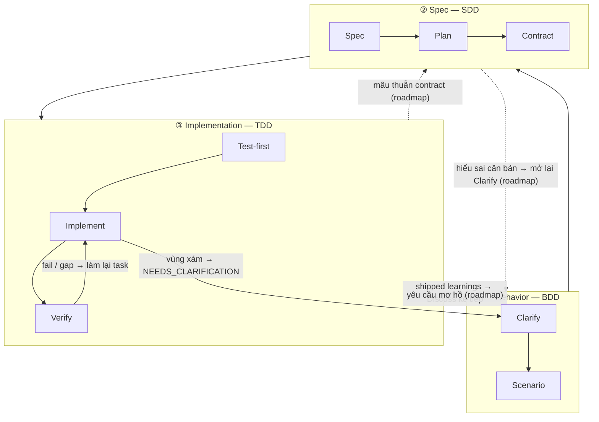

Ngăn xếp ba tầng là lý thuyết của harnessed về việc _tại sao_ nhịp làm việc lại có hình dạng như vậy. Đây là bản hiện thực hóa về mặt kỹ thuật phần mềm của cấu trúc lồng nhau đã được thừa nhận **BDD → SDD → TDD**: ba vòng phản hồi lồng nhau, mỗi vòng trả lời một câu hỏi khác nhau. Đóng góp của harnessed là **kết hợp** hệ sinh thái mã nguồn mở vào từng vòng — và vì các thành phần upstream _chồng lấn một phần_, việc phân xử phần chồng lấn đó chính là công việc của một orchestrator kết hợp.

## Ba vòng lặp

| Tầng                 | Loop | Câu hỏi nó trả lời                    | Kết hợp từ (có chồng lấn)                                                                         |
| -------------------- | ---- | ------------------------------------- | ------------------------------------------------------------------------------------------------- |
| **① Behavior**       | BDD  | Xây _cái gì_, và làm sao biết đã xong | gstack `/office-hours` governance · GSD discuss · superpowers brainstorming → acceptance criteria |
| **② Spec**           | SDD  | Cấu trúc _ra sao_                     | GSD plan-phase → requirements / design / tasks · contracts (Spec Kit / ECC patterns)              |
| **③ Implementation** | TDD  | Nó có thực sự _chạy được_ không       | superpowers TDD red-green · subagent execution · GSD verify-work · ralph-loop completion          |

**Các vòng lặp là những thấu kính lồng nhau, không phải giai đoạn.** Cucumber phổ biến vòng lặp đôi BDD-ngoài + TDD-trong: một scenario thất bại mở vòng ngoài, và bạn đẩy nó tới xanh qua nhiều chu trình red-green TDD bên trong. Kỷ nguyên GenAI thêm một vòng ở giữa — vòng **spec** tường minh của SDD nằm giữa Behavior và Implementation, bởi agent cần một contract đã đóng băng để thực thi. Đó là **triple-loop** ở trên.

## Phân rã theo nút

Mỗi vòng chia thành các nút, và mỗi nút cho biết nó được kết hợp từ thành phần mã nguồn mở nào.

### ① Behavior (BDD)

| Nút          | Vai trò                                 | Kết hợp từ                                                       |
| ------------ | --------------------------------------- | ---------------------------------------------------------------- |
| **Clarify**  | Chốt _xây cái gì_ + phơi bày điểm mơ hồ | gstack `/office-hours` + GSD discuss + superpowers brainstorming |
| **Scenario** | Chuyển ý định thành acceptance criteria | GSD phase success criteria                                       |

Vòng ngoài còn mở cho tới khi acceptance criteria của scenario được viết ra. Định nghĩa "xong" được quyết ở đây — trước mọi cấu trúc hay dòng code nào.

### ② Spec (SDD)

| Nút          | Vai trò                | Kết hợp từ                                                      |
| ------------ | ---------------------- | --------------------------------------------------------------- |
| **Spec**     | requirements + design  | GSD plan-phase + bộ ba Spec Kit (requirements / design / tasks) |
| **Plan**     | tasks + DAG phụ thuộc  | GSD `PLAN.md` + phân rã của ECC                                 |
| **Contract** | giao diện đã đóng băng | quy ước contract                                                |

Vòng giữa chuyển "cái gì" thành cấu trúc chạy được. Điều kiện thoát của nó là một **contract đã đóng băng** — giao diện mà vòng implementation sẽ viết test đối chiếu.

### ③ Implementation (TDD)

| Nút            | Vai trò                       | Kết hợp từ                              |
| -------------- | ----------------------------- | --------------------------------------- |
| **Test-first** | test thất bại (red gate)      | superpowers TDD                         |
| **Implement**  | đẩy tới xanh                  | subagent execution                      |
| **Verify**     | refactor + hoàn tất theo task | GSD verify-work + ralph-loop completion |

Vòng trong chính là chu trình kinh điển red → green → refactor, chạy một lượt cho mỗi task cho tới khi mọi contract được thỏa mãn.

### Xuyên suốt

Hai mối quan tâm nằm ngoài bất kỳ vòng đơn lẻ nào:

| Mối quan tâm | Vai trò                       | Kết hợp từ                           |
| ------------ | ----------------------------- | ------------------------------------ |
| **Review**   | gate chất lượng + bảo mật     | gstack `/review` + `/cso`            |
| **Ship**     | sẵn sàng phát hành + bàn giao | `release-preflight` + gstack `/ship` |

Ngoài ra, hai **discipline** chạy xuyên _mọi_ tầng:

- **karpathy principles** — _how_ to code: thay đổi khả thi nhỏ nhất, chỉnh sửa như phẫu thuật, simplicity first.
- **mattpocock moves** — công cụ theo yêu cầu (`/zoom-out`, `/diagnose`, `/grill-with-docs`), triệu hồi tùy tình huống.

## Quay lui (GoBack)

Luồng mặc định đi từ ngoài vào trong. **harnessed là bản hiện thực linear-cadence của triple-loop này — đồ thị định tuyến đầy đủ là hướng tiến hóa của nó.** Các vòng này vẫn là vòng phản hồi, nhưng hôm nay mới chỉ một phần cạnh quay lui được phát hành; định tuyến theo vòng mịn hơn nằm trong roadmap. Sơ đồ dưới vẽ cạnh đã phát hành bằng nét liền, cạnh roadmap bằng nét đứt kèm nhãn `(roadmap)`.

### Đã phát hành hôm nay

Nhịp tuyến tính hiện tại có ba cạnh quay lui đang sống:

- **Verify → Task** — một kiểm tra thất bại hoặc một khoảng trống chưa lấp sẽ đẩy phần việc đó về vòng implementation.
- **Vùng xám → làm rõ** — khi subagent gặp điểm mơ hồ, nó trả về `STATUS: NEEDS_CLARIFICATION`; lần chạy tạm dừng, làm rõ, rồi tiếp tục.
- **Learnings → Discuss kế tiếp** — mỗi chu trình đã phát hành nối thêm tín hiệu failure/loop/reject, và chúng chảy vào vòng Behavior tiếp theo (learn loop luôn bật).

### Roadmap (chưa phát hành)

Các đường quay lui có cấu trúc mịn hơn — định tuyến khoảng trống _thẳng_ về vòng nắm câu trả lời — là hướng tiến hóa, không phải hành vi hiện tại:

- **Mâu thuẫn contract** (implementation không thỏa mãn nổi một giao diện đã đóng băng) → định tuyến về **Spec**.
- **Yêu cầu mơ hồ** (contract tự nó nhất quán nhưng behavior còn thiếu đặc tả) → định tuyến về **Behavior**.
- **Hiểu sai căn bản** (toàn bộ cấu trúc nhắm sai kết quả) → mở lại **Clarify** của Behavior.

Hôm nay các khoảng trống này lộ ra qua ba cạnh đã phát hành ở trên (thường là Verify → Task cộng với làm rõ thủ công), chứ không phải định tuyến theo vòng một cách tự động. Giá trị trước mắt của orchestrator kết hợp là giữ cho nhịp tuyến tính nhất quán khi các thành phần upstream khác nhau sở hữu những vòng khác nhau; đồ thị định tuyến là bước kế tiếp.

## Các thành phần giao nhau — đó chính là mấu chốt

Cùng một công cụ upstream xuất hiện ở nhiều hơn một vòng. Sự giao nhau này không phải dư thừa: đó là giao diện mà orchestrator kết hợp phải phân xử:

- **GSD** là xương sống — xuyên qua cả ba vòng (discuss → plan → verify).
- **gstack** trải trên **Behavior + Review**.
- **superpowers** trải trên **Behavior** (brainstorm) + **Implementation** (TDD).

Không có phân xử, những chỗ giao này sẽ kích hoạt trùng lặp hoặc mâu thuẫn nhau. Lớp kết hợp định tuyến mỗi vòng tới đúng công cụ upstream và xử lý các đường nối.

## Lý thuyết vs. runtime

Ngăn xếp ba tầng là _lý thuyết_. [Nhịp 5 giai đoạn](/vi/docs/concepts/five-stage-cadence/) là cách lý thuyết đó vận hành trên dòng lệnh:

| Loop (lý thuyết) | Giai đoạn runtime                 |
| ---------------- | --------------------------------- |
| ① Behavior       | **Discuss**                       |
| ② Spec           | **Plan**                          |
| ③ Implementation | **Build** (Task)                  |
| Xuyên suốt       | **Verify + Ship** (evidence gate) |

Về việc các công cụ upstream được ghép lại _ra sao_ mà không cần fork, xem [Kết hợp thay vì vendoring](/vi/docs/concepts/composition/).
