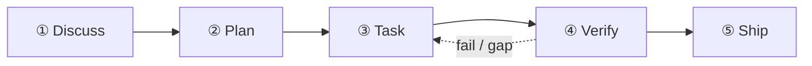

Hướng dẫn này đi qua nhịp 5 giai đoạn theo cách thủ công với một ví dụ thực tế: **"Thêm rate limiter cho Express API của chúng ta — 100 req/phút mỗi IP, dùng Redis."**

Lần chạy `/auto` đầu tiên của bạn đi hết năm giai đoạn từ đầu đến cuối:



## Giai đoạn 1 — Discuss

```
/discuss "thêm rate limiter cho Express API của chúng ta — 100 req/phút mỗi IP, dùng Redis"
```

`/discuss` đánh giá song song 3 gate làm rõ và chỉ chạy những gate được kích hoạt:

- **Gate chiến lược** (`discuss-strategic`): đây là tính năng mới hay một thay đổi trên hạ tầng sẵn có? Nó có ảnh hưởng đến định vị sản phẩm không? Với rate limiter, gate này thường kích hoạt một lượt kiểm tra quản trị nhanh.
- **Gate phase** (`discuss-phase`): có ≥2 quyết định triển khai còn bỏ ngỏ không? (Redis hay in-memory? Theo route hay toàn cục?) Gate này làm rõ và lưu phát hiện vào `findings.md`.
- **Gate subtask** (`discuss-subtask`): có subtask nào với ≥2 hướng tiếp cận khác biệt không? Thiết kế thuật toán cốt lõi sẽ qua một lượt brainstorming nhanh.

**Đầu ra**: `findings.md` và `knowledge.md` trong `.planning/PHASE-N/`.

## Giai đoạn 2 — Plan

```
/plan "tính năng rate limiter"
```

`/plan` chạy hai bước theo thứ tự:

1. **Review kiến trúc** (có điều kiện) — nếu tính năng vượt ranh giới module hoặc động đến hạ tầng mới, staff engineer đa nghi của gstack sẽ review thiết kế
2. **Kế hoạch phase** — GSD lưu `task_plan.md` với đường dẫn tệp chính xác, tiêu chí nghiệm thu và thứ tự phụ thuộc

**Đầu ra**: `.planning/PHASE-N/PLAN.md` và `task_plan.md`.

## Giai đoạn 3 — Task

```
/task "triển khai middleware rate limiter"
```

`/task` chạy 4 bước con cho mỗi subtask, theo trình tự:

1. **Làm rõ** — xác minh spec trước khi viết code; phơi bày điểm mơ hồ
2. **Viết code** — triển khai theo nguyên tắc karpathy (thay đổi khả thi nhỏ nhất, chỉnh sửa như phẫu thuật)
3. **Kiểm thử** — TDD cho logic cốt lõi: red → green → refactor
4. **Bàn giao** — wrapper `ralph-loop` đảm bảo có `COMPLETE` nguyên văn trước khi đi tiếp

## Giai đoạn 4 — Verify

```
/verify "tính năng rate limiter"
```

`/verify` phân phát tối đa 7 kiểm tra con tùy theo những gì đã thay đổi:

| Kiểm tra | Kích hoạt khi |
|----------|---------------|
| `verify-progress` | luôn luôn (nghiệm thu UAT + đồng bộ trạng thái) |
| `verify-code-review` | luôn luôn (fan-out đa agent song song) |
| `verify-paranoid` | module trọng yếu hoặc trước PR |
| `verify-qa` | có thay đổi UI |
| `verify-security` | có động đến auth hoặc secret |
| `verify-design` | có thay đổi thiết kế |
| `verify-simplify` | luôn chạy cuối (loại bỏ logic dư thừa) |

## Sản phẩm được lưu trong `.planning/`

```
.planning/
├── STATE.md          # nguồn sự thật về phase / tiến độ hiện tại
├── ROADMAP.md        # bản đồ lộ trình các phase
└── PHASE-1/
    ├── PLAN.md       # danh sách task, đường dẫn tệp, tiêu chí nghiệm thu
    ├── findings.md   # đầu ra của giai đoạn discuss
    ├── task_plan.md  # phân rã theo từng subtask
    └── PROGRESS.md   # theo dõi tiến độ trực tiếp
```

## Bước tiếp theo

Sau khi Verify xong, chạy `/retro` để khép cột mốc và ghi lại bài học. Nếu bạn chạy `/auto` thì các giai đoạn này đã tự nối với nhau — xem [Khởi động nhanh](/vi/docs/getting-started/quickstart/) để biết lối đi một lệnh.

Về kiến trúc phía sau mỗi giai đoạn, hãy đọc [Nhịp 5 giai đoạn](/vi/docs/concepts/five-stage-cadence/).
