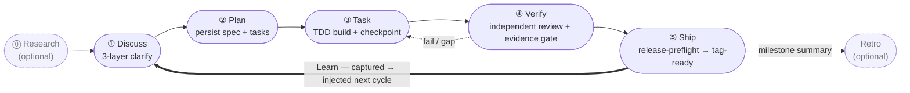

harnessed là trình quản lý gói và orchestrator kết hợp cho các harness lập trình AI. Nó cài đặt, kết hợp và chạy các workflow gộp Skills, MCP server và harness pack thông qua một manifest có kiểu — mà không vendoring mã nguồn upstream.

Nếu bạn đang làm việc với Claude Code, harnessed nối những thành phần mã nguồn mở tốt nhất — ECC, Superpowers, GSD, gstack — thành một workflow thống nhất, chạy được, chỉ bằng một lệnh.

Vòng lặp vận hành — năm stage được khép lại bởi một chu trình Learn luôn bật:

## Bắt đầu từ đâu

- **[Cài đặt](/vi/docs/getting-started/installation/)** — cài harnessed và chạy setup trong 30 giây
- **[Khởi động nhanh](/vi/docs/getting-started/quickstart/)** — từ cài đặt đến workflow đầu tiên trong 60 giây
- **[Khái niệm kết hợp](/vi/docs/concepts/composition/)** — harnessed kết hợp công cụ upstream mà không fork chúng như thế nào
- **[Tham khảo workflow](/vi/docs/reference/workflows/)** — toàn bộ 28 workflow có thể kết hợp trong bản phát hành hiện tại

## Điều làm harnessed khác biệt

Ba nguyên tắc nâng đỡ mọi workflow:

**Kết hợp thay vì vendoring.** Mỗi harness pack đi kèm một manifest. harnessed đọc nó, kiểm tra tương thích và ghép các công cụ upstream lại tại runtime. Bạn luôn chạy upstream chính thức — không bao giờ là một fork đã cũ.

**Nhịp 5 giai đoạn có sẵn.** Discuss → Plan → Task → Verify → Ship, kèm Research và Retro tùy chọn, cộng thêm một vòng học tự động. Hoặc chạy `/auto` để đi hết pipeline 6 giai đoạn (research → retro; Ship là tường minh) chỉ bằng một lệnh.

**Phương pháp dogfood-first.** Mọi workflow đều được kiểm chứng bằng chính định nghĩa của nó — cùng một kỷ luật mà harnessed dùng để phát hành chính mình.

Đọc [README](https://github.com/easyinplay/harnessed#readme) để có bức tranh tổng thể.
