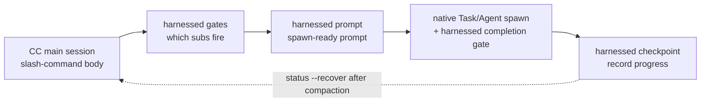

> **Mô hình thực thi v4.0.** harnessed là _orchestration brain + thư viện prompt_, không phải engine thực thi. Phần thân lệnh gạch chéo (do `harnessed setup` sinh ra) điều khiển **spawn CC-native subagent** thông qua ba CLI hàm thuần và nhanh — `harnessed gates` (subworkflow nào được kích hoạt), `harnessed prompt` (prompt sẵn sàng spawn cho một subworkflow) và `harnessed checkpoint` (ghi tiến độ). Việc spawn thực tế, Agent Teams và các vòng làm rõ đều do main session của Claude Code thực hiện bằng công cụ gốc. `harnessed run` chỉ còn dành cho CI/headless.

Ba CLI orchestration điều khiển spawn CC-native ra sao:



## `harnessed` (bảng you-are-here)

Chạy `harnessed` **không kèm tham số** sẽ in bảng you-are-here — cách nhanh nhất để định vị lại trong một workflow đang chạy (tương tự `/comet` của comet, ra mắt ở v8.0).

```bash
harnessed          # bảng you-are-here + bước kế tiếp, dễ đọc cho người
harnessed --json   # đối tượng có cấu trúc, máy đọc được
```

Nó tự phát hiện workflow đang chạy của repo hiện tại và in phase hiện thời, trạng thái từng subworkflow, cùng contract xác định một dòng `NEXT: auto | manual | done` kèm gợi ý chạy (ví dụ `→ run: harnessed prompt <sub>`). Khi không có workflow nào đang chạy, nó in gợi ý nhập môn trỏ tới `harnessed setup`.

**Chỉ đọc** — không spawn, không đổi trạng thái/git/remote, và luôn thoát với `0`. Chỉ `harnessed` trần (hoặc `harnessed --json`, kèm `--lang` tùy chọn) mới xuất bảng này; mọi subcommand, `--help`, `--version` hay từ khóa lạ đều rơi xuống bộ phân tích lệnh thông thường (nên `harnessed bogus` vẫn báo lỗi).

Các trường `--json`: `active`, `phase`, `status`, `started_at`, `next`, `sub`, `hint`, `sub_progress`.

---

## `harnessed setup`

Onboarding một lần — cài workflow skills và manifest nền vào `~/.claude/`.

```bash
harnessed setup [tùy chọn]
```

**Nó làm gì:**

1. Quét `workflows/<name>/SKILL.md` và chép từng tệp sang `~/.claude/skills/<name>/`
2. Xử lý `manifests/tools/*.yaml` và `manifests/skill-packs/*.yaml`
3. Ghi `CLAUDE_CODE_EXPERIMENTAL_AGENT_TEAMS=1` vào `~/.claude/settings.json`
4. Phát hiện locale hệ điều hành và ghi vào `env.HARNESSED_USER_LANG` (zh-* → `zh-Hans`, còn lại → `en`)

**Cờ:**

| Cờ                   | Mô tả                                                              |
| -------------------- | ------------------------------------------------------------------ |
| `--user-lang <code>` | Ghi đè locale đã phát hiện. Nhận `en`, `zh-Hans`, `zh-CN`, `zh-TW` |
| `--dry-run`          | Chỉ xem trước — in ra những gì sẽ ghi, không đụng vào đĩa          |

**Mã thoát:** `0` = thành công, `1` = lỗi hệ thống tệp, `2` = không tìm thấy workflow có SKILL.md.

---

## `harnessed install <pack>`

Cài một harness pack theo tên hoặc đường dẫn.

```bash
harnessed install <pack>
```

Phân giải manifest của pack, kiểm tra theo schema, rồi chạy từng bước `install` theo thứ tự. Hiện hỗ trợ bootstrap từ đường dẫn cục bộ và URL git; việc khám phá pack trên npm registry đang trong kế hoạch.

---

## `harnessed install-base`

Cài toàn bộ profile nền trong một lượt — mọi manifest trong `manifests/tools/*.yaml` và `manifests/skill-packs/*.yaml`, theo thứ tự sắp xếp. Đây là subcommand riêng (không phải cờ `--base` của `install`) nên không xung đột với gate dành cho pack đơn lẻ.

```bash
harnessed install-base                   # áp dụng ngay (mặc định)
harnessed install-base --dry-run         # chỉ xem trước — không đụng vào đĩa
harnessed install-base --non-interactive # bỏ qua mọi lời nhắc (CI / script)
```

In thống kê: `installed / already-installed / skipped (user-aborted) / failed`.

**Mã thoát:** `0` = cài được ít nhất một và không có lỗi · `1` = có một hoặc nhiều lỗi · `2` = không cài gì (tất cả đã có sẵn hoặc bị hủy).

---

## `harnessed research`

Chạy workflow research — định tuyến con theo hạng mục tìm kiếm → spawn subagent → `COMPLETE` nguyên văn. Đây là bí danh mỏng của `workflows/research/workflow.yaml`.

```bash
harnessed research --query "compare Postgres vs SQLite for this use case"
harnessed research --query "..." --dry-run          # xem trước workflow đã phân giải + gate context (JSON)
harnessed research --query "..." --model sonnet      # model của subagent: haiku | sonnet | opus
harnessed research --query "..." --non-interactive   # bỏ qua mọi lời nhắc (CI / script)
```

| Cờ                  | Mô tả                                                                 |
| ------------------- | --------------------------------------------------------------------- |
| `--query <text>`    | prompt cho research (**bắt buộc**)                                    |
| `--dry-run`         | Chỉ xem trước — in `{ workflow, yamlPath, gateContext }`, không spawn |
| `--model <model>`   | model của subagent: `haiku` \| `sonnet` \| `opus`                     |
| `--non-interactive` | Bỏ qua mọi lời nhắc (CI / script)                                     |

**Mã thoát:** `0` = workflow hoàn tất · `1` = workflow lỗi lúc chạy · `2` = sai cách dùng (thiếu `--query` hoặc không tìm thấy yaml của workflow).

---

## `harnessed manifest-add <upstream>`

Thêm một adapter upstream mới sau **gate merge 5 câu hỏi EE-5** — năm câu hỏi tương tác buộc bạn ra quyết định có cân nhắc trước khi đưa một upstream mới vào phần kết hợp (đây có phải surface tái dùng được không, tên có hợp không, có chồng lấn với thành phần sẵn có không, bạn đang mượn một khái niệm hay mượn bản sắc sản phẩm của người khác, người dùng không biết upstream có hiểu được không). Cả năm câu đều phải có câu trả lời không rỗng.

```bash
harnessed manifest-add https://github.com/owner/repo.git
harnessed manifest-add <upstream> --category tools    # skill-packs (mặc định) | tools
harnessed manifest-add <upstream> --name myadapter    # mặc định lấy basename của <upstream>
harnessed manifest-add <upstream> --dry-run           # xem trước — in câu trả lời, không ghi
harnessed manifest-add <upstream> --non-interactive   # CI: dry-run chỉ WARN, không ghi gì
```

Khi thành công, ghi câu trả lời vào `manifests/<category>/<name>.ee5-answers.json`.

| Cờ                  | Mô tả                                                     |
| ------------------- | --------------------------------------------------------- |
| `--category <cat>`  | Hạng mục manifest: `skill-packs` (mặc định) \| `tools`    |
| `--name <name>`     | Tên adapter ngắn (mặc định lấy basename của `<upstream>`) |
| `--dry-run`         | Chỉ xem trước — in JSON câu trả lời, không ghi            |
| `--non-interactive` | CI / script — chỉ WARN, không ghi gì                      |

**Mã thoát:** `0` = qua gate (đã ghi hoặc xem trước) · `1` = có câu trả lời bỏ trống.

---

## `harnessed uninstall [pack]`

Gỡ một pack đã cài; khi không có tham số, xóa các tệp do chính harnessed cài.

```bash
harnessed uninstall <pack>   # gỡ một pack (chạy các bước uninstall trong manifest của nó)
harnessed uninstall          # xóa khỏi ~/.claude/ phần skills/manifests của chính harnessed
```

Với ba phương thức cài đặt đặt skill lên đĩa (`npm-cli`, `git-clone-with-setup`, `npx-skill-installer`), uninstall thực thi **contract `spec.uninstall` được khai báo** trong manifest: trước hết chạy `cmd` đã khai báo (fail-soft — thoát khác 0 hay thiếu shell chỉ cảnh báo rồi đi tiếp), sau đó force-rm idempotent cho từng mục `cleanup_paths`, và toàn bộ thao tác **bị giới hạn trong `$HOME`** (đường dẫn nằm ngoài cây thư mục home sẽ hard-fail). Các phương thức đụng vào settings/plugin/MCP (`cc-hook-add`, `cc-plugin-marketplace`, `mcp-*-add`) giữ trình gỡ riêng của mình. Lệnh gỡ hợp nhất không tham số sẽ đảo ngược `harnessed setup`.

---

## CLI orchestration (v4.0)

Ba CLI hàm thuần này là thứ mà phần thân lệnh gạch chéo được sinh ra dùng để điều khiển spawn CC-native. Chúng chỉ in JSON và không tự spawn — việc điều phối do main session làm.

### `harnessed gates <master>`

Đánh giá subworkflow nào được kích hoạt cho một master orchestrator (`discuss` / `plan` / `task` / `verify` / `auto`) và một spec nhiệm vụ.

```bash
harnessed gates plan --task "add OAuth login" --skip-sub discuss
# → JSON: { fire: [{ sub, order, mode }], skip: [...], parallelism: { escalate_to_teams } }
```

`fire` liệt kê các subworkflow đã qua gate phán quyết, theo thứ tự thực thi; `parallelism.escalate_to_teams` cho biết khi nào nên chuyển từ spawn subagent tuần tự sang Agent Teams CC-native.

### `harnessed prompt <sub>`

Phát ra prompt sẵn sàng spawn cho một subworkflow — thân role-prompt + checklist + các disciplines đã áp dụng.

```bash
harnessed prompt plan-phase --task "add OAuth login" --json
# → JSON: { prompt, max_iterations, model }
```

Main session đưa `prompt` này vào một spawn `Task` gốc (bên ngoài là plugin `harnessed checkpoint complete`); `max_iterations` / `model` lấy thẳng từ giá trị mặc định của workflow.

### `harnessed checkpoint`

Ghi tiến độ subworkflow vào checkpoint store của harnessed. Main session gọi nó sau khi mỗi subworkflow hoàn tất (và khi thất bại), nhờ đó có thể khôi phục bằng `harnessed status --recover` sau compaction.

```bash
harnessed checkpoint start <master> --plan <json>   # gieo mầm ledger tiến độ
harnessed checkpoint complete <sub>                 # đánh dấu subworkflow hoàn tất (kèm evidence guard)
harnessed checkpoint fail <sub>                      # ghi lại subworkflow thất bại
```

### `harnessed run`

**Chỉ dành cho CI / headless.** Spawn toàn bộ workflow trong tiến trình qua SDK — dùng khi không có main session tương tác để điều phối. Lối mặc định của v4.0 là chuỗi gates → prompt → checkpoint ở trên; `run` là phương án dự phòng.

```bash
harnessed run <master> --task "<spec>"
```

---

## `harnessed doctor`

Chẩn đoán bản cài harnessed + Claude Code trên máy — báo cáo sức khỏe gồm 23 mục kiểm tra (Node, phạm vi và máy chủ MCP (tavily/exa), jq, bun, loại bash trên Windows, origin URL, tiền tố gstack, manifest đã ngừng dùng, ngân sách token, env Agent Teams, planning-with-files, mattpocock-skills, CodeGraph, xung đột GateGuard, tính toàn vẹn skill của workflow, update, kênh cài đặt, hook lỗi thời, ECC, ghép cặp inject mỗi lượt, độ mới của plugin đã cài, công tắc ablation `HARNESSED_OFF`). `HARNESSED_OFF=1` biến mọi hook luôn bật của harnessed thành no-op (có nhóm đối chứng sạch cho so sánh A/B mà không cần gỡ cài đặt); doctor sẽ cảnh báo trong lúc biến này được đặt.

```bash
harnessed doctor
harnessed doctor --json   # báo cáo máy đọc được
```

---

## `harnessed update`

Giữ harnessed (và tùy chọn các plugin upstream) luôn cập nhật. Mục kiểm tra update của doctor cũng thụ động báo "update available X→Y". `update` có hai kênh — tự phát hiện cách harnessed được cài và đi theo luồng tương ứng.

```bash
harnessed update                      # tự nâng cấp + phần đầu CHANGELOG + nhắc khởi động lại
harnessed update --check              # chỉ báo phiên bản installed/latest, không cài
harnessed update --dry-run            # xem trước các thao tác cập nhật — không ghi gì
harnessed update --upstreams          # chạy lại manifest nền để nâng cấp cả plugin upstream
harnessed update --migration-report   # kiểm kê chỉ đọc trạng thái harnessed cũ (không xóa gì)
harnessed update --rollback [version] # chỉ với binary biên dịch — khôi phục bản cũ giữ trong bin-backup/
```

**Kênh npm** — chạy `npm i -g harnessed@latest`, in phần đầu CHANGELOG và nhắc khởi động lại Claude Code.

**Kênh binary biên dịch** (trình cài một dòng) — tải tài nguyên theo nền tảng từ GitHub releases, kiểm tra checksum `.sha256` **và chữ ký ed25519 của nó** (`<asset>.sha256.sig`; từ v4.32.19 đây là contract phát hành — thiếu chữ ký hay xác minh thất bại đều là hard error, binary hiện tại giữ nguyên), rồi thay binary mới một cách nguyên tử; bản cũ bị thay được đưa vào `bin-backup/` để rollback.

**`--rollback [version]`** (chỉ với binary biên dịch) — khôi phục nguyên tử một bản cũ từ `bin-backup/`: mặc định lấy bản giữ mới nhất, hoặc chỉ định phiên bản (phiên bản lạ sẽ báo lỗi và liệt kê các bản khả dụng). Binary hiện tại được cất lại vào bin-backup trước, nên bản thân việc rollback cũng đảo ngược được. Ở chế độ cài qua npm, lệnh từ chối và hướng bạn tới `npm i -g harnessed@<version>`.

Truy cập mạng là fail-soft — không bao giờ báo lỗi khi không với tới npm.

---

## `harnessed release-preflight`

Gate của giai đoạn Ship. Kiểm tra mức sẵn sàng phát hành **chỉ đọc** — thoát với 1 nếu repo chưa sẵn sàng. Không thay đổi gì (việc publish thật do CI làm khi push tag).

```bash
harnessed release-preflight
```

Các mục kiểm tra: `[Unreleased]` (hoặc phần `[<version>]`) trong `CHANGELOG.md` không rỗng, `package.json` có version hợp lệ, cây làm việc sạch (thay đổi ở tệp tracked), và tag `v<version>` chưa tồn tại.

---

## `harnessed compact`

Tóm tắt rồi loại bỏ các mục ledger tiến độ con đã giải quyết, giải phóng context cho các nhiệm vụ dài. **G6-safe**: mục có `fail_count > 0` không bao giờ bị loại, giữ nguyên tín hiệu break-loop.

```bash
harnessed compact                                  # compaction thủ công
harnessed checkpoint complete <sub> --tokens <n>   # tự kích hoạt khi số token vượt ngưỡng
```

---

## `harnessed workflows`

Liệt kê các workflow đang chạy — mỗi repo một cái (harnessed chia ô trạng thái checkpoint theo repo root, nên các dự án song song không ghi đè nhau).

```bash
harnessed workflows
```

---

## `harnessed learn`

Nối một learning dạng văn xuôi vào `.planning/LEARNINGS.md` của repo hiện tại. Các workflow hoàn tất cũng tự nối tín hiệu failure/loop/reject của chúng; inject hook đưa learnings liên quan vào session kế tiếp.

```bash
harnessed learn "đừng thử lại migration một cách mù quáng — cần có snapshot sạch trước đã"
```

---

## `harnessed retro`

Đặt lại lời nhắc nhịp retro. `/retro` là skill của gstack và harnessed không quan sát được nó, nên sau khi chạy xong, hãy gọi `harnessed retro --done` để đưa bộ đếm phase của repo về 0 và xóa lời nhắc `RETRO-DUE`.

```bash
harnessed retro --done   # đặt lại bộ đếm phase + xóa lời nhắc RETRO-DUE
```

Không có `--done`, lệnh không làm gì và thoát với `1` (`nothing to do — pass --done after running /retro`).

---

## `harnessed next`

In contract bước kế tiếp mang tính xác định — chỉ đọc, không đổi trạng thái. Hai tầng:

1. **workflow đang chạy** (còn sub chưa xử lý) → dùng contract nội bộ của workflow `NEXT: auto <sub> | manual <sub> | done` (exit `0`, không đổi).
2. **mọi sub đã giải quyết** → rơi xuống **tiếp nối ngang giữa các unit** (v4.10): suy ra work unit kế tiếp (phase / task tiếp theo) từ nguồn sự thật trên đĩa trong `.planning/`, rồi in `NEXT: advance | blocked | done`.

```bash
harnessed next
# đang chạy:    NEXT: auto <sub>
# fall-through: NEXT: advance
#               UNIT: phase 16 'rate limiter'
#               HINT: run /auto (or harnessed advance) to start it — 2 phases remain
```

**Mã thoát giữa các unit:** `0` = advance (còn unit kế tiếp) · `2` = done (mọi phase đã xong) · `10` = blocked (cần quyết định của con người).

---

## `harnessed advance`

Tiến tới work unit kế tiếp được suy ra từ nguồn sự thật trên đĩa trong `.planning/` — **chỉ in ra (print-only)**. Nó in phase/task kế tiếp cùng lệnh cần chạy (ví dụ `→ run /auto "..."`), nhưng **không** gieo trạng thái và **không** spawn; lệnh in ra do chính main session chạy, nhờ vậy giữ được các vòng làm rõ và Agent Teams.

```bash
harnessed advance
# ADVANCE: advance
# UNIT: phase 16 'rate limiter'
# → run /auto "phase 16 'rate limiter'"
```

**advance-gate.** `advance` từ chối nhảy qua một phase trước đó _chưa hoàn tất_ (gate "comet"): nếu phase kế tiếp suy ra được xếp trước con trỏ workflow, hoặc có sub thất bại đang chặn ledger, nó thoát với mã khác 0 và **không** in lệnh chạy. Dùng `--force` để ghi đè — nó ghi một ghi chú kiểm toán vào đầu ra rồi đi tiếp.

```bash
harnessed advance --force   # ghi đè gate (ghi lại ghi chú kiểm toán)
```

**Driver loop.** `--json` xuất `{ next, unit, hint }` máy đọc được, cho phép một vòng lặp shell nối nhiều phase mà không cần can thiệp — vòng lặp dừng ở bất kỳ mã thoát khác 0 nào (done / blocked / gate-reject):

```bash
while harnessed advance --json; do : ; done
```

**Mã thoát:** `0` = advance · `2` = done (mọi phase đã xong) · `10` = blocked · `11` = gate-reject (phase trước chưa xong; dùng `--force`) · `1` = error.

**Thiết kế — suy ra từ đĩa, không giữ hàng đợi.** "Kế tiếp" luôn được suy ra từ đĩa, không bao giờ từ một hàng đợi đã lưu. Một phase được tính là hoàn tất ⇔ mỗi `NN-*-PLAN.md` đều có `NN-*-SUMMARY.md` tương ứng (suy ra từ sản phẩm, nên các phase đã phát hành tự nhiên bị bỏ qua). Chèn thêm phase vào giữa (sửa `ROADMAP.md` hoặc thêm `phases/16.1-*/`) thì lần `advance` kế tiếp sẽ tự nhặt lên. Tiếp nối ở mức phase là nền đã phát hành; giải quyết ở mức task đã resolver-ready nhưng chưa nối vào CLI.

---

## `harnessed reject <sub>`

Đánh dấu một subworkflow là bị người dùng từ chối — trạng thái kết thúc, khác với `failed` (vốn kích hoạt logic thử lại của break-loop).

```bash
harnessed reject <sub>
```

---

## `harnessed resume`

Tiếp tục một pipeline `/auto` bị lỗi, bắt đầu từ giai đoạn thành công gần nhất.

```bash
harnessed resume
```

Đọc `.planning/STATE.md` để tìm giai đoạn thành công gần nhất và vào lại pipeline từ đó. Hữu ích khi một giai đoạn hỏng giữa chừng.

---

## `harnessed status`

Hiển thị trạng thái pipeline cho thư mục làm việc hiện tại.

```bash
harnessed status
```

Đọc `.planning/STATE.md` và in giai đoạn hiện tại, giai đoạn hoàn tất gần nhất cùng mọi điểm nghẽn.

```bash
harnessed status --recover
```

`--recover` đọc ledger tiến độ từ checkpoint (thay vì STATE.md) và in một khung nhìn khôi phục có cấu trúc sau compaction — subworkflow đã xong / còn chờ / bị bỏ qua, lệnh cần chạy tiếp, và mọi cảnh báo evidence-drift. Dùng để định vị lại sau khi context bị compaction.

---

## `harnessed audit`

Kiểm toán tự nhất quán tuyến hai cho các manifest trong `manifests/tools/` và `manifests/skill-packs/`. Đây là lượt phòng thủ theo chiều sâu, bắt schema drift, giá trị giữ chỗ và can thiệp mà schema Ajv không bắt được.

```bash
harnessed audit                 # cả tầng manifest lẫn runtime
harnessed audit --skip-runtime  # chỉ tầng manifest (ngoại tuyến / chưa khởi tạo)
```

**Tầng manifest:** dạng URL repository (`https://…​.git`), giá trị giữ chỗ ở `signed_by` (`unsigned` / `todo` / `tbd` / …), và `git_ref` di động (`HEAD` / `main` / `master` — đây là _error_: phải pin vào SHA hoặc tag). **Tầng runtime** (bỏ qua bằng `--skip-runtime`): can thiệp origin-URL, tiêm shell trong `install.cmd` + đối chiếu chéo gói npm, gate provenance. In báo cáo `✓ / ⚠ / ✗` theo từng manifest và số lượng phát hiện.

**Mã thoát:** `0` = không có phát hiện mức error (cho phép warning) · `1` = có một hoặc nhiều error.

> **`audit` và `audit-log`** — `audit` _xác minh tính toàn vẹn của tệp manifest_; `audit-log` (bên dưới) _truy vấn nhật ký_ các lượt định tuyến/cài đặt đã diễn ra. Hai mối quan tâm khác nhau.

---

## `harnessed audit-log`

Xem nhật ký kiểm toán định tuyến/cài đặt — gate nào đã kích hoạt, pack nào đã cài, vào lúc nào.

```bash
harnessed audit-log                    # bảng 5 cột dễ đọc cho người
harnessed audit-log --filter <pack>    # lọc theo pack/sự kiện
harnessed audit-log --json             # bản ghi đầy đủ 12 trường
```

---

## `harnessed backup list`

Liệt kê từng snapshot sao lưu trong `.harnessed-backup/` — mỗi snapshot một dòng, kèm dấu thời gian, manifest nguồn và số tệp. Đọc từ `metadata.json` của mỗi snapshot.

```bash
harnessed backup list
```

Đi cặp với `harnessed gc` (xóa snapshot cũ) và `harnessed rollback` (khôi phục từ dấu thời gian đã chọn).

---

## `harnessed gc`

Thu hồi các bản sao lưu cũ còn sót lại sau install/uninstall/rollback.

```bash
harnessed gc
```

---

## `harnessed rollback`

Khôi phục trạng thái trước đó từ bản sao lưu gần nhất (giữ nguyên CRLF/LF) — hoàn tác thay đổi install/setup gần nhất.

```bash
harnessed rollback
```

---

## `harnessed check-docs`

Gate kỷ luật tài liệu cho `.planning/` — giới hạn số dòng của bản tóm tắt STATE.md (mặc định 100), nhịp lưu trữ và ROADMAP chỉ chứa con trỏ thay vì nhúng tường thuật. Thoát với mã `2` khi có vi phạm chặn, `1` khi chỉ có khuyến nghị.

```bash
harnessed check-docs                       # báo cáo cho người đọc
harnessed check-docs --json                # dạng máy đọc được
harnessed check-docs --max-state-lines 120 # nâng trần của STATE.md
harnessed check-docs --hook                # chế độ PreToolUse: chỉ kiểm soát `git commit`
```

---

## `harnessed facts <master>`

Liệt kê các gate facts mà một master thực sự dùng — giá trị xác định được điền sẵn, giá trị cần phán đoán để `null` kèm một dòng gợi ý. Điền phần còn lại rồi đưa file cho `harnessed gates --context-file`.

```bash
harnessed facts verify --out facts.json
harnessed gates verify --context-file facts.json
```

---

## `harnessed eval`

Chạy bộ trap kiểm thử hồi quy hành vi của orchestrator: các kịch bản đã ghi được phát lại một cách xác định so với golden. Đây là một gate trong CI.

```bash
harnessed eval                     # chạy ./fixtures/eval
harnessed eval --filter <substr>   # chỉ các kịch bản có tên hoặc thư mục khớp
harnessed eval --coverage          # ma trận độ phủ trigger của judgments
harnessed eval --update-golden     # ghi lại golden — xem kỹ diff được in ra
harnessed eval record              # biến quỹ đạo của một lần chạy thật thành kịch bản phát lại được
```

---

## `harnessed exempt-gateguard`

Lưu cố định `GATEGUARD_EXEMPT_GLOBS=".planning/**"` vào env trong settings của harness (sao lưu trước, ghi nguyên tử). Lệnh này giải quyết xung đột hai lớp bảo vệ giữa hook GateGuard của ECC và evidence guard của harnessed; mục kiểm tra GateGuard của doctor trỏ tới đây.

```bash
harnessed exempt-gateguard
```

---

## Điểm vào của hook (nội bộ)

`harnessed inject-state` và `harnessed stop-hook` được chạy bởi các hook mà `harnessed setup` đăng ký, không dùng thủ công. `inject-state` in khối `<workflow-state>` ở mỗi lượt (`--invalidate` xóa bộ nhớ đệm ngữ cảnh của phiên khi SessionStart); `stop-hook` tự khôi phục đầu ra lệnh gọi công cụ bị hỏng khi kết thúc lượt. Bản nhị phân đã biên dịch đăng ký trực tiếp các lệnh con này, nên hook không cần Node trên máy chủ.

---

## `harnessed --version`

```bash
harnessed --version
# → 4.43.0
```

---

## `harnessed --help`

```bash
harnessed --help
harnessed <command> --help   # trợ giúp theo từng lệnh
```

---

## Cờ toàn cục

| Cờ          | Mô tả                  |
| ----------- | ---------------------- |
| `--version` | In phiên bản rồi thoát |
| `--help`    | In trợ giúp rồi thoát  |

Mã nguồn nằm ở `src/cli.ts` và `src/cli/` trong [repo harnessed](https://github.com/easyinplay/harnessed/tree/main/src/cli).
