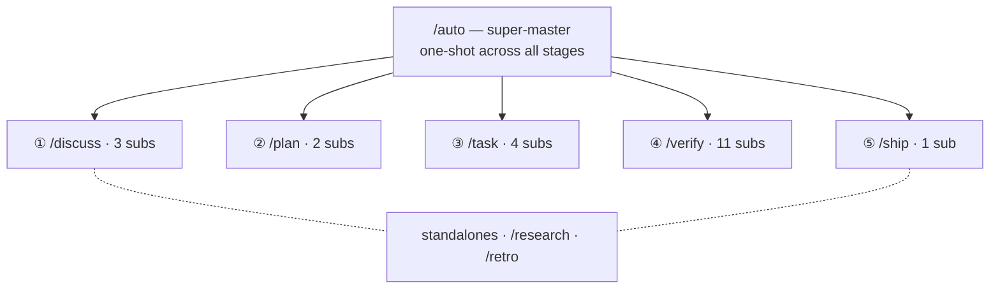

harnessed cung cấp 29 workflow được phân tầng theo namespace: một super-master, năm master giai đoạn (Discuss · Plan · Task · Verify · Ship), 21 subworkflow và hai workflow độc lập.

29 workflow — một super-master tỏa ra năm stage master cùng các sub của chúng, thêm hai workflow độc lập:

## Super-master

| Lệnh    | Phạm vi      | Capability                                                                                                                                                                                                                                                                |
| ------- | ------------ | ------------------------------------------------------------------------------------------------------------------------------------------------------------------------------------------------------------------------------------------------------------------------- |
| `/auto` | super-master | Trọn pipeline 6 giai đoạn: research (có điều kiện) → discuss → plan → task → verify → retro (bắt buộc). Đánh giá độ phức tạp một lượt bằng AI + kiểm tra mức độ hiểu. Cờ `--staged` bật UX gate theo giai đoạn. Dừng ngay khi thất bại, tiếp tục bằng `harnessed resume`. |

## Workflow độc lập

| Lệnh        | Phạm vi | Capability                                                                                                                             |
| ----------- | ------- | -------------------------------------------------------------------------------------------------------------------------------------- |
| `/research` | độc lập | Điều tra đa nguồn qua Tavily, Exa MCP và ctx7. Trong `/auto` kích hoạt như giai đoạn 0, hoặc gọi trực tiếp trước discuss.              |
| `/retro`    | độc lập | Tóm tắt khép cột mốc qua gstack `/retro`. Ghi bài học, quyết định và phát hiện bất ngờ vào `RETROSPECTIVE.md`. Bắt buộc trong `/auto`. |

## Giai đoạn Discuss

| Lệnh                 | Phạm vi          | Capability                                                                                                                                 |
| -------------------- | ---------------- | ------------------------------------------------------------------------------------------------------------------------------------------ |
| `/discuss`           | master giai đoạn | Đánh giá song song ba gate thảo luận, chỉ chạy những gate được kích hoạt.                                                                  |
| `/discuss-strategic` | subworkflow      | Tầng chiến lược — tính năng mới / milestone / hướng sản phẩm. gstack `/office-hours` + `/plan-ceo-review`. Lưu `findings.md`.              |
| `/discuss-phase`     | subworkflow      | Tầng phase — ≥2 quyết định còn bỏ ngỏ, làm rõ vùng xám. GSD `gsd-discuss-phase`. Lưu `findings.md` + `knowledge.md`.                       |
| `/discuss-subtask`   | subworkflow      | Tầng subtask — ≥2 hướng tiếp cận / thuật toán cốt lõi / contract API. Superpowers brainstorming + `/grill-with-docs`. Tạm thời, không lưu. |

## Giai đoạn Plan

| Lệnh                 | Phạm vi          | Capability                                                                                                              |
| -------------------- | ---------------- | ----------------------------------------------------------------------------------------------------------------------- |
| `/plan`              | master giai đoạn | Tuần tự: review kiến trúc (có điều kiện) → kế hoạch phase (luôn chạy).                                                  |
| `/plan-architecture` | subworkflow      | Tầng kiến trúc — gate quản trị cho kiến trúc phức tạp. gstack `/plan-eng-review`. Chốt thiết kế trước khi lập kế hoạch. |
| `/plan-phase`        | subworkflow      | Kế hoạch phase — GSD `gsd-plan-phase` + planning-with-files. Lưu `task_plan.md` + `progress.md`.                        |

## Giai đoạn Task

| Lệnh            | Phạm vi          | Capability                                                                                                                                               |
| --------------- | ---------------- | -------------------------------------------------------------------------------------------------------------------------------------------------------- |
| `/task`         | master giai đoạn | Vòng lặp tuần tự theo subtask: làm rõ → viết code → kiểm thử → bàn giao.                                                                                 |
| `/task-clarify` | subworkflow      | Gate làm rõ lúc khởi động. Superpowers brainstorming + `/grill-with-docs` có điều kiện.                                                                  |
| `/task-code`    | subworkflow      | Viết code theo 4 nguyên tắc karpathy. `/zoom-out` / `/improve-codebase-architecture` / `/diagnose` có điều kiện. Đồng bộ `progress.md` giữa các session. |
| `/task-test`    | subworkflow      | TDD red → green → refactor. Superpowers TDD + `/diagnose` có điều kiện. Bắt buộc với logic cốt lõi.                                                      |
| `/task-deliver` | subworkflow      | Gate hoàn thành của chính harnessed (`harnessed checkpoint complete`). Chạy tới khi có `COMPLETE` nguyên văn. Agent Teams có điều kiện khi cần phối hợp full-stack.                                   |

## Giai đoạn Verify

| Lệnh                     | Phạm vi          | Capability                                                                                                                                      |
| ------------------------ | ---------------- | ----------------------------------------------------------------------------------------------------------------------------------------------- |
| `/verify`                | master giai đoạn | Phân phát tối đa 11 kiểm tra con theo cờ tình huống.                                                                                             |
| `/verify-progress`       | subworkflow      | Luôn chạy đầu tiên. Kiểm tra tiêu chí nghiệm thu UAT + đồng bộ trạng thái GSD.                                                                  |
| `/verify-code-review`    | subworkflow      | Fan-out song song nhiều subagent. Phát hiện có độ tin cậy cao.                                                                                  |
| `/verify-paranoid`       | subworkflow      | Review của staff engineer đa nghi qua gstack `/review`. Bắt buộc với module trọng yếu trước PR.                                                 |
| `/verify-qa`             | subworkflow      | QA đầu-cuối qua gstack `/qa` + playwright-cli / `@playwright/test`. Kích hoạt khi có thay đổi UI.                                               |
| `/verify-security`       | subworkflow      | Kiểm tra OWASP / auth / secret qua gstack `/cso`. Kích hoạt khi động đến auth hoặc secret.                                                      |
| `/verify-design`         | subworkflow      | Tính nhất quán design system qua gstack `/design-review` + ui-ux-pro-max + design-taste-frontend. Kích hoạt khi có thay đổi thiết kế.           |
| `/verify-eval-review`    | subworkflow      | Kiểm toán độ phủ eval cho phase AI qua GSD `/gsd-eval-review`. Kích hoạt khi phase có bước AI/LLM (cặp với gsd-ai-integration-phase phía plan). |
| `/verify-validate-phase` | subworkflow      | Lấp độ phủ yêu cầu→test theo Nyquist qua GSD `/gsd-validate-phase`. Kích hoạt khi cần kiểm toán độ phủ.                                         |
| `/verify-second-opinion`  | sub-workflow | Ý kiến thứ hai từ mô hình khác về diff kể từ release tag gần nhất. Kích hoạt khi thay đổi chạm vào bề mặt mà engine thực sự đọc.                      |
| `/verify-simplify`       | subworkflow      | Đơn giản hóa lần cuối qua `code-simplifier`. Luôn chạy sau cùng.                                                                                |
| `/verify-multispec`      | subworkflow      | Agent Team bốn chuyên gia, Pattern C — chất vấn chéo qua SendMessage. Lối nâng cấp cho bản phát hành trọng yếu và PR refactor quy mô lớn.       |

## Bộ bọc kỷ luật

| Lệnh   | Phạm vi  | Năng lực                                                                                                    |
| ------ | -------- | ------------------------------------------------------------------------------------------------------------- |
| `/tdd` | kỷ luật  | Red → green → refactor. Ghép từ `superpowers:test-driven-development` của upstream (mattpocock `/tdd` dự phòng). |

Cam kết hoàn thành không còn là bộ bọc từ upstream: từ 4.36.0 nó là gate của chính harnessed — `harnessed checkpoint complete ` (ADR 0039), nên `/ralph-loop` và điểm vào `/execute-task` cũ đã bị bỏ.

Toàn bộ định nghĩa workflow nằm ở `workflows/<name>/workflow.yaml` trong [repo harnessed](https://github.com/easyinplay/harnessed).
